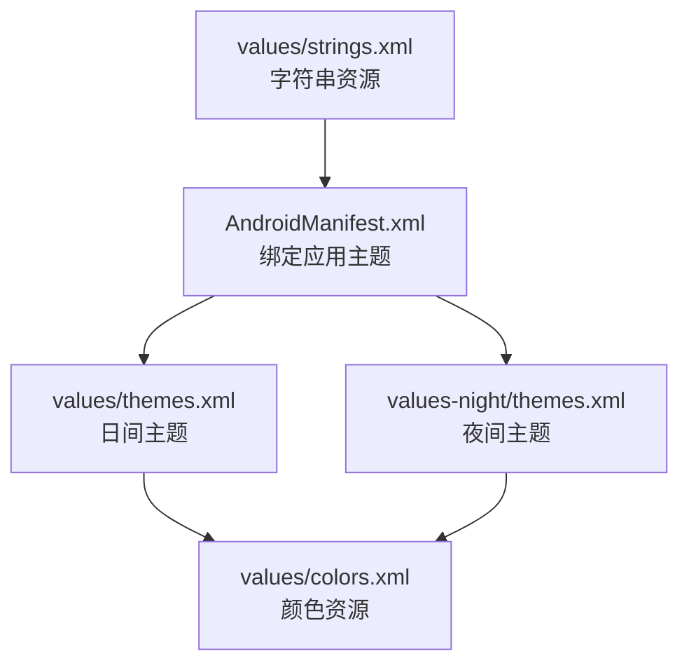
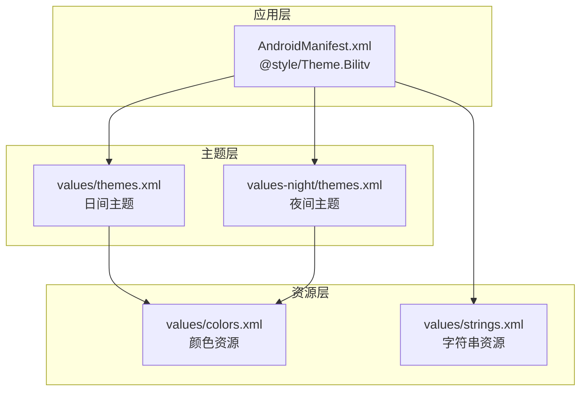
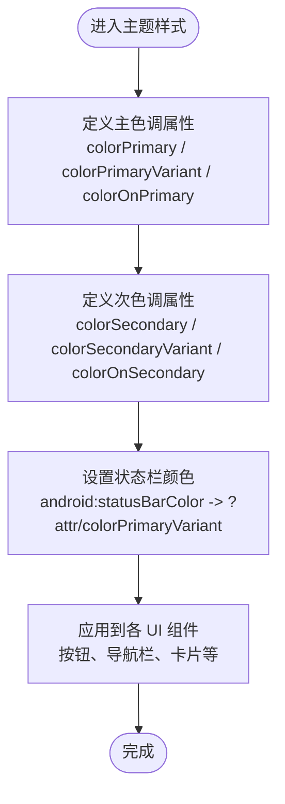
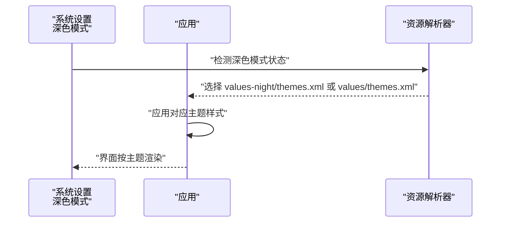
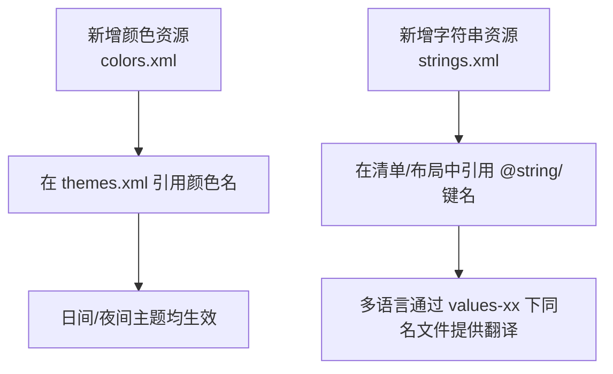
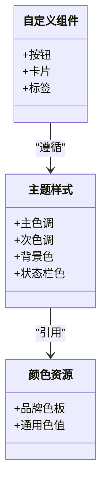
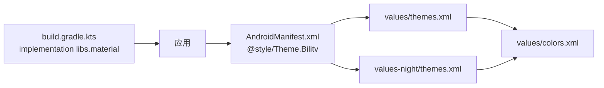

# 主题与外观自定义

<cite>
**本文引用的文件**
- [themes.xml（日间）](file://app/src/main/res/values/themes.xml)
- [themes.xml（夜间）](file://app/src/main/res/values-night/themes.xml)
- [colors.xml](file://app/src/main/res/values/colors.xml)
- [strings.xml](file://app/src/main/res/values/strings.xml)
- [AndroidManifest.xml](file://app/src/main/AndroidManifest.xml)
- [build.gradle.kts](file://app/build.gradle.kts)
- [settings.gradle.kts](file://settings.gradle.kts)
</cite>

## 目录
1. [简介](#简介)
2. [项目结构](#项目结构)
3. [核心组件](#核心组件)
4. [架构总览](#架构总览)
5. [详细组件分析](#详细组件分析)
6. [依赖关系分析](#依赖关系分析)
7. [性能考虑](#性能考虑)
8. [故障排查指南](#故障排查指南)
9. [结论](#结论)
10. [附录](#附录)

## 简介
本文件围绕如何通过修改主题与颜色资源来自定义应用的视觉风格展开，重点覆盖：
- 如何在 themes.xml 中调整主色调、次色调与背景色
- DayNight 主题继承机制（Theme.MaterialComponents.DayNight）及其在不同系统设置下的自动切换行为
- 如何新增颜色与字符串资源，并确保多语言与深色模式正确生效
- 如何扩展主题以支持自定义 UI 组件，提升品牌一致性

## 项目结构
该应用采用标准的 Android 资源目录组织方式，主题与颜色资源分别位于：
- values/themes.xml：日间主题样式定义
- values-night/themes.xml：夜间主题样式定义
- values/colors.xml：颜色资源定义
- values/strings.xml：字符串资源定义
- AndroidManifest.xml：应用入口主题绑定

图表来源
- [AndroidManifest.xml](file://app/src/main/AndroidManifest.xml#L1-L15)
- [themes.xml（日间）](file://app/src/main/res/values/themes.xml#L1-L16)
- [themes.xml（夜间）](file://app/src/main/res/values-night/themes.xml#L1-L16)
- [colors.xml](file://app/src/main/res/values/colors.xml#L1-L10)
- [strings.xml](file://app/src/main/res/values/strings.xml#L1-L3)

章节来源
- [AndroidManifest.xml](file://app/src/main/AndroidManifest.xml#L1-L15)
- [themes.xml（日间）](file://app/src/main/res/values/themes.xml#L1-L16)
- [themes.xml（夜间）](file://app/src/main/res/values-night/themes.xml#L1-L16)
- [colors.xml](file://app/src/main/res/values/colors.xml#L1-L10)
- [strings.xml](file://app/src/main/res/values/strings.xml#L1-L3)

## 核心组件
- 应用主题样式：通过 styles 定义主色调、次色调、状态栏颜色等属性
- 颜色资源：集中管理品牌色板与通用色值
- 字符串资源：应用名称等文本资源
- DayNight 主题：基于系统设置自动在日间/夜间主题之间切换

章节来源
- [themes.xml（日间）](file://app/src/main/res/values/themes.xml#L1-L16)
- [themes.xml（夜间）](file://app/src/main/res/values-night/themes.xml#L1-L16)
- [colors.xml](file://app/src/main/res/values/colors.xml#L1-L10)
- [strings.xml](file://app/src/main/res/values/strings.xml#L1-L3)

## 架构总览
应用主题体系由“主题样式 → 颜色资源 → 系统主题继承”三层构成。应用在清单中绑定主题样式，样式引用颜色资源；当系统处于深色模式时，系统会优先使用 night 目录下的主题资源，从而实现自动切换。

图表来源
- [AndroidManifest.xml](file://app/src/main/AndroidManifest.xml#L1-L15)
- [themes.xml（日间）](file://app/src/main/res/values/themes.xml#L1-L16)
- [themes.xml（夜间）](file://app/src/main/res/values-night/themes.xml#L1-L16)
- [colors.xml](file://app/src/main/res/values/colors.xml#L1-L10)
- [strings.xml](file://app/src/main/res/values/strings.xml#L1-L3)

## 详细组件分析

### 主题样式与颜色资源映射
- 主色调（Primary）与次色调（Secondary）：通过 colorPrimary、colorPrimaryVariant、colorOnPrimary、colorSecondary、colorSecondaryVariant、colorOnSecondary 等属性控制
- 状态栏颜色：通过 android:statusBarColor 指向当前主题的 colorPrimaryVariant
- 日间与夜间主题：两套 themes.xml 分别定义了不同的颜色映射，以适配浅色与深色背景

图表来源
- [themes.xml（日间）](file://app/src/main/res/values/themes.xml#L1-L16)
- [themes.xml（夜间）](file://app/src/main/res/values-night/themes.xml#L1-L16)

章节来源
- [themes.xml（日间）](file://app/src/main/res/values/themes.xml#L1-L16)
- [themes.xml（夜间）](file://app/src/main/res/values-night/themes.xml#L1-L16)

### DayNight 主题继承机制与自动切换
- 继承关系：应用主题继承自 Theme.MaterialComponents.DayNight.DarkActionBar，后者在运行时根据系统深色模式选择 Light 或 Dark 对应的主题变体
- 切换行为：当系统设置为深色模式时，系统优先加载 values-night 目录下的资源（如 themes.xml），从而实现自动切换
- 建议实践：将仅在深色模式下需要调整的属性放入 values-night/themes.xml，避免重复定义

图表来源
- [themes.xml（日间）](file://app/src/main/res/values/themes.xml#L1-L16)
- [themes.xml（夜间）](file://app/src/main/res/values-night/themes.xml#L1-L16)

章节来源
- [themes.xml（日间）](file://app/src/main/res/values/themes.xml#L1-L16)
- [themes.xml（夜间）](file://app/src/main/res/values-night/themes.xml#L1-L16)

### 新增颜色资源与字符串资源
- 新增颜色资源：在 colors.xml 中添加新的颜色条目，然后在 themes.xml 中引用该颜色名，即可在日间/夜间主题中统一生效
- 新增字符串资源：在 strings.xml 中添加新键值对，通过 @string/键名 在清单或其他布局中引用
- 多语言支持：strings.xml 位于 values 目录下，若需多语言，请在 values-xx 目录下创建同名的 strings.xml 并提供对应翻译

图表来源
- [colors.xml](file://app/src/main/res/values/colors.xml#L1-L10)
- [strings.xml](file://app/src/main/res/values/strings.xml#L1-L3)

章节来源
- [colors.xml](file://app/src/main/res/values/colors.xml#L1-L10)
- [strings.xml](file://app/src/main/res/values/strings.xml#L1-L3)

### 扩展主题以支持自定义 UI 组件
- 品牌一致性：通过统一的颜色与字体规范，确保自定义控件（如卡片、按钮、标签）与系统组件保持一致
- 自定义组件建议：
  - 使用主题中的 colorPrimary 作为强调色
  - 使用 colorOnPrimary 作为强调色上的文字或图标色
  - 使用 colorSecondary 作为次要功能色
  - 使用 colorSurface 作为卡片或对话框背景色（如适用）
- 动态颜色：Material3 提供动态颜色能力，可在主题中启用以适配系统色彩方案（需在主题中声明相应覆盖）

图表来源
- [themes.xml（日间）](file://app/src/main/res/values/themes.xml#L1-L16)
- [themes.xml（夜间）](file://app/src/main/res/values-night/themes.xml#L1-L16)
- [colors.xml](file://app/src/main/res/values/colors.xml#L1-L10)

章节来源
- [themes.xml（日间）](file://app/src/main/res/values/themes.xml#L1-L16)
- [themes.xml（夜间）](file://app/src/main/res/values-night/themes.xml#L1-L16)
- [colors.xml](file://app/src/main/res/values/colors.xml#L1-L10)

## 依赖关系分析
- 应用依赖 Material Design 组件库（从构建脚本可见 material 实现依赖）
- 主题样式依赖颜色资源；颜色资源被主题样式引用
- 清单文件绑定应用主题样式，决定应用启动时的默认主题

图表来源
- [build.gradle.kts](file://app/build.gradle.kts#L1-L47)
- [AndroidManifest.xml](file://app/src/main/AndroidManifest.xml#L1-L15)
- [themes.xml（日间）](file://app/src/main/res/values/themes.xml#L1-L16)
- [themes.xml（夜间）](file://app/src/main/res/values-night/themes.xml#L1-L16)
- [colors.xml](file://app/src/main/res/values/colors.xml#L1-L10)

章节来源
- [build.gradle.kts](file://app/build.gradle.kts#L1-L47)
- [AndroidManifest.xml](file://app/src/main/AndroidManifest.xml#L1-L15)
- [themes.xml（日间）](file://app/src/main/res/values/themes.xml#L1-L16)
- [themes.xml（夜间）](file://app/src/main/res/values-night/themes.xml#L1-L16)
- [colors.xml](file://app/src/main/res/values/colors.xml#L1-L10)

## 性能考虑
- 资源合并：多语言与夜间资源会参与编译期合并，建议保持颜色与字符串资源命名规范，减少冗余
- 主题切换：DayNight 会在系统设置变化时触发主题重绘，尽量避免在主题中使用昂贵的自定义绘制
- 资源体积：颜色与字符串资源体积小，影响有限；但过多的自定义样式可能增加资源体积与编译时间

## 故障排查指南
- 主题未生效
  - 检查清单是否绑定正确的主题样式
  - 确认主题样式是否正确引用颜色资源
- 夜间主题不生效
  - 确认已提供 values-night/themes.xml
  - 确认系统深色模式已开启
- 颜色不匹配
  - 检查 colors.xml 中颜色名是否与主题引用一致
  - 检查是否在夜间主题中覆盖了颜色映射
- 多语言显示异常
  - 确认在 values-xx 目录下提供同名字符串资源文件
  - 确认键名一致且无拼写错误

章节来源
- [AndroidManifest.xml](file://app/src/main/AndroidManifest.xml#L1-L15)
- [themes.xml（日间）](file://app/src/main/res/values/themes.xml#L1-L16)
- [themes.xml（夜间）](file://app/src/main/res/values-night/themes.xml#L1-L16)
- [colors.xml](file://app/src/main/res/values/colors.xml#L1-L10)
- [strings.xml](file://app/src/main/res/values/strings.xml#L1-L3)

## 结论
通过合理组织 colors.xml 与 themes.xml，并利用 DayNight 主题继承机制，可以高效地实现跨系统设置的主题切换与品牌一致性。建议：
- 将品牌色板集中管理在 colors.xml
- 在 themes.xml 中仅做属性映射，避免硬编码颜色
- 使用 values-night/themes.xml 专门处理夜间差异
- 通过多语言目录提供 strings 的本地化支持
- 在自定义组件中遵循主题属性，确保整体风格统一

## 附录
- 参考路径
  - [应用主题绑定](file://app/src/main/AndroidManifest.xml#L1-L15)
  - [日间主题样式](file://app/src/main/res/values/themes.xml#L1-L16)
  - [夜间主题样式](file://app/src/main/res/values-night/themes.xml#L1-L16)
  - [颜色资源](file://app/src/main/res/values/colors.xml#L1-L10)
  - [字符串资源](file://app/src/main/res/values/strings.xml#L1-L3)
  - [构建脚本依赖](file://app/build.gradle.kts#L1-L47)
  - [项目仓库配置](file://settings.gradle.kts#L1-L24)