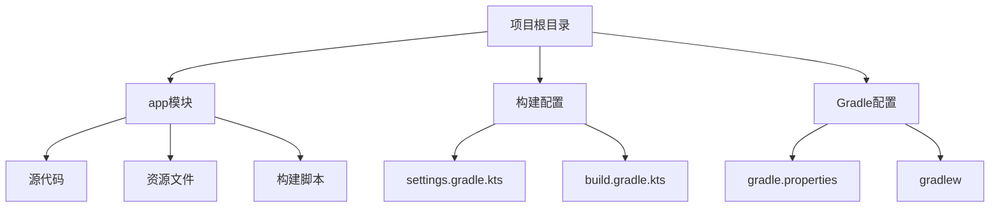
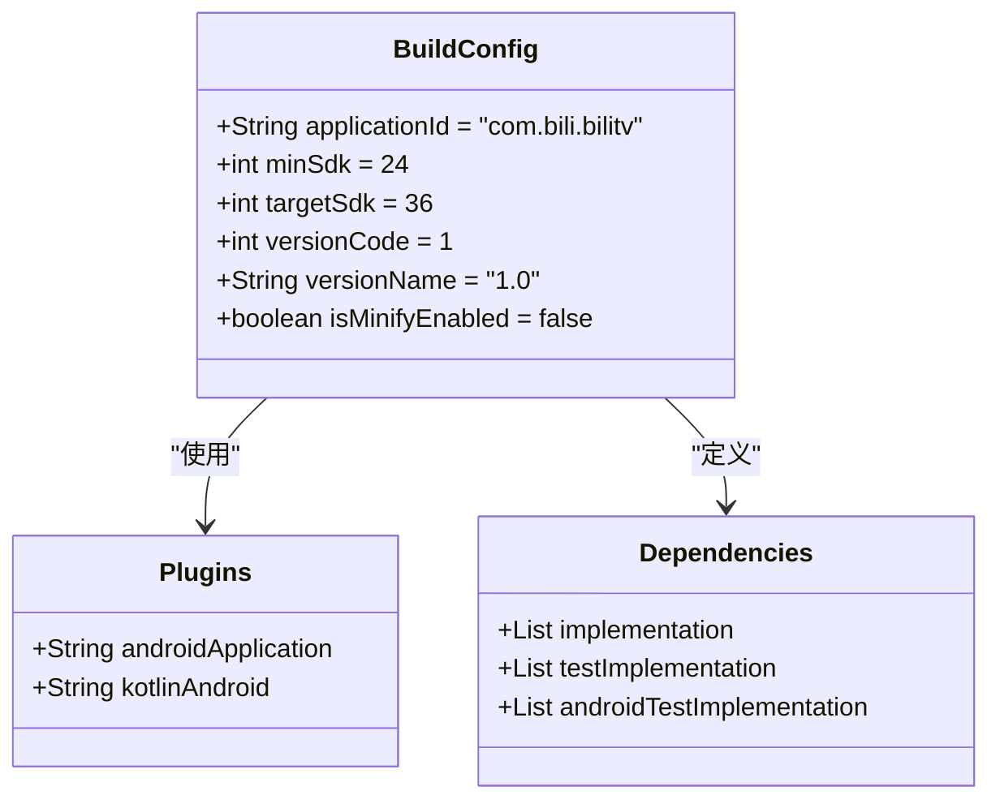
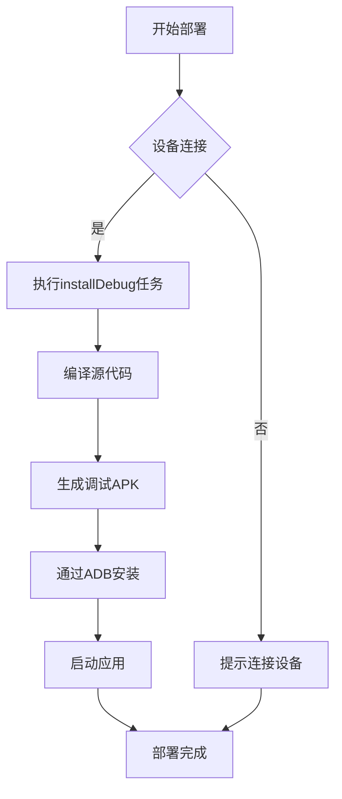
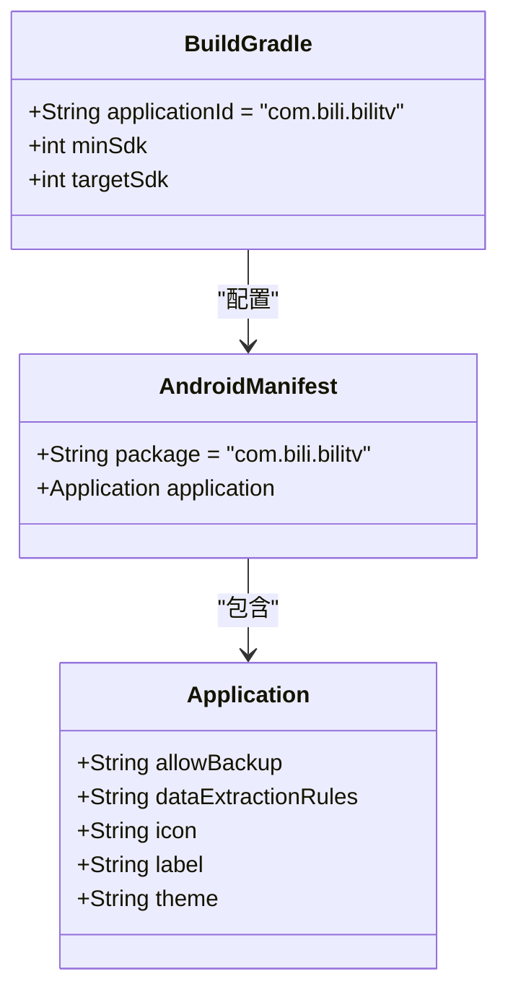
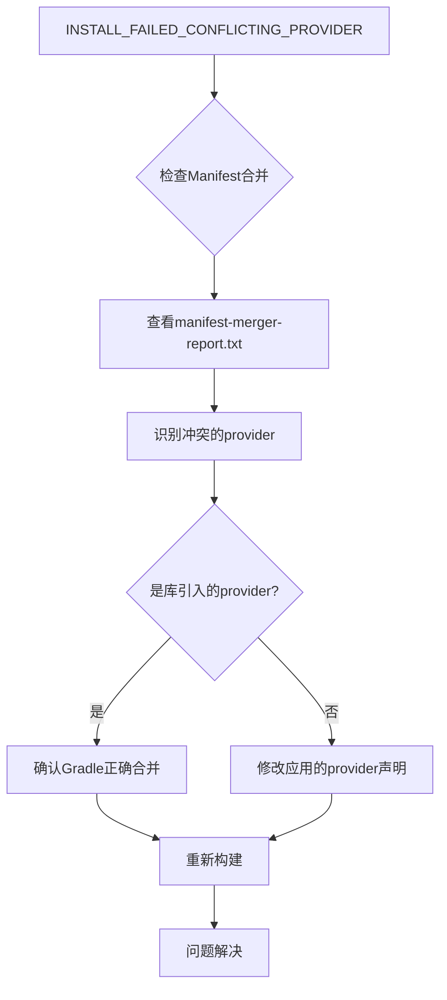

# 在模拟器或真机上部署应用

<cite>
**本文档引用的文件**  
- [app/build.gradle.kts](file://app/build.gradle.kts)
- [app/src/main/AndroidManifest.xml](file://app/src/main/AndroidManifest.xml)
- [settings.gradle.kts](file://settings.gradle.kts)
- [build.gradle.kts](file://build.gradle.kts)
- [gradle.properties](file://gradle.properties)
- [app/proguard-rules.pro](file://app/proguard-rules.pro)
- [app/build/outputs/logs/manifest-merger-debug-report.txt](file://app/build/outputs/logs/manifest-merger-debug-report.txt)
- [app/build/intermediates/merged_manifest/debug/processDebugMainManifest/AndroidManifest.xml](file://app/build/intermediates/merged_manifest/debug/processDebugMainManifest/AndroidManifest.xml)
</cite>

## 目录
1. [简介](#简介)
2. [项目结构](#项目结构)
3. [核心构建配置](#核心构建配置)
4. [部署流程](#部署流程)
5. [AndroidManifest.xml 与 applicationId 分析](#androidmanifestxml-与-applicationid-分析)
6. [常见部署问题及解决方案](#常见部署问题及解决方案)
7. [结论](#结论)

## 简介
本文档详细描述将Android应用部署到模拟器或物理设备的完整流程。涵盖开发者选项启用、ADB设备识别、安装调试版本APK的方法，并深入分析AndroidManifest.xml中package属性与applicationId在多环境部署中的作用，同时提供常见部署问题的解决方案。

## 项目结构
本项目为标准的Android Gradle项目结构，包含应用模块和根项目配置。主要目录包括app模块、构建脚本和配置文件。



**图表来源**  
- [app](file://app)
- [settings.gradle.kts](file://settings.gradle.kts)
- [build.gradle.kts](file://build.gradle.kts)

**章节来源**  
- [app](file://app)
- [settings.gradle.kts](file://settings.gradle.kts)

## 核心构建配置
项目使用Kotlin DSL (build.gradle.kts) 进行构建配置，采用现代Android项目结构和依赖管理方式。

### 构建脚本分析
项目配置了Android应用插件和Kotlin支持，定义了编译SDK版本、应用ID、最小SDK版本等关键构建参数。



**图表来源**  
- [app/build.gradle.kts](file://app/build.gradle.kts#L1-L47)
- [build.gradle.kts](file://build.gradle.kts#L1-L5)

**章节来源**  
- [app/build.gradle.kts](file://app/build.gradle.kts#L1-L47)

## 部署流程
将应用部署到Android设备或模拟器需要经过一系列标准化步骤，包括环境准备、构建和安装过程。

### 设备准备
1. 在物理设备上启用开发者选项：进入"设置"→"关于手机"→连续点击"版本号"7次
2. 启用USB调试：在"设置"→"开发者选项"中开启"USB调试"
3. 连接设备到电脑，确认设备授权调试权限

### 构建与安装
#### 使用Android Studio
1. 打开项目并同步Gradle
2. 选择目标设备（已连接的物理设备或创建的模拟器）
3. 点击"Run"按钮（绿色三角形）或使用快捷键
4. Android Studio自动执行构建、安装和启动流程

#### 使用命令行
通过Gradle Wrapper执行安装命令：
```bash
./gradlew installDebug
```

此命令会：
1. 编译调试版本的应用
2. 生成debug APK文件
3. 通过ADB安装到连接的设备
4. 启动应用

构建输出的APK位于`app/build/outputs/apk/debug/`目录下。



**图表来源**  
- [app/build.gradle.kts](file://app/build.gradle.kts#L22-L29)
- [gradlew](file://gradlew)

**章节来源**  
- [app/build.gradle.kts](file://app/build.gradle.kts#L6-L38)

## AndroidManifest.xml 与 applicationId 分析
AndroidManifest.xml文件和build.gradle中的applicationId在应用部署过程中扮演关键角色。

### package属性与applicationId关系
在`app/build.gradle.kts`中定义的`applicationId`是应用在设备上安装时的唯一标识符，而`AndroidManifest.xml`中的package属性主要用于Java类的命名空间。



**图表来源**  
- [app/build.gradle.kts](file://app/build.gradle.kts#L13-L17)
- [app/src/main/AndroidManifest.xml](file://app/src/main/AndroidManifest.xml#L1-L15)

**章节来源**  
- [app/build.gradle.kts](file://app/build.gradle.kts#L13-L17)
- [app/src/main/AndroidManifest.xml](file://app/src/main/AndroidManifest.xml#L1-L15)

### 多环境部署配置
applicationId在多环境部署中具有重要作用：
- **唯一标识**：确保应用在Google Play商店和设备上的唯一性
- **更新兼容**：应用更新时必须保持相同的applicationId
- **环境隔离**：可通过Gradle构建变体为不同环境配置不同的applicationId

在本项目中，applicationId被设置为`com.bili.bilitv`，这将成为应用在设备上的唯一标识。

## 常见部署问题及解决方案
在部署过程中可能会遇到各种问题，以下是常见问题及其解决方案。

### INSTALL_FAILED_CONFLICTING_PROVIDER
此错误通常由Content Provider权限冲突引起。在本项目中，构建系统自动添加了由依赖库引入的provider。

**问题原因**：
- 多个库尝试注册相同名称的Content Provider
- 权限声明冲突

**解决方案**：
1. 检查`manifest-merger-debug-report.txt`中的provider合并情况
2. 确保没有重复的provider声明
3. 如果使用库的默认配置，通常无需修改

在本项目中，`androidx.profileinstaller`和`androidx.emoji2`等库引入了provider，但Gradle构建系统已正确处理合并。



**图表来源**  
- [app/build/outputs/logs/manifest-merger-debug-report.txt](file://app/build/outputs/logs/manifest-merger-debug-report.txt#L235-L267)
- [app/build.gradle.kts](file://app/build.gradle.kts#L40-L47)

### 权限拒绝问题
**问题表现**：
- 应用请求权限被拒绝
- 特殊权限（如DUMP）无法获取

**解决方案**：
1. 检查`AndroidManifest.xml`中的权限声明
2. 对于运行时权限，确保在代码中正确请求
3. 对于特殊系统权限，确认设备已root或具有相应权限

在本项目中，`androidx.profileinstaller`需要`android.permission.DUMP`权限，这通常在开发设备上可用。

### 设备未检测到
**问题原因**：
- USB调试未启用
- 驱动程序未正确安装
- ADB服务异常

**解决方案**：
1. 确认设备上已启用USB调试
2. 重启ADB服务：
   ```bash
   adb kill-server
   adb start-server
   ```
3. 检查设备连接：
   ```bash
   adb devices
   ```
4. 尝试更换USB线缆或端口

**章节来源**  
- [app/build/outputs/logs/manifest-merger-debug-report.txt](file://app/build/outputs/logs/manifest-merger-debug-report.txt)
- [app/build.gradle.kts](file://app/build.gradle.kts)
- [app/src/main/AndroidManifest.xml](file://app/src/main/AndroidManifest.xml)

## 结论
本项目已配置为标准的Android应用部署流程。通过正确配置`build.gradle.kts`中的applicationId和`AndroidManifest.xml`，应用可以顺利部署到模拟器或物理设备。使用Android Studio的Run功能或命令行`./gradlew installDebug`均可完成部署。对于常见的部署问题，如provider冲突、权限拒绝等，可通过分析构建输出和正确配置解决。

关键要点：
- applicationId是应用的唯一标识，部署时必须保持一致
- Gradle构建系统自动处理Manifest合并和依赖库引入的组件
- 调试版本使用debug签名，适合开发和测试
- 遇到部署问题时，首先检查设备连接和ADB状态，然后分析构建报告