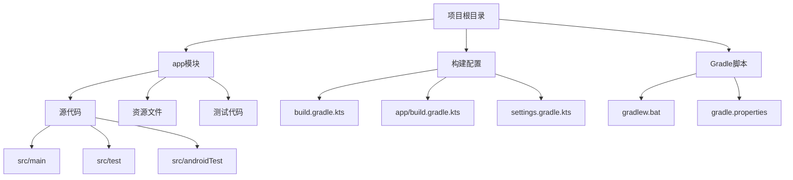
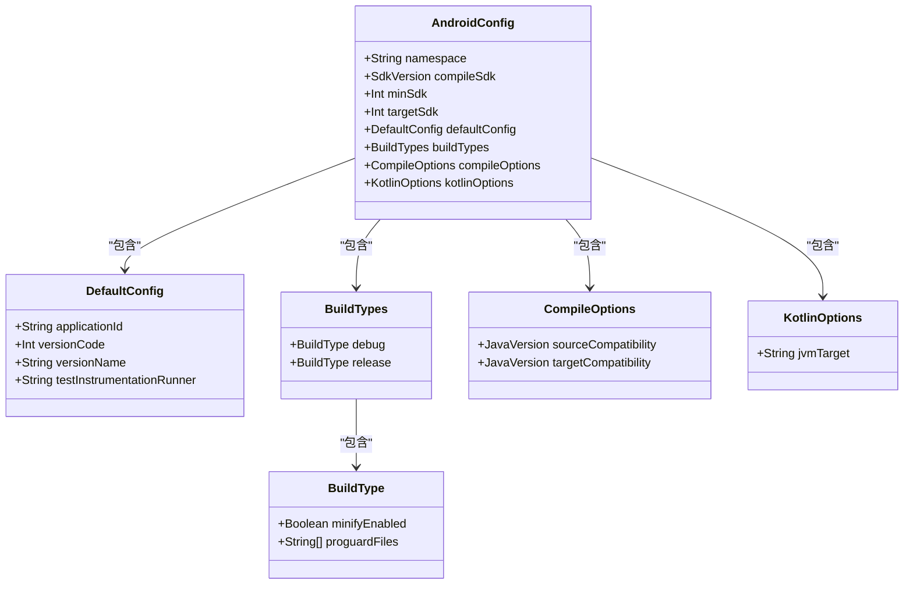
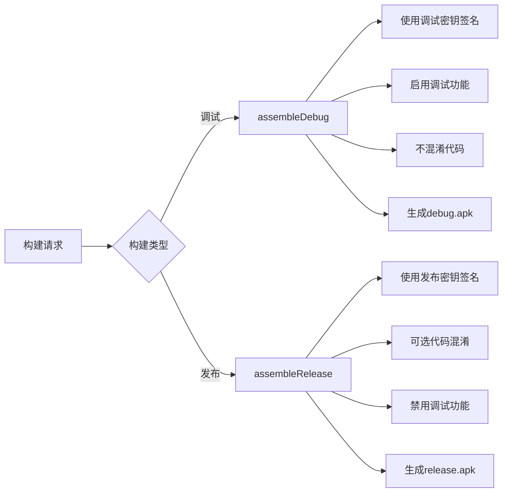
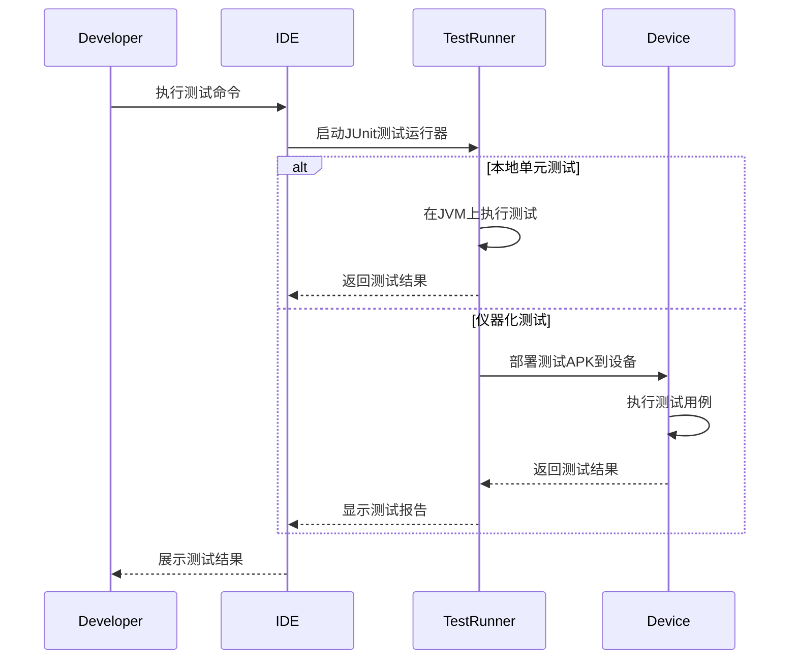
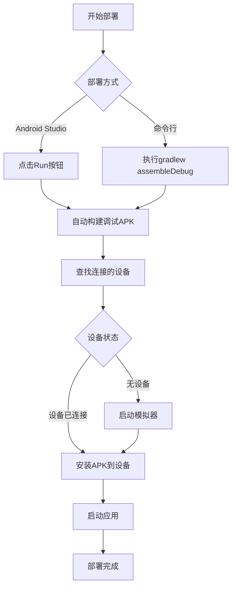
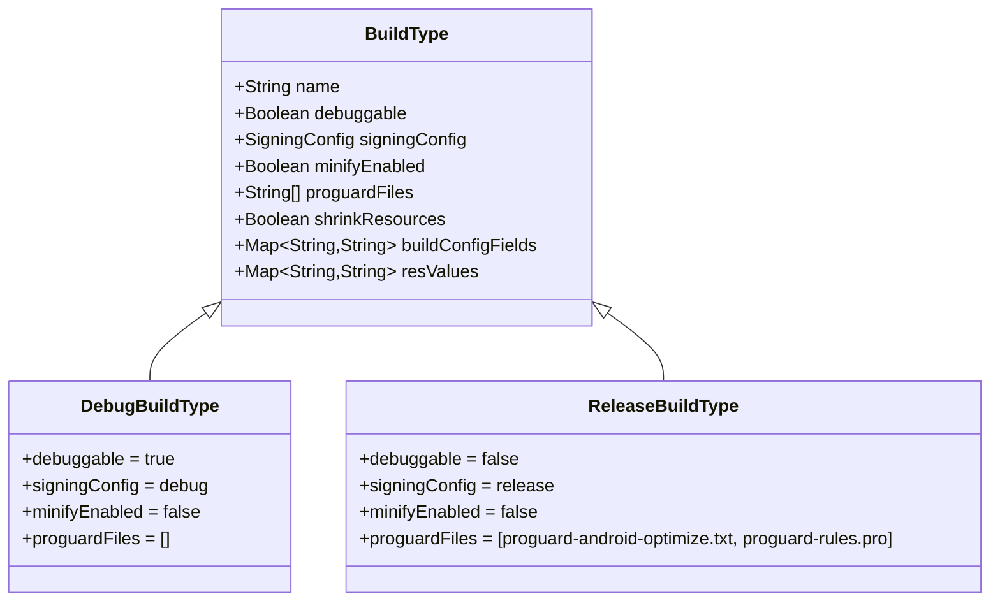
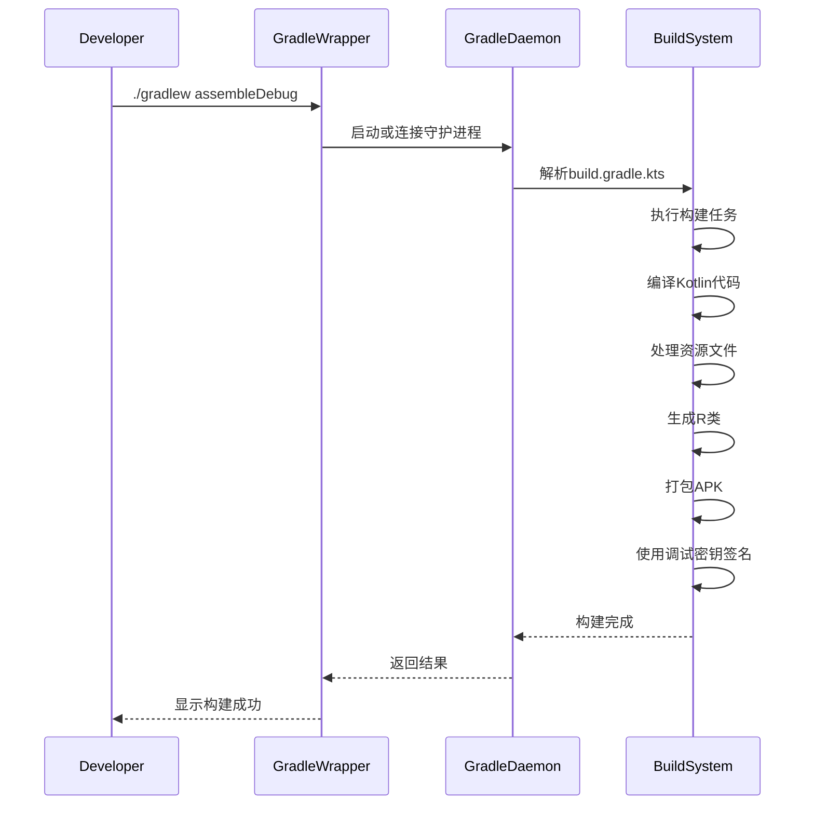
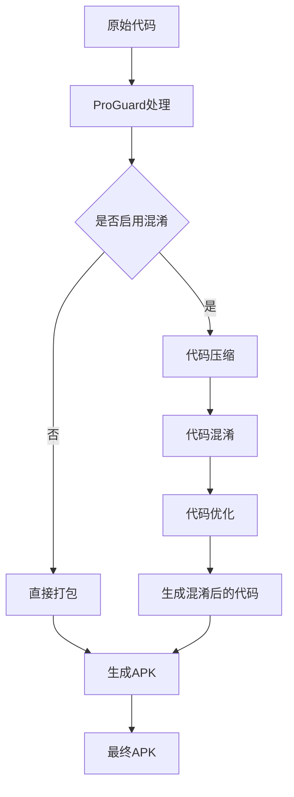

# 常见开发任务操作

<cite>
**本文档引用的文件**  
- [app/build.gradle.kts](file://app/build.gradle.kts)
- [build.gradle.kts](file://build.gradle.kts)
- [settings.gradle.kts](file://settings.gradle.kts)
- [gradle.properties](file://gradle.properties)
- [gradlew.bat](file://gradlew.bat)
- [proguard-rules.pro](file://app/proguard-rules.pro)
- [ExampleUnitTest.kt](file://app/src/test/java/com/bili/bilitv/ExampleUnitTest.kt)
- [ExampleInstrumentedTest.kt](file://app/src/androidTest/java/com/bili/bilitv/ExampleInstrumentedTest.kt)
- [AndroidManifest.xml](file://app/src/main/AndroidManifest.xml)
</cite>

## 目录
1. [简介](#简介)
2. [项目结构](#项目结构)
3. [构建配置详解](#构建配置详解)
4. [构建调试与发布版本](#构建调试与发布版本)
5. [运行单元测试与仪器化测试](#运行单元测试与仪器化测试)
6. [在模拟器或真机上部署应用](#在模拟器或真机上部署应用)
7. [build.gradle.kts 中的 buildTypes 配置](#buildgradlekts-中的-buildtypes-配置)
8. [通过命令行执行构建](#通过命令行执行构建)
9. [proguard-rules.pro 的作用](#proguard-rulespro-的作用)

## 简介
本文档旨在详细说明在 BiliTV Android 项目中的日常开发高频操作流程。涵盖如何构建调试版本与发布版本的 APK、如何运行单元测试与仪器化测试、如何在模拟器或真机上部署应用等核心开发任务。同时深入解析 build.gradle.kts 文件中的 buildTypes 配置项（debug 与 release）及其对构建输出的影响，帮助开发者快速掌握项目的基本操作闭环。

## 项目结构
本项目采用标准的 Android 项目结构，主要包含以下核心组件：

- **app/**: 主要应用模块，包含源代码、资源文件和构建配置
- **src/main/**: 主要源码和资源目录，包含 Java/Kotlin 代码、AndroidManifest.xml 和 res 资源
- **src/test/**: 本地单元测试代码
- **src/androidTest/**: 仪器化测试代码
- **build.gradle.kts**: 模块级别的构建配置文件
- **app/build.gradle.kts**: 应用模块的构建配置
- **settings.gradle.kts**: 项目设置，定义包含的模块
- **gradle.properties**: Gradle 构建系统的项目范围设置
- **gradlew.bat**: Windows 平台的 Gradle 包装器脚本



**图示来源**
- [app/build.gradle.kts](file://app/build.gradle.kts)
- [settings.gradle.kts](file://settings.gradle.kts)
- [gradle.properties](file://gradle.properties)

**本节来源**
- [app/build.gradle.kts](file://app/build.gradle.kts#L1-L47)
- [settings.gradle.kts](file://settings.gradle.kts#L1-L24)
- [gradle.properties](file://gradle.properties#L1-L23)

## 构建配置详解
项目使用 Kotlin DSL (build.gradle.kts) 进行构建配置，采用了现代 Android 项目的最佳实践。通过插件别名管理依赖版本，实现了更好的版本控制和可维护性。

核心配置包括：
- 使用 `android.application` 插件构建 Android 应用
- 使用 `kotlin.android` 插件支持 Kotlin 语言
- 配置了 compileSdk、minSdk 和 targetSdk 版本
- 设置了 Java 11 和 Kotlin JVM 目标版本
- 定义了应用的基本信息（applicationId、versionCode、versionName）



**图示来源**
- [app/build.gradle.kts](file://app/build.gradle.kts#L6-L38)

**本节来源**
- [app/build.gradle.kts](file://app/build.gradle.kts#L1-L47)
- [build.gradle.kts](file://build.gradle.kts#L1-L5)

## 构建调试与发布版本
在 Android 开发中，构建版本主要分为调试（Debug）和发布（Release）两种类型，它们有不同的构建配置和用途。

### 调试版本构建
调试版本用于开发过程中的测试和调试，具有以下特点：
- 自动签名使用调试密钥
- 启用调试功能和日志输出
- 不进行代码混淆和优化
- 构建速度快

### 发布版本构建
发布版本用于在应用商店分发，具有以下特点：
- 需要使用正式签名密钥
- 可选择启用代码混淆和优化
- 禁用调试功能以提高安全性
- 经过充分测试和验证



**图示来源**
- [app/build.gradle.kts](file://app/build.gradle.kts#L22-L30)
- [app/proguard-rules.pro](file://app/proguard-rules.pro#L1-L21)

**本节来源**
- [app/build.gradle.kts](file://app/build.gradle.kts#L22-L30)
- [app/proguard-rules.pro](file://app/proguard-rules.pro#L1-L21)

## 运行单元测试与仪器化测试
项目配置了两种类型的测试：本地单元测试和仪器化测试，分别用于不同的测试场景。

### 单元测试 (Unit Test)
单元测试在开发机器上运行，主要用于测试业务逻辑和纯 Kotlin/Java 代码。

```kotlin
class ExampleUnitTest {
    @Test
    fun addition_isCorrect() {
        assertEquals(4, 2 + 2)
    }
}
```

### 仪器化测试 (Instrumented Test)
仪器化测试在 Android 设备或模拟器上运行，可以访问 Android SDK 和应用上下文。

```kotlin
@RunWith(AndroidJUnit4::class)
class ExampleInstrumentedTest {
    @Test
    fun useAppContext() {
        val appContext = InstrumentationRegistry.getInstrumentation().targetContext
        assertEquals("com.bili.bilitv", appContext.packageName)
    }
}
```



**图示来源**
- [app/src/test/java/com/bili/bilitv/ExampleUnitTest.kt](file://app/src/test/java/com/bili/bilitv/ExampleUnitTest.kt#L1-L17)
- [app/src/androidTest/java/com/bili/bilitv/ExampleInstrumentedTest.kt](file://app/src/androidTest/java/com/bili/bilitv/ExampleInstrumentedTest.kt#L1-L24)

**本节来源**
- [app/src/test/java/com/bili/bilitv/ExampleUnitTest.kt](file://app/src/test/java/com/bili/bilitv/ExampleUnitTest.kt#L1-L17)
- [app/src/androidTest/java/com/bili/bilitv/ExampleInstrumentedTest.kt](file://app/src/androidTest/java/com/bili/bilitv/ExampleInstrumentedTest.kt#L1-L24)
- [app/build.gradle.kts](file://app/build.gradle.kts#L40-L47)

## 在模拟器或真机上部署应用
将应用部署到设备是开发过程中的关键步骤，可以通过 Android Studio 或命令行完成。

### 通过 Android Studio 部署
1. 连接设备或启动模拟器
2. 在 Android Studio 中选择目标设备
3. 点击 "Run" 按钮（绿色三角形）
4. Android Studio 自动构建并安装应用

### 通过命令行部署
使用 ADB (Android Debug Bridge) 工具进行部署：

```bash
# 构建调试版本
./gradlew assembleDebug

# 安装到连接的设备
adb install app/build/outputs/apk/debug/app-debug.apk
```



**图示来源**
- [app/build.gradle.kts](file://app/build.gradle.kts#L22-L30)
- [gradlew.bat](file://gradlew.bat)

**本节来源**
- [app/build.gradle.kts](file://app/build.gradle.kts#L22-L30)
- [gradlew.bat](file://gradlew.bat)
- [app/src/main/AndroidManifest.xml](file://app/src/main/AndroidManifest.xml#L1-L15)

## build.gradle.kts 中的 buildTypes 配置
`buildTypes` 是 Android 构建系统中的关键配置，用于定义不同构建类型的属性和行为。

### Debug 构建类型
虽然项目中没有显式定义 debug 类型，但 Android 构建系统提供了默认的 debug 配置：

- **isDebuggable**: true - 启用调试功能
- **signingConfig**: debug - 使用调试密钥签名
- **minifyEnabled**: false - 不启用代码混淆
- **shrinkResources**: false - 不启用资源压缩

### Release 构建类型
项目中显式配置了 release 构建类型：

```kotlin
buildTypes {
    release {
        isMinifyEnabled = false
        proguardFiles(
            getDefaultProguardFile("proguard-android-optimize.txt"),
            "proguard-rules.pro"
        )
    }
}
```

**关键配置项：**
- **isMinifyEnabled**: 控制是否启用代码混淆
- **proguardFiles**: 指定 ProGuard 规则文件
- **signingConfig**: 指定签名配置（默认使用 release 密钥）



**图示来源**
- [app/build.gradle.kts](file://app/build.gradle.kts#L22-L30)

**本节来源**
- [app/build.gradle.kts](file://app/build.gradle.kts#L22-L30)

## 通过命令行执行构建
除了使用 Android Studio，还可以通过命令行工具执行构建任务，这对于自动化构建和持续集成非常重要。

### 常用 Gradle 命令
```bash
# 构建调试版本APK
./gradlew assembleDebug

# 构建发布版本APK
./gradlew assembleRelease

# 运行所有单元测试
./gradlew test

# 运行仪器化测试
./gradlew connectedAndroidTest

# 清理构建输出
./gradlew clean

# 查看所有可用任务
./gradlew tasks
```

### 构建流程详解


**图示来源**
- [gradlew.bat](file://gradlew.bat)
- [app/build.gradle.kts](file://app/build.gradle.kts#L1-L47)

**本节来源**
- [gradlew.bat](file://gradlew.bat)
- [app/build.gradle.kts](file://app/build.gradle.kts#L1-L47)

## proguard-rules.pro 的作用
ProGuard 是 Android 构建过程中的代码混淆和优化工具，`proguard-rules.pro` 文件用于配置 ProGuard 的行为。

### ProGuard 的主要功能
1. **代码压缩**: 移除未使用的类、字段、方法和属性
2. **代码混淆**: 将类名、方法名和字段名替换为无意义的短名称
3. **代码优化**: 优化字节码，提高性能和减小 APK 大小

### 项目中的 ProGuard 配置
虽然当前项目中 `isMinifyEnabled = false`，但已经配置了 ProGuard 规则文件，为未来的发布版本做好准备：

```proguard
# Add project specific ProGuard rules here.
# You can control the set of applied configuration files using the
# proguardFiles setting in build.gradle.
#
# For more details, see
#   http://developer.android.com/guide/developing/tools/proguard.html

# If your project uses WebView with JS, uncomment the following
# and specify the fully qualified class name to the JavaScript interface
# class:
#-keepclassmembers class fqcn.of.javascript.interface.for.webview {
#   public *;
#}

# Uncomment this to preserve the line number information for
# debugging stack traces.
#-keepattributes SourceFile,LineNumberTable

# If you keep the line number information, uncomment this to
# hide the original source file name.
#-renamesourcefileattribute SourceFile
```

### 常用 ProGuard 规则
- `-keep`: 保留指定的类和成员不被混淆
- `-keepclassmembers`: 保留指定类的成员
- `-keepclasseswithmembers`: 保留具有特定成员的类
- `-dontwarn`: 忽略指定类的警告



**图示来源**
- [app/proguard-rules.pro](file://app/proguard-rules.pro#L1-L21)
- [app/build.gradle.kts](file://app/build.gradle.kts#L25-L27)

**本节来源**
- [app/proguard-rules.pro](file://app/proguard-rules.pro#L1-L21)
- [app/build.gradle.kts](file://app/build.gradle.kts#L25-L27)