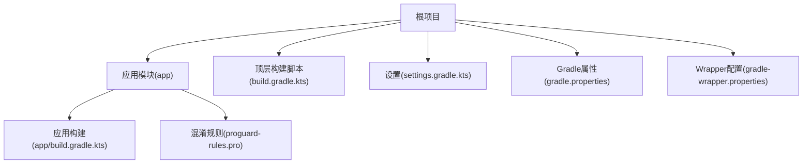
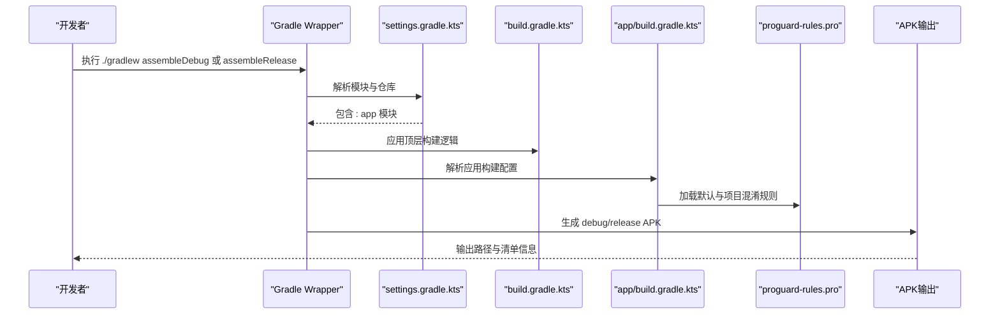
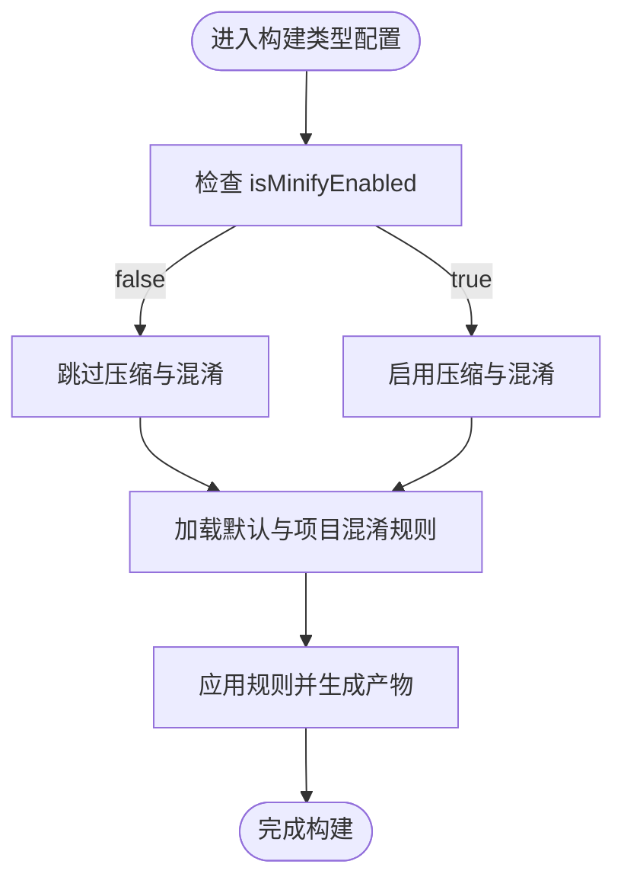
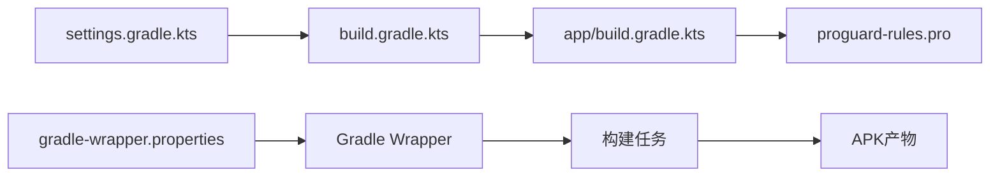

# 构建调试与发布版本APK

<cite>
**本文引用的文件**
- [app/build.gradle.kts](file://app/build.gradle.kts)
- [build.gradle.kts](file://build.gradle.kts)
- [gradle.properties](file://gradle.properties)
- [settings.gradle.kts](file://settings.gradle.kts)
- [gradle-wrapper.properties](file://gradle/wrapper/gradle-wrapper.properties)
- [proguard-rules.pro](file://app/proguard-rules.pro)
</cite>

## 目录
1. [简介](#简介)
2. [项目结构](#项目结构)
3. [核心组件](#核心组件)
4. [架构总览](#架构总览)
5. [详细组件分析](#详细组件分析)
6. [依赖关系分析](#依赖关系分析)
7. [性能考虑](#性能考虑)
8. [故障排查指南](#故障排查指南)
9. [结论](#结论)
10. [附录](#附录)

## 简介
本文件面向需要在本地通过命令行构建Android应用APK的开发者，系统性说明如何使用Gradle构建“调试版”（debug）与“发布版”（release）APK，并深入解析app/build.gradle.kts中buildTypes配置块的含义，尤其是release构建类型中的isMinifyEnabled与proguardFiles的作用。同时给出命令行构建步骤、产物输出位置、混淆规则文件的角色与自定义方法，以及常见构建失败问题的排查思路。

## 项目结构
该仓库为标准Android应用工程，采用Kotlin DSL构建脚本，模块位于app目录下，顶层包含构建脚本与仓库配置文件。关键文件包括：
- app/build.gradle.kts：应用模块的构建配置，含buildTypes、编译选项、依赖声明等
- build.gradle.kts：顶层构建脚本，统一管理插件与仓库
- gradle.properties：全局Gradle属性设置
- settings.gradle.kts：插件仓库与模块包含配置
- gradle-wrapper.properties：Gradle Wrapper分发版本配置
- app/proguard-rules.pro：ProGuard/R8混淆规则文件

图表来源
- [settings.gradle.kts](file://settings.gradle.kts#L1-L24)
- [build.gradle.kts](file://build.gradle.kts#L1-L5)
- [gradle.properties](file://gradle.properties#L1-L23)
- [gradle-wrapper.properties](file://gradle/wrapper/gradle-wrapper.properties#L1-L9)
- [app/build.gradle.kts](file://app/build.gradle.kts#L1-L47)
- [proguard-rules.pro](file://app/proguard-rules.pro#L1-L21)

章节来源
- [settings.gradle.kts](file://settings.gradle.kts#L1-L24)
- [build.gradle.kts](file://build.gradle.kts#L1-L5)
- [gradle.properties](file://gradle.properties#L1-L23)
- [gradle-wrapper.properties](file://gradle/wrapper/gradle-wrapper.properties#L1-L9)

## 核心组件
- 构建类型与混淆配置
  - 在app/build.gradle.kts中，buildTypes块定义了release构建类型，并设置了isMinifyEnabled与proguardFiles。当前release未启用代码压缩与混淆（isMinifyEnabled=false），但保留了默认的优化配置文件与项目自定义规则文件的引用。
- 编译与语言级别
  - compileSdk、minSdk、targetSdk在defaultConfig中定义；compileOptions与kotlinOptions统一到Java 11。
- 依赖与插件
  - 顶层build.gradle.kts声明并复用android应用与Kotlin插件；app模块通过libs版本目录管理依赖。
- 全局Gradle属性
  - gradle.properties开启AndroidX、非传递R类等特性，有助于减小R类体积与提升兼容性。

章节来源
- [app/build.gradle.kts](file://app/build.gradle.kts#L1-L47)
- [build.gradle.kts](file://build.gradle.kts#L1-L5)
- [gradle.properties](file://gradle.properties#L1-L23)

## 架构总览
下图展示了从命令行触发构建到生成APK产物的整体流程，涵盖Gradle Wrapper、构建脚本、构建类型与混淆配置之间的关系。

图表来源
- [settings.gradle.kts](file://settings.gradle.kts#L1-L24)
- [build.gradle.kts](file://build.gradle.kts#L1-L5)
- [app/build.gradle.kts](file://app/build.gradle.kts#L1-L47)
- [proguard-rules.pro](file://app/proguard-rules.pro#L1-L21)

## 详细组件分析

### 构建类型与混淆配置详解
- buildTypes配置块
  - 作用：定义不同构建变体（如debug、release）的编译与打包策略。
  - 当前release配置要点：
    - isMinifyEnabled：是否启用代码压缩与混淆。当前值为false，表示不进行压缩与混淆。
    - proguardFiles：指定混淆规则文件列表。包含默认优化配置文件与项目自定义规则文件。
- 为什么release默认关闭混淆？
  - 便于发布前快速验证功能与减少构建时间；若后续需要发布优化包，可按需开启并完善混淆规则。
- 混淆规则文件角色
  - proguard-rules.pro用于声明项目特定的混淆保留与优化规则，例如保留WebView JavaScript接口类、保留行号信息以便调试等。

图表来源
- [app/build.gradle.kts](file://app/build.gradle.kts#L21-L30)
- [proguard-rules.pro](file://app/proguard-rules.pro#L1-L21)

章节来源
- [app/build.gradle.kts](file://app/build.gradle.kts#L21-L30)
- [proguard-rules.pro](file://app/proguard-rules.pro#L1-L21)

### 命令行构建与产物输出
- 调试版APK构建
  - 使用命令：./gradlew assembleDebug
  - 作用：构建debug变体，便于本地调试与测试。
- 发布版APK构建
  - 使用命令：./gradlew assembleRelease
  - 作用：构建release变体，当前未启用混淆，如需混淆请参考后文调整。
- 产物输出位置
  - 调试版APK通常位于：app/build/outputs/apk/debug/
  - 发布版APK通常位于：app/build/outputs/apk/release/
  - 中间产物与元数据位于：app/build/intermediates/ 与 app/build/outputs/logs/

章节来源
- [app/build.gradle.kts](file://app/build.gradle.kts#L1-L47)

### 自定义混淆规则
- 如何添加自定义规则
  - 在proguard-rules.pro中新增保留规则，例如保留特定类或成员以防止被混淆。
  - 可根据需要启用保留行号信息以便调试堆栈。
- 注意事项
  - 若项目使用WebView且存在JavaScript接口，请明确保留相关类，避免运行时反射异常。
  - 启用混淆后建议配合签名与完整性校验，确保发布包安全。

章节来源
- [proguard-rules.pro](file://app/proguard-rules.pro#L1-L21)

## 依赖关系分析
- 插件与仓库
  - 顶层build.gradle.kts声明并复用android应用与Kotlin插件，settings.gradle.kts配置仓库与模块包含。
- 构建脚本链路
  - settings.gradle.kts -> build.gradle.kts -> app/build.gradle.kts -> proguard-rules.pro
- Gradle Wrapper
  - gradle-wrapper.properties固定Gradle版本，确保团队一致性。

图表来源
- [settings.gradle.kts](file://settings.gradle.kts#L1-L24)
- [build.gradle.kts](file://build.gradle.kts#L1-L5)
- [app/build.gradle.kts](file://app/build.gradle.kts#L1-L47)
- [proguard-rules.pro](file://app/proguard-rules.pro#L1-L21)
- [gradle-wrapper.properties](file://gradle/wrapper/gradle-wrapper.properties#L1-L9)

章节来源
- [settings.gradle.kts](file://settings.gradle.kts#L1-L24)
- [build.gradle.kts](file://build.gradle.kts#L1-L5)
- [gradle-wrapper.properties](file://gradle/wrapper/gradle-wrapper.properties#L1-L9)

## 性能考虑
- 构建速度
  - 关闭混淆可显著缩短release构建时间，适合快速迭代与预发布验证。
  - 若开启混淆，建议在CI中缓存依赖与增量构建，减少重复工作。
- 资源与R类
  - gradle.properties中启用android.nonTransitiveRClass可减小R类体积，降低编译与打包开销。
- 并行与内存
  - gradle.properties中可通过org.gradle.jvmargs调整JVM内存，提升大项目构建稳定性。

章节来源
- [gradle.properties](file://gradle.properties#L1-L23)

## 故障排查指南
- 签名错误
  - 现象：构建release时报签名相关错误。
  - 排查：确认是否配置了签名信息（如签名密钥库与别名）。当前仓库未见签名配置文件，如需发布正式包，请补充签名配置。
- 资源合并冲突
  - 现象：多渠道或多模块资源命名冲突导致合并失败。
  - 排查：检查values、drawable、mipmap等资源命名是否唯一；必要时使用命名空间或资源隔离策略。
- 构建类型未生效
  - 现象：期望release启用混淆但未生效。
  - 排查：确认app/build.gradle.kts中release块的isMinifyEnabled已设为true；proguardFiles已正确引用默认与项目规则文件。
- Gradle版本不一致
  - 现象：不同机器构建结果不一致。
  - 排查：核对gradle-wrapper.properties中的Gradle版本，确保团队统一使用相同版本。

章节来源
- [app/build.gradle.kts](file://app/build.gradle.kts#L21-L30)
- [proguard-rules.pro](file://app/proguard-rules.pro#L1-L21)
- [gradle-wrapper.properties](file://gradle/wrapper/gradle-wrapper.properties#L1-L9)

## 结论
本仓库通过Kotlin DSL构建脚本清晰地定义了构建类型与混淆策略，默认release未启用混淆以提升构建效率。开发者可通过./gradlew assembleDebug与./gradlew assembleRelease分别构建调试与发布APK，产物位于app/build/outputs/apk/对应目录。若需发布优化包，可在release构建类型中启用混淆并完善proguard-rules.pro中的规则。遇到签名错误、资源冲突等问题时，可依据本文提供的排查步骤逐一定位与修复。

## 附录
- 常用命令
  - 构建调试APK：./gradlew assembleDebug
  - 构建发布APK：./gradlew assembleRelease
- 产物路径
  - 调试APK：app/build/outputs/apk/debug/
  - 发布APK：app/build/outputs/apk/release/
- 配置文件位置
  - 应用构建配置：app/build.gradle.kts
  - 顶层构建配置：build.gradle.kts
  - Gradle属性：gradle.properties
  - 设置与仓库：settings.gradle.kts
  - Wrapper版本：gradle/wrapper/gradle-wrapper.properties
  - 混淆规则：app/proguard-rules.pro