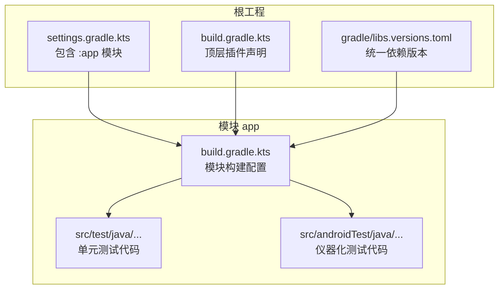
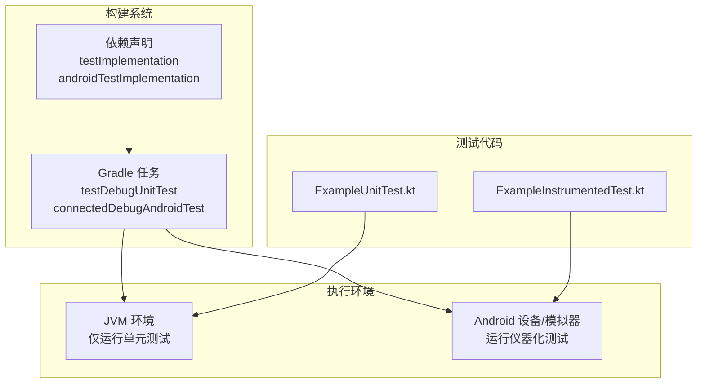
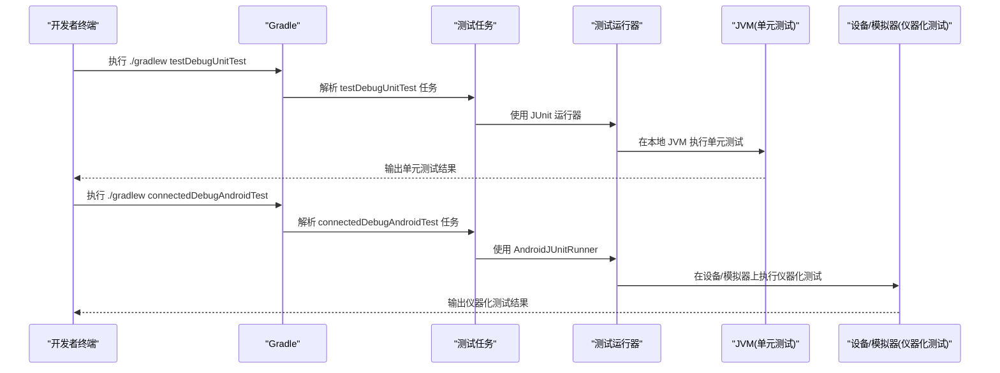
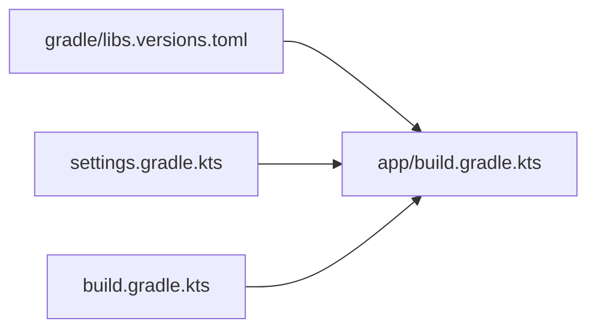

# 运行单元测试与仪器化测试

<cite>
**本文引用的文件**
- [app/src/test/java/com/bili/bilitv/ExampleUnitTest.kt](file://app/src/test/java/com/bili/bilitv/ExampleUnitTest.kt)
- [app/src/androidTest/java/com/bili/bilitv/ExampleInstrumentedTest.kt](file://app/src/androidTest/java/com/bili/bilitv/ExampleInstrumentedTest.kt)
- [app/build.gradle.kts](file://app/build.gradle.kts)
- [build.gradle.kts](file://build.gradle.kts)
- [settings.gradle.kts](file://settings.gradle.kts)
- [gradle/libs.versions.toml](file://gradle/libs.versions.toml)
</cite>

## 目录
1. [简介](#简介)
2. [项目结构](#项目结构)
3. [核心组件](#核心组件)
4. [架构总览](#架构总览)
5. [详细组件分析](#详细组件分析)
6. [依赖关系分析](#依赖关系分析)
7. [性能与效率建议](#性能与效率建议)
8. [故障排查指南](#故障排查指南)
9. [结论](#结论)
10. [附录](#附录)

## 简介
本指南面向开发者，帮助你在本地正确运行项目的单元测试与仪器化测试。内容涵盖：
- testImplementation 与 androidTestImplementation 的区别及其在测试执行中的作用
- 如何通过 Android Studio 测试运行器或命令行触发测试任务
- 结合 ExampleUnitTest.kt 与 ExampleInstrumentedTest.kt 解释本地测试与设备测试的应用场景
- 测试失败时的日志查看路径与调试建议，包括模拟器环境配置、权限问题处理等

## 项目结构
该模块为 Android 应用模块，测试相关源码位于标准目录中：
- 单元测试：app/src/test/java/...
- 仪器化测试：app/src/androidTest/java/...

构建脚本与仓库配置位于根工程与模块级 Gradle 文件中，统一管理插件与依赖版本。

图表来源
- [settings.gradle.kts](file://settings.gradle.kts#L1-L24)
- [build.gradle.kts](file://build.gradle.kts#L1-L5)
- [gradle/libs.versions.toml](file://gradle/libs.versions.toml#L1-L23)
- [app/build.gradle.kts](file://app/build.gradle.kts#L1-L47)

章节来源
- [settings.gradle.kts](file://settings.gradle.kts#L1-L24)
- [build.gradle.kts](file://build.gradle.kts#L1-L5)
- [gradle/libs.versions.toml](file://gradle/libs.versions.toml#L1-L23)
- [app/build.gradle.kts](file://app/build.gradle.kts#L1-L47)

## 核心组件
- 单元测试示例：ExampleUnitTest.kt
  - 位置：app/src/test/java/com/bili/bilitv/ExampleUnitTest.kt
  - 特点：纯 JVM 环境执行，不依赖 Android 框架，适合逻辑与工具类验证
- 仪器化测试示例：ExampleInstrumentedTest.kt
  - 位置：app/src/androidTest/java/com/bili/bilitv/ExampleInstrumentedTest.kt
  - 特点：在真实设备或模拟器上运行，可访问 Android 框架与应用上下文

章节来源
- [app/src/test/java/com/bili/bilitv/ExampleUnitTest.kt](file://app/src/test/java/com/bili/bilitv/ExampleUnitTest.kt#L1-L17)
- [app/src/androidTest/java/com/bili/bilitv/ExampleInstrumentedTest.kt](file://app/src/androidTest/java/com/bili/bilitv/ExampleInstrumentedTest.kt#L1-L24)

## 架构总览
下图展示测试任务在构建系统中的角色与依赖关系，以及两类测试的执行环境差异。

图表来源
- [app/build.gradle.kts](file://app/build.gradle.kts#L1-L47)
- [app/src/test/java/com/bili/bilitv/ExampleUnitTest.kt](file://app/src/test/java/com/bili/bilitv/ExampleUnitTest.kt#L1-L17)
- [app/src/androidTest/java/com/bili/bilitv/ExampleInstrumentedTest.kt](file://app/src/androidTest/java/com/bili/bilitv/ExampleInstrumentedTest.kt#L1-L24)

## 详细组件分析

### 单元测试：ExampleUnitTest.kt
- 执行环境：本地 JVM（开发机器）
- 适用场景：验证纯逻辑、数学运算、工具函数、非 Android 依赖的业务逻辑
- 关键点：无需 Android 框架，启动快，便于持续集成与快速反馈

章节来源
- [app/src/test/java/com/bili/bilitv/ExampleUnitTest.kt](file://app/src/test/java/com/bili/bilitv/ExampleUnitTest.kt#L1-L17)

### 仪器化测试：ExampleInstrumentedTest.kt
- 执行环境：Android 设备或模拟器
- 适用场景：验证应用上下文、资源访问、系统服务、UI 行为（配合 Espresso）
- 关键点：使用 AndroidJUnit4 运行器与 InstrumentationRegistry 获取目标上下文

章节来源
- [app/src/androidTest/java/com/bili/bilitv/ExampleInstrumentedTest.kt](file://app/src/androidTest/java/com/bili/bilitv/ExampleInstrumentedTest.kt#L1-L24)

### 依赖与运行器配置
- testImplementation：为单元测试提供 JUnit 4 等依赖
- androidTestImplementation：为仪器化测试提供 AndroidX Test JUnit 与 Espresso
- testInstrumentationRunner：指定仪器化测试运行器（AndroidJUnitRunner）

章节来源
- [app/build.gradle.kts](file://app/build.gradle.kts#L1-L47)
- [gradle/libs.versions.toml](file://gradle/libs.versions.toml#L1-L23)

### 命令行触发测试流程（序列图）
以下序列图展示了从命令到测试执行的关键步骤，包括任务解析、依赖注入与运行器调用。

图表来源
- [app/build.gradle.kts](file://app/build.gradle.kts#L1-L47)
- [app/src/test/java/com/bili/bilitv/ExampleUnitTest.kt](file://app/src/test/java/com/bili/bilitv/ExampleUnitTest.kt#L1-L17)
- [app/src/androidTest/java/com/bili/bilitv/ExampleInstrumentedTest.kt](file://app/src/androidTest/java/com/bili/bilitv/ExampleInstrumentedTest.kt#L1-L24)

## 依赖关系分析
- 统一版本管理：libs.versions.toml 提供 junit、androidx.test.ext:junit、androidx.test.espresso:espresso-core 等依赖版本
- 模块依赖声明：app/build.gradle.kts 中通过 testImplementation 与 androidTestImplementation 引入对应依赖
- 插件与仓库：settings.gradle.kts 配置仓库与插件解析；build.gradle.kts 声明顶层插件

图表来源
- [gradle/libs.versions.toml](file://gradle/libs.versions.toml#L1-L23)
- [app/build.gradle.kts](file://app/build.gradle.kts#L1-L47)
- [settings.gradle.kts](file://settings.gradle.kts#L1-L24)
- [build.gradle.kts](file://build.gradle.kts#L1-L5)

章节来源
- [gradle/libs.versions.toml](file://gradle/libs.versions.toml#L1-L23)
- [app/build.gradle.kts](file://app/build.gradle.kts#L1-L47)
- [settings.gradle.kts](file://settings.gradle.kts#L1-L24)
- [build.gradle.kts](file://build.gradle.kts#L1-L5)

## 性能与效率建议
- 优先使用单元测试验证纯逻辑，提升反馈速度
- 将仪器化测试聚焦于需要 Android 上下文的场景，避免不必要的设备端开销
- 合理拆分测试用例，减少仪器化测试的运行时间
- 在 CI 环境中并行执行不同变体的测试任务，缩短整体耗时

## 故障排查指南

### 常见问题与定位路径
- 无法找到测试任务
  - 确认已同步 Gradle 并包含模块
  - 参考任务名称：testDebugUnitTest、connectedDebugAndroidTest
- 设备未连接或模拟器不可用
  - 启动模拟器或连接真机，确保 adb devices 可见
  - 若使用模拟器，确认系统镜像与 ABI 兼容
- 权限不足或签名问题
  - 确保安装包签名与测试运行器兼容
  - 检查清单文件与权限声明是否满足测试需求
- 依赖冲突或版本不匹配
  - 核对 libs.versions.toml 中的版本号
  - 清理缓存后重新构建：./gradlew clean && ./gradlew build

### 日志查看路径
- 控制台输出：Gradle 任务执行的标准输出与错误输出
- Android Studio 测试结果窗口：查看测试报告与失败堆栈
- 设备日志：使用 logcat 查看仪器化测试期间的系统日志
- 构建日志：检查 Gradle 构建输出中的警告与错误

### 调试建议
- 单元测试调试：直接在 IDE 中右键运行单测，断点定位清晰
- 仪器化测试调试：在 Android Studio 中选择“Android Instrumented Tests”，设置断点并运行
- 模拟器配置：确保系统镜像版本与 targetSdk 匹配；必要时更换 ABI 或启用硬件加速
- 权限处理：若测试涉及系统权限，提前在设备上授予或在测试前动态申请

章节来源
- [app/build.gradle.kts](file://app/build.gradle.kts#L1-L47)
- [gradle/libs.versions.toml](file://gradle/libs.versions.toml#L1-L23)

## 结论
- testImplementation 用于本地 JVM 单元测试，速度快、易调试
- androidTestImplementation 用于设备/模拟器上的仪器化测试，覆盖真实 Android 环境
- 通过 Android Studio 或命令行均可触发测试任务，建议结合两者进行日常开发与持续集成
- 出错时优先检查设备/模拟器状态、依赖版本与权限配置，并利用 IDE 与日志进行定位

## 附录

### 术语说明
- 单元测试：在本地 JVM 环境执行，不依赖 Android 框架
- 仪器化测试：在 Android 设备或模拟器上执行，可访问 Android 框架与应用上下文
- testImplementation：仅在 test 编译集生效的依赖
- androidTestImplementation：仅在 androidTest 编译集生效的依赖

### 示例文件路径参考
- 单元测试示例：app/src/test/java/com/bili/bilitv/ExampleUnitTest.kt
- 仪器化测试示例：app/src/androidTest/java/com/bili/bilitv/ExampleInstrumentedTest.kt

章节来源
- [app/src/test/java/com/bili/bilitv/ExampleUnitTest.kt](file://app/src/test/java/com/bili/bilitv/ExampleUnitTest.kt#L1-L17)
- [app/src/androidTest/java/com/bili/bilitv/ExampleInstrumentedTest.kt](file://app/src/androidTest/java/com/bili/bilitv/ExampleInstrumentedTest.kt#L1-L24)