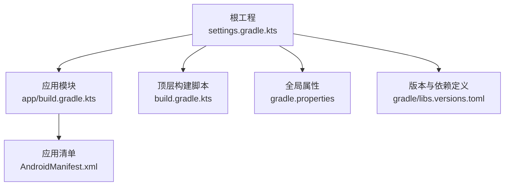
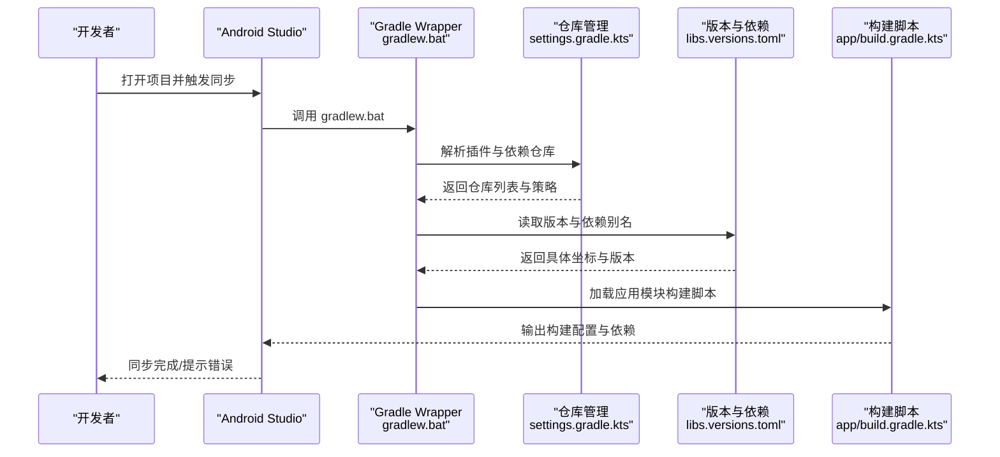
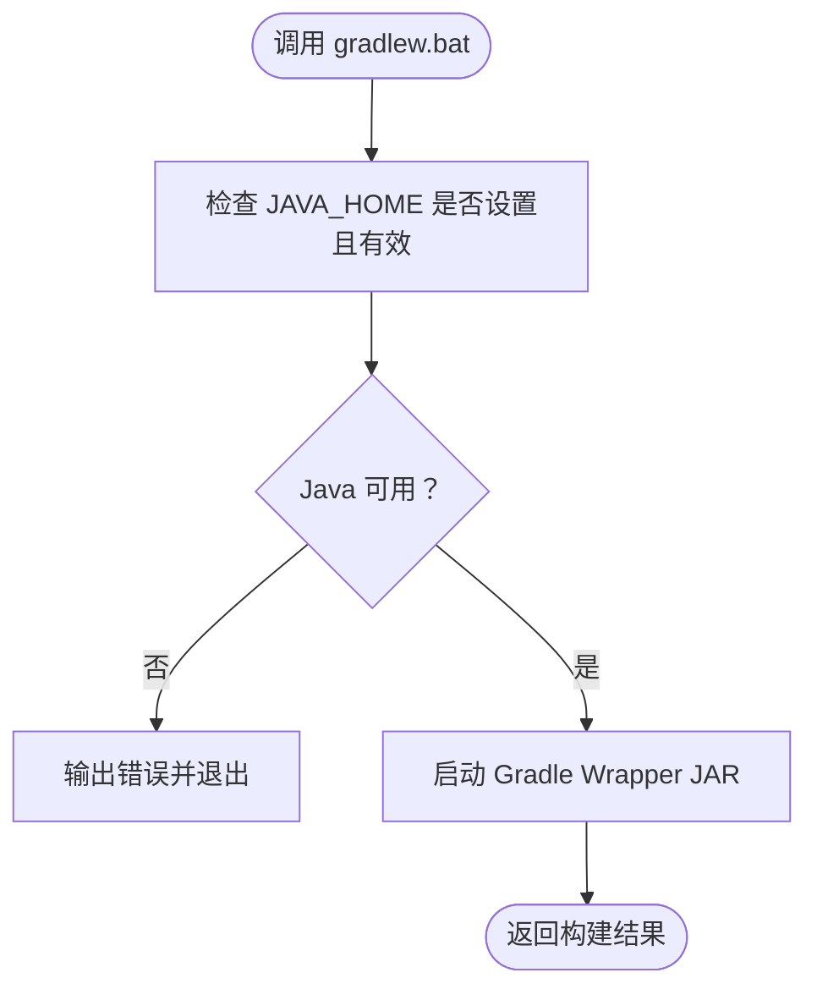
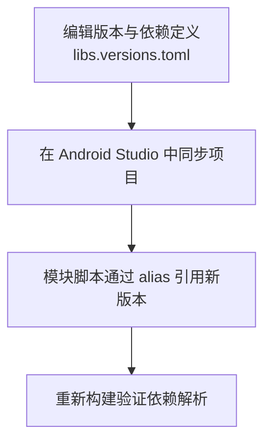
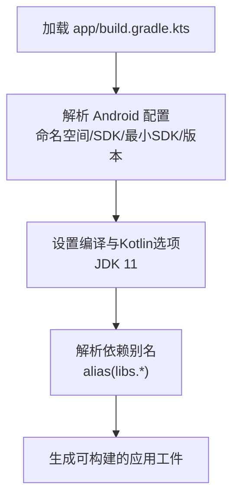
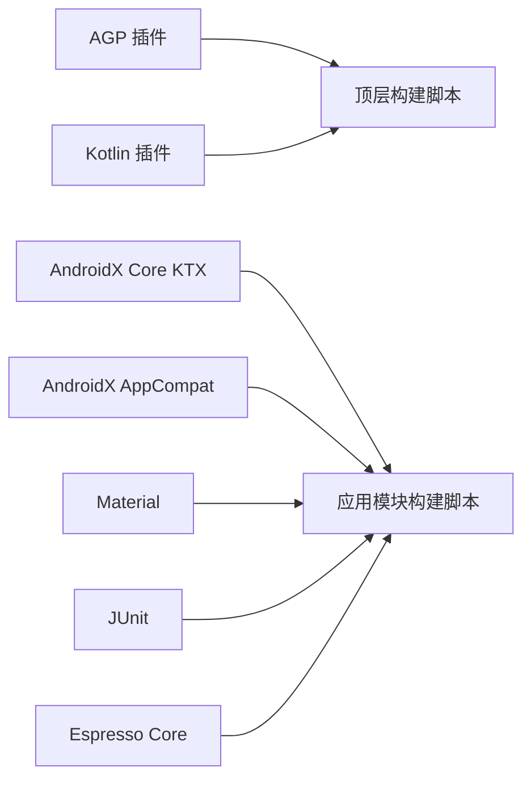

# 开发环境搭建

<cite>
**本文引用的文件**
- [gradlew.bat](file://gradlew.bat)
- [settings.gradle.kts](file://settings.gradle.kts)
- [build.gradle.kts](file://build.gradle.kts)
- [gradle.properties](file://gradle.properties)
- [gradle/libs.versions.toml](file://gradle/libs.versions.toml)
- [app/build.gradle.kts](file://app/build.gradle.kts)
- [app/src/main/AndroidManifest.xml](file://app/src/main/AndroidManifest.xml)
</cite>

## 目录
1. [简介](#简介)
2. [项目结构](#项目结构)
3. [核心组件](#核心组件)
4. [架构总览](#架构总览)
5. [详细组件分析](#详细组件分析)
6. [依赖分析](#依赖分析)
7. [性能考虑](#性能考虑)
8. [故障排查指南](#故障排查指南)
9. [结论](#结论)
10. [附录](#附录)

## 简介
本指南面向新加入的开发者，帮助你快速完成 bilitv 项目的本地开发环境搭建与配置。内容覆盖：
- Android Studio 安装与基础配置
- JDK 11 的安装与环境变量设置
- Android SDK 的准备与路径配置
- 项目导入步骤与 Gradle Wrapper 的作用
- 依赖管理机制（libs.versions.toml）与依赖同步流程
- 常见环境问题排查（如 Gradle 同步失败、SDK 路径错误等）

目标是让你在最短时间内完成环境准备，顺利进入开发状态。

## 项目结构
该项目采用多模块结构，根工程通过 settings.gradle.kts 指定包含 app 子模块；顶层 build.gradle.kts 使用版本目录中的插件别名；应用层 app/build.gradle.kts 配置了 Android 构建参数与依赖。

图表来源
- [settings.gradle.kts](file://settings.gradle.kts#L1-L24)
- [build.gradle.kts](file://build.gradle.kts#L1-L5)
- [gradle.properties](file://gradle.properties#L1-L23)
- [gradle/libs.versions.toml](file://gradle/libs.versions.toml#L1-L23)
- [app/build.gradle.kts](file://app/build.gradle.kts#L1-L47)
- [app/src/main/AndroidManifest.xml](file://app/src/main/AndroidManifest.xml#L1-L15)

章节来源
- [settings.gradle.kts](file://settings.gradle.kts#L1-L24)
- [build.gradle.kts](file://build.gradle.kts#L1-L5)
- [gradle.properties](file://gradle.properties#L1-L23)
- [gradle/libs.versions.toml](file://gradle/libs.versions.toml#L1-L23)
- [app/build.gradle.kts](file://app/build.gradle.kts#L1-L47)
- [app/src/main/AndroidManifest.xml](file://app/src/main/AndroidManifest.xml#L1-L15)

## 核心组件
- 顶层构建脚本：使用版本目录中的插件别名，避免在子模块重复声明插件版本。
- 应用模块构建脚本：配置命名空间、编译与目标 SDK、最小 SDK、编译选项（JDK 11）、测试依赖等。
- 版本与依赖定义：集中管理第三方库与插件版本，便于统一升级与同步。
- 全局属性：启用 AndroidX、非传递 R 类、JVM 内存参数等。
- 设置脚本：统一插件仓库与依赖仓库策略，确保仓库一致性。

章节来源
- [build.gradle.kts](file://build.gradle.kts#L1-L5)
- [app/build.gradle.kts](file://app/build.gradle.kts#L1-L47)
- [gradle/libs.versions.toml](file://gradle/libs.versions.toml#L1-L23)
- [gradle.properties](file://gradle.properties#L1-L23)
- [settings.gradle.kts](file://settings.gradle.kts#L1-L24)

## 架构总览
下图展示了从 Android Studio 到 Gradle Wrapper，再到版本与依赖解析的整体流程。

图表来源
- [gradlew.bat](file://gradlew.bat#L1-L95)
- [settings.gradle.kts](file://settings.gradle.kts#L1-L24)
- [gradle/libs.versions.toml](file://gradle/libs.versions.toml#L1-L23)
- [app/build.gradle.kts](file://app/build.gradle.kts#L1-L47)

## 详细组件分析

### 组件一：Gradle Wrapper（gradlew.bat）
- 作用
  - 提供跨平台一致的 Gradle 构建入口，避免不同机器上手动安装不同版本 Gradle 导致的不一致。
  - 在 Windows 上通过批处理脚本定位 Java 并启动 Gradle Wrapper JAR。
- 关键行为
  - 优先从 JAVA_HOME 查找 Java；若未设置或无效，则提示设置 JAVA_HOME 或 PATH 中存在可用 java 命令。
  - 通过 -jar 方式执行包装器 JAR，并传入默认 JVM 参数与命令行参数。
- 与项目的关系
  - 项目使用该脚本进行构建与同步，确保团队成员使用相同的 Gradle 版本与插件版本。

图表来源
- [gradlew.bat](file://gradlew.bat#L1-L95)

章节来源
- [gradlew.bat](file://gradlew.bat#L1-L95)

### 组件二：版本与依赖管理（libs.versions.toml）
- 作用
  - 将所有第三方库与插件版本集中在一个文件中，通过别名在各模块中引用，实现统一升级与维护。
- 结构要点
  - [versions]：统一声明版本号（如 AGP、Kotlin、AndroidX、Material 等）。
  - [libraries]：以坐标形式定义库，引用 [versions] 中的版本。
  - [plugins]：定义插件 ID 与其版本引用。
- 在项目中的使用
  - 顶层 build.gradle.kts 与 app/build.gradle.kts 通过 alias(libs.*) 引用插件与库，避免硬编码版本。
- 同步与升级流程
  - 修改 [versions] 中的版本后，在 Android Studio 中触发“同步项目”，即可将新版本传播到所有模块。
  - 若需要新增库，先在 [libraries] 中添加条目，再在模块中通过 alias 引用。

图表来源
- [gradle/libs.versions.toml](file://gradle/libs.versions.toml#L1-L23)
- [build.gradle.kts](file://build.gradle.kts#L1-L5)
- [app/build.gradle.kts](file://app/build.gradle.kts#L1-L47)

章节来源
- [gradle/libs.versions.toml](file://gradle/libs.versions.toml#L1-L23)
- [build.gradle.kts](file://build.gradle.kts#L1-L5)
- [app/build.gradle.kts](file://app/build.gradle.kts#L1-L47)

### 组件三：应用模块构建脚本（app/build.gradle.kts）
- 关键配置
  - 命名空间与编译/目标 SDK、最小 SDK、版本号与名称。
  - 编译选项与 Kotlin 选项均设置为 JDK 11。
  - 依赖项通过 alias(libs.*) 引用，包括 AndroidX 核心、AppCompat、Material、JUnit 测试与 Espresso。
- 影响范围
  - 这些配置直接影响编译器兼容性、运行时行为与测试覆盖率。

图表来源
- [app/build.gradle.kts](file://app/build.gradle.kts#L1-L47)

章节来源
- [app/build.gradle.kts](file://app/build.gradle.kts#L1-L47)

### 组件四：全局属性（gradle.properties）
- 关键设置
  - 启用 AndroidX、非传递 R 类、JVM 内存参数等。
- 对构建的影响
  - 影响资源命名空间、内存分配与并行构建策略等。

章节来源
- [gradle.properties](file://gradle.properties#L1-L23)

### 组件五：设置脚本（settings.gradle.kts）
- 关键设置
  - 插件仓库：Google、Maven Central、Gradle Plugin Portal。
  - 依赖仓库：Google、Maven Central。
  - 仓库策略：FAIL_ON_PROJECT_REPOS，确保项目不会意外使用模块级仓库覆盖全局策略。
  - 包含 app 子模块。
- 对构建的影响
  - 统一插件与依赖来源，减少因仓库差异导致的解析失败。

章节来源
- [settings.gradle.kts](file://settings.gradle.kts#L1-L24)

## 依赖分析
- 依赖来源
  - 插件与库通过 libs.versions.toml 统一定义与引用。
  - 仓库由 settings.gradle.kts 统一管理，确保一致性。
- 依赖关系可视化

图表来源
- [gradle/libs.versions.toml](file://gradle/libs.versions.toml#L1-L23)
- [build.gradle.kts](file://build.gradle.kts#L1-L5)
- [app/build.gradle.kts](file://app/build.gradle.kts#L1-L47)

章节来源
- [gradle/libs.versions.toml](file://gradle/libs.versions.toml#L1-L23)
- [build.gradle.kts](file://build.gradle.kts#L1-L5)
- [app/build.gradle.kts](file://app/build.gradle.kts#L1-L47)

## 性能考虑
- JVM 内存：gradle.properties 中设置了较大的堆大小，有助于大型项目构建。
- 并行构建：注释掉的并行选项可根据项目规模与硬件条件开启。
- 仓库一致性：统一仓库与 FAIL_ON_PROJECT_REPOS 策略可减少解析失败与缓存抖动。

章节来源
- [gradle.properties](file://gradle.properties#L1-L23)
- [settings.gradle.kts](file://settings.gradle.kts#L1-L24)

## 故障排查指南
- Gradle 同步失败
  - 检查网络与代理：确保可访问 Google、Maven Central、Gradle Plugin Portal。
  - 清理缓存：在 Android Studio 中选择“清理并重建”或删除 .gradle 缓存后重试。
  - 同步项目：修改版本或依赖后，务必点击“同步项目”按钮。
- SDK 路径错误
  - 确认 Android Studio 已正确安装 SDK 并配置路径。
  - 在项目中确认 app/build.gradle.kts 中的 compileSdk/targetSdk/minSdk 配置与本地 SDK 匹配。
- Java 环境问题
  - gradlew.bat 会检查 JAVA_HOME 是否设置且有效；若提示未设置或无效，请在系统环境变量中设置 JAVA_HOME 指向 JDK 11 安装目录。
- 依赖解析失败
  - 确认 settings.gradle.kts 的仓库配置未被模块级仓库覆盖（FAIL_ON_PROJECT_REPOS 策略）。
  - 检查 libs.versions.toml 中的版本与坐标是否正确，避免拼写错误。
- 构建失败（Kotlin/JDK 兼容性）
  - 确保项目使用的 Kotlin 与 AGP 版本与 JDK 11 兼容；必要时在 libs.versions.toml 中调整版本后再同步。

章节来源
- [gradlew.bat](file://gradlew.bat#L1-L95)
- [settings.gradle.kts](file://settings.gradle.kts#L1-L24)
- [gradle/libs.versions.toml](file://gradle/libs.versions.toml#L1-L23)
- [app/build.gradle.kts](file://app/build.gradle.kts#L1-L47)

## 结论
通过以上步骤，你可以完成 bilitv 项目的环境搭建与配置：
- 安装 Android Studio、JDK 11 与 Android SDK
- 正确配置 JAVA_HOME 与 Android SDK 路径
- 使用 Gradle Wrapper（gradlew.bat）进行跨平台一致的构建
- 借助 libs.versions.toml 实现依赖与版本的集中管理与同步
- 遇到常见问题时，按故障排查指南逐项检查

完成上述配置后，你将可以顺利导入项目并在 Android Studio 中进行构建与调试。

## 附录
- 项目导入建议
  - 在 Android Studio 中选择“打开现有项目”，选择仓库根目录。
  - 等待 Gradle 同步完成，若失败请参考故障排查指南。
- 版本与依赖更新建议
  - 修改 gradle/libs.versions.toml 后，立即同步项目并验证构建。
- 最佳实践
  - 团队成员统一使用 Gradle Wrapper，避免本地环境差异。
  - 保持仓库配置一致，避免模块级仓库覆盖全局策略。