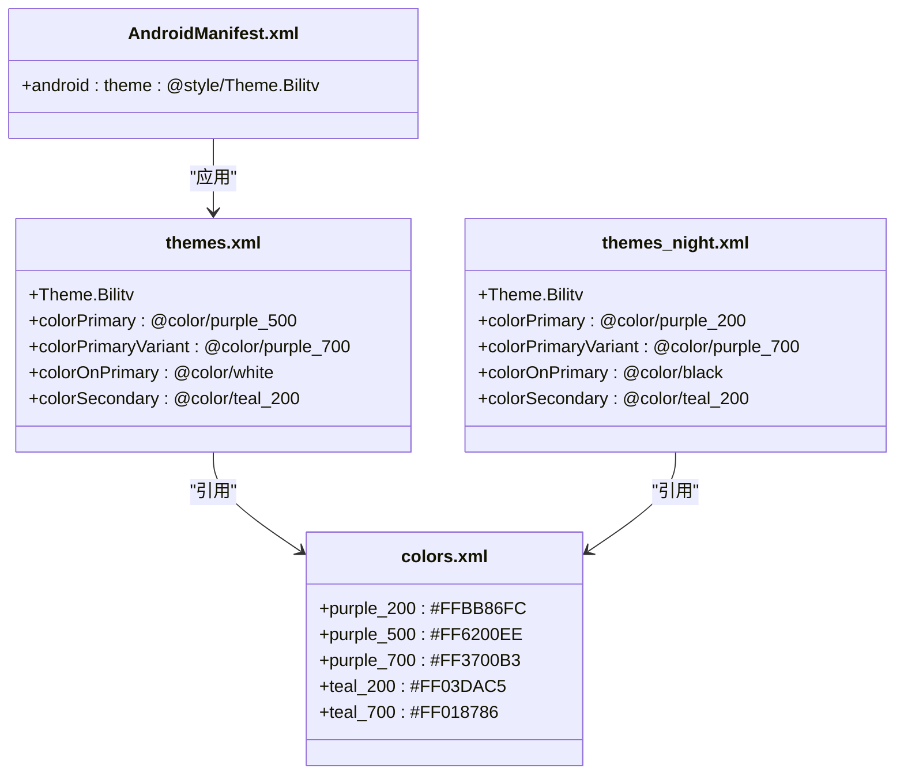
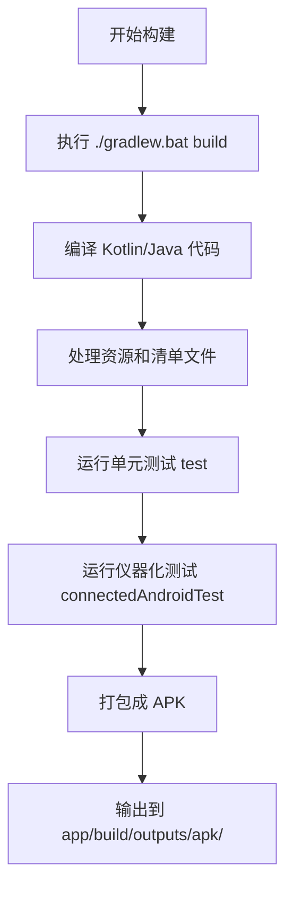

# 开发者指南

<cite>
**本文档中引用的文件**  
- [app/build.gradle.kts](file://app/build.gradle.kts)
- [settings.gradle.kts](file://settings.gradle.kts)
- [gradle.properties](file://gradle.properties)
- [gradlew.bat](file://gradlew.bat)
- [app/src/main/res/values/colors.xml](file://app/src/main/res/values/colors.xml)
- [app/src/main/res/values/themes.xml](file://app/src/main/res/values/themes.xml)
- [app/src/main/res/values-night/themes.xml](file://app/src/main/res/values-night/themes.xml)
- [app/src/main/AndroidManifest.xml](file://app/src/main/AndroidManifest.xml)
- [app/src/test/java/com/bili/bilitv/ExampleUnitTest.kt](file://app/src/test/java/com/bili/bilitv/ExampleUnitTest.kt)
- [app/src/androidTest/java/com/bili/bilitv/ExampleInstrumentedTest.kt](file://app/src/androidTest/java/com/bili/bilitv/ExampleInstrumentedTest.kt)
</cite>

## 目录
1. [简介](#简介)
2. [开发环境搭建](#开发环境搭建)
3. [项目导入与配置](#项目导入与配置)
4. [日常开发任务](#日常开发任务)
5. [自定义外观配置](#自定义外观配置)
6. [构建与测试](#构建与测试)
7. [最佳实践与快捷键](#最佳实践与快捷键)
8. [故障排除](#故障排除)

## 简介
本指南旨在为新加入的开发者提供一份实用的操作手册，涵盖从环境搭建到日常开发的完整流程。项目名为 bilitv，是一个基于 Android 的应用程序，使用 Kotlin 语言开发，并采用现代 Android 开发技术栈，包括 AndroidX、Material Design 组件和 Gradle 构建系统。通过本指南，开发者将能够快速上手项目，理解核心配置，并高效地进行功能开发和调试。

## 开发环境搭建

### Android Studio 配置
要开始开发，请确保已安装最新版本的 Android Studio。推荐使用 Android Studio Giraffe 或更高版本，以获得对 Kotlin 和 Gradle 的最佳支持。安装完成后，启动 Android Studio 并配置以下环境：

1. **JDK 版本**：项目要求使用 Java 11。在 Android Studio 中，进入 `File > Project Structure > SDK Location`，确认 JDK 路径指向 JDK 11 的安装目录。
2. **Android SDK**：确保已安装 API 级别 36 的 SDK，因为项目配置为 `compileSdk 36`。同时，`minSdk` 为 24，`targetSdk` 为 36。
3. **Kotlin 插件**：Android Studio 通常自带 Kotlin 插件，但请检查 `Settings > Plugins` 确保其已启用。

### 系统依赖
项目使用 Gradle Wrapper (`gradlew.bat`) 来保证构建环境的一致性。这意味着开发者无需手动安装 Gradle，构建脚本会自动下载并使用指定版本的 Gradle。然而，Java 环境是必需的。请确保系统环境变量 `JAVA_HOME` 已正确设置，指向 JDK 11 的安装路径。这可以通过在命令行运行 `java -version` 来验证。

**Section sources**
- [app/build.gradle.kts](file://app/build.gradle.kts#L8-L10)
- [gradle.properties](file://gradle.properties#L9)
- [gradlew.bat](file://gradlew.bat)

## 项目导入与配置

### 导入项目
1. 启动 Android Studio。
2. 选择 `Open an existing Android Studio project`。
3. 浏览到项目根目录 `` 并选择它。
4. Android Studio 将自动识别 `settings.gradle.kts` 文件并开始同步项目。

### Gradle 同步
导入后，Android Studio 会自动执行 Gradle 同步。此过程会：
- 解析 `settings.gradle.kts` 以确定包含的模块（此处为 `:app`）。
- 从 `build.gradle.kts` 文件中读取插件和依赖项。
- 根据 `dependencyResolutionManagement` 中的配置（Google Maven 仓库和 Maven Central）下载所有依赖库。

如果同步失败，请检查网络连接或代理设置。同步成功后，项目的目录结构将在 IDE 中正确显示。

```mermaid
graph TD
A[打开 Android Studio] --> B[选择 "Open an existing project"]
B --> C[定位到 ]
C --> D[自动识别 settings.gradle.kts]
D --> E[开始 Gradle 同步]
E --> F[解析模块和依赖]
F --> G[从远程仓库下载依赖]
G --> H[同步完成]
```

**Diagram sources**
- [settings.gradle.kts](file://settings.gradle.kts)
- [app/build.gradle.kts](file://app/build.gradle.kts)

**Section sources**
- [settings.gradle.kts](file://settings.gradle.kts)
- [app/build.gradle.kts](file://app/build.gradle.kts)

## 日常开发任务

### 添加新资源
Android 资源（如图片、布局文件、字符串）存放在 `app/src/main/res/` 目录下。添加新资源的步骤如下：
1. **图片资源**：将图片文件放入 `res/drawable/` 目录。对于不同分辨率的图片，可以使用 `drawable-hdpi/`, `drawable-xhdpi/` 等目录。
2. **布局文件**：创建 XML 布局文件并放入 `res/layout/` 目录。虽然当前项目结构中未显示该目录，但它是标准位置。
3. **字符串资源**：编辑 `res/values/strings.xml` 文件，添加新的 `<string>` 标签。这有助于实现多语言支持和集中管理文本。

### 配置调试环境
#### 模拟器调试
1. 在 Android Studio 中，打开 `Device Manager`。
2. 创建一个新的虚拟设备（AVD），选择一个 API 级别不低于 24 的系统镜像。
3. 启动模拟器。
4. 在 Android Studio 的工具栏中选择该模拟器，然后点击运行按钮（绿色三角形）来部署应用。

#### 真机调试
1. 在 Android 设备上启用“开发者选项”和“USB 调试”。
2. 使用 USB 数据线将设备连接到电脑。
3. Android Studio 会检测到设备，选择它并运行应用。

**Section sources**
- [app/src/main/res](file://app/src/main/res)

## 自定义外观配置

### 主题与颜色系统
应用的外观主要由 `themes.xml` 和 `colors.xml` 文件控制。项目采用了 Material Design 主题，并支持日/夜模式。

#### colors.xml
该文件定义了应用中使用的基本颜色调色板。
```xml
<!-- app/src/main/res/values/colors.xml -->
<color name="purple_500">#FF6200EE</color>
<color name="teal_200">#FF03DAC5</color>
```
这些颜色是命名的常量，可以在其他地方通过 `@color/color_name` 引用。

#### themes.xml
主题文件定义了应用的整体视觉风格，它引用了 `colors.xml` 中的颜色。
- **日间主题** (`res/values/themes.xml`)：
  ```xml
  <style name="Theme.Bilitv" parent="Theme.MaterialComponents.DayNight.DarkActionBar">
      <item name="colorPrimary">@color/purple_500</item>
      <item name="colorSecondary">@color/teal_200</item>
  </style>
  ```
- **夜间主题** (`res/values-night/themes.xml`)：
  ```xml
  <style name="Theme.Bilitv" parent="Theme.MaterialComponents.DayNight.DarkActionBar">
      <item name="colorPrimary">@color/purple_200</item>
      <item name="colorSecondary">@color/teal_200</item>
  </style>
  ```

### 自定义步骤
要修改应用的主色调：
1. 打开 `app/src/main/res/values/colors.xml`。
2. 修改 `purple_500` 的值为你想要的十六进制颜色代码。
3. 保存文件。更改会自动反映在日间主题中。
4. 如果需要为夜间模式设置不同的主色，可以修改 `app/src/main/res/values-night/themes.xml` 中 `colorPrimary` 的引用，例如指向 `@color/purple_200` 或一个新定义的颜色。

应用的主主题在 `AndroidManifest.xml` 中通过 `android:theme="@style/Theme.Bilitv"` 应用到整个应用。



**Diagram sources**
- [app/src/main/res/values/colors.xml](file://app/src/main/res/values/colors.xml)
- [app/src/main/res/values/themes.xml](file://app/src/main/res/values/themes.xml)
- [app/src/main/res/values-night/themes.xml](file://app/src/main/res/values-night/themes.xml)
- [app/src/main/AndroidManifest.xml](file://app/src/main/AndroidManifest.xml)

**Section sources**
- [app/src/main/res/values/colors.xml](file://app/src/main/res/values/colors.xml)
- [app/src/main/res/values/themes.xml](file://app/src/main/res/values/themes.xml)
- [app/src/main/res/values-night/themes.xml](file://app/src/main/res/values-night/themes.xml)
- [app/src/main/AndroidManifest.xml](file://app/src/main/AndroidManifest.xml)

## 构建与测试

### 使用 Gradle Wrapper
项目包含 Gradle Wrapper (`gradlew.bat` for Windows, `gradlew` for macOS/Linux)，它确保所有开发者使用相同的 Gradle 版本进行构建，避免了因本地 Gradle 版本不同而导致的构建问题。

常用命令：
- **构建 APK**：在项目根目录运行 `./gradlew.bat build`。这将编译代码、运行测试并生成 APK 文件，位于 `app/build/outputs/apk/`。
- **清理项目**：运行 `./gradlew.bat clean` 可以删除所有构建生成的文件。
- **同步依赖**：运行 `./gradlew.bat dependencies` 可以查看项目的依赖树。

### 运行测试用例
项目包含两种类型的测试：
- **本地单元测试**：位于 `app/src/test/`，运行在开发机的 JVM 上，用于测试纯 Kotlin/Java 代码。
- **仪器化测试**：位于 `app/src/androidTest/`，运行在 Android 设备或模拟器上，用于测试与 Android 框架交互的代码。

要运行测试：
1. 在 Android Studio 中，右键点击测试类或方法。
2. 选择 `Run 'test_name'`。
3. 或者，使用命令行：
   - 运行所有单元测试：`./gradlew.bat test`
   - 运行所有仪器化测试：`./gradlew.bat connectedAndroidTest`



**Diagram sources**
- [gradlew.bat](file://gradlew.bat)
- [app/src/test/java/com/bili/bilitv/ExampleUnitTest.kt](file://app/src/test/java/com/bili/bilitv/ExampleUnitTest.kt)
- [app/src/androidTest/java/com/bili/bilitv/ExampleInstrumentedTest.kt](file://app/src/androidTest/java/com/bili/bilitv/ExampleInstrumentedTest.kt)

**Section sources**
- [gradlew.bat](file://gradlew.bat)
- [app/src/test/java/com/bili/bilitv/ExampleUnitTest.kt](file://app/src/test/java/com/bili/bilitv/ExampleUnitTest.kt)
- [app/src/androidTest/java/com/bili/bilitv/ExampleInstrumentedTest.kt](file://app/src/androidTest/java/com/bili/bilitv/ExampleInstrumentedTest.kt)

## 最佳实践与快捷键

### 高效开发建议
- **使用 Gradle Wrapper**：始终使用 `gradlew.bat` 而不是全局的 `gradle` 命令，以保证构建一致性。
- **代码格式化**：在提交代码前，使用 Android Studio 的 `Code > Reformat Code` (Ctrl+Alt+L) 功能统一代码风格。
- **资源命名**：遵循清晰的命名约定，如 `ic_launcher_background`，以便于理解资源用途。
- **依赖管理**：所有依赖都在 `build.gradle.kts` 中声明，避免手动添加 JAR 文件。

### 推荐快捷键
- **Ctrl+Shift+N**：快速搜索文件。
- **Ctrl+Alt+L**：格式化代码。
- **Ctrl+F**：在当前文件中查找。
- **Ctrl+Shift+F**：在整个项目中查找。
- **Ctrl+Shift+U**：切换选中文本的大小写。
- **Ctrl+/**：注释/取消注释当前行或选中代码块。
- **Alt+Enter**：显示上下文操作（如导入类、修复错误）。

## 故障排除

### 常见问题
- **Gradle 同步失败**：检查网络连接，确认 `settings.gradle.kts` 中的仓库地址是否可访问。尝试 `File > Sync Project with Gradle Files`。
- **JAVA_HOME 错误**：确保 `JAVA_HOME` 环境变量指向正确的 JDK 11 路径。可以在命令行运行 `echo %JAVA_HOME%` (Windows) 或 `echo $JAVA_HOME` (macOS/Linux) 来检查。
- **设备未连接**：对于真机调试，确保已启用 USB 调试，并且设备驱动已正确安装。可以运行 `adb devices` 命令来查看连接的设备列表。
- **资源找不到**：检查资源文件名是否拼写正确，以及是否放在了正确的 `res` 子目录中。

**Section sources**
- [gradle.properties](file://gradle.properties#L9)
- [app/build.gradle.kts](file://app/build.gradle.kts)
- [settings.gradle.kts](file://settings.gradle.kts)