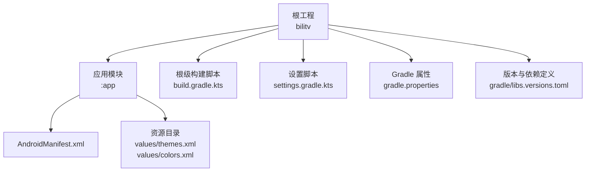
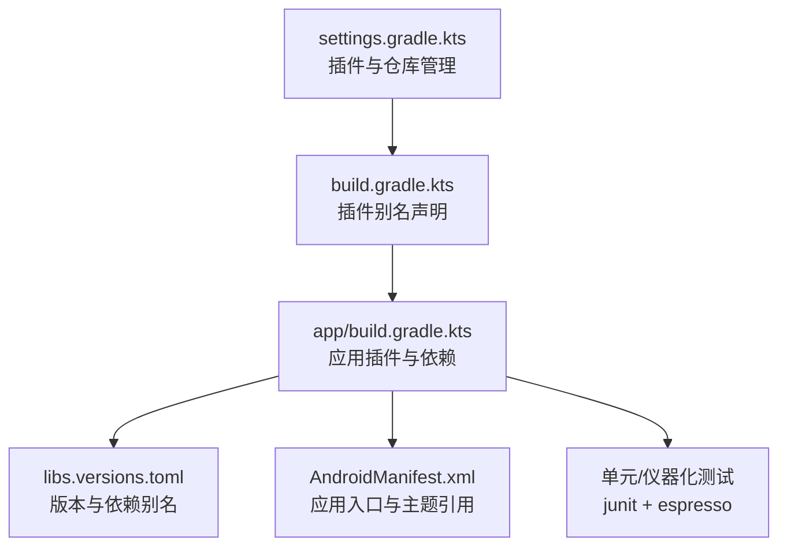
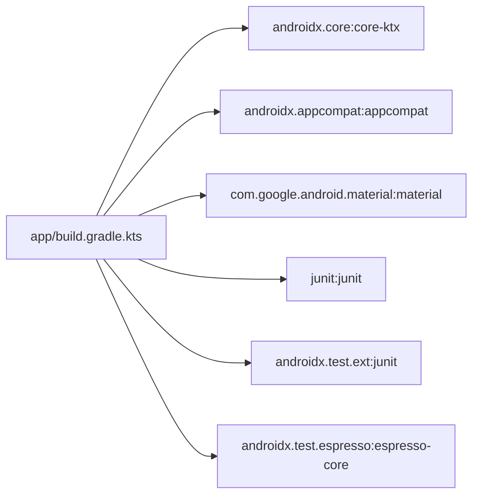

# 技术栈与依赖

<cite>
**本文引用的文件**
- [build.gradle.kts](file://build.gradle.kts)
- [app/build.gradle.kts](file://app/build.gradle.kts)
- [settings.gradle.kts](file://settings.gradle.kts)
- [gradle.properties](file://gradle.properties)
- [gradle/libs.versions.toml](file://gradle/libs.versions.toml)
- [app/src/main/res/values/themes.xml](file://app/src/main/res/values/themes.xml)
- [app/src/main/res/values/colors.xml](file://app/src/main/res/values/colors.xml)
- [app/src/main/AndroidManifest.xml](file://app/src/main/AndroidManifest.xml)
- [app/src/test/java/com/bili/bilitv/ExampleUnitTest.kt](file://app/src/test/java/com/bili/bilitv/ExampleUnitTest.kt)
- [app/src/androidTest/java/com/bili/bilitv/ExampleInstrumentedTest.kt](file://app/src/androidTest/java/com/bili/bilitv/ExampleInstrumentedTest.kt)
</cite>

## 目录
1. [引言](#引言)
2. [项目结构](#项目结构)
3. [核心组件](#核心组件)
4. [架构总览](#架构总览)
5. [详细组件分析](#详细组件分析)
6. [依赖分析](#依赖分析)
7. [性能考虑](#性能考虑)
8. [故障排查指南](#故障排查指南)
9. [结论](#结论)

## 引言
本节面向希望快速理解 bilitv 项目技术栈与构建体系的开发者，重点覆盖以下方面：
- Kotlin 语言特性在项目中的体现与优势
- AndroidX 组件（Core KTX、AppCompat）的作用与集成方式
- Material Design 主题系统与资源组织
- JUnit 与 Espresso 测试框架的配置与使用
- build.gradle.kts 中依赖声明与版本管理策略
- Gradle Kotlin DSL 相比传统 Groovy 的优势
- 关键构建插件（com.android.application、kotlin-android）的职责与影响

## 项目结构
项目采用标准 Android 应用模块化布局，根工程包含一个名为 app 的模块。构建脚本与依赖通过 Gradle Kotlin DSL 管理，并使用 libs.versions.toml 进行集中版本与依赖声明。

图表来源
- [settings.gradle.kts](file://settings.gradle.kts#L1-L24)
- [build.gradle.kts](file://build.gradle.kts#L1-L5)
- [gradle.properties](file://gradle.properties#L1-L23)
- [gradle/libs.versions.toml](file://gradle/libs.versions.toml#L1-L23)
- [app/src/main/AndroidManifest.xml](file://app/src/main/AndroidManifest.xml#L1-L15)
- [app/src/main/res/values/themes.xml](file://app/src/main/res/values/themes.xml#L1-L16)
- [app/src/main/res/values/colors.xml](file://app/src/main/res/values/colors.xml#L1-L10)

章节来源
- [settings.gradle.kts](file://settings.gradle.kts#L1-L24)
- [build.gradle.kts](file://build.gradle.kts#L1-L5)
- [gradle.properties](file://gradle.properties#L1-L23)
- [gradle/libs.versions.toml](file://gradle/libs.versions.toml#L1-L23)
- [app/src/main/AndroidManifest.xml](file://app/src/main/AndroidManifest.xml#L1-L15)
- [app/src/main/res/values/themes.xml](file://app/src/main/res/values/themes.xml#L1-L16)
- [app/src/main/res/values/colors.xml](file://app/src/main/res/values/colors.xml#L1-L10)

## 核心组件
- 构建脚本与插件
  - 根级 build.gradle.kts 声明了 com.android.application 与 kotlin-android 插件的别名，用于统一版本与复用。
  - app/build.gradle.kts 在模块内应用上述插件，并配置 Android 编译参数、构建类型、Java/Kotlin 目标兼容性等。
- 版本与依赖管理
  - gradle/libs.versions.toml 定义了 Android Gradle Plugin、Kotlin、AndroidX Core KTX、AppCompat、Material Components、JUnit、Espresso 等依赖的版本与别名。
- 资源与主题
  - values/themes.xml 使用 Theme.MaterialComponents.DayNight.DarkActionBar 作为基类，配合 colors.xml 中的主色与次色，形成 Material 风格的主题。
- 测试框架
  - 单元测试：junit 4.x 与断言工具
  - 仪器化测试：androidx.test.ext:junit 与 androidx.test.espresso:espresso-core

章节来源
- [build.gradle.kts](file://build.gradle.kts#L1-L5)
- [app/build.gradle.kts](file://app/build.gradle.kts#L1-L47)
- [gradle/libs.versions.toml](file://gradle/libs.versions.toml#L1-L23)
- [app/src/main/res/values/themes.xml](file://app/src/main/res/values/themes.xml#L1-L16)
- [app/src/main/res/values/colors.xml](file://app/src/main/res/values/colors.xml#L1-L10)
- [app/src/test/java/com/bili/bilitv/ExampleUnitTest.kt](file://app/src/test/java/com/bili/bilitv/ExampleUnitTest.kt#L1-L17)
- [app/src/androidTest/java/com/bili/bilitv/ExampleInstrumentedTest.kt](file://app/src/androidTest/java/com/bili/bilitv/ExampleInstrumentedTest.kt#L1-L24)

## 架构总览
下图展示了构建阶段的关键角色与交互：Gradle 设置脚本负责仓库与插件管理；根级构建脚本声明插件别名；模块级构建脚本应用插件并引入依赖；最终生成应用包。

图表来源
- [settings.gradle.kts](file://settings.gradle.kts#L1-L24)
- [build.gradle.kts](file://build.gradle.kts#L1-L5)
- [app/build.gradle.kts](file://app/build.gradle.kts#L1-L47)
- [gradle/libs.versions.toml](file://gradle/libs.versions.toml#L1-L23)
- [app/src/main/AndroidManifest.xml](file://app/src/main/AndroidManifest.xml#L1-L15)
- [app/src/test/java/com/bili/bilitv/ExampleUnitTest.kt](file://app/src/test/java/com/bili/bilitv/ExampleUnitTest.kt#L1-L17)
- [app/src/androidTest/java/com/bili/bilitv/ExampleInstrumentedTest.kt](file://app/src/androidTest/java/com/bili/bilitv/ExampleInstrumentedTest.kt#L1-L24)

## 详细组件分析

### 构建脚本与插件体系
- 根级构建脚本
  - 通过 alias(libs.plugins.*) 声明插件别名，避免在子模块重复声明版本，提升一致性与可维护性。
- 模块级构建脚本
  - 应用 com.android.application 与 org.jetbrains.kotlin.android 插件，启用 Android 与 Kotlin 编译支持。
  - 配置 compileSdk、minSdk、targetSdk、versionCode、versionName、测试运行器等。
  - 构建类型 release 默认关闭混淆，保留 ProGuard 规则文件以便后续扩展。
  - Java 与 Kotlin 目标兼容性均设置为 11，确保现代语言特性与 ABI 兼容。
- 版本与依赖定义
  - libs.versions.toml 统一管理 AGP、Kotlin、AndroidX、Material、JUnit、Espresso 等版本，模块通过别名引用，降低耦合与升级成本。

章节来源
- [build.gradle.kts](file://build.gradle.kts#L1-L5)
- [app/build.gradle.kts](file://app/build.gradle.kts#L1-L47)
- [gradle/libs.versions.toml](file://gradle/libs.versions.toml#L1-L23)

### Material Design 主题系统
- 主题基类
  - values/themes.xml 继承 Theme.MaterialComponents.DayNight.DarkActionBar，提供深浅主题切换能力。
- 色彩体系
  - colors.xml 定义主色、次色与常用黑白，配合主题中的 colorPrimary、colorPrimaryVariant、colorOnPrimary、colorSecondary、colorSecondaryVariant、colorOnSecondary 等属性。
- 应用入口
  - AndroidManifest.xml 将应用主题指向 Theme.Bilitv，确保全局一致的视觉风格。

章节来源
- [app/src/main/res/values/themes.xml](file://app/src/main/res/values/themes.xml#L1-L16)
- [app/src/main/res/values/colors.xml](file://app/src/main/res/values/colors.xml#L1-L10)
- [app/src/main/AndroidManifest.xml](file://app/src/main/AndroidManifest.xml#L1-L15)

### 测试框架与实践
- 单元测试
  - ExampleUnitTest.kt 使用 junit 4.x 断言进行本地逻辑验证，适合无 Android 环境的快速测试。
- 仪器化测试
  - ExampleInstrumentedTest.kt 使用 AndroidJUnit4 运行器与 InstrumentationRegistry 获取目标上下文，验证包名等运行时信息，适合设备端集成测试。

章节来源
- [app/src/test/java/com/bili/bilitv/ExampleUnitTest.kt](file://app/src/test/java/com/bili/bilitv/ExampleUnitTest.kt#L1-L17)
- [app/src/androidTest/java/com/bili/bilitv/ExampleInstrumentedTest.kt](file://app/src/androidTest/java/com/bili/bilitv/ExampleInstrumentedTest.kt#L1-L24)

### Gradle Kotlin DSL 与传统 Groovy 的对比
- 类型安全
  - Kotlin DSL 在编译期提供更强的类型检查与补全提示，减少拼写错误与配置遗漏。
- 可组合性与别名
  - 通过 libs.versions.toml 与 alias(...)，集中管理版本与依赖，便于跨模块共享与升级。
- 可读性与维护性
  - 结构化语法与函数式风格使构建脚本更易阅读与维护，尤其在大型工程中优势明显。

章节来源
- [build.gradle.kts](file://build.gradle.kts#L1-L5)
- [app/build.gradle.kts](file://app/build.gradle.kts#L1-L47)
- [gradle/libs.versions.toml](file://gradle/libs.versions.toml#L1-L23)

## 依赖分析
本节从“为什么选择这些库”的角度，解释各依赖的作用与选型理由。

- AndroidX Core KTX（androidx.core:core-ktx）
  - 提供 Kotlin 扩展函数与协程支持，简化线程、生命周期与数据处理，提升开发效率与代码可读性。
- AndroidX AppCompat（androidx.appcompat:appcompat）
  - 提供向后兼容的 UI 组件与主题系统，确保在旧版本 Android 上也能使用现代控件与样式。
- Material Components（com.google.android.material:material）
  - 提供 Material Design 组件与主题，统一视觉语言，加速界面开发与品牌一致性。
- JUnit（junit:junit）
  - 经典的单元测试框架，提供断言与注解驱动的测试编写方式，适合本地逻辑验证。
- AndroidX Test Ext JUnit（androidx.test.ext:junit）
  - 为 Android 仪器化测试提供 JUnit 运行器与扩展能力，适配 Instrumentation 环境。
- Espresso（androidx.test.espresso:espresso-core）
  - UI 自动化测试框架，支持对真实设备或模拟器进行交互与断言，保障用户体验一致性。

图表来源
- [app/build.gradle.kts](file://app/build.gradle.kts#L40-L47)
- [gradle/libs.versions.toml](file://gradle/libs.versions.toml#L1-L23)

章节来源
- [app/build.gradle.kts](file://app/build.gradle.kts#L40-L47)
- [gradle/libs.versions.toml](file://gradle/libs.versions.toml#L1-L23)

## 性能考虑
- Java/Kotlin 目标兼容性
  - 将 Java 与 Kotlin 的目标版本统一设置为 11，有助于利用现代语言特性与优化器能力，同时保持广泛的设备兼容性。
- 构建类型与混淆
  - 当前 release 构建未启用混淆，有利于调试与问题定位；如需进一步减小体积与增强安全性，可在后续迭代中开启并完善规则。
- 资源命名与主题继承
  - 使用 Material Components 主题与规范化的颜色命名，有助于减少资源冲突与提升渲染性能。

章节来源
- [app/build.gradle.kts](file://app/build.gradle.kts#L31-L37)
- [app/src/main/res/values/themes.xml](file://app/src/main/res/values/themes.xml#L1-L16)
- [app/src/main/res/values/colors.xml](file://app/src/main/res/values/colors.xml#L1-L10)

## 故障排查指南
- 构建失败：插件或仓库不可用
  - 检查 settings.gradle.kts 中的仓库配置是否包含 Google 与 Maven Central，确保网络可达。
- 版本不匹配
  - 若出现依赖冲突，优先核对 gradle/libs.versions.toml 中的版本号是否一致，避免在模块内重复指定不同版本。
- AndroidX 迁移问题
  - gradle.properties 已开启 android.useAndroidX=true，若仍出现包名冲突，请确认所有第三方库已迁移到 AndroidX。
- 测试无法运行
  - 确认 AndroidJUnit4 运行器与 Instrumentation Registry 的使用正确，且设备/模拟器可用。
- 主题与资源异常
  - 检查 AndroidManifest.xml 是否引用了正确的主题名称，以及 values/themes.xml 与 colors.xml 的命名是否一致。

章节来源
- [settings.gradle.kts](file://settings.gradle.kts#L1-L24)
- [gradle.properties](file://gradle.properties#L1-L23)
- [app/src/main/AndroidManifest.xml](file://app/src/main/AndroidManifest.xml#L1-L15)
- [app/src/test/java/com/bili/bilitv/ExampleUnitTest.kt](file://app/src/test/java/com/bili/bilitv/ExampleUnitTest.kt#L1-L17)
- [app/src/androidTest/java/com/bili/bilitv/ExampleInstrumentedTest.kt](file://app/src/androidTest/java/com/bili/bilitv/ExampleInstrumentedTest.kt#L1-L24)

## 结论
bilitv 项目采用现代 Android 开发栈：以 Gradle Kotlin DSL 统一构建与版本管理，结合 AndroidX 与 Material Components 实现一致的 UI 体验；通过 JUnit 与 Espresso 构建完善的测试体系。该技术组合在可维护性、可扩展性与开发效率之间取得良好平衡，适合快速迭代与长期演进。