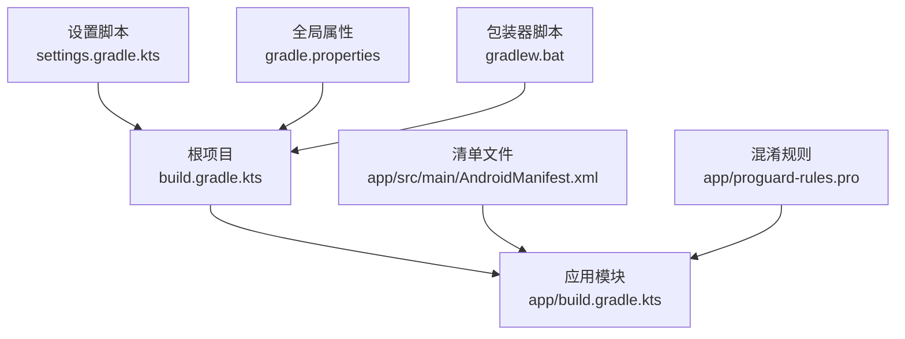
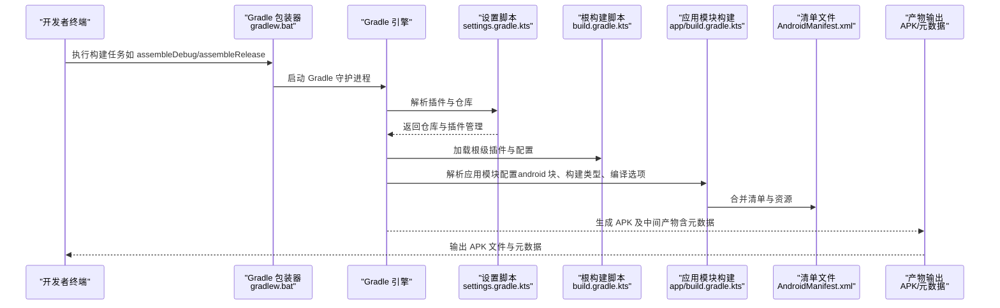
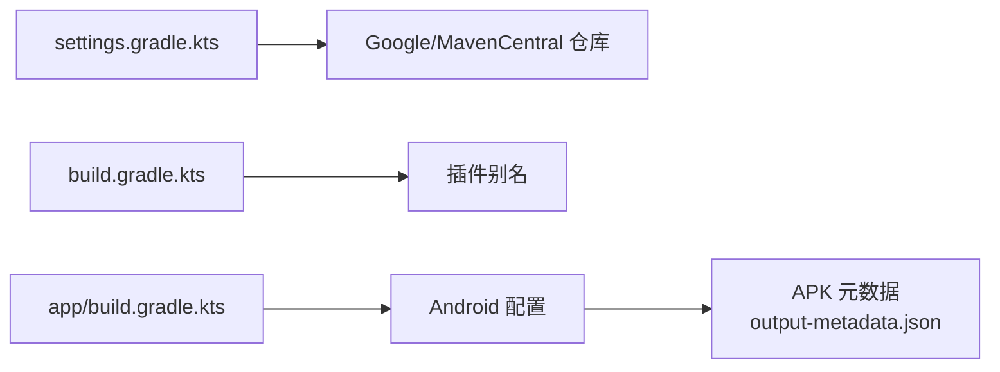

# 构建与发布

<cite>
**本文引用的文件**
- [build.gradle.kts](file://build.gradle.kts)
- [app/build.gradle.kts](file://app/build.gradle.kts)
- [gradle.properties](file://gradle.properties)
- [gradlew.bat](file://gradlew.bat)
- [settings.gradle.kts](file://settings.gradle.kts)
- [app/proguard-rules.pro](file://app/proguard-rules.pro)
- [app/src/main/AndroidManifest.xml](file://app/src/main/AndroidManifest.xml)
- [app/build/intermediates/signing_config_versions/debug/writeDebugSigningConfigVersions/signing-config-versions.json](file://app/build/intermediates/signing_config_versions/debug/writeDebugSigningConfigVersions/signing-config-versions.json)
- [app/build/intermediates/apk/debug/output-metadata.json](file://app/build/intermediates/apk/debug/output-metadata.json)
</cite>

## 目录
1. [简介](#简介)
2. [项目结构](#项目结构)
3. [核心组件](#核心组件)
4. [架构总览](#架构总览)
5. [详细组件分析](#详细组件分析)
6. [依赖分析](#依赖分析)
7. [性能考虑](#性能考虑)
8. [故障排除指南](#故障排除指南)
9. [结论](#结论)
10. [附录](#附录)

## 简介
本文件系统性梳理该项目从环境搭建到打包输出的完整构建与发布准备流程，重点解析 build.gradle.kts 中 android 块的配置项（compileSdk、minSdk、targetSdk、versionCode、versionName），说明构建脚本与属性文件的作用，并给出可操作的构建步骤与常见问题排查建议。由于当前仓库未包含签名配置与发布签名相关文件，本文将明确指出该部分缺失并提供替代方案与最佳实践建议。

## 项目结构
项目采用多模块结构，根目录包含顶层构建脚本与全局设置，应用模块位于 app 子目录中。关键文件如下：
- 根级构建脚本：用于声明插件与全局配置
- 应用模块构建脚本：定义 Android 配置、构建类型、编译选项等
- 全局属性文件：控制 Gradle 运行时行为与 AndroidX 使用策略
- 包装器启动脚本：跨平台命令行入口
- 设置脚本：统一插件与依赖仓库管理

图表来源
- [build.gradle.kts](file://build.gradle.kts#L1-L5)
- [app/build.gradle.kts](file://app/build.gradle.kts#L1-L47)
- [settings.gradle.kts](file://settings.gradle.kts#L1-L24)
- [gradle.properties](file://gradle.properties#L1-L23)
- [gradlew.bat](file://gradlew.bat#L1-L95)
- [app/src/main/AndroidManifest.xml](file://app/src/main/AndroidManifest.xml#L1-L15)
- [app/proguard-rules.pro](file://app/proguard-rules.pro#L1-L21)

章节来源
- [settings.gradle.kts](file://settings.gradle.kts#L1-L24)
- [build.gradle.kts](file://build.gradle.kts#L1-L5)
- [gradle.properties](file://gradle.properties#L1-L23)
- [gradlew.bat](file://gradlew.bat#L1-L95)

## 核心组件
- 顶层构建脚本：声明插件别名，供子模块按需应用
- 应用模块构建脚本：集中定义 Android 编译与运行时参数、构建类型、依赖
- 全局属性文件：控制 Gradle JVM 参数、并开启 AndroidX 与非传递 R 类等特性
- 包装器脚本：提供跨平台命令行入口，自动定位 Java 并执行 Gradle
- 清单与混淆：应用清单与 ProGuard 规则文件参与最终产物生成

章节来源
- [build.gradle.kts](file://build.gradle.kts#L1-L5)
- [app/build.gradle.kts](file://app/build.gradle.kts#L1-L47)
- [gradle.properties](file://gradle.properties#L1-L23)
- [app/src/main/AndroidManifest.xml](file://app/src/main/AndroidManifest.xml#L1-L15)
- [app/proguard-rules.pro](file://app/proguard-rules.pro#L1-L21)

## 架构总览
下图展示从命令行到最终 APK 的关键流程与文件交互关系。

图表来源
- [gradlew.bat](file://gradlew.bat#L1-L95)
- [settings.gradle.kts](file://settings.gradle.kts#L1-L24)
- [build.gradle.kts](file://build.gradle.kts#L1-L5)
- [app/build.gradle.kts](file://app/build.gradle.kts#L1-L47)
- [app/src/main/AndroidManifest.xml](file://app/src/main/AndroidManifest.xml#L1-L15)
- [app/build/intermediates/apk/debug/output-metadata.json](file://app/build/intermediates/apk/debug/output-metadata.json#L1-L21)

## 详细组件分析

### Android 配置块（android{}）解析
- 命名空间与 SDK 版本
  - 命名空间用于唯一标识包名前缀，避免资源冲突
  - compileSdk 指定编译时使用的平台版本；targetSdk 指定目标兼容级别；minSdk 指定最低支持版本
  - 当前配置：compileSdk 为最新稳定版，targetSdk 与 minSdk 分别为 36 与 24
- 默认配置
  - applicationId、versionCode、versionName 用于标识应用与版本
  - 测试运行器用于仪器测试
- 构建类型
  - release 构建未启用代码压缩与混淆（isMinifyEnabled=false），但保留了默认 ProGuard 规则文件路径
- 编译与 Kotlin 选项
  - Java 与 Kotlin 的兼容性目标均为 11

章节来源
- [app/build.gradle.kts](file://app/build.gradle.kts#L1-L47)

### 构建类型与混淆
- release 构建未启用代码压缩与混淆，适合调试与快速迭代
- 若需要发布版本，可在 release 块中启用压缩与自定义混淆规则文件

章节来源
- [app/build.gradle.kts](file://app/build.gradle.kts#L22-L30)
- [app/proguard-rules.pro](file://app/proguard-rules.pro#L1-L21)

### 清单合并与签名状态
- 清单合并报告与打包清单输出表明构建流程已正确执行
- 调试变体的签名状态显示未启用 V1 签名，启用 V2 签名（V3/V4 未启用）

章节来源
- [app/src/main/AndroidManifest.xml](file://app/src/main/AndroidManifest.xml#L1-L15)
- [app/build/intermediates/signing_config_versions/debug/writeDebugSigningConfigVersions/signing-config-versions.json](file://app/build/intermediates/signing_config_versions/debug/writeDebugSigningConfigVersions/signing-config-versions.json#L1-L1)

### 仓库与插件管理
- 插件与依赖仓库统一由 settings.gradle.kts 管理，确保 Google 与 Maven Central 的可用性
- 根级构建脚本使用插件别名并在子模块按需应用

章节来源
- [settings.gradle.kts](file://settings.gradle.kts#L1-L24)
- [build.gradle.kts](file://build.gradle.kts#L1-L5)

### gradle.properties 性能调优参数
- org.gradle.jvmargs：设置 Gradle 守护进程最大堆内存与文件编码，有助于提升构建稳定性与速度
- android.useAndroidX：启用 AndroidX，避免兼容性问题
- kotlin.code.style：官方风格，保持代码一致性
- android.nonTransitiveRClass：减少 R 类体积，降低编译与链接开销

章节来源
- [gradle.properties](file://gradle.properties#L1-L23)

### gradlew.bat 跨平台构建能力
- 自动定位 Java 环境（优先 JAVA_HOME），若未找到则提示设置
- 通过包装器 JAR 启动 Gradle，支持传入 JVM 与 Gradle 参数
- 在 Windows 上提供稳定的命令行入口，便于 CI/CD 与本地开发

章节来源
- [gradlew.bat](file://gradlew.bat#L1-L95)

### 版本号与版本名称语义
- versionCode：整数递增的内部版本号，用于区分构建版本
- versionName：对外可见的应用版本字符串，便于用户识别

章节来源
- [app/build.gradle.kts](file://app/build.gradle.kts#L12-L18)

### 签名配置说明
- 当前仓库未发现签名配置文件或密钥库文件
- 调试变体未启用 V1 签名，仅启用 V2 签名
- 发布签名应在 release 构建类型中配置，以满足分发要求

章节来源
- [app/build/intermediates/signing_config_versions/debug/writeDebugSigningConfigVersions/signing-config-versions.json](file://app/build/intermediates/signing_config_versions/debug/writeDebugSigningConfigVersions/signing-config-versions.json#L1-L1)

## 依赖分析
- 插件与仓库
  - settings.gradle.kts 统一管理插件与依赖仓库，确保插件与依赖解析一致
  - 根级构建脚本通过插件别名在子模块按需应用
- 构建产物
  - APK 产物与元数据文件记录了 variant 名称、版本号与输出文件名

图表来源
- [settings.gradle.kts](file://settings.gradle.kts#L1-L24)
- [build.gradle.kts](file://build.gradle.kts#L1-L5)
- [app/build.gradle.kts](file://app/build.gradle.kts#L1-L47)
- [app/build/intermediates/apk/debug/output-metadata.json](file://app/build/intermediates/apk/debug/output-metadata.json#L1-L21)

章节来源
- [settings.gradle.kts](file://settings.gradle.kts#L1-L24)
- [build.gradle.kts](file://build.gradle.kts#L1-L5)
- [app/build.gradle.kts](file://app/build.gradle.kts#L1-L47)
- [app/build/intermediates/apk/debug/output-metadata.json](file://app/build/intermediates/apk/debug/output-metadata.json#L1-L21)

## 性能考虑
- JVM 内存与并行化
  - 适当提高 org.gradle.jvmargs 的堆大小可缓解大型项目构建内存压力
  - 并行构建（org.gradle.parallel）在解耦项目上可加速，但需谨慎评估资源占用
- 编译与 Kotlin 目标
  - Java/Kotlin 目标版本保持一致，避免不必要的兼容性检查
- 依赖与仓库
  - 使用统一仓库与插件管理，减少网络与解析失败导致的重试成本

章节来源
- [gradle.properties](file://gradle.properties#L1-L23)

## 故障排除指南
- Java 环境未配置
  - 现象：启动 gradlew.bat 提示未设置 JAVA_HOME 或找不到 java
  - 处理：设置 JAVA_HOME 指向 JDK 安装目录并重启终端
- 构建任务无法识别
  - 现象：命令行提示未知任务
  - 处理：确认使用正确的任务名（如 assembleDebug、assembleRelease），并确保在仓库根目录执行
- 清单合并冲突
  - 现象：清单合并报告出现冲突
  - 处理：检查 AndroidManifest.xml 与第三方库清单，修正重复标签或权限冲突
- 签名相关问题（发布）
  - 现象：发布 APK 无法安装或签名不匹配
  - 处理：在 release 构建类型中配置签名信息；确保签名算法与渠道要求一致
- 产物路径与命名
  - 现象：找不到 APK 输出文件
  - 处理：查看 APK 元数据文件与构建日志，确认 variant 与输出文件名

章节来源
- [gradlew.bat](file://gradlew.bat#L1-L95)
- [app/src/main/AndroidManifest.xml](file://app/src/main/AndroidManifest.xml#L1-L15)
- [app/build/intermediates/apk/debug/output-metadata.json](file://app/build/intermediates/apk/debug/output-metadata.json#L1-L21)

## 结论
本项目已具备完整的构建基础：统一的仓库与插件管理、清晰的 Android 配置与构建类型、合理的全局属性调优。当前仓库未包含发布签名配置，建议在 release 构建类型中补充签名信息以满足正式发布需求。通过合理利用 gradle.properties 的性能参数与规范化的构建流程，可显著提升构建效率与稳定性。

## 附录

### 可操作的构建指南
- 环境准备
  - 确保已安装 JDK 并配置 JAVA_HOME
  - 使用 gradlew.bat 作为跨平台入口
- 常用命令
  - assembleDebug：构建调试版本
  - assembleRelease：构建发布版本（需补充签名配置）
- 产物位置
  - 调试 APK 元数据与输出文件名可参考 APK 元数据 JSON
- 发布签名（建议）
  - 在 release 构建类型中配置签名信息，确保签名算法与渠道要求一致
  - 发布前进行多渠道打包与签名验证

章节来源
- [gradlew.bat](file://gradlew.bat#L1-L95)
- [app/build.gradle.kts](file://app/build.gradle.kts#L22-L30)
- [app/build/intermediates/apk/debug/output-metadata.json](file://app/build/intermediates/apk/debug/output-metadata.json#L1-L21)