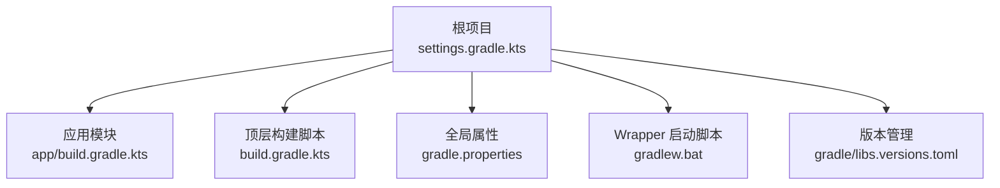
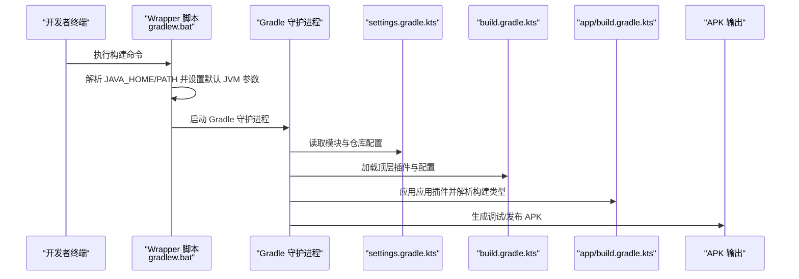
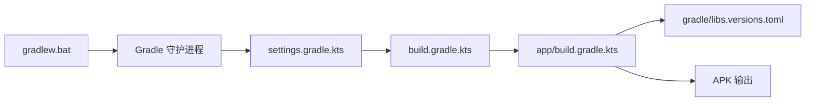

# 构建操作

<cite>
**本文引用的文件**
- [gradlew.bat](file://gradlew.bat)
- [gradle.properties](file://gradle.properties)
- [build.gradle.kts](file://build.gradle.kts)
- [app/build.gradle.kts](file://app/build.gradle.kts)
- [settings.gradle.kts](file://settings.gradle.kts)
- [gradle/libs.versions.toml](file://gradle/libs.versions.toml)
</cite>

## 目录
1. [简介](#简介)
2. [项目结构](#项目结构)
3. [核心组件](#核心组件)
4. [架构总览](#架构总览)
5. [详细组件分析](#详细组件分析)
6. [依赖关系分析](#依赖关系分析)
7. [性能考量](#性能考量)
8. [故障排查指南](#故障排查指南)
9. [结论](#结论)

## 简介
本指南面向开发者，系统讲解如何在本项目中执行构建操作，重点围绕 Gradle Wrapper 在 Windows 平台的作用、调试与发布构建命令、构建产物输出路径与命名规则、命令行测试任务、以及常见构建失败的排查方法。文档强调使用 Wrapper 脚本而非本地 Gradle 安装，以确保团队构建环境一致。

## 项目结构
本仓库采用标准 Android 应用工程结构，顶层通过 Gradle Wrapper 提供跨平台构建入口；应用模块位于 app 子目录，构建配置集中在各模块的构建脚本中，并通过版本目录统一管理插件与依赖版本。

图表来源
- [settings.gradle.kts](file://settings.gradle.kts#L1-L24)
- [build.gradle.kts](file://build.gradle.kts#L1-L5)
- [app/build.gradle.kts](file://app/build.gradle.kts#L1-L47)
- [gradle.properties](file://gradle.properties#L1-L23)
- [gradlew.bat](file://gradlew.bat#L1-L95)
- [gradle/libs.versions.toml](file://gradle/libs.versions.toml#L1-L23)

章节来源
- [settings.gradle.kts](file://settings.gradle.kts#L1-L24)
- [build.gradle.kts](file://build.gradle.kts#L1-L5)
- [app/build.gradle.kts](file://app/build.gradle.kts#L1-L47)
- [gradle.properties](file://gradle.properties#L1-L23)
- [gradlew.bat](file://gradlew.bat#L1-L95)
- [gradle/libs.versions.toml](file://gradle/libs.versions.toml#L1-L23)

## 核心组件
- Gradle Wrapper（Windows）：通过 gradlew.bat 在 Windows 上启动 Gradle 构建，自动解析 JAVA_HOME 或 PATH 中的 Java，避免本地安装差异带来的环境不一致问题。
- 全局构建属性：gradle.properties 统一设置 JVM 参数、并行构建、AndroidX 使用策略、Kotlin 代码风格等。
- 顶层构建脚本：build.gradle.kts 声明插件别名，但不直接应用，由子模块按需应用。
- 应用模块构建脚本：app/build.gradle.kts 配置编译目标、最小 SDK、签名与混淆策略、Java/Kotlin 编译选项等。
- 版本管理：gradle/libs.versions.toml 统一声明 AGP、Kotlin、第三方库版本，保证团队一致性。
- 模块声明：settings.gradle.kts 声明包含 app 模块并配置仓库源。

章节来源
- [gradlew.bat](file://gradlew.bat#L1-L95)
- [gradle.properties](file://gradle.properties#L1-L23)
- [build.gradle.kts](file://build.gradle.kts#L1-L5)
- [app/build.gradle.kts](file://app/build.gradle.kts#L1-L47)
- [settings.gradle.kts](file://settings.gradle.kts#L1-L24)
- [gradle/libs.versions.toml](file://gradle/libs.versions.toml#L1-L23)

## 架构总览
下图展示从命令行到构建产物的关键流程：Wrapper 脚本定位 Java，加载 Wrapper JAR，调用 Gradle 守护进程，解析 settings 与构建脚本，最终生成 APK 输出。

图表来源
- [gradlew.bat](file://gradlew.bat#L1-L95)
- [settings.gradle.kts](file://settings.gradle.kts#L1-L24)
- [build.gradle.kts](file://build.gradle.kts#L1-L5)
- [app/build.gradle.kts](file://app/build.gradle.kts#L1-L47)

## 详细组件分析

### Gradle Wrapper（Windows）
- 作用：在 Windows 平台上提供与平台无关的 Gradle 启动方式，自动校验 Java 环境，避免本地安装差异导致的构建失败。
- 关键点：
  - 默认 JVM 参数已在脚本中设定，可通过环境变量或命令行参数覆盖。
  - 若未设置 JAVA_HOME 或 PATH 中找不到 java.exe，会提示错误并退出。
  - 通过 classpath 加载 Wrapper JAR，实现对 Gradle 版本的隔离与统一。

章节来源
- [gradlew.bat](file://gradlew.bat#L1-L95)

### 全局构建属性（gradle.properties）
- 关键配置项：
  - JVM 参数：用于控制 Gradle 守护进程内存上限与文件编码，建议根据机器内存适当提高以减少 OOM。
  - 并行构建：可选开启，适合多模块解耦项目。
  - AndroidX 使用策略：启用 AndroidX 包结构。
  - Kotlin 代码风格：官方风格，便于团队协作。
  - R 类非传递性：减少 R 类体积，降低资源冲突风险。

章节来源
- [gradle.properties](file://gradle.properties#L1-L23)

### 顶层构建脚本（build.gradle.kts）
- 插件别名：通过 libs.plugins 引入 Android Application 与 Kotlin Android 插件，顶层仅声明别名，避免重复应用。
- 适用场景：当需要在多模块共享相同插件版本时，推荐在此集中声明别名并在子模块按需应用。

章节来源
- [build.gradle.kts](file://build.gradle.kts#L1-L5)
- [gradle/libs.versions.toml](file://gradle/libs.versions.toml#L1-L23)

### 应用模块构建脚本（app/build.gradle.kts）
- 编译与目标：
  - compileSdk/targetSdk/minSdk：明确编译与运行目标。
  - Java/Kotlin 编译兼容性：sourceCompatibility/targetCompatibility 与 jvmTarget 均设为 11。
- 构建类型：
  - release：关闭代码压缩（isMinifyEnabled=false），保留 ProGuard 规则以便后续扩展。
- 依赖：
  - 实现与测试依赖通过 libs 别名引入，保持版本统一。

章节来源
- [app/build.gradle.kts](file://app/build.gradle.kts#L1-L47)
- [gradle/libs.versions.toml](file://gradle/libs.versions.toml#L1-L23)

### 版本管理（gradle/libs.versions.toml）
- 统一管理 AGP、Kotlin、AndroidX、Material、JUnit、Espresso 等版本，避免版本漂移。
- 插件与库版本通过 [versions]/[libraries]/[plugins] 分组维护，便于升级与审计。

章节来源
- [gradle/libs.versions.toml](file://gradle/libs.versions.toml#L1-L23)

### 模块与仓库（settings.gradle.kts）
- 模块包含：根项目名称与包含 app 模块。
- 仓库源：优先使用 Google/Maven Central/Gradle Plugin Portal，确保插件与依赖拉取稳定。

章节来源
- [settings.gradle.kts](file://settings.gradle.kts#L1-L24)

## 依赖关系分析
- Wrapper 与 Java：Wrapper 负责定位 Java，确保 Gradle 可正常启动。
- settings 与构建脚本：settings 决定模块结构与仓库源，build 脚本定义构建行为与产物。
- 版本管理：libs.versions.toml 为插件与依赖提供统一版本，减少冲突。
- 构建类型：release 构建类型影响产物是否启用混淆与压缩。

图表来源
- [gradlew.bat](file://gradlew.bat#L1-L95)
- [settings.gradle.kts](file://settings.gradle.kts#L1-L24)
- [build.gradle.kts](file://build.gradle.kts#L1-L5)
- [app/build.gradle.kts](file://app/build.gradle.kts#L1-L47)
- [gradle/libs.versions.toml](file://gradle/libs.versions.toml#L1-L23)

章节来源
- [gradlew.bat](file://gradlew.bat#L1-L95)
- [settings.gradle.kts](file://settings.gradle.kts#L1-L24)
- [build.gradle.kts](file://build.gradle.kts#L1-L5)
- [app/build.gradle.kts](file://app/build.gradle.kts#L1-L47)
- [gradle/libs.versions.toml](file://gradle/libs.versions.toml#L1-L23)

## 性能考量
- JVM 内存：通过 gradle.properties 的 org.gradle.jvmargs 提升 Gradle 守护进程内存上限，有助于大型项目构建稳定性。
- 并行构建：可选开启 org.gradle.parallel，提升多模块构建效率。
- 编译兼容性：统一 Java/Kotlin 目标版本（11）可减少编译器差异带来的性能波动。
- 仓库源：稳定的 Google/Maven Central/Gradle Plugin Portal 仓库可减少网络波动对构建的影响。

章节来源
- [gradle.properties](file://gradle.properties#L1-L23)
- [app/build.gradle.kts](file://app/build.gradle.kts#L1-L47)

## 故障排查指南

### 1. 构建命令与产物路径
- 调试构建：使用 Wrapper 执行调试构建任务，生成调试 APK。
- 发布构建：使用 Wrapper 执行发布构建任务，生成发布 APK。
- 产物位置与命名规则：
  - 调试 APK：位于 app/build/outputs/apk/debug/，文件名为基于应用 ID 与版本的命名，具体命名遵循 Gradle/AAPT 规则。
  - 发布 APK：位于 app/build/outputs/apk/release/，命名规则同上，但包含发布签名与优化配置（当前 release 未启用混淆）。
- 输出元数据：构建过程中会生成 output-metadata.json 等元数据文件，记录 variant 名称、版本号、输出文件路径等信息，可用于自动化集成。

章节来源
- [app/build.gradle.kts](file://app/build.gradle.kts#L1-L47)

### 2. 常见构建失败与解决
- JVM 内存不足（OOM）：
  - 现象：构建过程中出现 OutOfMemoryError。
  - 处理：在 gradle.properties 中提高 org.gradle.jvmargs 的内存上限，例如增加最大堆大小。
- Java/Kotlin 版本不匹配：
  - 现象：编译报错，提示 Java/Kotlin 版本不兼容。
  - 处理：确保 compileOptions 与 kotlinOptions 的目标版本一致（当前项目均设置为 11），并确保本地 JDK 版本满足要求。
- Wrapper 启动失败（找不到 Java）：
  - 现象：提示未设置 JAVA_HOME 或 PATH 中无 java 命令。
  - 处理：正确设置 JAVA_HOME 指向 JDK 安装目录，或在 PATH 中添加 java.exe 所在目录。
- 仓库拉取失败：
  - 现象：无法从 Google/Maven Central/Gradle Plugin Portal 拉取依赖。
  - 处理：检查网络与代理设置，确认 settings.gradle.kts 中的仓库源可用。

章节来源
- [gradle.properties](file://gradle.properties#L1-L23)
- [app/build.gradle.kts](file://app/build.gradle.kts#L1-L47)
- [gradlew.bat](file://gradlew.bat#L1-L95)
- [settings.gradle.kts](file://settings.gradle.kts#L1-L24)

## 结论
- 使用 Wrapper 脚本（gradlew.bat）是确保团队构建环境一致性的关键，它屏蔽了本地 Gradle 安装差异与 Java 环境差异。
- 调试与发布构建分别对应不同的构建类型，产物路径与命名遵循 Gradle 默认约定，可通过输出元数据文件辅助定位。
- 通过统一的版本管理与全局属性配置，可以有效减少版本漂移与构建不稳定因素。
- 遇到构建失败时，优先检查 JVM 内存、Java/Kotlin 版本、Wrapper 启动环境与仓库可用性。