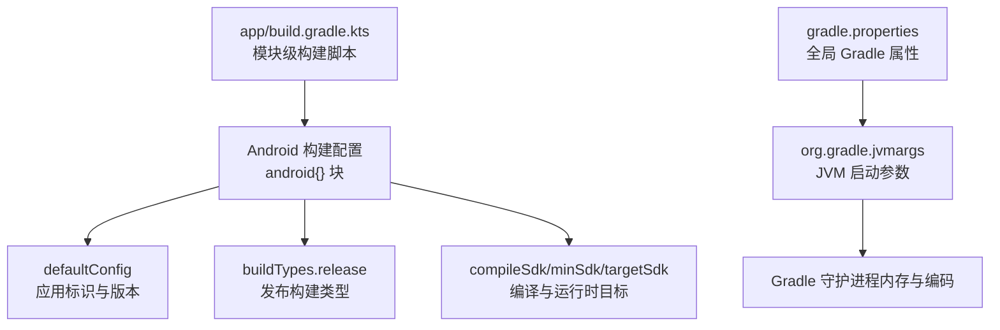
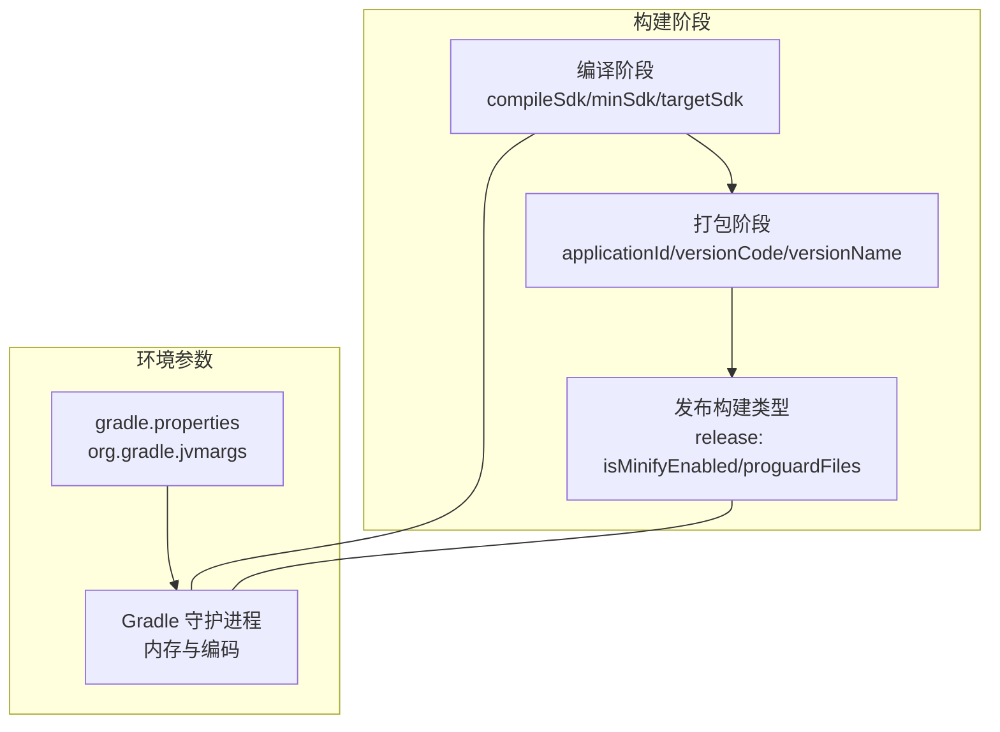
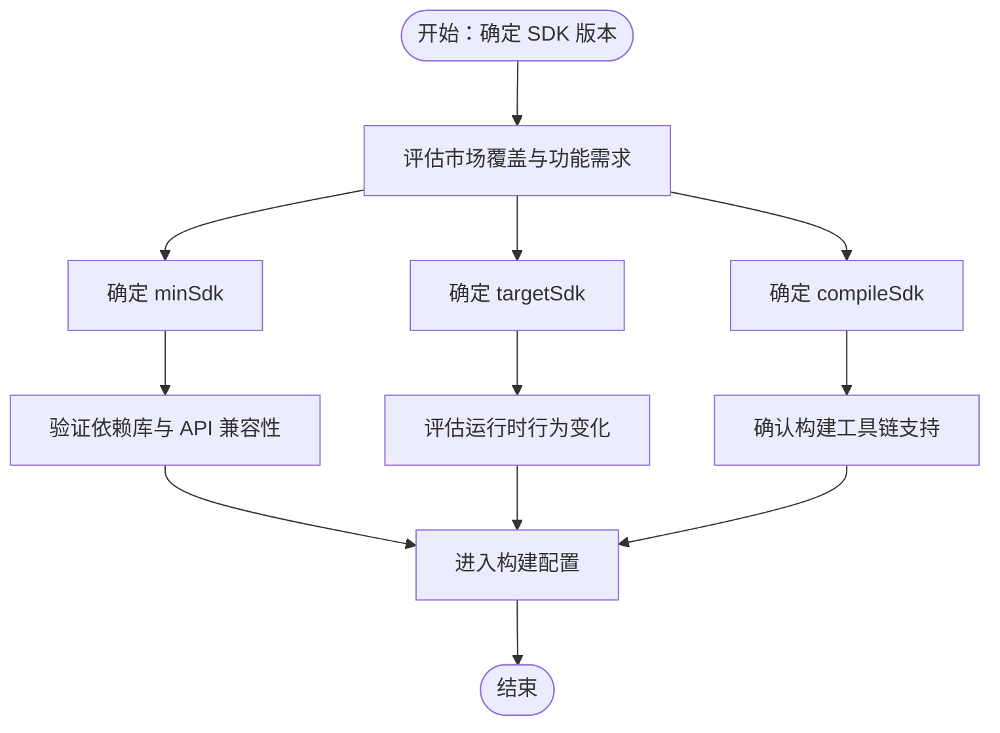
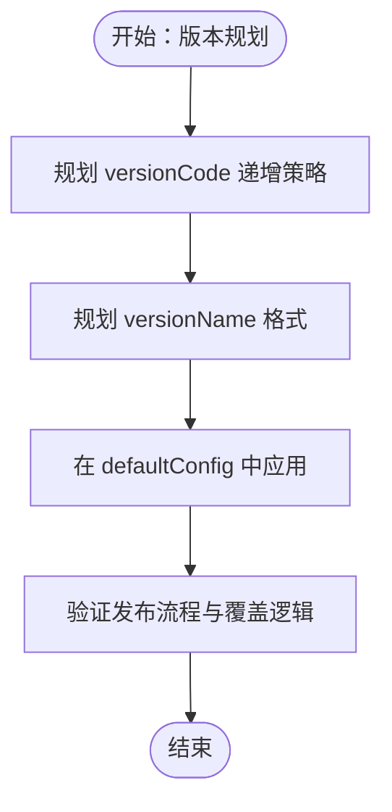
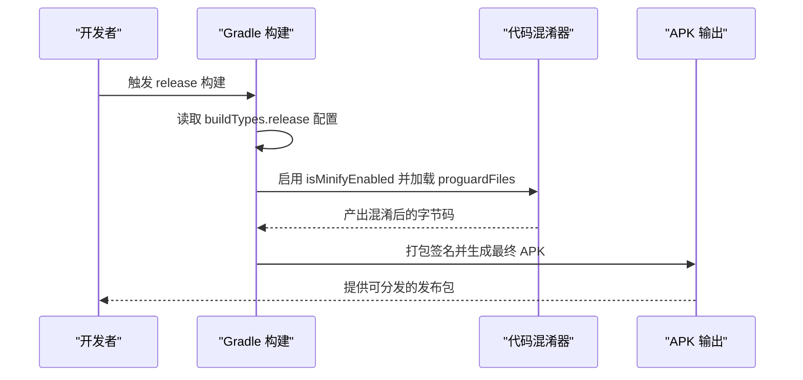
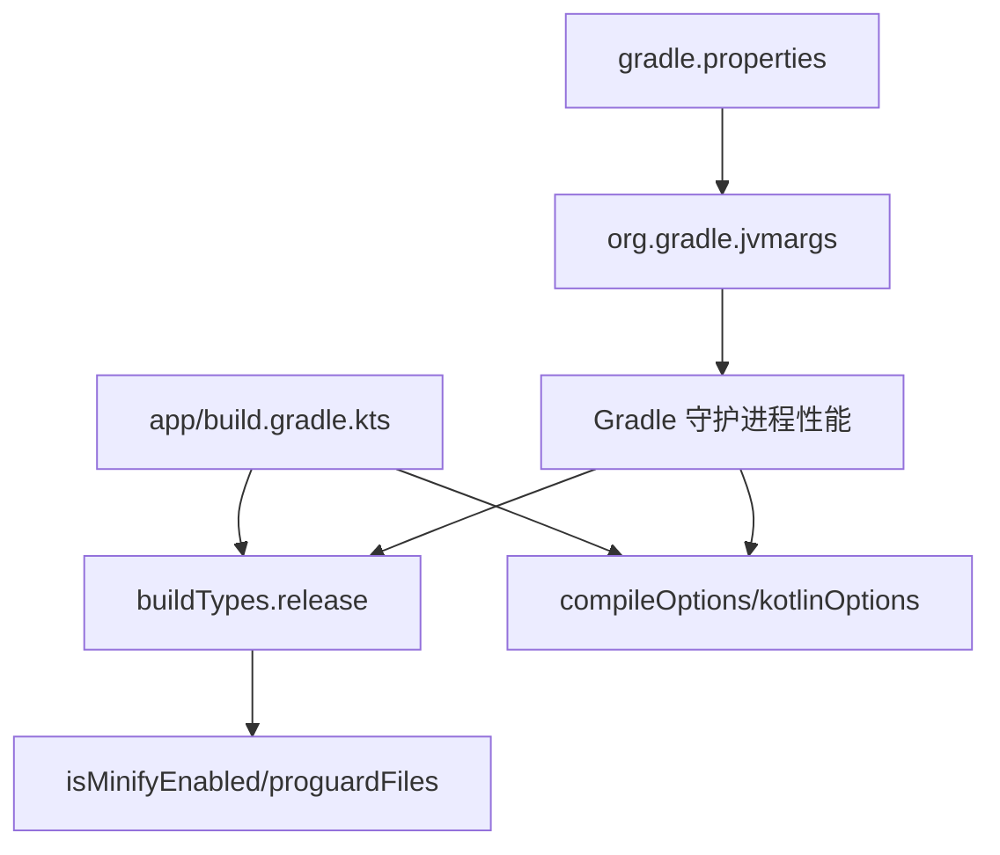

# 构建配置

<cite>
**本文引用的文件**
- [app/build.gradle.kts](file://app/build.gradle.kts)
- [gradle.properties](file://gradle.properties)
</cite>

## 目录
1. [简介](#简介)
2. [项目结构](#项目结构)
3. [核心组件](#核心组件)
4. [架构总览](#架构总览)
5. [详细组件分析](#详细组件分析)
6. [依赖关系分析](#依赖关系分析)
7. [性能考量](#性能考量)
8. [故障排查指南](#故障排查指南)
9. [结论](#结论)
10. [附录](#附录)

## 简介
本文件围绕 app/build.gradle.kts 中的 android{} 块展开，系统解析以下关键配置：
- namespace、compileSdk、minSdk、targetSdk 的作用与版本选择策略
- defaultConfig 中 applicationId、versionCode、versionName 的语义及发布影响
- buildTypes.release 的 isMinifyEnabled 与 proguardFiles 对代码混淆与优化的作用
- 结合 gradle.properties 的 org.gradle.jvmargs 对构建性能的影响（含 -Xmx 内存分配与编码设置）
并提供最佳实践、常见错误与修复建议，以及通过“代码片段路径”定位到具体配置位置。

## 项目结构
本仓库为 Android 应用工程，app 模块包含构建脚本与资源清单；根目录包含全局构建属性文件。下图给出与本文相关的文件与角色映射：

图表来源
- [app/build.gradle.kts](file://app/build.gradle.kts#L6-L38)
- [gradle.properties](file://gradle.properties#L9-L9)

章节来源
- [app/build.gradle.kts](file://app/build.gradle.kts#L1-L47)
- [gradle.properties](file://gradle.properties#L1-L23)

## 核心组件
本节聚焦 android{} 块内的关键配置项及其职责与影响。

- namespace
  - 作用：为应用定义唯一的命名空间，用于资源合并、R 类生成与包名隔离。
  - 当前值：已在脚本中显式声明。
  - 参考路径：[app/build.gradle.kts](file://app/build.gradle.kts#L6-L10)

- compileSdk
  - 作用：指定应用编译时使用的 SDK 版本，决定可使用的 API 与构建工具能力。
  - 当前值：使用 release(36) 形式声明。
  - 参考路径：[app/build.gradle.kts](file://app/build.gradle.kts#L6-L10)

- minSdk
  - 作用：应用可运行的最低 Android 版本要求。低于该版本的设备无法安装或运行。
  - 当前值：24。
  - 参考路径：[app/build.gradle.kts](file://app/build.gradle.kts#L12-L20)

- targetSdk
  - 作用：应用针对的目标 SDK 版本，影响运行时行为与平台兼容策略。
  - 当前值：36。
  - 参考路径：[app/build.gradle.kts](file://app/build.gradle.kts#L12-L20)

- defaultConfig
  - applicationId：应用在设备上的唯一包名，发布后不可更改。
  - versionCode：整型版本号，用于内部递增与覆盖安装判断。
  - versionName：字符串形式的可见版本名称，面向用户展示。
  - 参考路径：[app/build.gradle.kts](file://app/build.gradle.kts#L12-L20)

- buildTypes.release
  - isMinifyEnabled：是否启用代码压缩与混淆。
  - proguardFiles：混淆规则文件列表，包含默认优化规则与自定义规则。
  - 参考路径：[app/build.gradle.kts](file://app/build.gradle.kts#L22-L30)

章节来源
- [app/build.gradle.kts](file://app/build.gradle.kts#L6-L38)

## 架构总览
下图展示构建配置在构建流程中的位置与影响范围：

图表来源
- [app/build.gradle.kts](file://app/build.gradle.kts#L6-L38)
- [gradle.properties](file://gradle.properties#L9-L9)

## 详细组件分析

### 组件一：命名空间与 SDK 版本策略
- namespace
  - 用途：确保资源与 R 类的唯一性，避免多模块冲突。
  - 建议：保持与 applicationId 一致或遵循公司规范，便于发布与升级。
  - 参考路径：[app/build.gradle.kts](file://app/build.gradle.kts#L6-L10)

- compileSdk
  - 选择策略：应与当前可用的最新稳定版保持同步，以获得最新 API 与构建工具支持。
  - 注意事项：更新时需验证所有 API 使用与依赖库兼容性。
  - 参考路径：[app/build.gradle.kts](file://app/build.gradle.kts#L6-L10)

- minSdk
  - 选择策略：基于业务覆盖范围与新功能需求权衡。过低会增加适配成本与安全风险。
  - 常见问题：若 minSdk 超出市场支持范围，可能导致用户无法安装。
  - 参考路径：[app/build.gradle.kts](file://app/build.gradle.kts#L12-L20)

- targetSdk
  - 选择策略：通常跟随最新稳定版，但需评估运行时行为变化与兼容性测试。
  - 参考路径：[app/build.gradle.kts](file://app/build.gradle.kts#L12-L20)

章节来源
- [app/build.gradle.kts](file://app/build.gradle.kts#L6-L20)

### 组件二：默认配置与版本管理
- applicationId
  - 语义：设备上应用的唯一包名，发布后不可更改。
  - 影响：变更将导致新包名，旧版本无法覆盖升级。
  - 参考路径：[app/build.gradle.kts](file://app/build.gradle.kts#L12-L20)

- versionCode
  - 语义：内部递增的整数版本号，用于覆盖安装与版本比较。
  - 影响：每次发布必须递增，否则可能被系统拒绝。
  - 参考路径：[app/build.gradle.kts](file://app/build.gradle.kts#L12-L20)

- versionName
  - 语义：面向用户的版本名称，便于传播与记录。
  - 影响：建议采用语义化格式，便于追踪。
  - 参考路径：[app/build.gradle.kts](file://app/build.gradle.kts#L12-L20)

章节来源
- [app/build.gradle.kts](file://app/build.gradle.kts#L12-L20)

### 组件三：发布构建与代码混淆
- isMinifyEnabled
  - 作用：启用代码压缩与混淆，减小 APK 体积并提升安全性。
  - 影响：需要配合 ProGuard/R8 规则，避免误删关键类或方法。
  - 参考路径：[app/build.gradle.kts](file://app/build.gradle.kts#L22-L30)

- proguardFiles
  - 作用：引入默认优化规则与自定义规则文件，控制混淆与优化行为。
  - 影响：规则不当可能导致崩溃或功能异常。
  - 参考路径：[app/build.gradle.kts](file://app/build.gradle.kts#L22-L30)

图表来源
- [app/build.gradle.kts](file://app/build.gradle.kts#L22-L30)

章节来源
- [app/build.gradle.kts](file://app/build.gradle.kts#L22-L30)

### 组件四：Java/Kotlin 编译目标与语言级别
- compileOptions 与 kotlinOptions
  - 作用：统一源码与目标兼容性，确保跨模块一致性。
  - 影响：与 JDK/JRE 版本匹配，避免运行时类缺失。
  - 参考路径：[app/build.gradle.kts](file://app/build.gradle.kts#L31-L37)

章节来源
- [app/build.gradle.kts](file://app/build.gradle.kts#L31-L37)

## 依赖关系分析
- 模块级构建脚本依赖于 Gradle 守护进程与 JVM 参数
- 构建类型与混淆规则依赖于 compileOptions/kotlinOptions 的语言级别
- 发布包的大小与稳定性受 isMinifyEnabled 与 proguardFiles 控制

图表来源
- [app/build.gradle.kts](file://app/build.gradle.kts#L22-L37)
- [gradle.properties](file://gradle.properties#L9-L9)

章节来源
- [app/build.gradle.kts](file://app/build.gradle.kts#L22-L37)
- [gradle.properties](file://gradle.properties#L9-L9)

## 性能考量
- org.gradle.jvmargs 的 -Xmx
  - 作用：限制 Gradle 守护进程最大堆内存，避免 OOM 或频繁 GC。
  - 影响：适当提高可减少大项目构建卡顿，过高可能引发系统内存压力。
  - 参考路径：[gradle.properties](file://gradle.properties#L9-L9)

- 编码设置 -Dfile.encoding
  - 作用：统一文件读写编码，避免资源处理乱码。
  - 参考路径：[gradle.properties](file://gradle.properties#L9-L9)

- 并行构建
  - 说明：注释掉的并行选项仅适用于解耦项目，需谨慎开启。
  - 参考路径：[gradle.properties](file://gradle.properties#L11-L13)

章节来源
- [gradle.properties](file://gradle.properties#L9-L13)

## 故障排查指南
- 常见错误与修复
  - minSdk 超出支持范围
    - 现象：部分设备无法安装或启动崩溃。
    - 修复：评估业务必要性，逐步降低 minSdk 或提供降级方案。
    - 参考路径：[app/build.gradle.kts](file://app/build.gradle.kts#L12-L20)

  - isMinifyEnabled 启用后崩溃
    - 现象：运行时找不到类或方法。
    - 修复：检查 proguardFiles 规则，添加 keep 规则保护关键类与反射入口。
    - 参考路径：[app/build.gradle.kts](file://app/build.gradle.kts#L22-L30)

  - 版本号未递增导致覆盖失败
    - 现象：安装提示版本更低或覆盖失败。
    - 修复：按发布计划递增 versionCode，保持 versionName 与语义化。
    - 参考路径：[app/build.gradle.kts](file://app/build.gradle.kts#L12-L20)

  - 构建内存不足
    - 现象：Gradle OOM 或长时间 GC。
    - 修复：调整 org.gradle.jvmargs 的 -Xmx 至合适值。
    - 参考路径：[gradle.properties](file://gradle.properties#L9-L9)

- 验证步骤
  - 重新构建并观察日志输出，确认混淆规则生效且无致命警告。
  - 在模拟器/真机上进行回归测试，覆盖关键路径。
  - 对比发布包大小与安装包体积，评估混淆效果。

章节来源
- [app/build.gradle.kts](file://app/build.gradle.kts#L12-L30)
- [gradle.properties](file://gradle.properties#L9-L9)

## 结论
- android{} 块是构建配置的核心，涵盖命名空间、SDK 版本、默认配置与发布类型等关键要素。
- 正确的 SDK 选择与版本管理策略直接影响兼容性与维护成本。
- 发布构建的混淆策略需与规则文件协同，避免误删与误混淆。
- 全局 JVM 参数对构建性能有直接作用，应根据项目规模与机器配置合理调优。

## 附录
- 代码片段路径索引
  - 命名空间与 SDK 版本：[app/build.gradle.kts](file://app/build.gradle.kts#L6-L10)
  - 默认配置（applicationId/versionCode/versionName）：[app/build.gradle.kts](file://app/build.gradle.kts#L12-L20)
  - 发布构建与混淆：[app/build.gradle.kts](file://app/build.gradle.kts#L22-L30)
  - Java/Kotlin 语言级别：[app/build.gradle.kts](file://app/build.gradle.kts#L31-L37)
  - Gradle JVM 参数：[gradle.properties](file://gradle.properties#L9-L9)