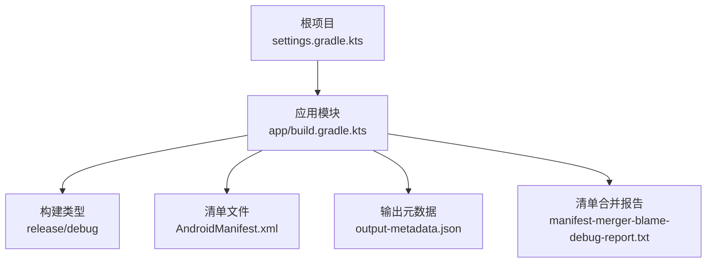
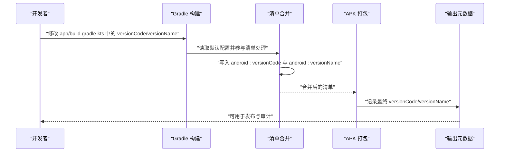
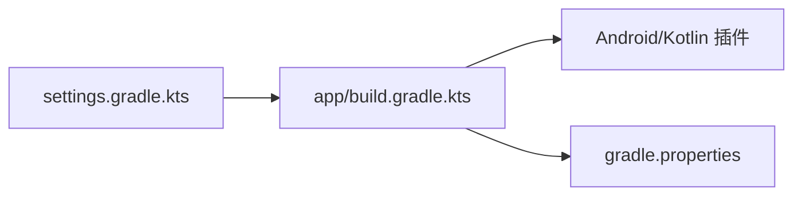

# 版本管理

<cite>
**本文引用的文件**
- [app/build.gradle.kts](file://app/build.gradle.kts)
- [build.gradle.kts](file://build.gradle.kts)
- [settings.gradle.kts](file://settings.gradle.kts)
- [gradle.properties](file://gradle.properties)
- [AndroidManifest.xml](file://app/src/main/AndroidManifest.xml)
- [strings.xml](file://app/src/main/res/values/strings.xml)
- [output-metadata.json](file://app/build/intermediates/apk/debug/output-metadata.json)
- [manifest-merger-blame-debug-report.txt](file://app/build/intermediates/manifest_merge_blame_file/debug/processDebugMainManifest/manifest-merger-blame-debug-report.txt)
</cite>

## 目录
1. [简介](#简介)
2. [项目结构](#项目结构)
3. [核心组件](#核心组件)
4. [架构总览](#架构总览)
5. [详细组件分析](#详细组件分析)
6. [依赖关系分析](#依赖关系分析)
7. [性能考虑](#性能考虑)
8. [故障排查指南](#故障排查指南)
9. [结论](#结论)
10. [附录](#附录)

## 简介
本文件系统性阐述项目中的版本管理机制，聚焦于 Android 应用构建脚本中 versionCode 与 versionName 的定义与语义。我们将解释：
- versionCode 作为递增整数在应用更新中的技术作用（用于区分新旧版本、驱动 Google Play 等平台的“仅增量更新”策略）。
- versionName 作为用户可见版本字符串的展示用途（通常采用语义化版本格式，如 1.0.0）。
- 版本升级的规范流程：何时递增 versionCode、如何命名 versionName（语义化版本）、如何满足应用商店要求。
- 通过示例展示从 1.0 到 1.1 的版本升级过程，并警示开发者避免 versionCode 重复或倒序等常见错误。

## 项目结构
本仓库为一个标准的 Android 应用工程，采用 Gradle 构建系统与 Kotlin DSL 配置。版本号相关的关键位置如下：
- 应用模块的构建脚本中定义了 versionCode 与 versionName。
- 构建产物元数据文件中包含最终打包时使用的版本号。
- 清单合并报告中展示了版本号在清单文件中的体现。

图表来源
- [settings.gradle.kts](file://settings.gradle.kts#L1-L24)
- [app/build.gradle.kts](file://app/build.gradle.kts#L1-L47)
- [AndroidManifest.xml](file://app/src/main/AndroidManifest.xml#L1-L15)
- [output-metadata.json](file://app/build/intermediates/apk/debug/output-metadata.json#L13-L14)
- [manifest-merger-blame-debug-report.txt](file://app/build/intermediates/manifest_merge_blame_file/debug/processDebugMainManifest/manifest-merger-blame-debug-report.txt#L3-L6)

章节来源
- [settings.gradle.kts](file://settings.gradle.kts#L1-L24)
- [app/build.gradle.kts](file://app/build.gradle.kts#L1-L47)

## 核心组件
- 应用模块构建脚本中的版本号定义
  - 在应用模块的构建脚本中，通过 defaultConfig 块设置了 versionCode 与 versionName。
  - 当前版本号为：versionCode = 1；versionName = "1.0"。
- 构建产物元数据
  - 构建完成后，会在输出元数据中记录最终使用的 versionCode 与 versionName，便于审计与回溯。
- 清单合并报告
  - 清单合并阶段会将 versionCode 与 versionName 写入到最终的清单文件中，供安装器与系统识别。

章节来源
- [app/build.gradle.kts](file://app/build.gradle.kts#L12-L20)
- [output-metadata.json](file://app/build/intermediates/apk/debug/output-metadata.json#L13-L14)
- [manifest-merger-blame-debug-report.txt](file://app/build/intermediates/manifest_merge_blame_file/debug/processDebugMainManifest/manifest-merger-blame-debug-report.txt#L3-L6)

## 架构总览
版本号在构建流水线中的流转路径如下：
- 开发者在构建脚本中设定 versionCode 与 versionName。
- Gradle 在编译与打包过程中读取该配置。
- 清单合并阶段将版本号注入到 AndroidManifest.xml。
- 最终产物元数据记录版本号，便于发布与审计。

图表来源
- [app/build.gradle.kts](file://app/build.gradle.kts#L12-L20)
- [AndroidManifest.xml](file://app/src/main/AndroidManifest.xml#L1-L15)
- [output-metadata.json](file://app/build/intermediates/apk/debug/output-metadata.json#L13-L14)

## 详细组件分析

### 组件一：构建脚本中的版本号定义
- 定位与职责
  - 在应用模块的构建脚本中，defaultConfig 块负责设置应用的基础属性，其中包含 versionCode 与 versionName。
  - 这两个字段是应用在构建阶段就确定的核心元数据，直接影响后续打包与发布流程。
- 数据结构与复杂度
  - versionCode 为整数型，复杂度 O(1)；versionName 为字符串型，复杂度 O(1)。
- 依赖关系
  - 构建脚本依赖 Gradle Android 插件提供的 android{} DSL。
  - 构建类型（如 release）会影响最终产物的签名与混淆策略，但不改变 versionCode 与 versionName 的值。
- 错误处理与边界情况
  - 若未显式设置，构建系统可能使用默认值或报错，建议始终显式声明。
  - versionCode 必须为严格递增；versionName 建议采用语义化版本格式，便于用户理解。
- 性能影响
  - 版本号本身对编译性能无直接影响，但错误的版本号会导致发布失败或回滚成本增加。

章节来源
- [app/build.gradle.kts](file://app/build.gradle.kts#L12-L20)

### 组件二：清单合并与版本号注入
- 定位与职责
  - 清单合并阶段会将 versionCode 与 versionName 注入到最终的 AndroidManifest.xml 中，供安装器与系统识别。
- 处理逻辑
  - 清单合并报告中明确显示了 android:versionCode 与 android:versionName 的值。
- 依赖关系
  - 依赖构建脚本中的 defaultConfig 设置。
  - 受 AndroidManifest.xml 结构与合并规则影响。
- 错误处理与边界情况
  - 若清单中存在冲突或缺失，合并阶段会报错，需修正构建脚本或清单内容。
- 性能影响
  - 清单合并为构建期操作，对运行时性能无影响。

章节来源
- [manifest-merger-blame-debug-report.txt](file://app/build/intermediates/manifest_merge_blame_file/debug/processDebugMainManifest/manifest-merger-blame-debug-report.txt#L3-L6)
- [AndroidManifest.xml](file://app/src/main/AndroidManifest.xml#L1-L15)

### 组件三：输出元数据中的版本号
- 定位与职责
  - 构建完成后，输出元数据文件记录了最终使用的 versionCode 与 versionName，便于发布与审计。
- 处理逻辑
  - 元数据文件包含 versionCode 与 versionName 字段，与构建脚本一致。
- 依赖关系
  - 依赖最终打包阶段的产物生成。
- 错误处理与边界情况
  - 若版本号不一致，应追溯到构建脚本或合并阶段的问题。
- 性能影响
  - 仅影响发布审计，不影响运行时性能。

章节来源
- [output-metadata.json](file://app/build/intermediates/apk/debug/output-metadata.json#L13-L14)

### 组件四：应用商店要求与最佳实践
- Google Play 等应用商店对版本号的要求
  - versionCode 必须严格递增，且不可重复或倒序。
  - versionName 建议采用语义化版本格式（如 1.0.0），以便用户与开发者清晰识别主次版本与补丁级别。
- 版本升级流程（从 1.0 到 1.1）
  - 步骤 1：在构建脚本中将 versionCode 递增为 2。
  - 步骤 2：将 versionName 更新为 1.1 或 1.1.0（视是否引入补丁）。
  - 步骤 3：执行构建并验证清单合并与输出元数据。
  - 步骤 4：提交到应用商店进行审核与发布。
- 常见错误与规避
  - 避免重复 versionCode：每次发布必须递增。
  - 避免倒序 versionCode：不得回退到更低数值。
  - 避免 versionName 不规范：建议遵循语义化版本，避免使用非语义化字符串导致歧义。

章节来源
- [app/build.gradle.kts](file://app/build.gradle.kts#L12-L20)
- [output-metadata.json](file://app/build/intermediates/apk/debug/output-metadata.json#L13-L14)
- [manifest-merger-blame-debug-report.txt](file://app/build/intermediates/manifest_merge_blame_file/debug/processDebugMainManifest/manifest-merger-blame-debug-report.txt#L3-L6)

## 依赖关系分析
- 模块级依赖
  - settings.gradle.kts 负责声明仓库与包含应用模块，确保构建系统能够正确解析依赖与插件。
- 构建脚本依赖
  - app/build.gradle.kts 依赖 Android 应用与 Kotlin 插件，用于配置 Android 构建参数与版本号。
- 属性与全局设置
  - gradle.properties 提供全局构建属性，如 AndroidX 使用与 R 类行为等，间接影响构建稳定性。

图表来源
- [settings.gradle.kts](file://settings.gradle.kts#L1-L24)
- [app/build.gradle.kts](file://app/build.gradle.kts#L1-L10)
- [gradle.properties](file://gradle.properties#L17-L23)

章节来源
- [settings.gradle.kts](file://settings.gradle.kts#L1-L24)
- [app/build.gradle.kts](file://app/build.gradle.kts#L1-L10)
- [gradle.properties](file://gradle.properties#L17-L23)

## 性能考虑
- 版本号变更对构建性能无直接影响。
- 建议在版本号变更后进行一次完整构建与测试，确保清单合并与打包流程正常。
- 发布前核对输出元数据与清单合并报告，避免版本号不一致导致的发布失败。

## 故障排查指南
- 现象：应用商店拒绝发布，提示版本号无效
  - 排查步骤：
    - 检查构建脚本中的 versionCode 是否严格递增。
    - 核对输出元数据中的 versionCode 与 versionName。
    - 查看清单合并报告，确认清单中 versionCode 与 versionName 是否正确。
- 现象：安装器提示版本号冲突或无法覆盖安装
  - 排查步骤：
    - 确认目标设备上已安装的应用版本号低于当前版本。
    - 检查应用签名与包名是否一致。
- 现象：版本号显示异常或不符合预期
  - 排查步骤：
    - 确认未在多个构建变体中混用不同版本号。
    - 检查是否存在自定义清单注入逻辑导致覆盖。

章节来源
- [output-metadata.json](file://app/build/intermediates/apk/debug/output-metadata.json#L13-L14)
- [manifest-merger-blame-debug-report.txt](file://app/build/intermediates/manifest_merge_blame_file/debug/processDebugMainManifest/manifest-merger-blame-debug-report.txt#L3-L6)

## 结论
- versionCode 是应用更新的技术依据，必须严格递增且不可重复或倒序。
- versionName 是面向用户的版本标识，建议采用语义化版本格式，提升可读性与一致性。
- 通过构建脚本、清单合并与输出元数据的协同，版本号在构建流水线中得到可靠传递与记录。
- 建议建立版本号变更的标准化流程，配合自动化校验，降低发布风险。

## 附录
- 术语说明
  - versionCode：Android 平台内部使用的递增整数版本号，用于区分新旧版本与增量更新。
  - versionName：用户可见的版本字符串，通常采用语义化版本格式（如 1.0.0）。
- 示例：从 1.0 升级到 1.1 的规范流程
  - 将 versionCode 从 1 递增为 2。
  - 将 versionName 从 "1.0" 更新为 "1.1" 或 "1.1.0"。
  - 重新构建并核对输出元数据与清单合并报告。
  - 提交至应用商店进行审核与发布。