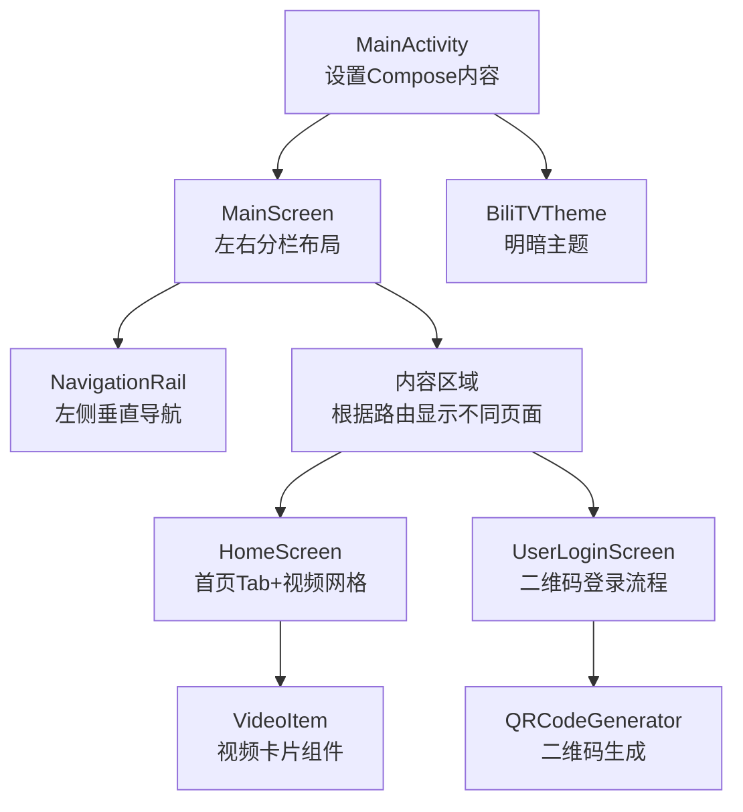
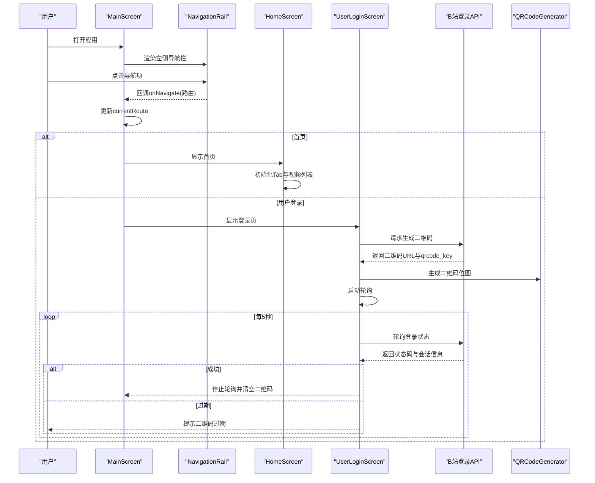
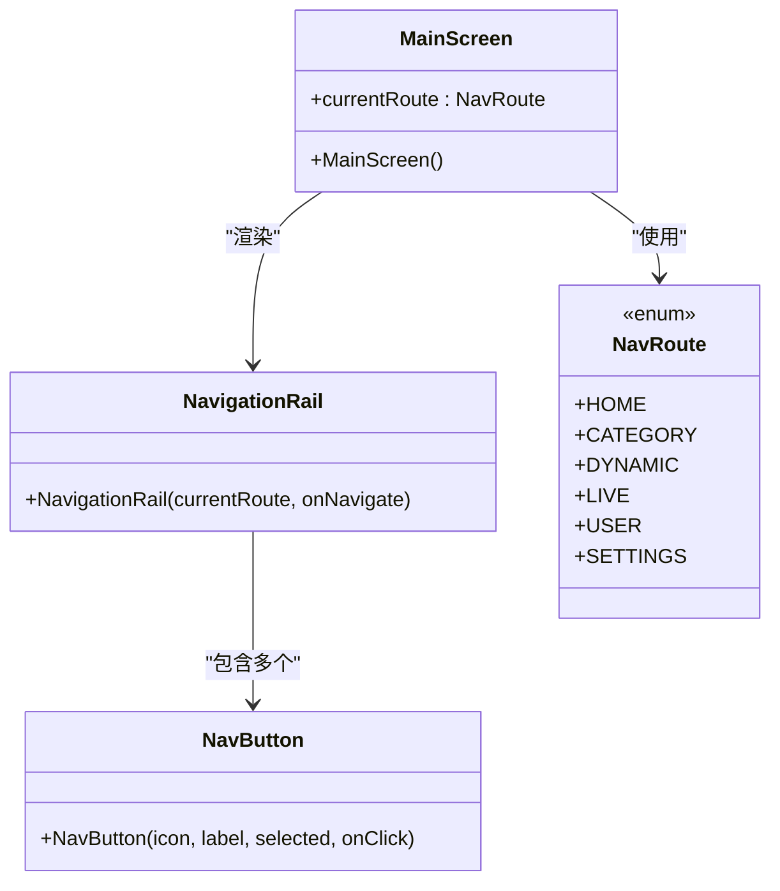
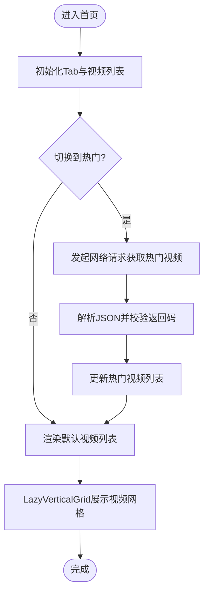
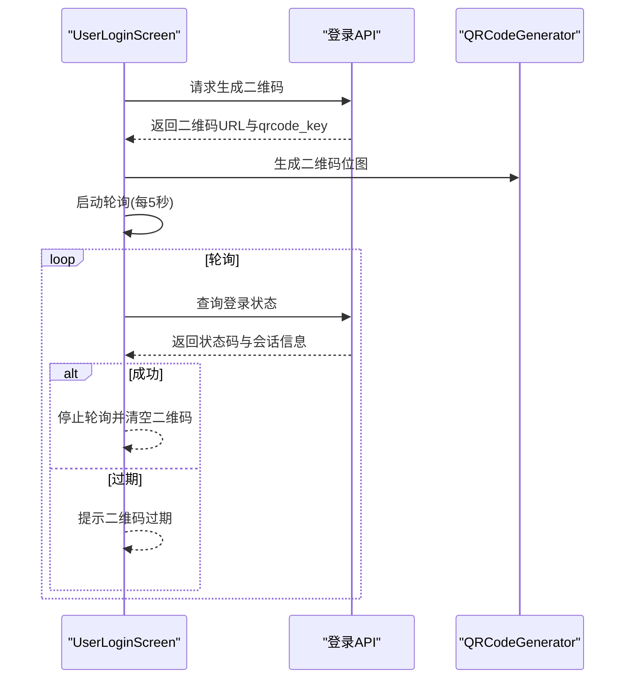
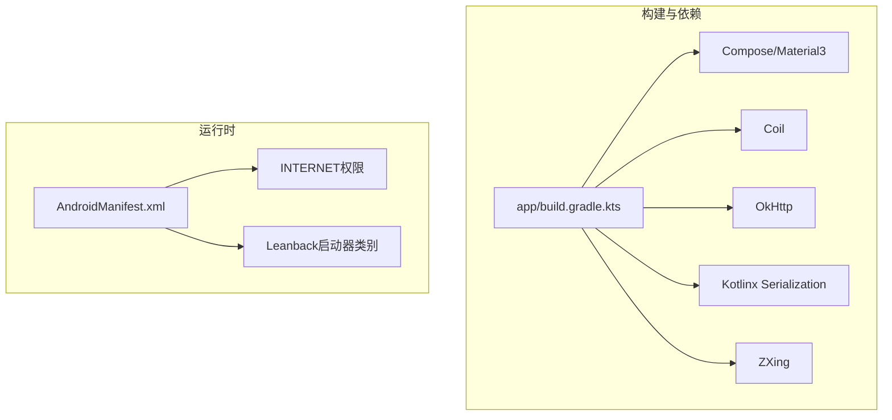

# 主界面与导航栏

<cite>
**本文引用的文件**
- [MainActivity.kt](file://app/src/main/java/com/bili/bilitv/MainActivity.kt)
- [MainScreen.kt](file://app/src/main/java/com/bili/bilitv/MainScreen.kt)
- [HomeScreen.kt](file://app/src/main/java/com/bili/bilitv/HomeScreen.kt)
- [Theme.kt](file://app/src/main/java/com/bili/bilitv/Theme.kt)
- [VideoItem.kt](file://app/src/main/java/com/bili/bilitv/VideoItem.kt)
- [QRCodeGenerator.kt](file://app/src/main/java/com/bili/bilitv/utils/QRCodeGenerator.kt)
- [AndroidManifest.xml](file://app/src/main/AndroidManifest.xml)
- [app/build.gradle.kts](file://app/build.gradle.kts)
- [build.gradle.kts](file://build.gradle.kts)
- [settings.gradle.kts](file://settings.gradle.kts)
- [strings.xml](file://app/src/main/res/values/strings.xml)
- [themes.xml](file://app/src/main/res/values/themes.xml)
</cite>

## 目录
1. [简介](#简介)
2. [项目结构](#项目结构)
3. [核心组件](#核心组件)
4. [架构总览](#架构总览)
5. [详细组件分析](#详细组件分析)
6. [依赖分析](#依赖分析)
7. [性能考虑](#性能考虑)
8. [故障排查指南](#故障排查指南)
9. [结论](#结论)

## 简介
本文件聚焦于应用的“主界面与导航栏”部分，基于 Jetpack Compose 实现。主界面采用左右分栏布局：左侧为垂直导航栏（NavigationRail），右侧为主内容区；顶部首页包含横向 Tab 切换；底部提供用户登录页、设置等路由。应用通过自定义主题适配明暗模式，并在用户登录页集成二维码扫码登录流程（网络请求、轮询状态、解析会话）。

## 项目结构
- 入口 Activity 负责设置 Compose 内容并包裹主题。
- 主屏幕负责导航栏与内容区域的布局及路由切换。
- 首页屏幕负责顶部 Tab 与视频网格展示。
- 视频项组件负责单个视频卡片渲染。
- 登录页通过二维码生成与轮询实现扫码登录。
- 主题文件提供明暗两套配色方案。
- 构建脚本声明了 Compose、Material3、OkHttp、Kotlinx Serialization、ZXing 等依赖。

图表来源
- [MainActivity.kt](file://app/src/main/java/com/bili/bilitv/MainActivity.kt#L1-L30)
- [MainScreen.kt](file://app/src/main/java/com/bili/bilitv/MainScreen.kt#L93-L128)
- [HomeScreen.kt](file://app/src/main/java/com/bili/bilitv/HomeScreen.kt#L80-L141)
- [VideoItem.kt](file://app/src/main/java/com/bili/bilitv/VideoItem.kt#L30-L125)
- [QRCodeGenerator.kt](file://app/src/main/java/com/bili/bilitv/utils/QRCodeGenerator.kt#L1-L31)
- [Theme.kt](file://app/src/main/java/com/bili/bilitv/Theme.kt#L52-L67)

章节来源
- [MainActivity.kt](file://app/src/main/java/com/bili/bilitv/MainActivity.kt#L1-L30)
- [MainScreen.kt](file://app/src/main/java/com/bili/bilitv/MainScreen.kt#L93-L128)
- [HomeScreen.kt](file://app/src/main/java/com/bili/bilitv/HomeScreen.kt#L80-L141)
- [VideoItem.kt](file://app/src/main/java/com/bili/bilitv/VideoItem.kt#L30-L125)
- [QRCodeGenerator.kt](file://app/src/main/java/com/bili/bilitv/utils/QRCodeGenerator.kt#L1-L31)
- [Theme.kt](file://app/src/main/java/com/bili/bilitv/Theme.kt#L52-L67)

## 核心组件
- 主入口 Activity：设置 Compose 内容，包裹主题与背景色，承载主屏幕。
- 主屏幕（MainScreen）：定义导航路由枚举、左侧 NavigationRail 导航、右侧内容区按路由切换。
- 导航栏（NavigationRail）：左侧固定宽度列容器，顶部放置常用功能入口，底部放置用户与设置入口。
- 导航按钮（NavButton）：带缩放与焦点边框反馈，支持选中态颜色变化。
- 首页（HomeScreen）：顶部 TabRow 切换推荐/动态/热门，LazyVerticalGrid 展示视频网格。
- 视频项（VideoItem）：卡片式布局，封面异步加载，标题与作者信息展示，支持焦点缩放与阴影。
- 登录页（UserLoginScreen）：生成二维码、轮询登录状态、解析会话信息。
- 主题（BiliTVTheme）：明/暗色配色方案，自动跟随系统深色模式。

章节来源
- [MainActivity.kt](file://app/src/main/java/com/bili/bilitv/MainActivity.kt#L1-L30)
- [MainScreen.kt](file://app/src/main/java/com/bili/bilitv/MainScreen.kt#L93-L128)
- [MainScreen.kt](file://app/src/main/java/com/bili/bilitv/MainScreen.kt#L275-L341)
- [MainScreen.kt](file://app/src/main/java/com/bili/bilitv/MainScreen.kt#L343-L388)
- [HomeScreen.kt](file://app/src/main/java/com/bili/bilitv/HomeScreen.kt#L80-L141)
- [HomeScreen.kt](file://app/src/main/java/com/bili/bilitv/HomeScreen.kt#L146-L206)
- [HomeScreen.kt](file://app/src/main/java/com/bili/bilitv/HomeScreen.kt#L211-L236)
- [VideoItem.kt](file://app/src/main/java/com/bili/bilitv/VideoItem.kt#L30-L125)
- [Theme.kt](file://app/src/main/java/com/bili/bilitv/Theme.kt#L52-L67)

## 架构总览
主界面采用“路由驱动”的导航模式：
- 路由枚举定义导航项与图标。
- 左侧 NavigationRail 根据当前路由高亮，点击触发路由变更。
- 右侧内容区根据路由选择渲染对应页面（首页、用户登录、设置等）。
- 首页内部使用 TabRow 控制内容分区，LazyVerticalGrid 渲染视频网格。
- 登录页通过网络请求生成二维码，定时轮询登录状态，成功后清理轮询并更新 UI。

图表来源
- [MainScreen.kt](file://app/src/main/java/com/bili/bilitv/MainScreen.kt#L93-L128)
- [MainScreen.kt](file://app/src/main/java/com/bili/bilitv/MainScreen.kt#L275-L341)
- [HomeScreen.kt](file://app/src/main/java/com/bili/bilitv/HomeScreen.kt#L80-L141)
- [QRCodeGenerator.kt](file://app/src/main/java/com/bili/bilitv/utils/QRCodeGenerator.kt#L1-L31)

章节来源
- [MainScreen.kt](file://app/src/main/java/com/bili/bilitv/MainScreen.kt#L93-L128)
- [HomeScreen.kt](file://app/src/main/java/com/bili/bilitv/HomeScreen.kt#L80-L141)
- [QRCodeGenerator.kt](file://app/src/main/java/com/bili/bilitv/utils/QRCodeGenerator.kt#L1-L31)

## 详细组件分析

### 主入口与主题
- MainActivity 设置 Compose 内容，使用 Surface 填充背景色，包裹 BiliTVTheme。
- BiliTVTheme 根据系统深色模式选择明/暗色配色方案，提供 primary/surface 等色板。

章节来源
- [MainActivity.kt](file://app/src/main/java/com/bili/bilitv/MainActivity.kt#L1-L30)
- [Theme.kt](file://app/src/main/java/com/bili/bilitv/Theme.kt#L52-L67)

### 主屏幕与导航栏
- 路由枚举 NavRoute 定义首页、分类、动态、直播、用户、设置六个路由，每个包含标题与图标。
- MainScreen 使用 Row 布局，左侧 NavigationRail，右侧 Box 占满权重作为内容区。
- NavigationRail 顶部放置常用入口，底部放置用户与设置入口，均通过 NavButton 渲染。
- NavButton 支持选中态颜色、焦点缩放与边框反馈，提升可访问性与交互体验。

图表来源
- [MainScreen.kt](file://app/src/main/java/com/bili/bilitv/MainScreen.kt#L93-L128)
- [MainScreen.kt](file://app/src/main/java/com/bili/bilitv/MainScreen.kt#L275-L341)
- [MainScreen.kt](file://app/src/main/java/com/bili/bilitv/MainScreen.kt#L343-L388)

章节来源
- [MainScreen.kt](file://app/src/main/java/com/bili/bilitv/MainScreen.kt#L93-L128)
- [MainScreen.kt](file://app/src/main/java/com/bili/bilitv/MainScreen.kt#L275-L341)
- [MainScreen.kt](file://app/src/main/java/com/bili/bilitv/MainScreen.kt#L343-L388)

### 首页与 Tab 切换
- HomeScreen 内部定义 TabType（推荐/动态/热门），使用 TabRow 进行切换。
- 当切换到“热门”时，通过 OkHttp 发起网络请求获取热门视频列表，解析 JSON 并更新状态。
- 使用 LazyVerticalGrid 以 4 列网格展示视频，每项使用 VideoItem 组件渲染。

图表来源
- [HomeScreen.kt](file://app/src/main/java/com/bili/bilitv/HomeScreen.kt#L80-L141)
- [HomeScreen.kt](file://app/src/main/java/com/bili/bilitv/HomeScreen.kt#L146-L206)
- [HomeScreen.kt](file://app/src/main/java/com/bili/bilitv/HomeScreen.kt#L211-L236)

章节来源
- [HomeScreen.kt](file://app/src/main/java/com/bili/bilitv/HomeScreen.kt#L80-L141)
- [HomeScreen.kt](file://app/src/main/java/com/bili/bilitv/HomeScreen.kt#L146-L206)
- [HomeScreen.kt](file://app/src/main/java/com/bili/bilitv/HomeScreen.kt#L211-L236)

### 视频项组件
- Video 数据类封装视频的基本信息（id、title、coverUrl、author、playCount、pubDate）。
- VideoItem 使用 Card 布局，封面使用 AsyncImage 异步加载，支持占位与错误占位。
- 标题最多两行，作者与发布时间在同一行展示，焦点时卡片提升阴影与缩放。

章节来源
- [VideoItem.kt](file://app/src/main/java/com/bili/bilitv/VideoItem.kt#L30-L125)

### 登录页与二维码登录流程
- UserLoginScreen 在首次可见时发起二维码生成请求，解析响应后使用 QRCodeGenerator 生成二维码位图。
- 启动轮询任务，每 5 秒向登录轮询接口查询状态；当状态码为成功时解析会话信息并停止轮询。
- 若状态码表示二维码已过期，则提示用户刷新。

图表来源
- [MainScreen.kt](file://app/src/main/java/com/bili/bilitv/MainScreen.kt#L130-L273)
- [QRCodeGenerator.kt](file://app/src/main/java/com/bili/bilitv/utils/QRCodeGenerator.kt#L1-L31)

章节来源
- [MainScreen.kt](file://app/src/main/java/com/bili/bilitv/MainScreen.kt#L130-L273)
- [QRCodeGenerator.kt](file://app/src/main/java/com/bili/bilitv/utils/QRCodeGenerator.kt#L1-L31)

## 依赖分析
- 构建脚本声明了 Compose、Material3、Coil、OkHttp、Kotlinx Serialization、ZXing 等依赖。
- 项目使用 AndroidX Compose 与 Material3，主题与组件样式统一。
- 网络层使用 OkHttp，序列化使用 Kotlinx Serialization，二维码生成使用 ZXing。
- Manifest 声明 INTERNET 权限与 Leanback 启动器类别。

图表来源
- [app/build.gradle.kts](file://app/build.gradle.kts#L45-L66)
- [AndroidManifest.xml](file://app/src/main/AndroidManifest.xml#L1-L31)

章节来源
- [app/build.gradle.kts](file://app/build.gradle.kts#L45-L66)
- [AndroidManifest.xml](file://app/src/main/AndroidManifest.xml#L1-L31)

## 性能考虑
- 网络请求与二维码生成分别在合适的 Dispatcher 上执行，避免阻塞主线程。
- 视频网格使用 LazyVerticalGrid，仅渲染可见项，减少布局与绘制开销。
- 导航按钮与视频项在焦点时才进行缩放与阴影变化，降低非必要重绘。
- 登录轮询在成功或过期后及时停止，避免无意义的网络请求。

## 故障排查指南
- 登录二维码无法生成或过期
  - 检查网络请求是否成功，确认 qrcode_key 是否存在。
  - 若状态码为过期，提示用户刷新二维码。
- 热门视频未加载
  - 检查网络请求返回码与 JSON 解析逻辑。
  - 确认热门 Tab 已被选中才会触发拉取。
- 视频封面加载失败
  - 检查 AsyncImage 的占位与错误占位资源是否可用。
  - 确认网络权限已声明。
- 主题不生效
  - 确认 BiliTVTheme 已包裹根内容。
  - 检查系统深色模式设置与主题色板配置。

章节来源
- [MainScreen.kt](file://app/src/main/java/com/bili/bilitv/MainScreen.kt#L130-L273)
- [HomeScreen.kt](file://app/src/main/java/com/bili/bilitv/HomeScreen.kt#L80-L141)
- [VideoItem.kt](file://app/src/main/java/com/bili/bilitv/VideoItem.kt#L30-L125)
- [Theme.kt](file://app/src/main/java/com/bili/bilitv/Theme.kt#L52-L67)
- [AndroidManifest.xml](file://app/src/main/AndroidManifest.xml#L1-L31)

## 结论
该应用的主界面与导航栏以 Compose 为基础，采用路由驱动的导航模式，左侧 NavigationRail 提供清晰的功能入口，右侧内容区按需渲染。首页 Tab 与视频网格提升了信息密度与浏览效率；登录页通过二维码与轮询实现了扫码登录的完整流程。整体架构清晰、组件职责明确，具备良好的扩展性与可维护性。