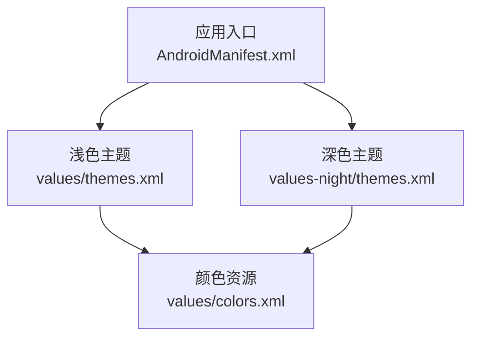
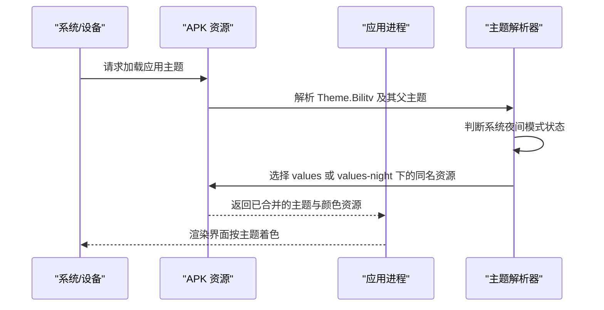
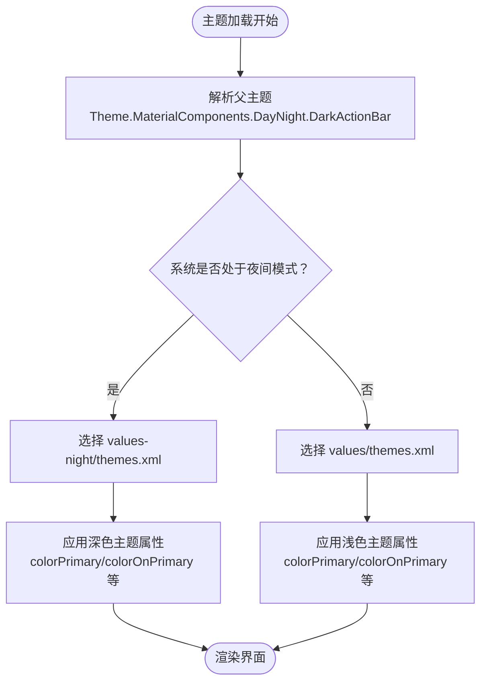
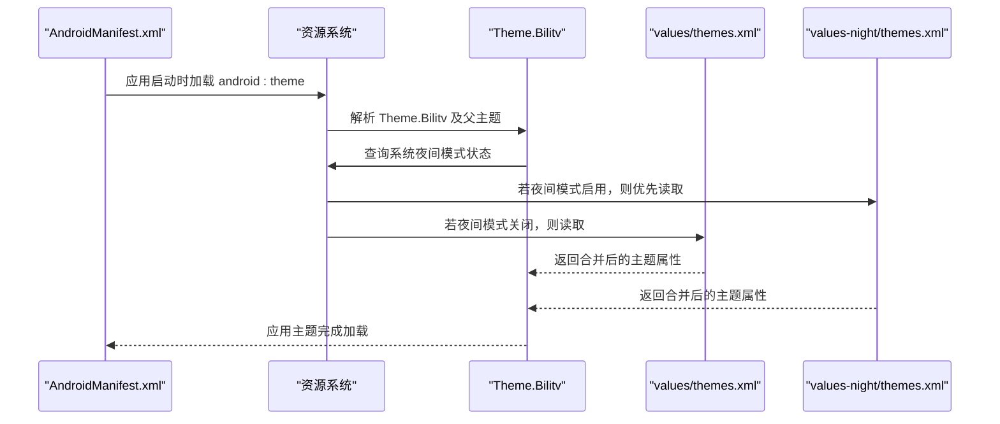
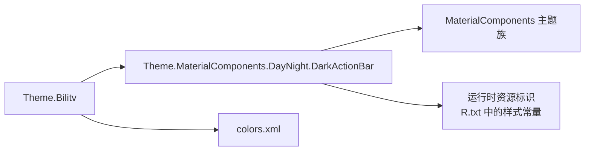

# 主题系统配置

<cite>
**本文引用的文件**
- [app/src/main/res/values/themes.xml](file://app/src/main/res/values/themes.xml)
- [app/src/main/res/values-night/themes.xml](file://app/src/main/res/values-night/themes.xml)
- [app/src/main/res/values/colors.xml](file://app/src/main/res/values/colors.xml)
- [app/src/main/AndroidManifest.xml](file://app/src/main/AndroidManifest.xml)
- [app/build/intermediates/merged_res_blame_folder/debug/mergeDebugResources/out/multi-v2/mergeDebugResources.json](file://app/build/intermediates/merged_res_blame_folder/debug/mergeDebugResources/out/multi-v2/mergeDebugResources.json)
- [app/build/intermediates/incremental/debug/mergeDebugResources/merged.dir/values-night-v8/values-night-v8.xml](file://app/build/intermediates/incremental/debug/mergeDebugResources/merged.dir/values-night-v8/values-night-v8.xml)
- [app/build/intermediates/incremental/debug/mergeDebugResources/merged.dir/values/values.xml](file://app/build/intermediates/incremental/debug/mergeDebugResources/merged.dir/values/values.xml)
- [app/build/intermediates/runtime_symbol_list/debug/processDebugResources/R.txt](file://app/build/intermediates/runtime_symbol_list/debug/processDebugResources/R.txt)
</cite>

## 目录
1. [简介](#简介)
2. [项目结构](#项目结构)
3. [核心组件](#核心组件)
4. [架构总览](#架构总览)
5. [详细组件分析](#详细组件分析)
6. [依赖分析](#依赖分析)
7. [性能考虑](#性能考虑)
8. [故障排查指南](#故障排查指南)
9. [结论](#结论)
10. [附录](#附录)

## 简介
本文件深入解析 bilitv 的主题系统实现机制，重点围绕浅色主题与深色主题的继承关系与差异化配置展开，说明如何基于 Theme.MaterialComponents.DayNight.DarkActionBar 实现自动日/夜模式切换，并对比 values/themes.xml 与 values-night/themes.xml 中 colorPrimary、colorOnPrimary 等关键属性的取值差异及其视觉影响。同时，结合构建产物与资源合并信息，解释 Android 资源系统如何根据系统设置与资源限定符自动选择对应资源目录；并提供扩展自定义主题样式、新增主题变体的方法，以及在代码中动态切换主题模式的实践建议与常见问题排查思路。

## 项目结构
- 应用主题定义位于 values 与 values-night 目录下，分别覆盖白天与夜间场景。
- 颜色资源集中于 values/colors.xml，供主题引用。
- 应用入口通过 AndroidManifest.xml 指定全局主题。

图表来源
- [app/src/main/AndroidManifest.xml](file://app/src/main/AndroidManifest.xml#L1-L15)
- [app/src/main/res/values/themes.xml](file://app/src/main/res/values/themes.xml#L1-L16)
- [app/src/main/res/values-night/themes.xml](file://app/src/main/res/values-night/themes.xml#L1-L16)
- [app/src/main/res/values/colors.xml](file://app/src/main/res/values/colors.xml#L1-L10)

章节来源
- [app/src/main/AndroidManifest.xml](file://app/src/main/AndroidManifest.xml#L1-L15)
- [app/src/main/res/values/themes.xml](file://app/src/main/res/values/themes.xml#L1-L16)
- [app/src/main/res/values-night/themes.xml](file://app/src/main/res/values-night/themes.xml#L1-L16)
- [app/src/main/res/values/colors.xml](file://app/src/main/res/values/colors.xml#L1-L10)

## 核心组件
- 基础主题继承链：Theme.Bilitv 继承自 Theme.MaterialComponents.DayNight.DarkActionBar，后者在运行时根据系统设置或用户偏好自动在“亮色/暗色”之间切换。
- 浅色主题（values/themes.xml）与深色主题（values-night/themes.xml）均以同一父类为基底，但对 colorPrimary、colorOnPrimary、colorSecondaryVariant 等关键属性进行差异化配置，从而在不同模式下呈现不同的主色与对比度。
- 颜色资源（colors.xml）集中管理品牌色与语义色，确保主题在不同模式下的色彩一致性与可维护性。

章节来源
- [app/src/main/res/values/themes.xml](file://app/src/main/res/values/themes.xml#L1-L16)
- [app/src/main/res/values-night/themes.xml](file://app/src/main/res/values-night/themes.xml#L1-L16)
- [app/src/main/res/values/colors.xml](file://app/src/main/res/values/colors.xml#L1-L10)

## 架构总览
Android 资源系统在编译期将 values 与 values-night 下的同名资源进行合并，并在运行时依据设备当前的系统设置（如夜间模式）与资源限定符（如 night-v8）选择最匹配的主题与颜色资源。Theme.MaterialComponents.DayNight.DarkActionBar 作为父主题，负责在运行时决定使用亮色还是暗色版本的资源。

图表来源
- [app/src/main/res/values/themes.xml](file://app/src/main/res/values/themes.xml#L1-L16)
- [app/src/main/res/values-night/themes.xml](file://app/src/main/res/values-night/themes.xml#L1-L16)
- [app/build/intermediates/merged_res_blame_folder/debug/mergeDebugResources/out/multi-v2/mergeDebugResources.json](file://app/build/intermediates/merged_res_blame_folder/debug/mergeDebugResources/out/multi-v2/mergeDebugResources.json#L4230-L4256)

## 详细组件分析

### 浅色主题（values/themes.xml）与深色主题（values-night/themes.xml）的继承与差异
- 共同父类：两者均继承自 Theme.MaterialComponents.DayNight.DarkActionBar，保证在运行时具备自动日/夜切换能力。
- 关键属性差异：
  - colorPrimary：浅色模式使用较深的紫色，深色模式使用较浅的紫色，以适配不同背景亮度。
  - colorOnPrimary：浅色模式使用白色以提升对比度，深色模式使用黑色以避免过亮。
  - colorSecondaryVariant：浅色模式与深色模式保持一致，深色模式的 colorOnSecondary 同样使用黑色。
  - android:statusBarColor：均绑定到 colorPrimaryVariant，确保状态栏与主色保持一致。
- 视觉影响：上述差异使得浅色模式更强调高对比度与明亮感，深色模式则偏向柔和与低刺激，同时保持品牌主色的一致性。

图表来源
- [app/src/main/res/values/themes.xml](file://app/src/main/res/values/themes.xml#L1-L16)
- [app/src/main/res/values-night/themes.xml](file://app/src/main/res/values-night/themes.xml#L1-L16)

章节来源
- [app/src/main/res/values/themes.xml](file://app/src/main/res/values/themes.xml#L1-L16)
- [app/src/main/res/values-night/themes.xml](file://app/src/main/res/values-night/themes.xml#L1-L16)

### 颜色资源（colors.xml）与主题的关联
- 颜色资源集中定义了品牌色与语义色，主题通过引用这些颜色来实现跨模式的一致性与可维护性。
- 在浅色与深色主题中，颜色资源本身不变，变化的是主题对这些颜色的使用方式（例如明暗程度、对比度）。

章节来源
- [app/src/main/res/values/colors.xml](file://app/src/main/res/values/colors.xml#L1-L10)
- [app/src/main/res/values/themes.xml](file://app/src/main/res/values/themes.xml#L1-L16)
- [app/src/main/res/values-night/themes.xml](file://app/src/main/res/values-night/themes.xml#L1-L16)

### 应用入口中的主题加载流程
- 应用在 AndroidManifest.xml 中通过 android:theme 指向 Theme.Bilitv，该主题继承自 DayNight 父类，因此系统会在运行时根据夜间模式状态选择 values 或 values-night 下的资源。
- 构建产物中存在 values-night-v8 与 values 的合并记录，表明系统会优先选择夜间限定资源，若未命中则回退到通用资源。

图表来源
- [app/src/main/AndroidManifest.xml](file://app/src/main/AndroidManifest.xml#L1-L15)
- [app/build/intermediates/merged_res_blame_folder/debug/mergeDebugResources/out/multi-v2/mergeDebugResources.json](file://app/build/intermediates/merged_res_blame_folder/debug/mergeDebugResources/out/multi-v2/mergeDebugResources.json#L4230-L4256)

章节来源
- [app/src/main/AndroidManifest.xml](file://app/src/main/AndroidManifest.xml#L1-L15)
- [app/build/intermediates/merged_res_blame_folder/debug/mergeDebugResources/out/multi-v2/mergeDebugResources.json](file://app/build/intermediates/merged_res_blame_folder/debug/mergeDebugResources/out/multi-v2/mergeDebugResources.json#L4230-L4256)

### 运行时主题切换与 DayNight 行为
- DayNight 父主题在运行时根据系统设置（如夜间模式开关）与资源限定符（night-v8 等）选择对应资源。
- 构建产物中包含 Theme.MaterialComponents.DayNight.DarkActionBar 的定义与桥接样式，表明系统在运行时会将 DayNight 映射到具体亮/暗主题。

章节来源
- [app/build/intermediates/incremental/debug/mergeDebugResources/merged.dir/values/values.xml](file://app/build/intermediates/incremental/debug/mergeDebugResources/merged.dir/values/values.xml#L7486-L7487)
- [app/build/intermediates/incremental/debug/mergeDebugResources/merged.dir/values-night-v8/values-night-v8.xml](file://app/build/intermediates/incremental/debug/mergeDebugResources/merged.dir/values-night-v8/values-night-v8.xml#L35-L36)

## 依赖分析
- 主题依赖关系：
  - Theme.Bilitv -> Theme.MaterialComponents.DayNight.DarkActionBar -> 更底层的 MaterialComponents 主题族。
- 资源依赖关系：
  - values/themes.xml 与 values-night/themes.xml 均依赖 colors.xml 中的颜色定义。
- 运行时符号与资源映射：
  - 构建产物中包含 Theme.MaterialComponents.DayNight.DarkActionBar 等样式标识，用于运行时定位与替换。

图表来源
- [app/src/main/res/values/themes.xml](file://app/src/main/res/values/themes.xml#L1-L16)
- [app/src/main/res/values-night/themes.xml](file://app/src/main/res/values-night/themes.xml#L1-L16)
- [app/src/main/res/values/colors.xml](file://app/src/main/res/values/colors.xml#L1-L10)
- [app/build/intermediates/runtime_symbol_list/debug/processDebugResources/R.txt](file://app/build/intermediates/runtime_symbol_list/debug/processDebugResources/R.txt#L5160-L5184)

章节来源
- [app/src/main/res/values/themes.xml](file://app/src/main/res/values/themes.xml#L1-L16)
- [app/src/main/res/values-night/themes.xml](file://app/src/main/res/values-night/themes.xml#L1-L16)
- [app/src/main/res/values/colors.xml](file://app/src/main/res/values/colors.xml#L1-L10)
- [app/build/intermediates/runtime_symbol_list/debug/processDebugResources/R.txt](file://app/build/intermediates/runtime_symbol_list/debug/processDebugResources/R.txt#L5160-L5184)

## 性能考虑
- 使用 DayNight 主题可减少重复主题定义，降低资源体积与维护成本。
- 将颜色与品牌色集中在 colors.xml，便于统一管理与复用，避免在多处硬编码颜色导致的资源膨胀。
- 避免在布局中直接硬编码颜色，尽量通过主题属性引用，以充分利用资源合并与运行时切换的优势。

## 故障排查指南
- 主题不生效
  - 检查 AndroidManifest.xml 是否正确设置了 android:theme 指向 Theme.Bilitv。
  - 确认 values 与 values-night 下是否存在同名主题文件，且父类继承链完整。
  - 查看构建产物合并日志，确认 values 与 values-night 的合并是否成功。
- 颜色冲突或对比度异常
  - 对比浅色与深色主题中 colorOnPrimary、colorOnSecondary 的取值，确保在不同背景下具备足够对比度。
  - 检查颜色资源是否被意外覆盖或拼写错误。
- 夜间模式切换无效
  - 确认父主题为 DayNight 类型，且未被其他主题覆盖。
  - 检查系统夜间模式设置与设备环境是否符合预期。
- 动态切换主题（建议做法）
  - 在 Activity 中，可在调用 super.setTheme(...) 之前设置主题，并在必要时重建 Activity 以应用新主题。
  - 注意：动态切换需谨慎处理状态保存与 UI 重建，避免闪烁或状态丢失。

章节来源
- [app/src/main/AndroidManifest.xml](file://app/src/main/AndroidManifest.xml#L1-L15)
- [app/src/main/res/values/themes.xml](file://app/src/main/res/values/themes.xml#L1-L16)
- [app/src/main/res/values-night/themes.xml](file://app/src/main/res/values-night/themes.xml#L1-L16)
- [app/build/intermediates/merged_res_blame_folder/debug/mergeDebugResources/out/multi-v2/mergeDebugResources.json](file://app/build/intermediates/merged_res_blame_folder/debug/mergeDebugResources/out/multi-v2/mergeDebugResources.json#L4230-L4256)

## 结论
bilitv 的主题系统通过 Theme.MaterialComponents.DayNight.DarkActionBar 实现了自动日/夜模式切换，浅色与深色主题在 values 与 values-night 下分别定义，仅对关键属性进行差异化配置，从而在不同模式下获得一致的品牌风格与良好的视觉体验。借助 colors.xml 的集中管理与资源合并机制，系统能够在运行时根据设备设置选择最优资源，简化了主题维护与扩展。对于需要动态切换主题的场景，应在 Activity 生命周期内合理设置主题并在必要时重建界面，同时关注对比度与可访问性。

## 附录
- 扩展自定义主题样式与新增主题变体
  - 在 values 与 values-night 下新增同名主题文件，继承 DayNight 父类并按需覆盖关键属性。
  - 将品牌色与语义色统一放入 colors.xml，避免硬编码颜色。
  - 如需支持更多设备特性（如动态颜色），可在主题中引入相应 Overlay 或父主题。
- 参考路径
  - [浅色主题定义](file://app/src/main/res/values/themes.xml#L1-L16)
  - [深色主题定义](file://app/src/main/res/values-night/themes.xml#L1-L16)
  - [颜色资源定义](file://app/src/main/res/values/colors.xml#L1-L10)
  - [应用主题入口](file://app/src/main/AndroidManifest.xml#L1-L15)
  - [资源合并与限定符映射](file://app/build/intermediates/merged_res_blame_folder/debug/mergeDebugResources/out/multi-v2/mergeDebugResources.json#L4230-L4256)
  - [DayNight 父主题定义](file://app/build/intermediates/incremental/debug/mergeDebugResources/merged.dir/values/values.xml#L7486-L7487)
  - [夜间资源桥接样式](file://app/build/intermediates/incremental/debug/mergeDebugResources/merged.dir/values-night-v8/values-night-v8.xml#L35-L36)
  - [运行时样式标识](file://app/build/intermediates/runtime_symbol_list/debug/processDebugResources/R.txt#L5160-L5184)