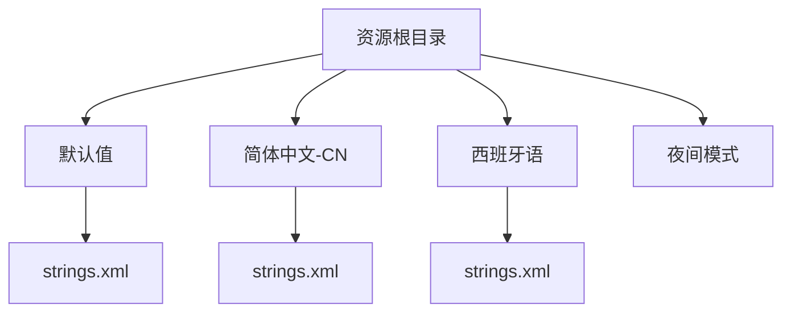
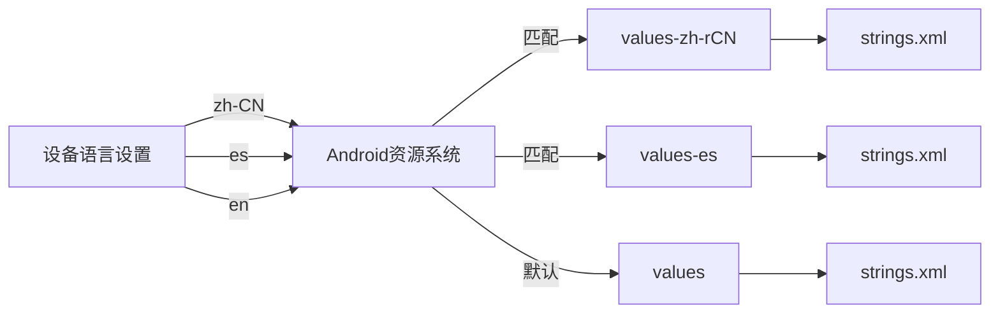
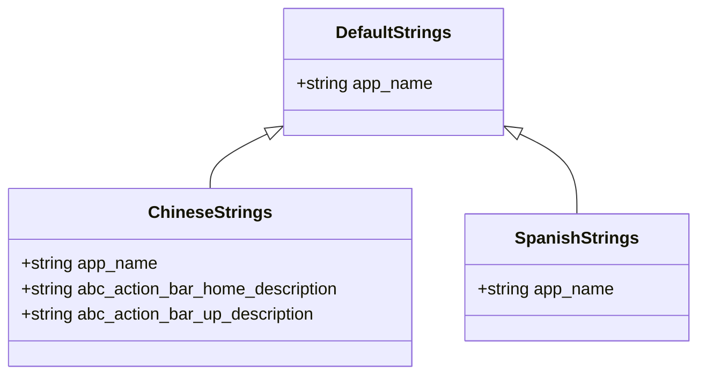
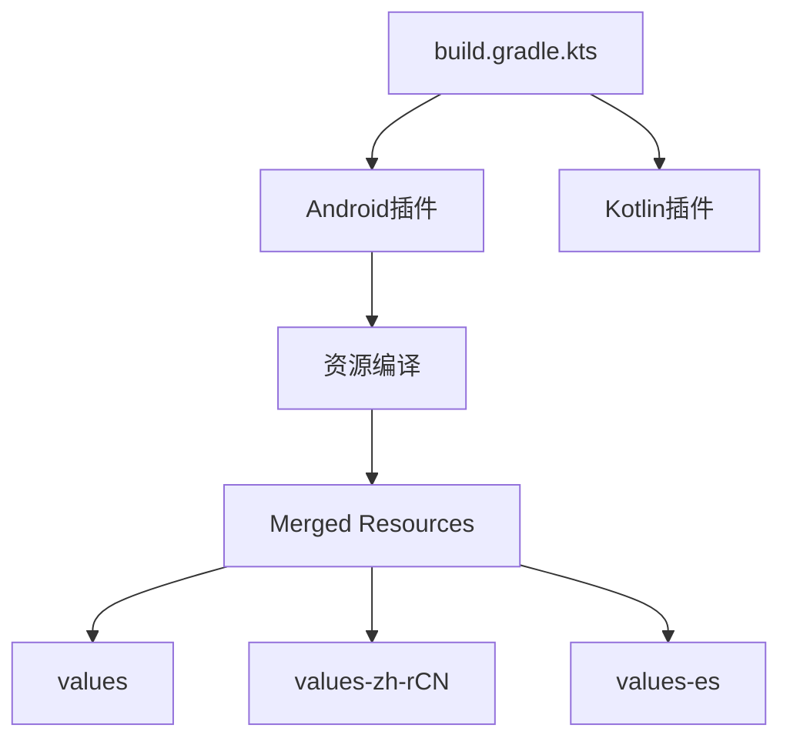

# 多语言支持实现

<cite>
**本文档引用的文件**
- [strings.xml](file://app/src/main/res/values/strings.xml)
- [values-zh-rCN.xml](file://app/build/intermediates/incremental/debug/mergeDebugResources/merged.dir/values-zh-rCN/values-zh-rCN.xml)
- [build.gradle.kts](file://app/build.gradle.kts)
- [settings.gradle.kts](file://settings.gradle.kts)
</cite>

## 目录
1. [简介](#简介)
2. [项目结构](#项目结构)
3. [核心组件](#核心组件)
4. [架构概述](#架构概述)
5. [详细组件分析](#详细组件分析)
6. [依赖分析](#依赖分析)
7. [性能考虑](#性能考虑)
8. [故障排除指南](#故障排除指南)
9. [结论](#结论)

## 简介
本文件详细说明了 bilitv 应用如何通过 Android 资源系统实现多语言支持。文档解释了 `values/`、`values-zh-rCN/`、`values-es/` 等资源目录命名规则的含义及其与设备语言设置的匹配机制。以 `strings.xml` 为基础，展示如何为不同语言环境提供本地化字符串，确保应用名称（app_name）等文本正确显示。同时指导开发者如何添加新的语言资源文件，包括创建对应限定符目录、复制模板并翻译内容，并强调字符串提取、占位符使用（如 %s）和 RTL 语言支持的最佳实践。

## 项目结构
bilitv 项目的资源文件组织遵循 Android 标准多语言支持结构。主资源文件位于 `app/src/main/res/` 目录下，其中包含基础的 `values/` 文件夹用于存放默认语言资源。构建系统在编译过程中会生成大量针对不同语言和区域设置的资源目录，如 `values-zh-rCN/`（简体中文，中国）、`values-es/`（西班牙语）等，这些目录包含了对应语言的本地化字符串资源。

**Diagram sources**
- [strings.xml](file://app/src/main/res/values/strings.xml)
- [values-zh-rCN.xml](file://app/build/intermediates/incremental/debug/mergeDebugResources/merged.dir/values-zh-rCN/values-zh-rCN.xml)

**Section sources**
- [strings.xml](file://app/src/main/res/values/strings.xml)
- [values-zh-rCN.xml](file://app/build/intermediates/incremental/debug/mergeDebugResources/merged.dir/values-zh-rCN/values-zh-rCN.xml)

## 核心组件
bilitv 应用的核心多语言支持功能依赖于 Android 资源系统。系统根据设备的语言和地区设置自动选择最匹配的资源目录。基础字符串资源定义在 `app/src/main/res/values/strings.xml` 中，而特定语言的翻译则分布在相应的限定符目录中。当应用运行时，Android 框架会自动加载与用户设备设置相匹配的语言资源。

**Section sources**
- [strings.xml](file://app/src/main/res/values/strings.xml)
- [values-zh-rCN.xml](file://app/build/intermediates/incremental/debug/mergeDebugResources/merged.dir/values-zh-rCN/values-zh-rCN.xml)

## 架构概述
bilitv 的多语言架构基于 Android 的资源限定符系统。该系统允许开发者为不同的语言、地区、屏幕尺寸等条件提供定制化的资源文件。语言资源通过特定的目录命名约定进行组织，Android 系统在运行时根据当前设备配置自动选择最合适的资源集。

**Diagram sources**
- [strings.xml](file://app/src/main/res/values/strings.xml)
- [values-zh-rCN.xml](file://app/build/intermediates/incremental/debug/mergeDebugResources/merged.dir/values-zh-rCN/values-zh-rCN.xml)

## 详细组件分析
### 字符串资源分析
bilitv 应用的字符串资源管理遵循 Android 最佳实践。基础字符串定义在默认的 `values/strings.xml` 文件中，包含应用名称等关键文本。对于需要本地化的字符串，系统会查找对应语言目录中的 `strings.xml` 文件。

#### 多语言资源匹配机制
Android 资源系统使用精确的命名约定来匹配语言资源。目录名称格式为 `values-<language>-r<region>`，其中 `<language>` 是 ISO 639-1 语言代码，`<region>` 是 ISO 3166-1 国家/地区代码。例如，`values-zh-rCN` 表示简体中文（中国），`values-es` 表示西班牙语（默认地区）。

**Diagram sources**
- [strings.xml](file://app/src/main/res/values/strings.xml)
- [values-zh-rCN.xml](file://app/build/intermediates/incremental/debug/mergeDebugResources/merged.dir/values-zh-rCN/values-zh-rCN.xml)

#### 占位符与复数支持
bilitv 的多语言实现支持复杂的字符串格式化，包括占位符（如 `%s`）和复数形式。在 `values-zh-rCN.xml` 中可以看到使用 `<plurals>` 标签定义的复数规则，以及使用 `<ns1:g id="APPLICATION_NAME">%s</ns1:g>` 语法的占位符，这确保了动态内容能够正确地与翻译文本结合。

**Section sources**
- [strings.xml](file://app/src/main/res/values/strings.xml)
- [values-zh-rCN.xml](file://app/build/intermediates/incremental/debug/mergeDebugResources/merged.dir/values-zh-rCN/values-zh-rCN.xml)

## 依赖分析
bilitv 项目的多语言支持依赖于 Android SDK 的资源管理系统和 Gradle 构建系统。构建配置在 `build.gradle.kts` 文件中定义，确保所有资源文件被正确编译和打包。项目还依赖于 AndroidX 库，这些库本身也提供了多语言支持，确保 UI 组件的文本能够正确本地化。

**Diagram sources**
- [build.gradle.kts](file://app/build.gradle.kts)
- [settings.gradle.kts](file://settings.gradle.kts)

**Section sources**
- [build.gradle.kts](file://app/build.gradle.kts)
- [settings.gradle.kts](file://settings.gradle.kts)

## 性能考虑
多语言资源的加载对应用性能影响较小，因为 Android 系统会缓存已加载的资源。然而，包含大量翻译字符串的 APK 会增加应用大小。建议仅包含必要的语言支持，并考虑使用 Play 应用的动态功能模块来按需下载语言包，以优化初始下载大小。

## 故障排除指南
### 资源缺失问题
当设备语言设置与应用支持的语言不匹配时，系统会回退到默认的 `values/` 资源。确保所有关键字符串在默认 `strings.xml` 中都有定义，以避免空文本显示。

### 编码错误
确保所有 `strings.xml` 文件使用 UTF-8 编码，特别是对于包含非 ASCII 字符的语言（如中文、阿拉伯文）。在 `values-zh-rCN.xml` 中可以看到文件明确声明了 `<?xml version="1.0" encoding="utf-8"?>`。

### 测试多语言切换
可以通过更改设备语言设置或使用 Android Studio 的布局预览功能来测试不同语言的显示效果。也可以在代码中临时设置 `Locale` 进行测试，但不应在生产代码中硬编码语言设置。

**Section sources**
- [strings.xml](file://app/src/main/res/values/strings.xml)
- [values-zh-rCN.xml](file://app/build/intermediates/incremental/debug/mergeDebugResources/merged.dir/values-zh-rCN/values-zh-rCN.xml)

## 结论
bilitv 应用通过标准的 Android 资源系统实现了完善的多语言支持。通过使用规范的资源目录命名约定，应用能够根据设备语言设置自动提供本地化内容。开发者应遵循最佳实践，包括提取所有用户可见字符串、使用适当的占位符语法、支持 RTL 语言布局，并确保默认资源的完整性，以提供一致的国际化用户体验。