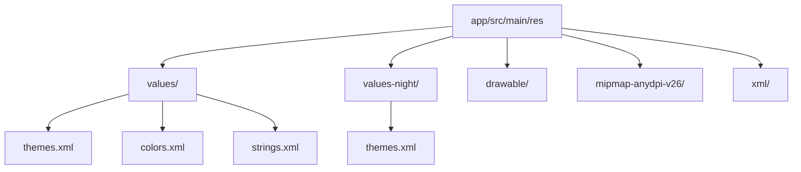
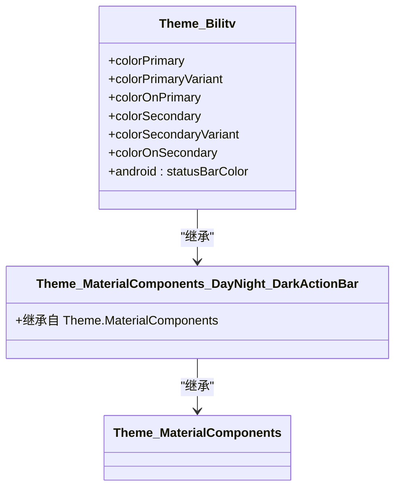

# 核心功能详解

<cite>
**本文档引用的文件**  
- [themes.xml](file://app/src/main/res/values/themes.xml)
- [themes.xml](file://app/src/main/res/values-night/themes.xml)
- [colors.xml](file://app/src/main/res/values/colors.xml)
- [strings.xml](file://app/src/main/res/values/strings.xml)
- [AndroidManifest.xml](file://app/src/main/AndroidManifest.xml)
- [values-zh-rCN.xml](file://app/build/intermediates/incremental/debug/mergeDebugResources/merged.dir/values-zh-rCN/values-zh-rCN.xml)
</cite>

## 目录
1. [项目结构](#项目结构)
2. [主题系统实现机制](#主题系统实现机制)
3. [颜色资源与设计系统](#颜色资源与设计系统)
4. [多语言字符串管理](#多语言字符串管理)
5. [资源限定符与国际化](#资源限定符与国际化)
6. [主题应用流程分析](#主题应用流程分析)
7. [扩展新主题与语言资源](#扩展新主题与语言资源)

## 项目结构

项目采用标准的 Android 应用结构，资源文件集中存放在 `app/src/main/res` 目录下，通过不同的资源目录限定符实现主题切换和多语言支持。

**图示来源**  
- [themes.xml](file://app/src/main/res/values/themes.xml)
- [themes.xml](file://app/src/main/res/values-night/themes.xml)

**本节来源**  
- [app/src/main/res](file://app/src/main/res)

## 主题系统实现机制

bilitv 项目通过 Android 的资源限定符机制实现了浅色主题与深色主题的自动切换。系统根据设备的当前显示模式自动选择合适的主题资源。

### 浅色主题与深色主题的继承关系

项目定义了两个 `themes.xml` 文件，分别位于 `values` 和 `values-night` 目录下，它们共享相同的主题名称 `Theme.Bilitv`，但配置了不同的颜色值。

浅色主题（`values/themes.xml`）继承自 `Theme.MaterialComponents.DayNight.DarkActionBar`，这是 Material Design 提供的基类主题，支持日/夜模式的自动切换。该主题主要配置了应用的主色调、次色调以及状态栏颜色。

深色主题（`values-night/themes.xml`）与浅色主题使用相同的父主题，但对部分颜色属性进行了重写，以适应暗色背景下的视觉效果。通过对比两个文件，可以发现 `colorPrimary` 从 `@color/purple_500` 变为 `@color/purple_200`，`colorOnPrimary` 从白色变为黑色，这些调整确保了在深色背景下文字和图标的可读性。

### 主题差异化配置

两个主题文件在颜色配置上存在明显差异：

- **主色调**：浅色主题使用较深的紫色 (`purple_500`)，而深色主题使用较浅的紫色 (`purple_200`)，以提高在暗背景上的可见度
- **文字颜色**：浅色主题上使用白色文字，深色主题上使用黑色文字，遵循了高对比度的设计原则
- **次色调变体**：深色主题中 `colorSecondaryVariant` 从 `teal_700` 变为 `teal_200`，使次要元素在暗背景下更加突出

这种设计模式遵循了 Material Design 的指导原则，确保了应用在不同光照条件下的可用性和美观性。

**本节来源**  
- [themes.xml](file://app/src/main/res/values/themes.xml)
- [themes.xml](file://app/src/main/res/values-night/themes.xml)

## 颜色资源与设计系统

颜色资源在 `colors.xml` 文件中集中定义，采用语义化的命名规范，体现了设计系统的一致性原则。

### 颜色命名规范

项目中的颜色命名遵循了 Material Design 的命名约定，使用 `颜色名称_色调深度` 的格式：

- `purple_200`, `purple_500`, `purple_700`：表示紫色调的不同深度，数字越大颜色越深
- `teal_200`, `teal_700`：表示青绿色调的不同深度
- `black`, `white`：基础黑白颜色

这种命名方式不仅清晰地表达了颜色的视觉特征，还便于在不同组件间保持颜色使用的一致性。开发者可以很容易地理解每个颜色的用途和视觉层级。

### 设计系统一致性

通过将颜色定义为可重用的资源，项目实现了设计系统的一致性：

- 主题配置直接引用这些颜色资源，确保了整个应用的视觉统一
- 颜色值集中管理，便于后续的设计调整和品牌更新
- 遵循了 Material Design 的色彩系统，保证了与 Android 平台的视觉协调

这种资源化的设计方法提高了开发效率，降低了维护成本，是现代 Android 应用开发的最佳实践。

**本节来源**  
- [colors.xml](file://app/src/main/res/values/colors.xml)

## 多语言字符串管理

字符串资源通过 `strings.xml` 文件进行管理，支持多语言环境下的文本显示。

### 字符串定义与引用

项目在 `values/strings.xml` 中定义了基本的字符串资源，如应用名称 `app_name`。这些字符串在代码和布局文件中通过 `@string/` 引用语法使用。

例如，在 `AndroidManifest.xml` 中，应用名称通过 `android:label="@string/app_name"` 引用，这种方式实现了文本内容与代码逻辑的分离，便于后续的本地化工作。

### 多语言支持

虽然项目主目录只包含默认的字符串资源，但构建系统生成了多个语言变体的资源文件，表明项目具备多语言支持能力。通过分析构建输出，可以发现系统自动生成了包括中文（`zh-rCN`）、香港繁体（`zh-rHK`）和台湾繁体（`zh-rTW`）在内的多种语言资源。

**本节来源**  
- [strings.xml](file://app/src/main/res/values/strings.xml)
- [AndroidManifest.xml](file://app/src/main/AndroidManifest.xml)

## 资源限定符与国际化

Android 的资源限定符机制是实现主题切换和多语言支持的核心技术。

### 资源限定符工作原理

资源限定符是附加在资源目录名称后的特殊后缀，用于指定该目录下的资源适用的设备配置。系统在运行时根据当前设备的状态自动选择最匹配的资源目录。

- `values-night`：表示该目录下的资源适用于夜间模式
- `values-zh-rCN`：表示该目录下的资源适用于简体中文（中国）环境
- `values-en-rUS`：表示该目录下的资源适用于英语（美国）环境

当应用请求某个资源时，Android 资源系统会按照优先级顺序搜索匹配的资源目录，选择最合适的资源文件。这种机制无需修改代码即可实现界面的动态适应。

### 国际化支持意义

资源限定符对国际化支持具有重要意义：

- **无缝切换**：用户更改系统语言后，应用自动加载对应语言的字符串资源
- **区域适配**：支持不同地区的语言变体，如中国大陆、香港、台湾的中文差异
- **维护简便**：每种语言的字符串独立管理，便于翻译和更新
- **扩展性强**：添加新语言只需创建相应的资源目录并提供翻译文件

这种基于配置的资源管理方式是 Android 平台国际化解决方案的核心，使得应用能够轻松覆盖全球市场。

**本节来源**  
- [values-zh-rCN.xml](file://app/build/intermediates/incremental/debug/mergeDebugResources/merged.dir/values-zh-rCN/values-zh-rCN.xml)

## 主题应用流程分析

主题的应用流程从 `AndroidManifest.xml` 开始，贯穿整个应用的生命周期。

### 主题初始化

在 `AndroidManifest.xml` 中，应用级别通过 `android:theme="@style/Theme.Bilitv"` 指定了默认主题。这个引用指向了在 `values/themes.xml` 中定义的主题样式。

当应用启动时，Android 系统会：
1. 检测当前设备的主题偏好（浅色或深色模式）
2. 根据偏好选择 `values` 或 `values-night` 目录下的 `themes.xml`
3. 加载相应的主题配置并应用到整个应用

### 主题继承链

通过分析构建输出，可以确定主题的完整继承链：

**图示来源**  
- [themes.xml](file://app/src/main/res/values/themes.xml)
- [themes.xml](file://app/src/main/res/values-night/themes.xml)

**本节来源**  
- [AndroidManifest.xml](file://app/src/main/AndroidManifest.xml)

## 扩展新主题与语言资源

开发者可以遵循现有模式轻松扩展新的主题或语言资源。

### 添加新主题

要添加新的主题变体，可以创建相应的资源目录：

1. 创建 `values-<qualifier>` 目录，如 `values-large` 用于大屏幕设备
2. 在新目录中复制 `themes.xml` 文件
3. 根据需要调整主题属性

例如，可以创建 `values-contrast-high` 目录来支持高对比度主题，满足无障碍访问需求。

### 添加新语言

添加新语言资源的步骤：

1. 创建语言特定的资源目录，如 `values-es` 用于西班牙语
2. 在目录中创建 `strings.xml` 文件
3. 复制默认字符串文件的内容
4. 将所有字符串值翻译为目标语言

对于地区变体，可以使用更具体的限定符，如 `values-es-rES`（西班牙西班牙语）或 `values-es-rMX`（墨西哥西班牙语）。

这种模块化的资源管理方式使得国际化和主题定制变得简单高效，是 Android 应用开发的重要优势。

**本节来源**  
- [themes.xml](file://app/src/main/res/values/themes.xml)
- [strings.xml](file://app/src/main/res/values/strings.xml)