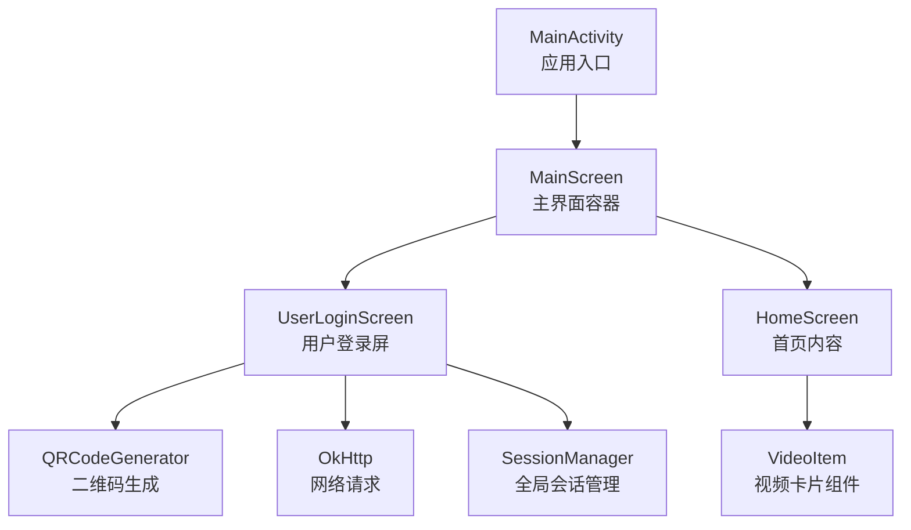
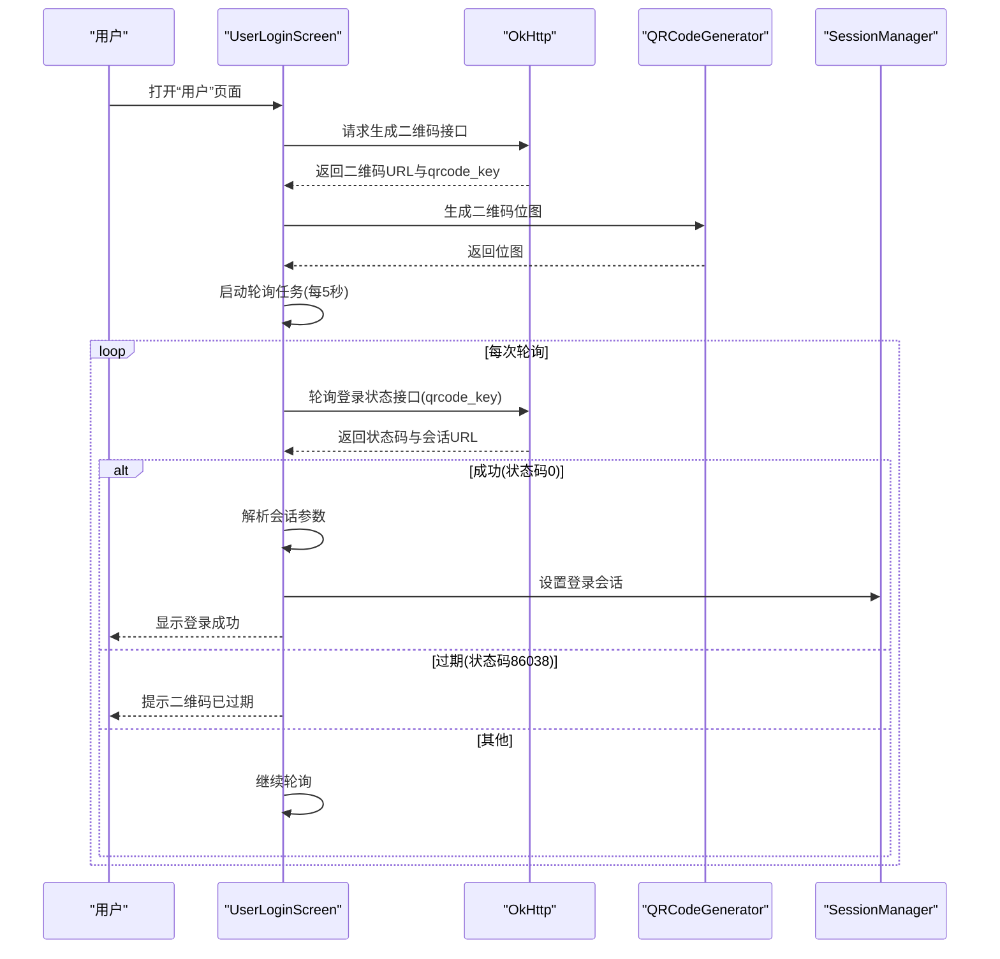
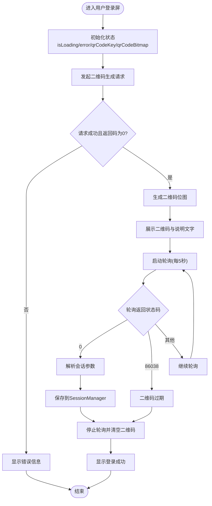
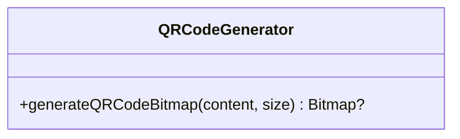
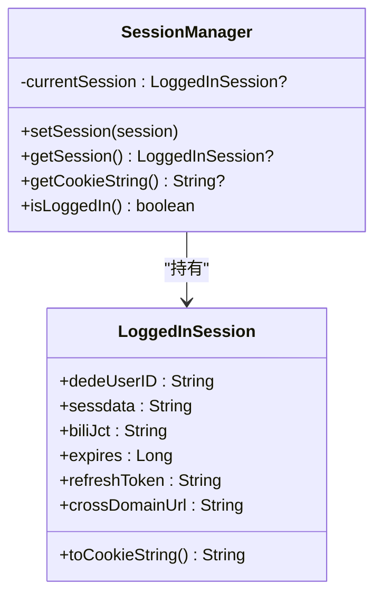
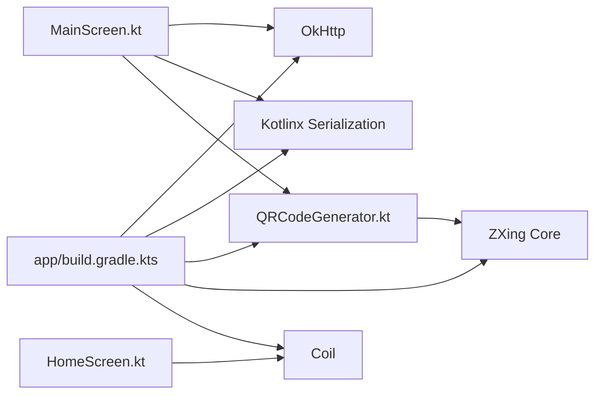

# 用户登录二维码功能

<cite>
**本文引用的文件**
- [MainActivity.kt](file://app/src/main/java/com/bili/bilitv/MainActivity.kt)
- [MainScreen.kt](file://app/src/main/java/com/bili/bilitv/MainScreen.kt)
- [HomeScreen.kt](file://app/src/main/java/com/bili/bilitv/HomeScreen.kt)
- [QRCodeGenerator.kt](file://app/src/main/java/com/bili/bilitv/utils/QRCodeGenerator.kt)
- [VideoItem.kt](file://app/src/main/java/com/bili/bilitv/VideoItem.kt)
- [AndroidManifest.xml](file://app/src/main/AndroidManifest.xml)
- [app/build.gradle.kts](file://app/build.gradle.kts)
- [settings.gradle.kts](file://app/settings.gradle.kts)
- [strings.xml](file://app/src/main/res/values/strings.xml)
- [colors.xml](file://app/src/main/res/values/colors.xml)
- [themes.xml](file://app/src/main/res/values/themes.xml)
</cite>

## 目录
1. [简介](#简介)
2. [项目结构](#项目结构)
3. [核心组件](#核心组件)
4. [架构总览](#架构总览)
5. [详细组件分析](#详细组件分析)
6. [依赖分析](#依赖分析)
7. [性能考虑](#性能考虑)
8. [故障排查指南](#故障排查指南)
9. [结论](#结论)

## 简介
本文件聚焦于“用户登录二维码功能”的完整实现与交互流程，涵盖从生成二维码、轮询登录状态、解析会话信息到保存全局会话的全过程。该功能基于 Jetpack Compose 构建，使用 OkHttp 发起网络请求，ZXing 生成二维码位图，并通过全局会话管理器持久化登录态。

## 项目结构
- 应用入口为 Activity，使用 Compose 渲染界面。
- 主界面包含侧边导航与右侧内容区域；用户登录位于“用户”导航项下。
- 登录流程在用户登录屏中完成：生成二维码、定时轮询、解析登录结果并保存会话。
- 工具类负责将登录链接转换为二维码位图。

图表来源
- [MainActivity.kt](file://app/src/main/java/com/bili/bilitv/MainActivity.kt#L1-L30)
- [MainScreen.kt](file://app/src/main/java/com/bili/bilitv/MainScreen.kt#L127-L301)
- [QRCodeGenerator.kt](file://app/src/main/java/com/bili/bilitv/utils/QRCodeGenerator.kt#L1-L31)
- [HomeScreen.kt](file://app/src/main/java/com/bili/bilitv/HomeScreen.kt#L80-L141)
- [VideoItem.kt](file://app/src/main/java/com/bili/bilitv/VideoItem.kt#L1-L132)

章节来源
- [MainActivity.kt](file://app/src/main/java/com/bili/bilitv/MainActivity.kt#L1-L30)
- [MainScreen.kt](file://app/src/main/java/com/bili/bilitv/MainScreen.kt#L127-L301)
- [HomeScreen.kt](file://app/src/main/java/com/bili/bilitv/HomeScreen.kt#L80-L141)
- [QRCodeGenerator.kt](file://app/src/main/java/com/bili/bilitv/utils/QRCodeGenerator.kt#L1-L31)
- [VideoItem.kt](file://app/src/main/java/com/bili/bilitv/VideoItem.kt#L1-L132)

## 核心组件
- 用户登录屏（UserLoginScreen）
  - 负责发起二维码生成请求、渲染二维码位图、定时轮询登录状态、解析登录结果并保存会话。
- 二维码生成器（QRCodeGenerator）
  - 将登录链接转换为位图，供 UI 展示。
- 全局会话管理器（SessionManager）
  - 提供登录态的设置、读取、Cookie 字符串生成与登录状态判断。
- 主界面容器（MainScreen）
  - 组织导航与内容区域，承载用户登录屏与其他页面。
- 首页内容（HomeScreen）
  - 展示视频列表，作为登录后的默认内容区域之一。

章节来源
- [MainScreen.kt](file://app/src/main/java/com/bili/bilitv/MainScreen.kt#L127-L301)
- [QRCodeGenerator.kt](file://app/src/main/java/com/bili/bilitv/utils/QRCodeGenerator.kt#L1-L31)
- [HomeScreen.kt](file://app/src/main/java/com/bili/bilitv/HomeScreen.kt#L80-L141)

## 架构总览
用户登录二维码功能采用“Compose 声明式 UI + 协程异步 + OkHttp 网络 + ZXing 二维码生成 + 全局会话管理”的组合架构。整体流程如下：

图表来源
- [MainScreen.kt](file://app/src/main/java/com/bili/bilitv/MainScreen.kt#L156-L301)
- [QRCodeGenerator.kt](file://app/src/main/java/com/bili/bilitv/utils/QRCodeGenerator.kt#L1-L31)

## 详细组件分析

### 用户登录屏（UserLoginScreen）
- 功能职责
  - 初始化时触发一次二维码生成请求。
  - 在获得二维码后，启动定时轮询以检测登录状态。
  - 根据轮询结果更新 UI：显示二维码、错误提示或登录成功信息。
  - 登录成功后，解析会话参数并写入全局会话管理器。
- 关键数据结构
  - 二维码响应模型：包含二维码 URL 与 qrcode_key。
  - 轮询响应模型：包含状态码、会话 URL、刷新令牌等。
  - 登录会话模型：包含用户标识、SESSDATA、bili_jct、过期时间、刷新令牌、跨域 URL 等。
- 错误处理
  - 对网络异常、HTTP 失败、API 返回非成功状态进行错误提示。
  - 二维码过期时停止轮询并清理 UI。
- 性能与并发
  - 网络请求在 IO 线程执行，二维码生成在默认线程池执行，避免阻塞 UI。
  - 轮询间隔固定为 5 秒，使用协程控制生命周期，避免泄漏。

图表来源
- [MainScreen.kt](file://app/src/main/java/com/bili/bilitv/MainScreen.kt#L156-L301)

章节来源
- [MainScreen.kt](file://app/src/main/java/com/bili/bilitv/MainScreen.kt#L156-L301)

### 二维码生成器（QRCodeGenerator）
- 功能职责
  - 将登录链接编码为二维码位图，支持自定义尺寸与字符集。
- 实现要点
  - 使用 ZXing 的 QRCodeWriter 生成矩阵，再转换为像素数组并创建 Bitmap。
  - 异常捕获，失败时返回空值，避免崩溃。
- 性能与复杂度
  - 时间复杂度与二维码尺寸成正比；默认尺寸为 512，可按需调整。
  - 使用枚举映射设置编码提示，保证生成质量。

图表来源
- [QRCodeGenerator.kt](file://app/src/main/java/com/bili/bilitv/utils/QRCodeGenerator.kt#L1-L31)

章节来源
- [QRCodeGenerator.kt](file://app/src/main/java/com/bili/bilitv/utils/QRCodeGenerator.kt#L1-L31)

### 全局会话管理器（SessionManager）
- 功能职责
  - 存储当前登录会话，提供会话读取、Cookie 字符串生成与登录状态判断。
- 设计要点
  - 单例对象，内部持有可空会话实例。
  - 提供安全访问方法，避免空指针。
- 使用场景
  - 登录成功后写入会话；后续网络请求可直接使用 Cookie 字符串。

图表来源
- [MainScreen.kt](file://app/src/main/java/com/bili/bilitv/MainScreen.kt#L69-L102)

章节来源
- [MainScreen.kt](file://app/src/main/java/com/bili/bilitv/MainScreen.kt#L69-L102)

### 主界面容器（MainScreen）与导航
- 功能职责
  - 提供侧边导航与内容区域布局，承载首页与用户登录屏。
- 导航路由
  - 包含首页、分类、动态、直播、用户、设置等路由。
  - 用户路由指向用户登录屏。
- 交互细节
  - 使用 NavigationRail 与按钮动画增强交互体验。

章节来源
- [MainScreen.kt](file://app/src/main/java/com/bili/bilitv/MainScreen.kt#L118-L153)
- [MainScreen.kt](file://app/src/main/java/com/bili/bilitv/MainScreen.kt#L302-L416)

### 首页内容（HomeScreen）与视频组件（VideoItem）
- 功能职责
  - 首页包含三个 Tab（推荐、动态、热门），热门 Tab 通过网络请求获取数据。
  - 视频列表使用 LazyVerticalGrid 布局，VideoItem 组件展示封面、标题、作者与播放量等信息。
- 数据模型
  - Video 数据类用于 UI 绑定。
- 性能优化
  - 使用 Coil 加载图片，懒加载网格提升滚动性能。

章节来源
- [HomeScreen.kt](file://app/src/main/java/com/bili/bilitv/HomeScreen.kt#L80-L141)
- [VideoItem.kt](file://app/src/main/java/com/bili/bilitv/VideoItem.kt#L1-L132)

## 依赖分析
- 网络与序列化
  - OkHttp：发起 HTTP 请求，支持同步/异步与协程上下文切换。
  - Kotlinx Serialization：JSON 解析，忽略未知字段以增强兼容性。
- UI 与图像
  - Jetpack Compose：声明式 UI，配合 Material3 组件。
  - Coil：异步图片加载。
  - ZXing：二维码生成。
- 构建与插件
  - Gradle 插件：Android Application、Kotlin、Compose、Serialization。
  - 依赖版本：compileSdk/targetSdk/minSdk、Java/Kotlin 版本等。

图表来源
- [MainScreen.kt](file://app/src/main/java/com/bili/bilitv/MainScreen.kt#L156-L301)
- [HomeScreen.kt](file://app/src/main/java/com/bili/bilitv/HomeScreen.kt#L80-L141)
- [QRCodeGenerator.kt](file://app/src/main/java/com/bili/bilitv/utils/QRCodeGenerator.kt#L1-L31)
- [app/build.gradle.kts](file://app/build.gradle.kts#L45-L66)

章节来源
- [app/build.gradle.kts](file://app/build.gradle.kts#L45-L66)
- [settings.gradle.kts](file://app/settings.gradle.kts#L1-L24)

## 性能考虑
- 线程与协程
  - 网络请求在 IO 线程执行，二维码生成在默认线程池执行，避免阻塞主线程。
  - 轮询使用协程延迟，结合 isActive 控制生命周期，防止泄漏。
- UI 渲染
  - 使用 Compose 的 remember 与状态管理减少重组。
  - 图片懒加载与网格布局提升滚动性能。
- 资源与内存
  - 二维码位图尺寸可调，默认 512；根据设备性能与需求调整。
  - 登录成功后及时停止轮询，释放资源。

## 故障排查指南
- 无法加载二维码
  - 检查网络权限与 HTTPS 访问是否受限。
  - 查看日志输出，确认生成接口返回码与 qrcode_key 是否存在。
- 轮询无响应
  - 确认 qrcode_key 是否正确传递至轮询接口。
  - 检查轮询开关与协程生命周期，确保未被提前取消。
- 二维码过期
  - 当状态码为特定过期码时，界面会提示过期并停止轮询；建议重新触发生成流程。
- 登录成功但会话无效
  - 检查解析逻辑是否正确提取会话参数，确认 SessionManager 已写入有效会话。
  - 如需携带 Cookie，请使用会话提供的 Cookie 字符串。

章节来源
- [MainScreen.kt](file://app/src/main/java/com/bili/bilitv/MainScreen.kt#L156-L301)
- [AndroidManifest.xml](file://app/src/main/AndroidManifest.xml#L1-L31)

## 结论
用户登录二维码功能通过清晰的模块划分与合理的异步处理，实现了从二维码生成到登录成功的完整闭环。其设计具备良好的扩展性：可替换二维码生成策略、接入更完善的错误处理与重试机制、以及在需要时将会话持久化至本地存储。对于后续迭代，建议增加二维码刷新机制、登录态有效期检查与自动续期能力，以进一步提升用户体验与安全性。