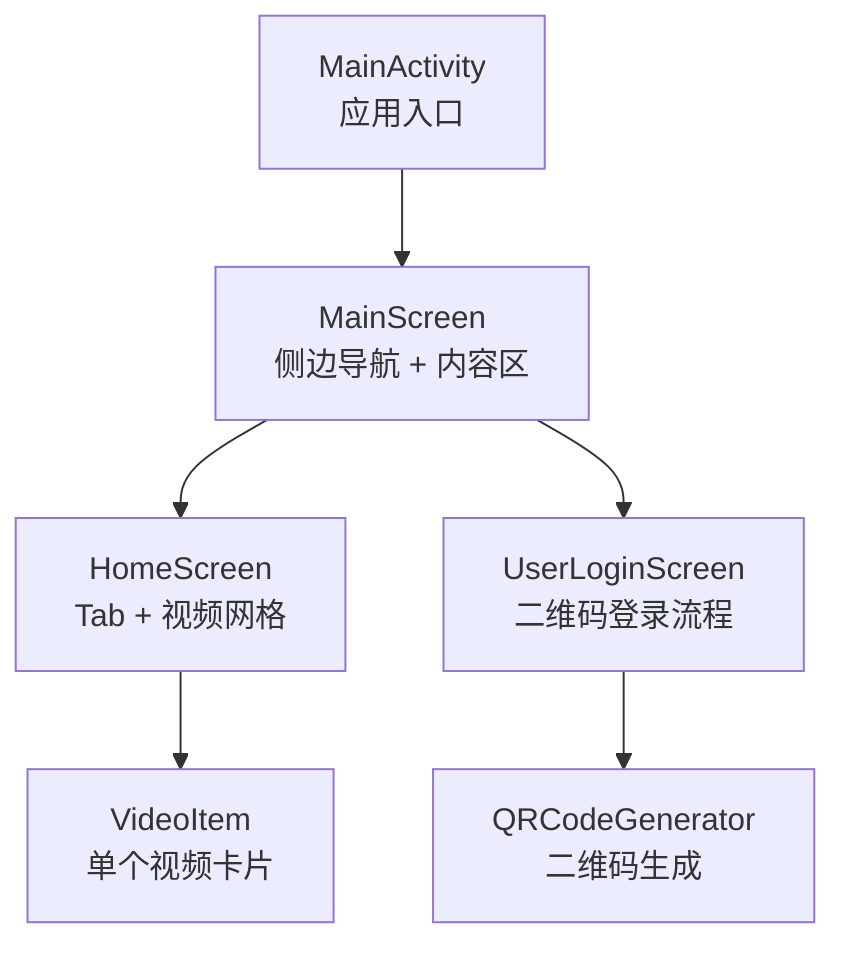
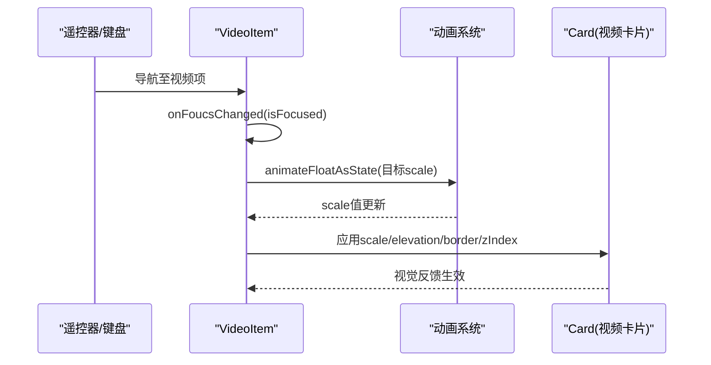
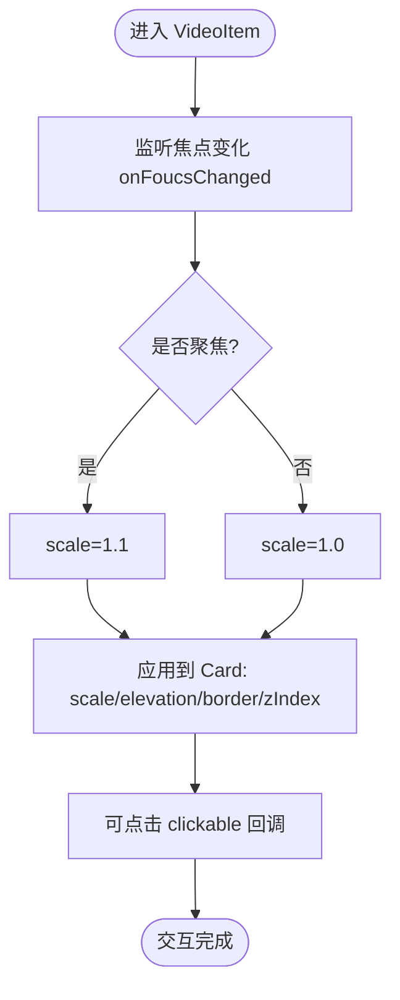
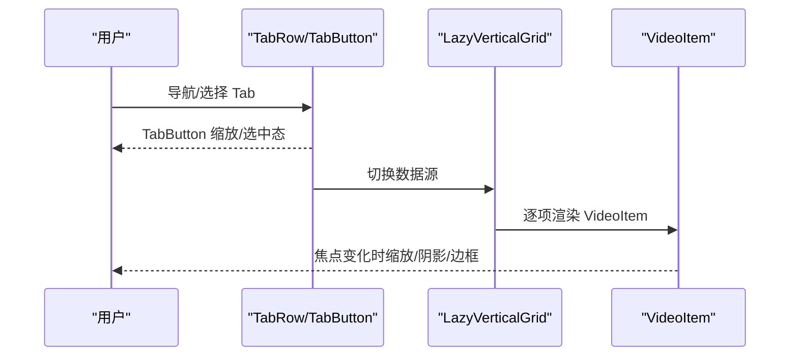
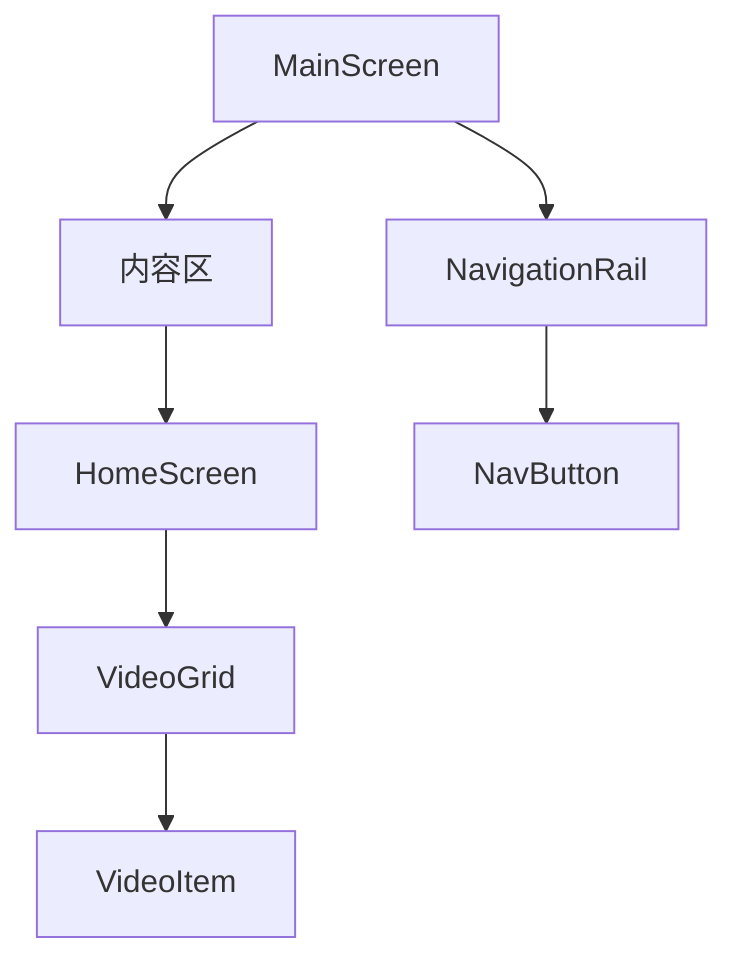
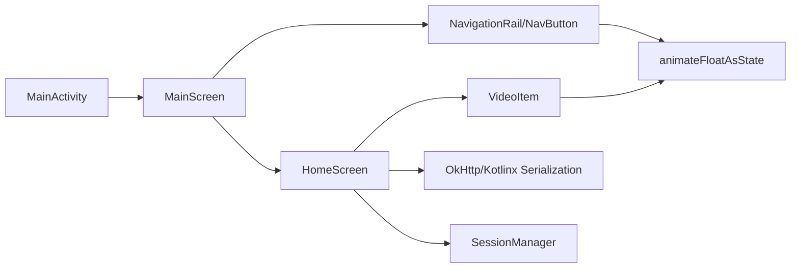

# 视频项焦点交互效果

<cite>
**本文引用的文件**
- [MainActivity.kt](file://app/src/main/java/com/bili/bilitv/MainActivity.kt)
- [MainScreen.kt](file://app/src/main/java/com/bili/bilitv/MainScreen.kt)
- [HomeScreen.kt](file://app/src/main/java/com/bili/bilitv/HomeScreen.kt)
- [VideoItem.kt](file://app/src/main/java/com/bili/bilitv/VideoItem.kt)
- [QRCodeGenerator.kt](file://app/src/main/java/com/bili/bilitv/utils/QRCodeGenerator.kt)
- [AndroidManifest.xml](file://app/src/main/AndroidManifest.xml)
- [themes.xml](file://app/src/main/res/values/themes.xml)
- [colors.xml](file://app/src/main/res/values/colors.xml)
</cite>

## 目录
1. [简介](#简介)
2. [项目结构](#项目结构)
3. [核心组件](#核心组件)
4. [架构总览](#架构总览)
5. [详细组件分析](#详细组件分析)
6. [依赖关系分析](#依赖关系分析)
7. [性能考量](#性能考量)
8. [故障排查指南](#故障排查指南)
9. [结论](#结论)

## 简介
本文件聚焦于“视频项焦点交互效果”的实现与设计，围绕视频网格中的视频项组件如何在遥控器或键盘导航下获得焦点时产生缩放、阴影、边框等视觉反馈，并结合整体页面的导航与焦点链路进行说明。文档基于仓库中实际源码进行分析，避免直接展示代码片段，通过路径引用的方式提供可追溯的信息来源。

## 项目结构
该项目采用 Jetpack Compose 构建的 Android 应用，入口为 Activity，顶层容器为 MainScreen，其中包含侧边导航与内容区；内容区在不同路由下渲染不同的页面，首页 HomeScreen 展示视频网格，网格中的每一项由 VideoItem 组件构成。

图表来源
- [MainActivity.kt](file://app/src/main/java/com/bili/bilitv/MainActivity.kt#L1-L30)
- [MainScreen.kt](file://app/src/main/java/com/bili/bilitv/MainScreen.kt#L127-L153)
- [HomeScreen.kt](file://app/src/main/java/com/bili/bilitv/HomeScreen.kt#L80-L151)
- [VideoItem.kt](file://app/src/main/java/com/bili/bilitv/VideoItem.kt#L47-L125)
- [QRCodeGenerator.kt](file://app/src/main/java/com/bili/bilitv/utils/QRCodeGenerator.kt#L1-L31)

章节来源
- [MainActivity.kt](file://app/src/main/java/com/bili/bilitv/MainActivity.kt#L1-L30)
- [MainScreen.kt](file://app/src/main/java/com/bili/bilitv/MainScreen.kt#L127-L153)
- [HomeScreen.kt](file://app/src/main/java/com/bili/bilitv/HomeScreen.kt#L80-L151)
- [VideoItem.kt](file://app/src/main/java/com/bili/bilitv/VideoItem.kt#L47-L125)
- [QRCodeGenerator.kt](file://app/src/main/java/com/bili/bilitv/utils/QRCodeGenerator.kt#L1-L31)

## 核心组件
- VideoItem：单个视频卡片组件，负责在获得焦点时执行缩放、阴影、边框等视觉反馈。
- HomeScreen：首页容器，包含 Tab 切换与视频网格，网格内使用 VideoItem 渲染视频项。
- MainScreen：顶层布局，左侧为导航栏，右侧为内容区，HomeScreen 在此处被作为内容区之一。
- MainActivity：应用入口，设置 Compose 主题与 Surface，承载 MainScreen。

章节来源
- [VideoItem.kt](file://app/src/main/java/com/bili/bilitv/VideoItem.kt#L47-L125)
- [HomeScreen.kt](file://app/src/main/java/com/bili/bilitv/HomeScreen.kt#L80-L151)
- [MainScreen.kt](file://app/src/main/java/com/bili/bilitv/MainScreen.kt#L127-L153)
- [MainActivity.kt](file://app/src/main/java/com/bili/bilitv/MainActivity.kt#L1-L30)

## 架构总览
从遥控器/键盘导航的角度看，焦点链路自上而下：
- MainActivity 设置主题与 Surface，承载 MainScreen。
- MainScreen 提供侧边导航与内容区，HomeScreen 作为内容区之一。
- HomeScreen 的视频网格 LazyVerticalGrid 中的每个 VideoItem 可获得焦点。
- VideoItem 通过 onFoucsChanged 记录焦点状态，并驱动动画缩放、阴影与边框变化。

图表来源
- [VideoItem.kt](file://app/src/main/java/com/bili/bilitv/VideoItem.kt#L53-L68)
- [VideoItem.kt](file://app/src/main/java/com/bili/bilitv/VideoItem.kt#L54-L55)

章节来源
- [MainActivity.kt](file://app/src/main/java/com/bili/bilitv/MainActivity.kt#L15-L28)
- [MainScreen.kt](file://app/src/main/java/com/bili/bilitv/MainScreen.kt#L127-L153)
- [HomeScreen.kt](file://app/src/main/java/com/bili/bilitv/HomeScreen.kt#L221-L246)
- [VideoItem.kt](file://app/src/main/java/com/bili/bilitv/VideoItem.kt#L47-L125)

## 详细组件分析

### VideoItem 组件：焦点交互与视觉反馈
VideoItem 是视频网格中的单个卡片，其交互效果围绕“焦点”展开：
- 焦点状态记录：通过 onFoucsChanged 监听焦点变化，使用 remember 与 mutableStateOf 维护 isFocused。
- 缩放动画：animateFloatAsState 将 scale 值在聚焦与非聚焦之间平滑过渡。
- 层级与阴影：聚焦时提升 zIndex 并增大 Card 的 elevation，使卡片在网格中“浮出”。
- 边框强调：聚焦时添加边框，增强可识别性。
- 点击行为：提供 onClick 回调，支持遥控器确认键触发。

图表来源
- [VideoItem.kt](file://app/src/main/java/com/bili/bilitv/VideoItem.kt#L53-L68)
- [VideoItem.kt](file://app/src/main/java/com/bili/bilitv/VideoItem.kt#L54-L55)

章节来源
- [VideoItem.kt](file://app/src/main/java/com/bili/bilitv/VideoItem.kt#L47-L125)

### HomeScreen：网格与 Tab 的焦点链路
HomeScreen 负责：
- TabRow 与 TabButton：Tab 按钮同样具备 onFoucsChanged 与缩放动画，保证 Tab 交互的一致性。
- LazyVerticalGrid：固定列数的网格，内部使用 VideoItem 渲染视频项。
- 数据来源：根据当前 Tab 加载热门视频或本地模拟数据。

图表来源
- [HomeScreen.kt](file://app/src/main/java/com/bili/bilitv/HomeScreen.kt#L135-L151)
- [HomeScreen.kt](file://app/src/main/java/com/bili/bilitv/HomeScreen.kt#L156-L216)
- [HomeScreen.kt](file://app/src/main/java/com/bili/bilitv/HomeScreen.kt#L221-L246)
- [HomeScreen.kt](file://app/src/main/java/com/bili/bilitv/HomeScreen.kt#L248-L279)

章节来源
- [HomeScreen.kt](file://app/src/main/java/com/bili/bilitv/HomeScreen.kt#L80-L151)
- [HomeScreen.kt](file://app/src/main/java/com/bili/bilitv/HomeScreen.kt#L156-L216)
- [HomeScreen.kt](file://app/src/main/java/com/bili/bilitv/HomeScreen.kt#L221-L246)
- [HomeScreen.kt](file://app/src/main/java/com/bili/bilitv/HomeScreen.kt#L248-L279)

### MainScreen：导航与内容区
MainScreen 提供左侧 NavigationRail 与右侧内容区，HomeScreen 作为内容区之一被渲染。导航按钮 NavButton 同样具备 onFoucsChanged 与缩放动画，确保整体导航链路一致。

图表来源
- [MainScreen.kt](file://app/src/main/java/com/bili/bilitv/MainScreen.kt#L127-L153)
- [MainScreen.kt](file://app/src/main/java/com/bili/bilitv/MainScreen.kt#L302-L416)
- [HomeScreen.kt](file://app/src/main/java/com/bili/bilitv/HomeScreen.kt#L221-L246)
- [VideoItem.kt](file://app/src/main/java/com/bili/bilitv/VideoItem.kt#L47-L125)

章节来源
- [MainScreen.kt](file://app/src/main/java/com/bili/bilitv/MainScreen.kt#L127-L153)
- [MainScreen.kt](file://app/src/main/java/com/bili/bilitv/MainScreen.kt#L302-L416)

### MainActivity：应用入口与主题
MainActivity 仅负责设置 Compose 主题与 Surface，承载 MainScreen。该层不涉及焦点逻辑，但为后续交互提供统一的背景与色彩方案。

章节来源
- [MainActivity.kt](file://app/src/main/java/com/bili/bilitv/MainActivity.kt#L1-L30)

## 依赖关系分析
- VideoItem 依赖 Material3 的 Card、Typography、颜色方案，以及动画系统 animateFloatAsState。
- HomeScreen 依赖 OkHttp 与 Kotlinx Serialization 进行网络请求，同时依赖 SessionManager 获取登录态。
- MainScreen 依赖 NavigationRail 与 NavButton，NavButton 与 VideoItem 的交互风格保持一致。
- MainActivity 依赖 AndroidManifest 的主题与网络权限声明。

图表来源
- [MainActivity.kt](file://app/src/main/java/com/bili/bilitv/MainActivity.kt#L1-L30)
- [MainScreen.kt](file://app/src/main/java/com/bili/bilitv/MainScreen.kt#L127-L153)
- [HomeScreen.kt](file://app/src/main/java/com/bili/bilitv/HomeScreen.kt#L80-L151)
- [VideoItem.kt](file://app/src/main/java/com/bili/bilitv/VideoItem.kt#L47-L125)

章节来源
- [MainActivity.kt](file://app/src/main/java/com/bili/bilitv/MainActivity.kt#L1-L30)
- [MainScreen.kt](file://app/src/main/java/com/bili/bilitv/MainScreen.kt#L127-L153)
- [HomeScreen.kt](file://app/src/main/java/com/bili/bilitv/HomeScreen.kt#L80-L151)
- [VideoItem.kt](file://app/src/main/java/com/bili/bilitv/VideoItem.kt#L47-L125)

## 性能考量
- 动画与状态：VideoItem 的 scale 与 elevation 变化由 animateFloatAsState 驱动，建议保持动画时长与目标值合理，避免过度频繁的状态切换导致卡顿。
- 网络与渲染：HomeScreen 在热门 Tab 下发起网络请求并解析 JSON，注意在 IO 线程执行网络请求，避免阻塞主线程。
- 图片加载：VideoItem 使用异步图片加载组件，建议在 TV 端使用合适的尺寸与占位图，减少内存抖动。
- 导航与层级：NavButton 与 VideoItem 的 zIndex 提升策略应避免过多层级叠加，以免影响渲染性能。

[本节为通用指导，无需列出具体文件来源]

## 故障排查指南
- 焦点未生效
  - 检查 VideoItem 是否正确绑定 onFoucsChanged，且父级容器允许焦点传递。
  - 确认 HomeScreen 的 LazyVerticalGrid 与 VideoItem 的 Modifier 链路未被覆盖焦点属性。
- 缩放/阴影无变化
  - 确认 animateFloatAsState 的目标值与 scale 应用位置正确。
  - 检查 Card 的 elevation 与 border 是否按 isFocused 条件更新。
- 登录态与热门视频
  - 若热门视频接口返回异常，检查 OkHttp 请求与 JSON 解析日志输出。
  - 确认 SessionManager 的 Cookie 字符串拼接正确，且请求头已携带 Cookie。
- 二维码登录
  - QRCodeGenerator 生成失败时，检查 ZXing 依赖与输入参数。
  - 用户登录成功后，SessionManager 应更新全局会话状态。

章节来源
- [VideoItem.kt](file://app/src/main/java/com/bili/bilitv/VideoItem.kt#L53-L68)
- [HomeScreen.kt](file://app/src/main/java/com/bili/bilitv/HomeScreen.kt#L86-L127)
- [MainScreen.kt](file://app/src/main/java/com/bili/bilitv/MainScreen.kt#L155-L300)
- [QRCodeGenerator.kt](file://app/src/main/java/com/bili/bilitv/utils/QRCodeGenerator.kt#L1-L31)

## 结论
本项目在 VideoItem 上实现了清晰的焦点交互效果：通过 onFoucsChanged 记录焦点状态，配合 animateFloatAsState 实现平滑缩放，同时提升 Card 的阴影与边框，最终在 TV 端提供明确的视觉反馈。HomeScreen 与 MainScreen 的导航组件也遵循相同的交互风格，形成一致的遥控器/键盘导航体验。若需进一步优化，可在动画时长、网络请求与图片加载方面做针对性调整，以提升流畅度与稳定性。