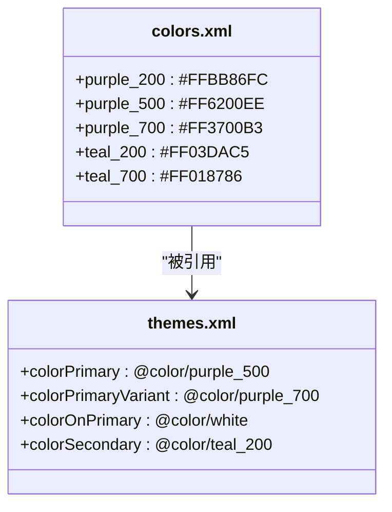
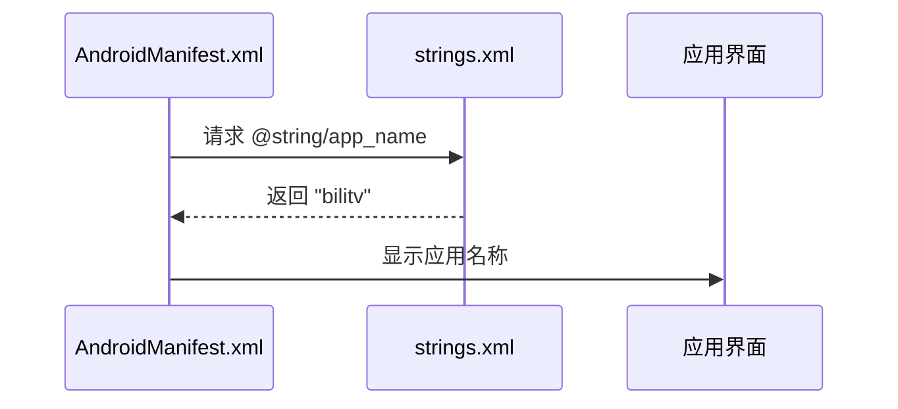

# 资源管理机制

<cite>
**本文档引用的文件**  
- [colors.xml](file://app/src/main/res/values/colors.xml)
- [strings.xml](file://app/src/main/res/values/strings.xml)
- [themes.xml](file://app/src/main/res/values/themes.xml)
- [themes.xml](file://app/src/main/res/values-night/themes.xml)
- [AndroidManifest.xml](file://app/src/main/AndroidManifest.xml)
</cite>

## 目录
1. [引言](#引言)
2. [颜色资源管理](#颜色资源管理)
3. [字符串资源管理](#字符串资源管理)
4. [资源引用与最佳实践](#资源引用与最佳实践)
5. [资源合并与优先级](#资源合并与优先级)
6. [常见问题与解决方案](#常见问题与解决方案)
7. [结论](#结论)

## 引言
bilitv 项目采用 Android 标准资源管理机制，通过集中化定义 colors.xml 和 strings.xml 实现 UI 一致性和多语言支持。本项目遵循 Material Design 色彩规范，利用主题系统实现日/夜模式切换，并通过资源限定符支持多语言和多设备适配。

**Section sources**
- [colors.xml](file://app/src/main/res/values/colors.xml)
- [strings.xml](file://app/src/main/res/values/strings.xml)

## 颜色资源管理

### 颜色命名规范与 Material Design 体系
项目中的颜色资源遵循 Material Design 的命名约定，采用 `颜色名称_色调值` 的格式，如 `purple_200`、`purple_500`。这种命名方式直接对应 Material Design 色彩体系中的色调等级：

- **purple_200**：较浅的紫色，用于高亮和强调元素
- **purple_500**：标准主色调，代表品牌主色
- **purple_700**：较深的紫色，用于深色背景上的文本或图标

这种分级系统允许在不同 UI 状态和主题模式下灵活选择合适的颜色变体。

### 主题中的颜色引用
颜色资源在主题中被系统性引用，实现品牌一致性。在 `themes.xml` 中，`colorPrimary` 属性引用 `@color/purple_500` 作为应用的主色调，`colorPrimaryVariant` 引用 `@color/purple_700` 作为辅助色。

**Diagram sources**
- [colors.xml](file://app/src/main/res/values/colors.xml#L3-L7)
- [themes.xml](file://app/src/main/res/values/themes.xml#L5-L9)

### 日/夜模式颜色适配
项目通过 `values-night` 资源目录实现夜间模式的颜色适配。在夜间主题中，主色调从 `purple_500` 变更为 `purple_200`，同时文本颜色从白色变为黑色，以适应暗色背景，提升可读性和视觉舒适度。

**Section sources**
- [colors.xml](file://app/src/main/res/values/colors.xml)
- [themes.xml](file://app/src/main/res/values/themes.xml)
- [themes.xml](file://app/src/main/res/values-night/themes.xml)

## 字符串资源管理

### 字符串定义与多语言适配
字符串资源在 `strings.xml` 中集中定义，采用 `name` 属性标识资源。当前项目定义了 `app_name` 字符串资源，值为 "bilitv"。这种集中管理方式便于维护和国际化。

项目构建系统生成了多个语言限定的资源文件（如 values-zh-rCN.xml、values-es.xml 等），为多语言适配提供了基础架构。通过为不同语言区域提供相应的 strings.xml 文件，应用可自动选择最适合用户语言环境的字符串资源。

### 字符串资源引用机制
字符串资源通过 `@string/资源名` 的语法在布局文件和代码中引用。在 `AndroidManifest.xml` 中，`android:label` 属性使用 `@string/app_name` 引用应用名称，确保应用标题与资源定义保持一致。

**Diagram sources**
- [strings.xml](file://app/src/main/res/values/strings.xml#L2)
- [AndroidManifest.xml](file://app/src/main/AndroidManifest.xml#L10)

**Section sources**
- [strings.xml](file://app/src/main/res/values/strings.xml)
- [AndroidManifest.xml](file://app/src/main/AndroidManifest.xml)

## 资源引用与最佳实践

### 避免硬编码
项目严格遵循避免硬编码的最佳实践，所有 UI 文本和颜色值均通过资源引用方式使用。这确保了设计一致性，便于全局修改，且支持多语言和主题切换。

### RTL 布局支持
在 `AndroidManifest.xml` 中，`android:supportsRtl="true"` 属性明确启用了对从右到左（RTL）布局的支持。当应用运行在支持 RTL 的语言环境中时，系统会自动调整布局方向，提升国际化用户体验。

**Section sources**
- [AndroidManifest.xml](file://app/src/main/AndroidManifest.xml#L12)

## 资源合并与优先级

### 资源合并机制
Android 构建系统会将主资源、库资源和构建变体资源合并。在 `build/intermediates/mergeDebugResources` 目录中生成的 `values.xml` 文件包含了所有合并后的资源定义。项目中的颜色和字符串资源会与 Material Design 库提供的资源进行合并。

### 资源优先级规则
当存在多个同名资源时，Android 遵循特定的优先级规则：
1. 构建变体资源（如 debug）优先级最高
2. 产品变种资源次之
3. 构建类型资源再次之
4. 主源集资源优先级最低

此外，更具体的资源限定符（如 `values-night-v8`）优先级高于通用限定符（如 `values-night`）。

**Section sources**
- [build/intermediates/mergeDebugResources](file://app/build/intermediates/mergeDebugResources)

## 常见问题与解决方案

### 资源加载错误
常见资源加载问题包括资源名称拼写错误、资源类型不匹配等。解决方案包括：
- 使用 Android Studio 的资源引用提示功能
- 在编译时检查资源引用的正确性
- 利用 Lint 工具检测未使用的资源

### 多语言适配问题
当特定语言的字符串资源缺失时，系统会回退到默认资源。为避免此问题，应确保所有界面文本都有对应的翻译资源，或使用工具检查资源完整性。

## 结论
bilitv 项目通过规范的资源管理策略，实现了良好的可维护性、可扩展性和国际化支持。颜色资源遵循 Material Design 规范，字符串资源支持多语言适配，所有资源引用均避免硬编码，符合 Android 开发最佳实践。通过合理的资源组织和引用机制，项目确保了 UI 的一致性并为未来的功能扩展奠定了坚实基础。