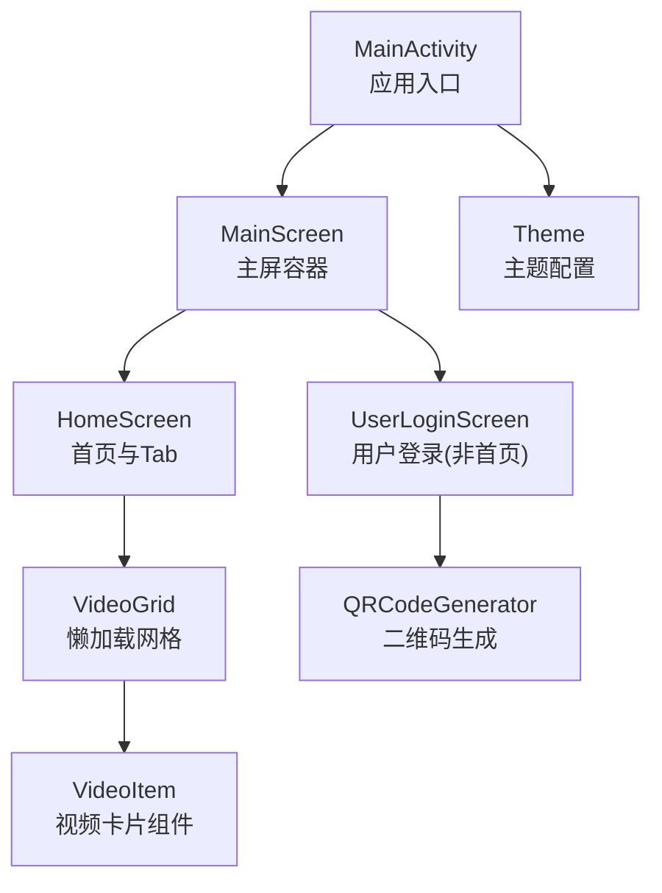
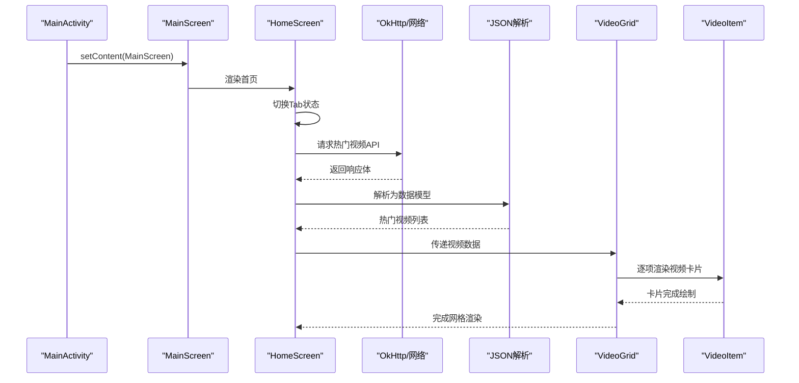
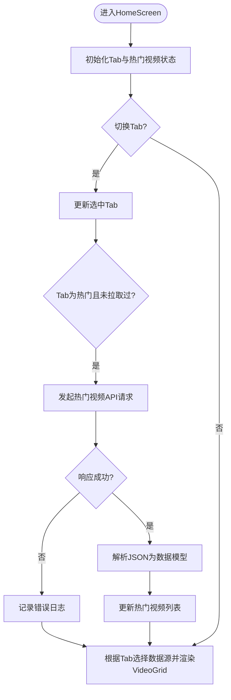
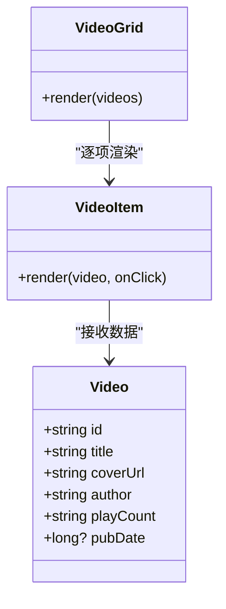
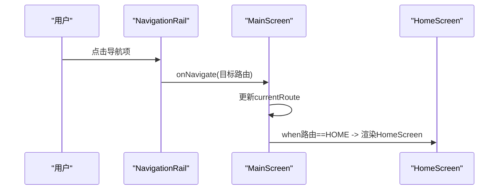
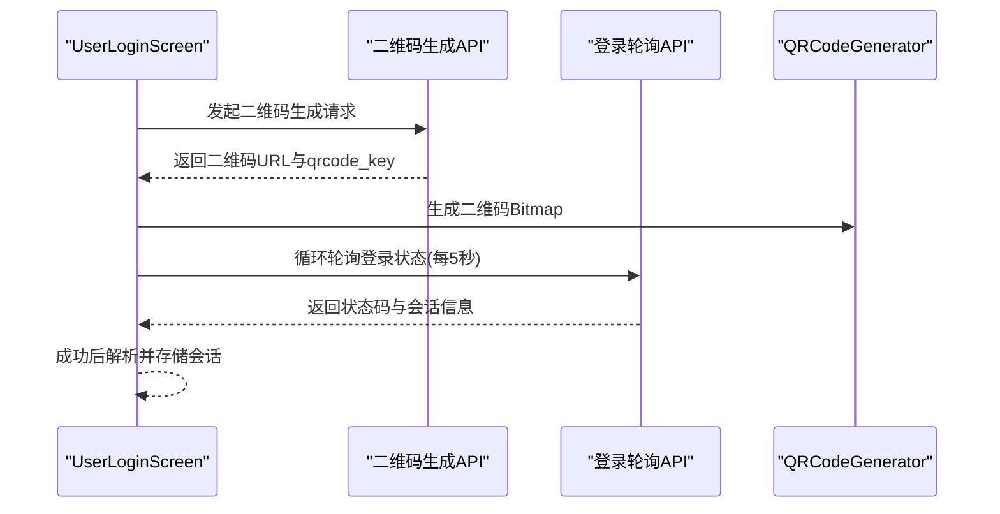
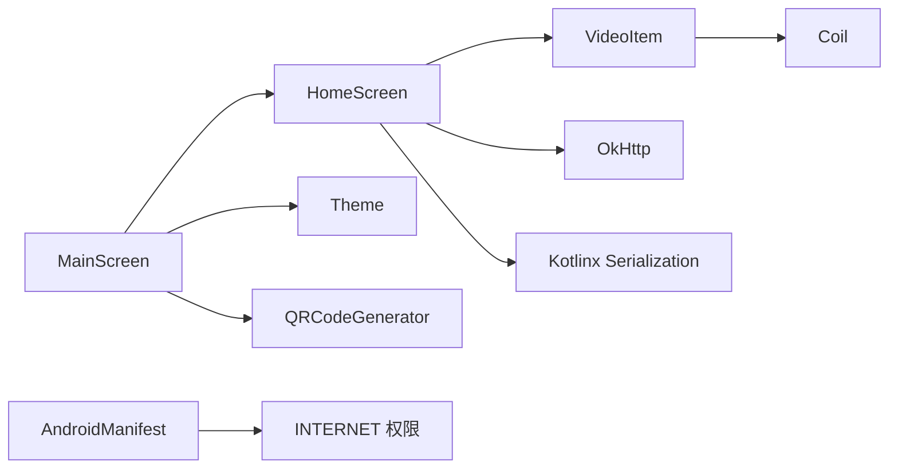

# 首页与视频列表实现

<cite>
**本文引用的文件**
- [MainActivity.kt](file://app/src/main/java/com/bili/bilitv/MainActivity.kt)
- [MainScreen.kt](file://app/src/main/java/com/bili/bilitv/MainScreen.kt)
- [HomeScreen.kt](file://app/src/main/java/com/bili/bilitv/HomeScreen.kt)
- [VideoItem.kt](file://app/src/main/java/com/bili/bilitv/VideoItem.kt)
- [Theme.kt](file://app/src/main/java/com/bili/bilitv/Theme.kt)
- [QRCodeGenerator.kt](file://app/src/main/java/com/bili/bilitv/utils/QRCodeGenerator.kt)
- [AndroidManifest.xml](file://app/src/main/AndroidManifest.xml)
- [app/build.gradle.kts](file://app/build.gradle.kts)
</cite>

## 目录
1. [简介](#简介)
2. [项目结构](#项目结构)
3. [核心组件](#核心组件)
4. [架构总览](#架构总览)
5. [详细组件分析](#详细组件分析)
6. [依赖分析](#依赖分析)
7. [性能考虑](#性能考虑)
8. [故障排查指南](#故障排查指南)
9. [结论](#结论)

## 简介
本文件聚焦于首页与视频列表的实现，涵盖以下要点：
- 首页包含顶部导航与底部标签页（推荐、动态、热门），以及视频网格列表。
- 热门标签页通过网络请求拉取B站热门视频数据，并在本地解析为可渲染的视频模型。
- 视频网格采用懒加载网格布局，支持多列展示；每个视频卡片包含封面、标题、UP主信息与播放量等。
- 应用主题基于Material3，支持明暗模式切换；登录页提供二维码登录流程（与首页视频列表无直接耦合）。

## 项目结构
该模块采用Jetpack Compose构建UI，遵循“按功能分层”的组织方式：
- 入口Activity负责设置Compose主题与根容器。
- 主屏包含左侧导航栏与右侧内容区，内容区根据当前路由渲染不同页面。
- 首页作为主屏的一个路由，内部包含Tab切换与视频网格。
- 视频项组件独立封装，便于复用与测试。
- 主题与工具类（二维码生成器）分别位于独立文件中。

图表来源
- [MainActivity.kt](file://app/src/main/java/com/bili/bilitv/MainActivity.kt#L1-L30)
- [MainScreen.kt](file://app/src/main/java/com/bili/bilitv/MainScreen.kt#L103-L128)
- [HomeScreen.kt](file://app/src/main/java/com/bili/bilitv/HomeScreen.kt#L80-L141)
- [VideoItem.kt](file://app/src/main/java/com/bili/bilitv/VideoItem.kt#L47-L125)
- [QRCodeGenerator.kt](file://app/src/main/java/com/bili/bilitv/utils/QRCodeGenerator.kt#L1-L31)
- [Theme.kt](file://app/src/main/java/com/bili/bilitv/Theme.kt#L55-L67)

章节来源
- [MainActivity.kt](file://app/src/main/java/com/bili/bilitv/MainActivity.kt#L1-L30)
- [MainScreen.kt](file://app/src/main/java/com/bili/bilitv/MainScreen.kt#L103-L128)
- [HomeScreen.kt](file://app/src/main/java/com/bili/bilitv/HomeScreen.kt#L80-L141)
- [VideoItem.kt](file://app/src/main/java/com/bili/bilitv/VideoItem.kt#L47-L125)
- [Theme.kt](file://app/src/main/java/com/bili/bilitv/Theme.kt#L55-L67)

## 核心组件
- MainActivity：应用入口，设置Compose主题与Surface，承载MainScreen。
- MainScreen：左侧导航栏与右侧内容区，根据当前路由渲染首页或其它占位页。
- HomeScreen：首页界面，包含TabRow与VideoGrid；根据选中的Tab决定视频数据来源。
- VideoItem：单个视频卡片组件，包含封面、标题、作者与发布时间等信息。
- Theme：Material3主题配置，支持明暗模式。
- QRCodeGenerator：二维码生成工具（用于登录页，与首页视频列表无直接耦合）。

章节来源
- [MainActivity.kt](file://app/src/main/java/com/bili/bilitv/MainActivity.kt#L1-L30)
- [MainScreen.kt](file://app/src/main/java/com/bili/bilitv/MainScreen.kt#L103-L128)
- [HomeScreen.kt](file://app/src/main/java/com/bili/bilitv/HomeScreen.kt#L80-L141)
- [VideoItem.kt](file://app/src/main/java/com/bili/bilitv/VideoItem.kt#L47-L125)
- [Theme.kt](file://app/src/main/java/com/bili/bilitv/Theme.kt#L55-L67)
- [QRCodeGenerator.kt](file://app/src/main/java/com/bili/bilitv/utils/QRCodeGenerator.kt#L1-L31)

## 架构总览
首页与视频列表的控制流如下：
- MainActivity创建主题与Surface，传入MainScreen。
- MainScreen根据当前路由选择渲染HomeScreen或其他页面。
- HomeScreen维护选中的Tab状态，当切换到“热门”时触发网络请求，拉取热门视频数据并解析为本地模型。
- HomeScreen根据当前Tab选择数据源（热门或本地模拟数据），交给VideoGrid渲染。
- VideoGrid使用LazyVerticalGrid进行懒加载网格布局，逐项渲染VideoItem。

图表来源
- [MainActivity.kt](file://app/src/main/java/com/bili/bilitv/MainActivity.kt#L15-L29)
- [MainScreen.kt](file://app/src/main/java/com/bili/bilitv/MainScreen.kt#L103-L128)
- [HomeScreen.kt](file://app/src/main/java/com/bili/bilitv/HomeScreen.kt#L86-L117)
- [HomeScreen.kt](file://app/src/main/java/com/bili/bilitv/HomeScreen.kt#L132-L141)
- [HomeScreen.kt](file://app/src/main/java/com/bili/bilitv/HomeScreen.kt#L211-L236)
- [VideoItem.kt](file://app/src/main/java/com/bili/bilitv/VideoItem.kt#L47-L125)

## 详细组件分析

### 首页与Tab交互（HomeScreen）
- 状态管理：使用可组合状态保存当前选中的Tab与热门视频列表。
- 数据来源：
  - 推荐/动态：返回本地模拟数据（固定数量与标题前缀）。
  - 热门：首次进入时触发网络请求，使用OkHttp发送HTTP请求，Kotlinx Serialization解析JSON，最终更新热门视频列表。
- 视频网格：根据当前Tab选择数据源，调用VideoGrid渲染。

图表来源
- [HomeScreen.kt](file://app/src/main/java/com/bili/bilitv/HomeScreen.kt#L80-L141)
- [HomeScreen.kt](file://app/src/main/java/com/bili/bilitv/HomeScreen.kt#L211-L236)

章节来源
- [HomeScreen.kt](file://app/src/main/java/com/bili/bilitv/HomeScreen.kt#L80-L141)
- [HomeScreen.kt](file://app/src/main/java/com/bili/bilitv/HomeScreen.kt#L211-L236)

### 视频网格与卡片（VideoGrid 与 VideoItem）
- VideoGrid：使用LazyVerticalGrid以固定列数渲染视频列表，支持水平/垂直间距与内边距配置。
- VideoItem：卡片包含封面图片（异步加载）、标题（两行省略）、作者与发布时间（可选）；支持焦点态缩放与阴影效果。

图表来源
- [VideoItem.kt](file://app/src/main/java/com/bili/bilitv/VideoItem.kt#L33-L41)
- [VideoItem.kt](file://app/src/main/java/com/bili/bilitv/VideoItem.kt#L47-L125)
- [HomeScreen.kt](file://app/src/main/java/com/bili/bilitv/HomeScreen.kt#L211-L236)

章节来源
- [VideoItem.kt](file://app/src/main/java/com/bili/bilitv/VideoItem.kt#L33-L41)
- [VideoItem.kt](file://app/src/main/java/com/bili/bilitv/VideoItem.kt#L47-L125)
- [HomeScreen.kt](file://app/src/main/java/com/bili/bilitv/HomeScreen.kt#L211-L236)

### 主屏与导航（MainScreen）
- 左侧导航栏：包含首页、分类、动态、直播、用户、设置等路由项。
- 右侧内容区：根据当前路由渲染对应页面；首页路由渲染HomeScreen。
- 导航按钮：支持焦点态缩放与选中态高亮。

图表来源
- [MainScreen.kt](file://app/src/main/java/com/bili/bilitv/MainScreen.kt#L103-L128)
- [MainScreen.kt](file://app/src/main/java/com/bili/bilitv/MainScreen.kt#L275-L341)
- [MainScreen.kt](file://app/src/main/java/com/bili/bilitv/MainScreen.kt#L343-L388)

章节来源
- [MainScreen.kt](file://app/src/main/java/com/bili/bilitv/MainScreen.kt#L103-L128)
- [MainScreen.kt](file://app/src/main/java/com/bili/bilitv/MainScreen.kt#L275-L341)
- [MainScreen.kt](file://app/src/main/java/com/bili/bilitv/MainScreen.kt#L343-L388)

### 登录页与二维码（UserLoginScreen 与 QRCodeGenerator）
- 登录页通过网络请求生成二维码，随后轮询登录状态；成功后解析会话参数。
- 二维码生成使用ZXing库，将URL编码为Bitmap。
- 该功能与首页视频列表无直接耦合，但同属主屏路由之一。

图表来源
- [MainScreen.kt](file://app/src/main/java/com/bili/bilitv/MainScreen.kt#L130-L273)
- [QRCodeGenerator.kt](file://app/src/main/java/com/bili/bilitv/utils/QRCodeGenerator.kt#L1-L31)

章节来源
- [MainScreen.kt](file://app/src/main/java/com/bili/bilitv/MainScreen.kt#L130-L273)
- [QRCodeGenerator.kt](file://app/src/main/java/com/bili/bilitv/utils/QRCodeGenerator.kt#L1-L31)

## 依赖分析
- 网络与序列化：OkHttp用于HTTP请求，Kotlinx Serialization用于JSON解析。
- 图像加载：Coil用于异步加载网络图片。
- UI框架：Jetpack Compose + Material3。
- 二维码：ZXing用于生成二维码Bitmap。
- 权限：应用声明INTERNET权限，允许网络访问。

图表来源
- [app/build.gradle.kts](file://app/build.gradle.kts#L45-L66)
- [AndroidManifest.xml](file://app/src/main/AndroidManifest.xml#L1-L31)
- [MainScreen.kt](file://app/src/main/java/com/bili/bilitv/MainScreen.kt#L103-L128)
- [HomeScreen.kt](file://app/src/main/java/com/bili/bilitv/HomeScreen.kt#L80-L141)
- [VideoItem.kt](file://app/src/main/java/com/bili/bilitv/VideoItem.kt#L47-L125)
- [QRCodeGenerator.kt](file://app/src/main/java/com/bili/bilitv/utils/QRCodeGenerator.kt#L1-L31)
- [Theme.kt](file://app/src/main/java/com/bili/bilitv/Theme.kt#L55-L67)

章节来源
- [app/build.gradle.kts](file://app/build.gradle.kts#L45-L66)
- [AndroidManifest.xml](file://app/src/main/AndroidManifest.xml#L1-L31)

## 性能考虑
- 网络请求与解析：
  - 使用IO调度器执行网络请求，避免阻塞主线程。
  - 使用Default调度器解析JSON，提升序列化性能。
- 图像加载：
  - 使用Coil异步加载图片，减少UI卡顿。
  - 为图片设置占位符与错误占位，提升体验一致性。
- 列表渲染：
  - 使用LazyVerticalGrid进行懒加载，仅渲染可见项，降低内存占用。
  - 固定列数与统一卡片尺寸，有助于滚动流畅性。
- 主题与动画：
  - 使用Material3主题与轻量动画（缩放、阴影），在保证视觉效果的同时保持性能。

章节来源
- [HomeScreen.kt](file://app/src/main/java/com/bili/bilitv/HomeScreen.kt#L86-L117)
- [VideoItem.kt](file://app/src/main/java/com/bili/bilitv/VideoItem.kt#L47-L125)
- [HomeScreen.kt](file://app/src/main/java/com/bili/bilitv/HomeScreen.kt#L211-L236)

## 故障排查指南
- 网络请求失败：
  - 检查是否已声明INTERNET权限。
  - 查看日志输出，确认HTTP状态码与错误信息。
  - 确认API地址可用且无需额外鉴权。
- JSON解析异常：
  - 确认响应体格式与字段名称一致。
  - 检查序列化配置（忽略未知字段）是否满足实际接口。
- 图片不显示：
  - 检查coverUrl是否为空或无效。
  - 确认Coil依赖已正确添加。
- 卡片交互无响应：
  - 检查VideoItem的点击回调是否被正确传递至VideoGrid。
  - 确认Card的clickable修饰符生效。

章节来源
- [AndroidManifest.xml](file://app/src/main/AndroidManifest.xml#L1-L31)
- [HomeScreen.kt](file://app/src/main/java/com/bili/bilitv/HomeScreen.kt#L86-L117)
- [VideoItem.kt](file://app/src/main/java/com/bili/bilitv/VideoItem.kt#L47-L125)

## 结论
首页与视频列表通过清晰的状态管理与组件拆分实现了良好的可维护性与扩展性：
- 首页以Tab驱动数据源切换，热门标签页通过网络请求实时获取数据。
- 视频网格采用懒加载与统一卡片设计，兼顾性能与体验。
- 主屏路由系统使页面切换简单直观，便于后续扩展更多页面。
- 二维码登录功能与首页视频列表解耦，体现模块化设计。