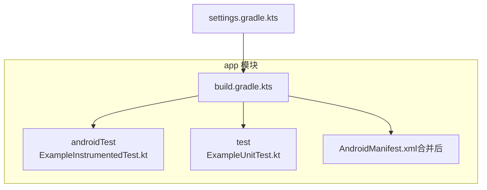
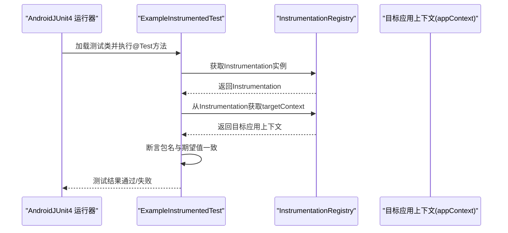
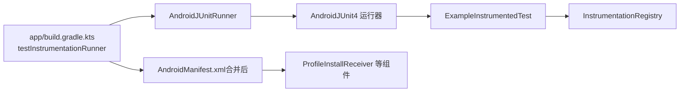

# 仪器化测试

<cite>
**本文引用的文件**
- [ExampleInstrumentedTest.kt](file://app/src/androidTest/java/com/bili/bilitv/ExampleInstrumentedTest.kt)
- [ExampleUnitTest.kt](file://app/src/test/java/com/bili/bilitv/ExampleUnitTest.kt)
- [build.gradle.kts](file://app/build.gradle.kts)
- [settings.gradle.kts](file://settings.gradle.kts)
- [AndroidManifest.xml（合并后）](file://app/build/intermediates/merged_manifests/debug/processDebugManifest/AndroidManifest.xml)
</cite>

## 目录
1. [引言](#引言)
2. [项目结构](#项目结构)
3. [核心组件](#核心组件)
4. [架构总览](#架构总览)
5. [详细组件分析](#详细组件分析)
6. [依赖关系分析](#依赖关系分析)
7. [性能考量](#性能考量)
8. [故障排查指南](#故障排查指南)
9. [结论](#结论)
10. [附录](#附录)

## 引言
本文件围绕项目中的仪器化测试体系展开，重点解析 ExampleInstrumentedTest.kt 的设计与作用，系统阐述：
- AndroidJUnit4 测试运行器与 @RunWith 注解的必要性
- InstrumentationRegistry 如何获取目标应用上下文（appContext）并进行正确性验证
- 仪器化测试必须在真实设备或模拟器上运行的原因与适用场景
- 示例测试 useAppContext() 的实际用途：验证应用包名一致性，作为基础环境检测手段
- 如何扩展仪器化测试以覆盖 Activity 启动、数据库操作、权限检查等复杂场景
- 运行仪器化测试的方法（Android Studio 点击运行或 adb 命令），以及日志输出与错误排查路径
- 测试前的准备工作与常见问题处理（设备连接、应用安装、权限拒绝、上下文为空）

## 项目结构
该工程采用标准 Android Gradle 工程布局，测试相关的关键位置如下：
- androidTest：存放仪器化测试代码，入口为 ExampleInstrumentedTest.kt
- test：存放本地单元测试代码，入口为 ExampleUnitTest.kt
- app/build.gradle.kts：定义测试运行器、依赖与构建配置
- settings.gradle.kts：项目模块与仓库配置
- AndroidManifest.xml（合并后）：包含第三方库注入的组件声明（如 ProfileInstallReceiver）

图表来源
- [ExampleInstrumentedTest.kt](file://app/src/androidTest/java/com/bili/bilitv/ExampleInstrumentedTest.kt#L1-L24)
- [ExampleUnitTest.kt](file://app/src/test/java/com/bili/bilitv/ExampleUnitTest.kt#L1-L17)
- [build.gradle.kts](file://app/build.gradle.kts#L1-L47)
- [settings.gradle.kts](file://settings.gradle.kts#L1-L24)
- [AndroidManifest.xml（合并后）](file://app/build/intermediates/merged_manifests/debug/processDebugManifest/AndroidManifest.xml#L32-L66)

章节来源
- [ExampleInstrumentedTest.kt](file://app/src/androidTest/java/com/bili/bilitv/ExampleInstrumentedTest.kt#L1-L24)
- [ExampleUnitTest.kt](file://app/src/test/java/com/bili/bilitv/ExampleUnitTest.kt#L1-L17)
- [build.gradle.kts](file://app/build.gradle.kts#L1-L47)
- [settings.gradle.kts](file://settings.gradle.kts#L1-L24)
- [AndroidManifest.xml（合并后）](file://app/build/intermediates/merged_manifests/debug/processDebugManifest/AndroidManifest.xml#L32-L66)

## 核心组件
- AndroidJUnit4 测试运行器与 @RunWith 注解
  - 通过 @RunWith(AndroidJUnit4::class) 明确使用 AndroidJUnit4 作为测试运行器，使 JUnit 测试能够在 Android 设备或模拟器上执行，而非仅限于本地 JVM。
- InstrumentationRegistry 与 appContext 获取
  - 使用 InstrumentationRegistry.getInstrumentation().targetContext 获取目标应用上下文，用于访问目标应用的资源、包名、服务等。
- useAppContext() 测试用例
  - 验证目标应用包名是否与期望值一致，作为基础环境检测手段，确保测试在正确的应用包下运行。

章节来源
- [ExampleInstrumentedTest.kt](file://app/src/androidTest/java/com/bili/bilitv/ExampleInstrumentedTest.kt#L16-L23)
- [build.gradle.kts](file://app/build.gradle.kts#L19-L19)

## 架构总览
仪器化测试的执行流程可概括为：AndroidJUnit4 运行器加载测试类，借助 InstrumentationRegistry 获取目标应用上下文，随后执行断言逻辑。下图展示了关键参与者之间的关系。

图表来源
- [ExampleInstrumentedTest.kt](file://app/src/androidTest/java/com/bili/bilitv/ExampleInstrumentedTest.kt#L16-L23)
- [build.gradle.kts](file://app/build.gradle.kts#L19-L19)

## 详细组件分析

### 组件一：AndroidJUnit4 测试运行器与 @RunWith 注解
- 作用
  - @RunWith(AndroidJUnit4::class) 指示测试框架使用 AndroidJUnit4 运行器，以便在 Android 环境中执行测试。
- 必要性
  - 若未指定运行器，JUnit 默认使用本地 JVM 运行器，无法访问 Android 框架 API 或目标应用上下文。
- 配置来源
  - 在 app/build.gradle.kts 中通过 testInstrumentationRunner 指定 AndroidJUnitRunner（由 AndroidJUnit4 内部使用）。

章节来源
- [ExampleInstrumentedTest.kt](file://app/src/androidTest/java/com/bili/bilitv/ExampleInstrumentedTest.kt#L16-L16)
- [build.gradle.kts](file://app/build.gradle.kts#L19-L19)

### 组件二：InstrumentationRegistry 与 appContext 获取
- 获取方式
  - 通过 InstrumentationRegistry.getInstrumentation().targetContext 获取目标应用上下文。
- 用途
  - 访问目标应用的包名、资源、服务、ContentProvider 等，是仪器化测试的基础能力。
- 正确性验证
  - 在 useAppContext() 中断言包名一致性，确保测试在预期的应用包下执行。

章节来源
- [ExampleInstrumentedTest.kt](file://app/src/androidTest/java/com/bili/bilitv/ExampleInstrumentedTest.kt#L21-L22)

### 组件三：useAppContext() 测试用例
- 实际用途
  - 验证目标应用包名与期望值一致，作为基础环境检测手段，防止测试在错误包名的应用上运行。
- 适用场景
  - 作为所有仪器化测试的前置条件，确保后续测试（如 Activity 启动、数据库操作、权限检查）在正确的环境中执行。

章节来源
- [ExampleInstrumentedTest.kt](file://app/src/androidTest/java/com/bili/bilitv/ExampleInstrumentedTest.kt#L18-L23)

### 组件四：扩展仪器化测试的实践建议
- Activity 启动
  - 可通过 Intent、ActivityScenario 或 ActivityTestRule 启动目标 Activity 并断言 UI 行为。
- 数据库操作
  - 可通过 Room、SQLiteOpenHelper 等访问数据库，断言数据读写与事务行为。
- 权限检查
  - 可通过 RuntimePermission、GrantPermissions 或自定义规则授予/拒绝权限，断言权限对功能的影响。
- SharedPreferences 操作
  - 可直接读写 SharedPreferences，断言键值一致性与默认值行为。
- 注意事项
  - 所有扩展均需在真实设备或模拟器上运行，避免在本地 JVM 上执行 Android 特定逻辑。

（本节为概念性指导，不直接分析具体文件，故无“章节来源”）

### 组件五：测试运行与日志输出
- 在 Android Studio 中运行
  - 在 androidTest 目录下右键选择“Run Instrumented Tests”，或直接运行 ExampleInstrumentedTest。
- 使用 adb 命令
  - 先确保设备已连接且应用已安装，然后使用 adb shell am instrument 命令触发测试运行。
- 日志输出与排查
  - 查看 Logcat 输出，定位测试异常堆栈与断言失败原因；结合设备连接状态与应用安装状态排查问题。

（本节为通用操作指导，不直接分析具体文件，故无“章节来源”）

## 依赖关系分析
- 测试运行器依赖
  - app/build.gradle.kts 中通过 testInstrumentationRunner 指定 AndroidJUnitRunner，为 AndroidJUnit4 提供底层运行支持。
- 第三方库注入
  - 合并后的 AndroidManifest.xml 中包含 androidx.profileinstaller 的组件声明，表明项目引入了 ProfileInstaller 相关组件，可能影响测试初始化阶段的行为。

图表来源
- [build.gradle.kts](file://app/build.gradle.kts#L19-L19)
- [ExampleInstrumentedTest.kt](file://app/src/androidTest/java/com/bili/bilitv/ExampleInstrumentedTest.kt#L16-L23)
- [AndroidManifest.xml（合并后）](file://app/build/intermediates/merged_manifests/debug/processDebugManifest/AndroidManifest.xml#L32-L66)

章节来源
- [build.gradle.kts](file://app/build.gradle.kts#L19-L19)
- [AndroidManifest.xml（合并后）](file://app/build/intermediates/merged_manifests/debug/processDebugManifest/AndroidManifest.xml#L32-L66)

## 性能考量
- 仪器化测试通常比本地单元测试慢，因为涉及设备/模拟器启动与应用安装。
- 建议：
  - 将高频、轻量的逻辑测试迁移至本地单元测试（如 ExampleUnitTest.kt），仅在需要 Android 框架或目标应用上下文时使用仪器化测试。
  - 合理拆分测试用例，避免长链路测试导致整体耗时过长。

（本节为通用性能建议，不直接分析具体文件，故无“章节来源”）

## 故障排查指南
- 设备连接问题
  - 确认设备已连接并处于可调试状态；在 Android Studio 的 Device Manager 中查看设备列表。
- 应用未安装
  - 确保已在目标设备上安装应用 Debug 包；若未安装，先执行构建并安装。
- 权限拒绝
  - 对于需要系统权限的测试（如存储、网络），可在测试前授予相应权限，或在测试中使用权限规则。
- 上下文为空
  - 若 InstrumentationRegistry 返回的 targetContext 为空，检查测试运行器配置与设备状态；确认应用已正确安装并可被 Instrumentation 访问。
- 日志与错误定位
  - 通过 Logcat 查看测试过程中的异常堆栈与断言失败信息；根据错误提示逐步修复。

（本节为通用排查建议，不直接分析具体文件，故无“章节来源”）

## 结论
- ExampleInstrumentedTest.kt 展示了仪器化测试的基本形态：通过 AndroidJUnit4 运行器与 InstrumentationRegistry 获取目标应用上下文，并以 useAppContext() 作为基础环境检测。
- 仪器化测试适用于验证 Android SDK 功能、组件生命周期、SharedPreferences 操作等场景，但必须在真实设备或模拟器上运行。
- 建议将轻量逻辑测试放入本地单元测试，仅在确需 Android 环境时使用仪器化测试，并遵循良好的测试组织与排错流程。

（本节为总结性内容，不直接分析具体文件，故无“章节来源”）

## 附录
- 本地单元测试示例（对比参考）
  - ExampleUnitTest.kt 展示了在本地 JVM 上执行的简单断言，适合验证纯逻辑或非 Android 依赖的功能。

章节来源
- [ExampleUnitTest.kt](file://app/src/test/java/com/bili/bilitv/ExampleUnitTest.kt#L12-L16)