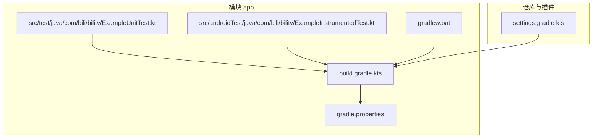
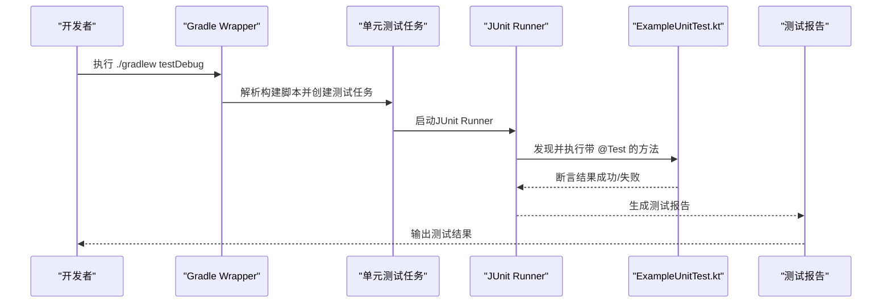
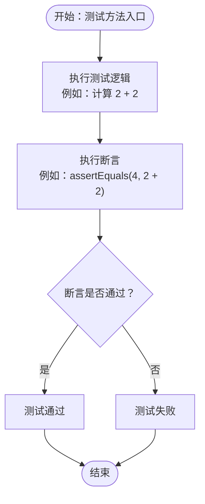
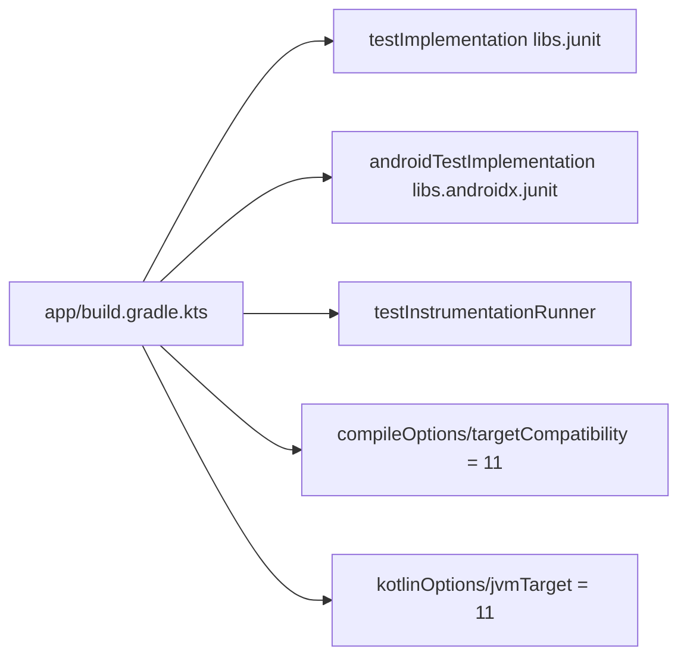
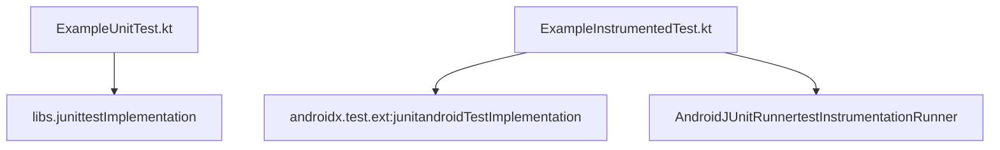

# 本地单元测试

<cite>
**本文引用的文件**
- [ExampleUnitTest.kt](file://app/src/test/java/com/bili/bilitv/ExampleUnitTest.kt)
- [ExampleInstrumentedTest.kt](file://app/src/androidTest/java/com/bili/bilitv/ExampleInstrumentedTest.kt)
- [build.gradle.kts](file://app/build.gradle.kts)
- [gradle.properties](file://gradle.properties)
- [gradlew.bat](file://gradlew.bat)
- [settings.gradle.kts](file://settings.gradle.kts)
</cite>

## 目录
1. [引言](#引言)
2. [项目结构](#项目结构)
3. [核心组件](#核心组件)
4. [架构总览](#架构总览)
5. [详细组件分析](#详细组件分析)
6. [依赖关系分析](#依赖关系分析)
7. [性能考量](#性能考量)
8. [故障排查指南](#故障排查指南)
9. [结论](#结论)
10. [附录](#附录)

## 引言
本文件围绕项目的本地单元测试实践展开，重点解析位于 app/src/test 下的 ExampleUnitTest.kt 文件，系统阐述：
- 在非Android环境下运行的JUnit测试机制与控制流
- @Test 注解与断言方法（如 assertEquals）的使用方式与验证逻辑
- 如何针对纯Kotlin/Java业务逻辑进行快速验证，且不依赖Android SDK
- 编写新单元测试用例的步骤指导：命名规范、异常测试（@Test(expected = ...)）、性能测试（超时设置）
- 结合代码示例展示如何对工具类、数据模型或算法逻辑进行测试
- 通过Gradle命令（如 ./gradlew testDebug）执行测试并生成报告
- 常见问题与解决方案（测试依赖缺失、JVM配置错误）

## 项目结构
本项目采用标准Android应用结构，其中与测试直接相关的关键目录与文件如下：
- app/src/test/java/com/bili/bilitv/ExampleUnitTest.kt：本地单元测试入口，演示基础断言
- app/src/androidTest/java/com/bili/bilitv/ExampleInstrumentedTest.kt：基于Android设备的仪器化测试入口
- app/build.gradle.kts：模块级构建脚本，声明测试依赖与AndroidJUnitRunner
- gradle.properties：全局Gradle属性，包含JVM参数
- gradlew.bat：Windows平台的Gradle Wrapper启动脚本
- settings.gradle.kts：仓库与插件管理配置

图表来源
- [ExampleUnitTest.kt](file://app/src/test/java/com/bili/bilitv/ExampleUnitTest.kt#L1-L17)
- [ExampleInstrumentedTest.kt](file://app/src/androidTest/java/com/bili/bilitv/ExampleInstrumentedTest.kt#L1-L24)
- [build.gradle.kts](file://app/build.gradle.kts#L1-L47)
- [gradle.properties](file://gradle.properties#L1-L23)
- [gradlew.bat](file://gradlew.bat#L1-L94)
- [settings.gradle.kts](file://settings.gradle.kts#L1-L24)

章节来源
- [ExampleUnitTest.kt](file://app/src/test/java/com/bili/bilitv/ExampleUnitTest.kt#L1-L17)
- [ExampleInstrumentedTest.kt](file://app/src/androidTest/java/com/bili/bilitv/ExampleInstrumentedTest.kt#L1-L24)
- [build.gradle.kts](file://app/build.gradle.kts#L1-L47)
- [gradle.properties](file://gradle.properties#L1-L23)
- [gradlew.bat](file://gradlew.bat#L1-L94)
- [settings.gradle.kts](file://settings.gradle.kts#L1-L24)

## 核心组件
- 本地单元测试类：ExampleUnitTest.kt
  - 使用 @Test 标记测试方法
  - 使用 org.junit.Assert.* 提供断言能力
  - 示例断言：assertEquals(4, 2 + 2)
- 构建与依赖：build.gradle.kts
  - testImplementation libs.junit：为本地单元测试提供JUnit依赖
  - androidTestImplementation libs.androidx.junit：为仪器化测试提供Android扩展JUnit
  - testInstrumentationRunner：指定AndroidJUnitRunner（用于仪器化测试）
- 运行环境与JVM配置：gradle.properties
  - org.gradle.jvmargs：设置Gradle守护进程JVM参数
- Gradle Wrapper：gradlew.bat
  - Windows平台Gradle Wrapper入口，负责定位Java并执行构建任务

章节来源
- [ExampleUnitTest.kt](file://app/src/test/java/com/bili/bilitv/ExampleUnitTest.kt#L1-L17)
- [build.gradle.kts](file://app/build.gradle.kts#L1-L47)
- [gradle.properties](file://gradle.properties#L1-L23)
- [gradlew.bat](file://gradlew.bat#L1-L94)

## 架构总览
下图展示了本地单元测试从源码到执行再到报告输出的整体流程，强调非Android环境下的运行机制与关键依赖。

图表来源
- [build.gradle.kts](file://app/build.gradle.kts#L1-L47)
- [ExampleUnitTest.kt](file://app/src/test/java/com/bili/bilitv/ExampleUnitTest.kt#L1-L17)
- [gradle.properties](file://gradle.properties#L1-L23)
- [gradlew.bat](file://gradlew.bat#L1-L94)

## 详细组件分析

### 组件A：本地单元测试类 ExampleUnitTest.kt
- 类型与作用域
  - 位于 app/src/test 下，属于本地单元测试范畴，不依赖Android SDK
  - 测试方法以 @Test 标记，由JUnit Runner发现并执行
- 关键注解与断言
  - @Test：标记可执行的测试方法
  - assertEquals(...)：断言期望值与实际值相等，不相等则抛出异常，导致测试失败
- 控制流与验证逻辑
  - 方法入口：测试函数被JUnit Runner调用
  - 断言执行：断言失败会中断当前测试并记录失败原因
  - 返回：无返回值（void），仅通过断言结果判定成功或失败

图表来源
- [ExampleUnitTest.kt](file://app/src/test/java/com/bili/bilitv/ExampleUnitTest.kt#L1-L17)

章节来源
- [ExampleUnitTest.kt](file://app/src/test/java/com/bili/bilitv/ExampleUnitTest.kt#L1-L17)

### 组件B：构建与依赖配置（build.gradle.kts）
- 本地单元测试依赖
  - testImplementation libs.junit：为本地单元测试提供JUnit核心库
- 仪器化测试依赖
  - androidTestImplementation libs.androidx.junit：为Android设备上的仪器化测试提供扩展
  - testInstrumentationRunner："androidx.test.runner.AndroidJUnitRunner"：指定仪器化测试运行器
- 编译选项
  - compileOptions 与 kotlinOptions 指定Java版本与JVM目标版本（11）

图表来源
- [build.gradle.kts](file://app/build.gradle.kts#L1-L47)

章节来源
- [build.gradle.kts](file://app/build.gradle.kts#L1-L47)

### 组件C：运行环境与JVM配置（gradle.properties）
- 关键配置项
  - org.gradle.jvmargs：设置Gradle守护进程JVM参数，影响测试执行内存与编码
- 影响范围
  - 本地单元测试与仪器化测试均受此配置影响

章节来源
- [gradle.properties](file://gradle.properties#L1-L23)

### 组件D：Gradle Wrapper（gradlew.bat）
- 职责
  - 在Windows环境下启动Gradle Wrapper，负责定位Java并执行构建与测试任务
- 错误提示
  - 当JAVA_HOME未设置或无效时，脚本会输出明确的错误信息并退出

章节来源
- [gradlew.bat](file://gradlew.bat#L1-L94)

### 组件E：仪器化测试对比（ExampleInstrumentedTest.kt）
- 运行环境
  - @RunWith(AndroidJUnit4::class)：在Android设备或模拟器上运行
  - 通过 InstrumentationRegistry 获取上下文，常用于验证包名等
- 与本地单元测试的区别
  - 本地单元测试在JVM上运行，无需Android设备
  - 仪器化测试需要Android运行时环境

章节来源
- [ExampleInstrumentedTest.kt](file://app/src/androidTest/java/com/bili/bilitv/ExampleInstrumentedTest.kt#L1-L24)

## 依赖关系分析
- 组件耦合
  - ExampleUnitTest.kt 依赖 JUnit断言库（通过 build.gradle.kts 的 testImplementation 引入）
  - 仪器化测试依赖 AndroidX JUnit与AndroidJUnitRunner（通过 build.gradle.kts 的 androidTestImplementation 与 testInstrumentationRunner）
- 外部依赖
  - JUnit：本地单元测试的核心断言框架
  - AndroidX JUnit：仪器化测试的扩展JUnit
- 可能的循环依赖
  - 本地单元测试与仪器化测试分别位于不同源集，不存在直接循环依赖

图表来源
- [ExampleUnitTest.kt](file://app/src/test/java/com/bili/bilitv/ExampleUnitTest.kt#L1-L17)
- [ExampleInstrumentedTest.kt](file://app/src/androidTest/java/com/bili/bilitv/ExampleInstrumentedTest.kt#L1-L24)
- [build.gradle.kts](file://app/build.gradle.kts#L1-L47)

章节来源
- [build.gradle.kts](file://app/build.gradle.kts#L1-L47)
- [ExampleUnitTest.kt](file://app/src/test/java/com/bili/bilitv/ExampleUnitTest.kt#L1-L17)
- [ExampleInstrumentedTest.kt](file://app/src/androidTest/java/com/bili/bilitv/ExampleInstrumentedTest.kt#L1-L24)

## 性能考量
- JVM参数调优
  - 通过 gradle.properties 中的 org.gradle.jvmargs 可调整Gradle守护进程的JVM内存与编码，有助于提升测试执行稳定性
- 并行与缓存
  - 可根据需要启用Gradle并行构建（需遵循官方建议），减少测试执行时间
- 测试粒度
  - 将复杂逻辑拆分为多个小而独立的单元测试，避免单测过长导致的执行时间膨胀

[本节为通用指导，不直接分析具体文件]

## 故障排查指南
- 测试依赖缺失
  - 症状：编译或运行测试时报错，提示找不到JUnit类
  - 排查：确认 build.gradle.kts 中已添加 testImplementation libs.junit
- JVM配置错误（Windows）
  - 症状：执行 ./gradlew testDebug 报错，提示JAVA_HOME未设置或无效
  - 排查：检查 gradlew.bat 的JAVA_HOME设置；确保系统已安装并正确配置JDK
- AndroidJUnitRunner未生效
  - 症状：仪器化测试无法运行或找不到Runner
  - 排查：确认 build.gradle.kts 中 testInstrumentationRunner 已正确配置为 "androidx.test.runner.AndroidJUnitRunner"
- 断言失败
  - 症状：测试方法执行后显示断言失败
  - 排查：核对断言参数与预期值，必要时增加日志或分步断言定位问题

章节来源
- [build.gradle.kts](file://app/build.gradle.kts#L1-L47)
- [gradlew.bat](file://gradlew.bat#L1-L94)

## 结论
本项目在本地单元测试方面具备清晰的结构与最小依赖：通过 JUnit 断言库与 Gradle Wrapper，可在非Android环境中高效执行单元测试。示例测试用例展示了基本的断言模式，为后续扩展到工具类、数据模型与算法逻辑提供了范式。配合合理的JVM参数与测试组织，能够稳定地支持日常开发中的快速验证与回归测试。

[本节为总结性内容，不直接分析具体文件]

## 附录

### A. 编写新单元测试用例的步骤指导
- 测试函数命名规范
  - 使用语义化名称，描述被测行为与期望结果，例如：addition_isCorrect
- 异常测试（@Test(expected = ...)）
  - 用于验证特定输入或操作应抛出指定异常类型
  - 注意：在现代JUnit中更推荐使用断言捕获与异常规则
- 性能测试（超时设置）
  - 使用 @Test(timeout = N) 设置毫秒级超时，防止死循环或极端耗时场景阻塞CI
- 断言方法选择
  - assertEquals：比较对象或数值相等
  - assertTrue/assertFalse：布尔条件断言
  - assertNotNull/assertNull：空值断言
- 测试组织
  - 将相关功能的测试归类在同一类中，便于维护与查找

[本节为通用指导，不直接分析具体文件]

### B. 执行测试与生成报告
- 常用命令
  - Windows：gradlew.bat testDebug
  - Linux/macOS：./gradlew testDebug
- 报告位置
  - 测试报告通常生成在 build/reports/tests/testDebug/ 目录下，包含HTML与XML格式
- 日志与输出
  - 可通过 Gradle 日志级别控制输出详细程度，便于定位失败原因

章节来源
- [gradlew.bat](file://gradlew.bat#L1-L94)
- [build.gradle.kts](file://app/build.gradle.kts#L1-L47)