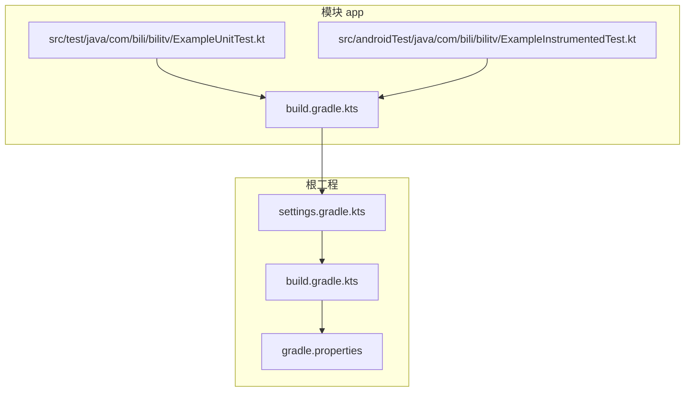
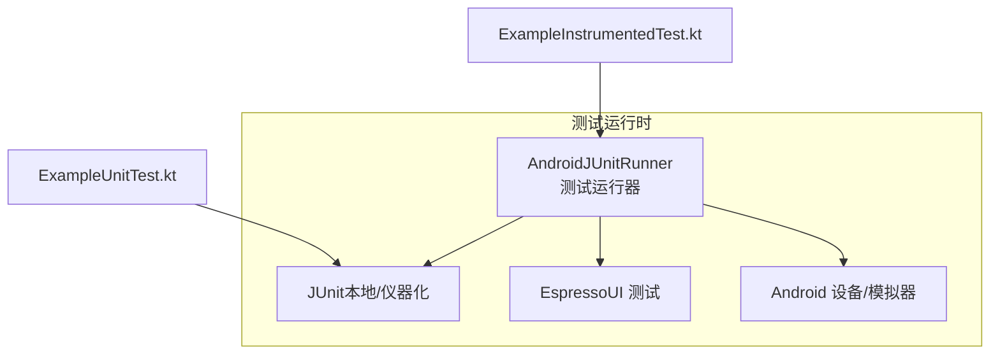
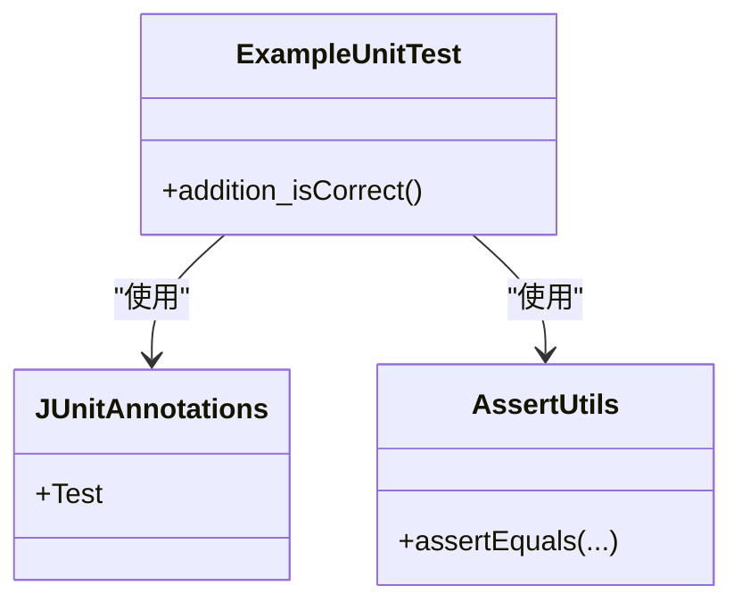
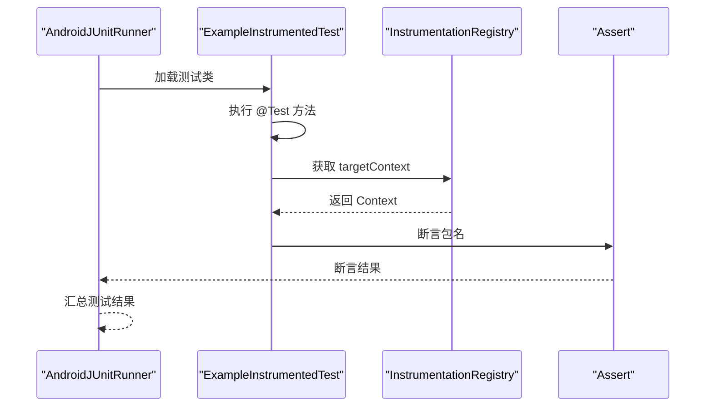
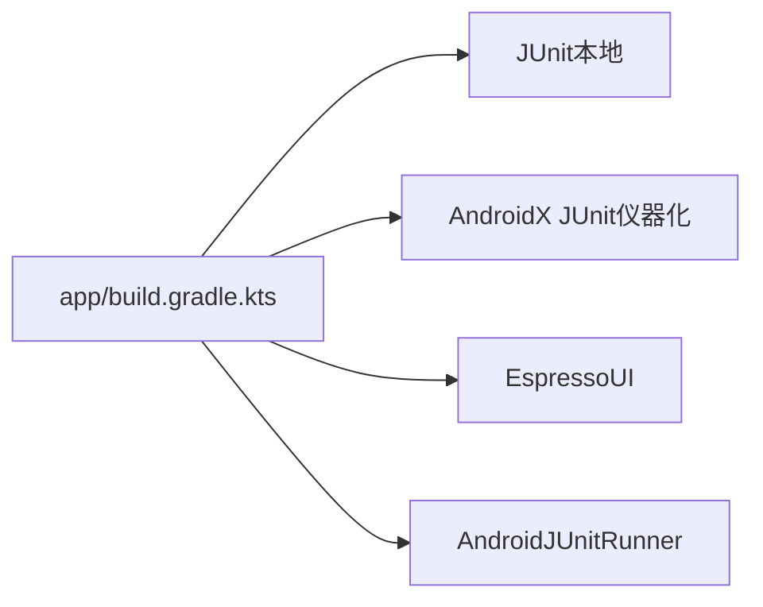

# 测试体系

<cite>
**本文引用的文件**
- [app/src/test/java/com/bili/bilitv/ExampleUnitTest.kt](file://app/src/test/java/com/bili/bilitv/ExampleUnitTest.kt)
- [app/src/androidTest/java/com/bili/bilitv/ExampleInstrumentedTest.kt](file://app/src/androidTest/java/com/bili/bilitv/ExampleInstrumentedTest.kt)
- [app/build.gradle.kts](file://app/build.gradle.kts)
- [settings.gradle.kts](file://settings.gradle.kts)
- [build.gradle.kts](file://build.gradle.kts)
- [gradle.properties](file://gradle.properties)
</cite>

## 目录
1. [引言](#引言)
2. [项目结构](#项目结构)
3. [核心组件](#核心组件)
4. [架构总览](#架构总览)
5. [详细组件分析](#详细组件分析)
6. [依赖分析](#依赖分析)
7. [性能考虑](#性能考虑)
8. [故障排查指南](#故障排查指南)
9. [结论](#结论)
10. [附录](#附录)

## 引言
本文件系统性梳理项目的测试体系，明确本地单元测试与仪器化测试的职责边界、适用场景与最佳实践。围绕 JUnit 的业务逻辑验证能力与 Espresso 的 UI 交互测试能力，解释测试类的结构组成（注解、断言、生命周期），并给出编写新测试用例、运行测试套件与解读结果的方法论。最后总结测试对代码质量的重要意义，并提供常见失败问题的排查建议。

## 项目结构
项目采用标准 Android 模块结构，测试相关源码位于：
- 本地单元测试：app/src/test/java/...
- 仪器化测试：app/src/androidTest/java/...

示例测试文件分别展示了两类测试的基本形态与最小依赖配置。

图表来源
- [app/src/test/java/com/bili/bilitv/ExampleUnitTest.kt](file://app/src/test/java/com/bili/bilitv/ExampleUnitTest.kt#L1-L17)
- [app/src/androidTest/java/com/bili/bilitv/ExampleInstrumentedTest.kt](file://app/src/androidTest/java/com/bili/bilitv/ExampleInstrumentedTest.kt#L1-L24)
- [app/build.gradle.kts](file://app/build.gradle.kts#L1-L47)
- [settings.gradle.kts](file://settings.gradle.kts#L1-L24)
- [build.gradle.kts](file://build.gradle.kts#L1-L5)
- [gradle.properties](file://gradle.properties#L1-L23)

章节来源
- [app/src/test/java/com/bili/bilitv/ExampleUnitTest.kt](file://app/src/test/java/com/bili/bilitv/ExampleUnitTest.kt#L1-L17)
- [app/src/androidTest/java/com/bili/bilitv/ExampleInstrumentedTest.kt](file://app/src/androidTest/java/com/bili/bilitv/ExampleInstrumentedTest.kt#L1-L24)
- [app/build.gradle.kts](file://app/build.gradle.kts#L1-L47)
- [settings.gradle.kts](file://settings.gradle.kts#L1-L24)
- [build.gradle.kts](file://build.gradle.kts#L1-L5)
- [gradle.properties](file://gradle.properties#L1-L23)

## 核心组件
- 本地单元测试（ExampleUnitTest.kt）
  - 运行环境：开发机（Host），不依赖 Android 系统框架
  - 依赖：JUnit（testImplementation）
  - 典型用途：纯函数、算法、数据处理、业务规则等逻辑验证
- 仪器化测试（ExampleInstrumentedTest.kt）
  - 运行环境：真实设备或模拟器（Device），通过 Instrumentation 访问系统服务
  - 依赖：AndroidX Test Runner、AndroidX JUnit、Espresso（androidTestImplementation）
  - 典型用途：UI 交互、导航、系统权限、应用上下文等端到端验证

章节来源
- [app/src/test/java/com/bili/bilitv/ExampleUnitTest.kt](file://app/src/test/java/com/bili/bilitv/ExampleUnitTest.kt#L1-L17)
- [app/src/androidTest/java/com/bili/bilitv/ExampleInstrumentedTest.kt](file://app/src/androidTest/java/com/bili/bilitv/ExampleInstrumentedTest.kt#L1-L24)
- [app/build.gradle.kts](file://app/build.gradle.kts#L40-L47)

## 架构总览
下图展示测试执行路径与依赖关系：

图表来源
- [app/build.gradle.kts](file://app/build.gradle.kts#L19-L20)
- [app/src/test/java/com/bili/bilitv/ExampleUnitTest.kt](file://app/src/test/java/com/bili/bilitv/ExampleUnitTest.kt#L1-L17)
- [app/src/androidTest/java/com/bili/bilitv/ExampleInstrumentedTest.kt](file://app/src/androidTest/java/com/bili/bilitv/ExampleInstrumentedTest.kt#L1-L24)

## 详细组件分析

### 本地单元测试（ExampleUnitTest.kt）
- 结构组成
  - 包声明与导入：包含 JUnit 注解与断言工具
  - 测试类：无状态、无外部依赖的纯逻辑验证
  - 测试方法：以 @Test 标记，使用断言方法进行结果比对
- 断言与注解
  - @Test：标记可执行的测试方法
  - Assert.*：提供相等性、布尔、异常等断言能力
- 生命周期
  - 示例未使用生命周期注解；如需初始化/清理可在测试类中添加相应逻辑（例如 @Before/@After 等，若存在）

图表来源
- [app/src/test/java/com/bili/bilitv/ExampleUnitTest.kt](file://app/src/test/java/com/bili/bilitv/ExampleUnitTest.kt#L1-L17)

章节来源
- [app/src/test/java/com/bili/bilitv/ExampleUnitTest.kt](file://app/src/test/java/com/bili/bilitv/ExampleUnitTest.kt#L1-L17)

### 仪器化测试（ExampleInstrumentedTest.kt）
- 结构组成
  - 包声明与导入：引入 AndroidX Test 的注册表与运行器
  - 类级注解：@RunWith(AndroidJUnit4::class) 指定运行器
  - 测试方法：通过 InstrumentationRegistry 获取目标上下文并断言
- 断言与注解
  - @Test：标记可执行的测试方法
  - @RunWith：指定 AndroidJUnit4 运行器
  - Assert.*：断言包名等条件
- 运行流程
  - 由 AndroidJUnitRunner 启动，加载测试类，执行 @Test 方法

图表来源
- [app/src/androidTest/java/com/bili/bilitv/ExampleInstrumentedTest.kt](file://app/src/androidTest/java/com/bili/bilitv/ExampleInstrumentedTest.kt#L1-L24)
- [app/build.gradle.kts](file://app/build.gradle.kts#L19-L20)

章节来源
- [app/src/androidTest/java/com/bili/bilitv/ExampleInstrumentedTest.kt](file://app/src/androidTest/java/com/bili/bilitv/ExampleInstrumentedTest.kt#L1-L24)
- [app/build.gradle.kts](file://app/build.gradle.kts#L19-L20)

### 测试类结构与注解使用
- 常用注解
  - @Test：声明测试方法
  - @RunWith(AndroidJUnit4::class)：为仪器化测试指定运行器
  - 可选：@Before/@After（若需要在每个测试前/后执行初始化/清理）
- 断言方法
  - 相等性断言：如 assertEquals(...)
  - 布尔断言：assertTrue(...) / assertFalse(...)
  - 异常断言：expected=... 或相应的异常捕获与断言
- 测试生命周期
  - 单元测试：通常无需生命周期注解；如需可按需添加
  - 仪器化测试：可通过生命周期注解进行设备/上下文准备与回收

章节来源
- [app/src/test/java/com/bili/bilitv/ExampleUnitTest.kt](file://app/src/test/java/com/bili/bilitv/ExampleUnitTest.kt#L1-L17)
- [app/src/androidTest/java/com/bili/bilitv/ExampleInstrumentedTest.kt](file://app/src/androidTest/java/com/bili/bilitv/ExampleInstrumentedTest.kt#L1-L24)

### 编写新的测试用例
- 本地单元测试
  - 在 app/src/test 下创建新类，使用 @Test 标记方法，使用 Assert 工具进行断言
  - 将业务逻辑与外部依赖隔离，必要时使用桩对象或替换依赖
- 仪器化测试
  - 在 app/src/androidTest 下创建新类，添加 @RunWith(AndroidJUnit4::class)
  - 使用 InstrumentationRegistry 获取 Context，结合 Espresso 进行 UI 验证
  - 注意：避免在仪器化测试中访问非公开 API，优先使用公共接口

章节来源
- [app/src/test/java/com/bili/bilitv/ExampleUnitTest.kt](file://app/src/test/java/com/bili/bilitv/ExampleUnitTest.kt#L1-L17)
- [app/src/androidTest/java/com/bili/bilitv/ExampleInstrumentedTest.kt](file://app/src/androidTest/java/com/bili/bilitv/ExampleInstrumentedTest.kt#L1-L24)
- [app/build.gradle.kts](file://app/build.gradle.kts#L40-L47)

### 运行测试套件与解读结果
- 运行方式
  - Android Studio：右键测试类或方法选择“Run”
  - Gradle：使用命令行执行测试任务（如 connectedAndroidTest、test）
- 结果解读
  - 成功：所有断言通过，测试类显示为绿色
  - 失败：定位失败断言，查看期望值与实际值差异
  - 异常：检查异常类型与堆栈，确认是否为预期行为
- 建议
  - 保持测试命名清晰，描述具体场景与期望
  - 将测试拆分为小而专一的用例，便于定位问题

章节来源
- [app/build.gradle.kts](file://app/build.gradle.kts#L19-L20)

## 依赖分析
- 测试运行器
  - 默认配置了 AndroidJUnitRunner，确保仪器化测试正常运行
- 依赖声明
  - 本地测试：testImplementation(junit)
  - 仪器化测试：androidTestImplementation(androidx.test.ext:junit)、androidTestImplementation(androidx.test.espresso:espresso-core)

图表来源
- [app/build.gradle.kts](file://app/build.gradle.kts#L40-L47)
- [app/build.gradle.kts](file://app/build.gradle.kts#L19-L20)

章节来源
- [app/build.gradle.kts](file://app/build.gradle.kts#L19-L20)
- [app/build.gradle.kts](file://app/build.gradle.kts#L40-L47)

## 性能考虑
- 本地单元测试
  - 快速、稳定，适合高频回归；避免不必要的 IO 与网络调用
- 仪器化测试
  - 启动与执行成本较高，建议减少无关 UI 交互，聚焦关键路径
- 并行与隔离
  - 合理拆分测试，避免共享状态导致的竞态与副作用
- 资源与设备
  - 使用稳定的设备/模拟器配置，避免因设备差异导致的不稳定

## 故障排查指南
- 仪器化测试无法启动
  - 检查默认运行器配置是否正确
  - 确认设备/模拟器可用且已解锁
- 断言失败
  - 对照期望值与实际值，逐步缩小范围
  - 若涉及 UI，确认视图层级与资源 ID 是否匹配
- 权限与系统服务
  - 仪器化测试可访问系统服务，注意权限与安全策略
- 依赖缺失
  - 确认依赖已正确声明于 build.gradle.kts 中

章节来源
- [app/build.gradle.kts](file://app/build.gradle.kts#L19-L20)
- [app/build.gradle.kts](file://app/build.gradle.kts#L40-L47)

## 结论
本项目的测试体系以本地单元测试与仪器化测试分工明确：前者专注于业务逻辑与算法验证，后者负责 UI 与系统集成验证。通过 JUnit 提供的断言与运行机制，以及 AndroidX Test 生态（Runner、Espresso）的支持，能够高效构建高质量的测试套件。建议在日常开发中坚持“先本地、后仪器化”的策略，持续完善测试覆盖，提升代码稳定性与交付质量。

## 附录
- 最小依赖清单（来自构建脚本）
  - 本地测试：junit
  - 仪器化测试：androidx.test.ext:junit、androidx.test.espresso:espresso-core
  - 运行器：androidx.test.runner.AndroidJUnitRunner

章节来源
- [app/build.gradle.kts](file://app/build.gradle.kts#L40-L47)
- [app/build.gradle.kts](file://app/build.gradle.kts#L19-L20)