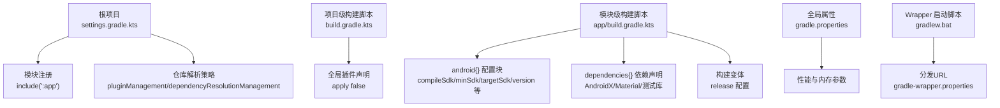
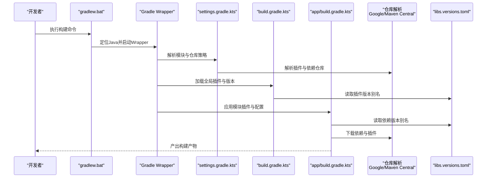
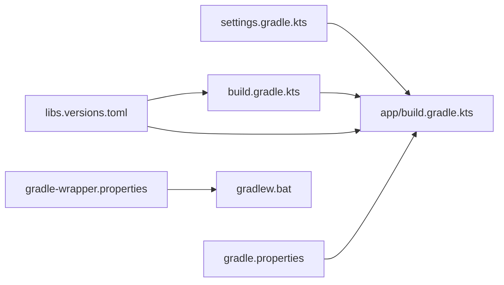

# 构建配置体系

<cite>
**本文引用的文件**
- [build.gradle.kts](file://build.gradle.kts)
- [app/build.gradle.kts](file://app/build.gradle.kts)
- [settings.gradle.kts](file://settings.gradle.kts)
- [gradle.properties](file://gradle.properties)
- [gradlew.bat](file://gradlew.bat)
- [gradle/libs.versions.toml](file://gradle/libs.versions.toml)
- [gradle/wrapper/gradle-wrapper.properties](file://gradle/wrapper/gradle-wrapper.properties)
</cite>

## 目录
1. [引言](#引言)
2. [项目结构](#项目结构)
3. [核心组件](#核心组件)
4. [架构总览](#架构总览)
5. [详细组件分析](#详细组件分析)
6. [依赖关系分析](#依赖关系分析)
7. [性能考量](#性能考量)
8. [故障排查指南](#故障排查指南)
9. [结论](#结论)

## 引言
本文件系统性解析该Android应用工程的Gradle构建配置体系，围绕以下目标展开：
- 项目级构建脚本中全局插件与仓库管理策略
- 模块级构建脚本中应用ID、版本号、SDK配置、依赖声明与构建变体设置
- settings.gradle.kts对项目模块的注册机制与仓库解析策略
- gradle.properties中的构建性能优化参数
- 结合Kotlin DSL语法特性，解释配置块的作用域与执行顺序
- Gradle Wrapper（gradlew.bat）在构建环境一致性保障中的关键作用

## 项目结构
该项目采用标准的Android多模块工程布局，顶层通过settings.gradle.kts声明模块包含关系与仓库解析策略，项目级build.gradle.kts集中声明全局插件，模块级app/build.gradle.kts完成具体应用配置与依赖声明，同时使用libs.versions.toml进行统一版本与依赖坐标管理，gradle.properties提供全局构建参数，gradlew.bat与gradle-wrapper.properties确保跨平台构建环境一致性。

图表来源
- [settings.gradle.kts](file://settings.gradle.kts#L1-L24)
- [build.gradle.kts](file://build.gradle.kts#L1-L5)
- [app/build.gradle.kts](file://app/build.gradle.kts#L1-L47)
- [gradle.properties](file://gradle.properties#L1-L23)
- [gradlew.bat](file://gradlew.bat#L1-L95)
- [gradle/wrapper/gradle-wrapper.properties](file://gradle/wrapper/gradle-wrapper.properties#L1-L9)

章节来源
- [settings.gradle.kts](file://settings.gradle.kts#L1-L24)
- [build.gradle.kts](file://build.gradle.kts#L1-L5)
- [app/build.gradle.kts](file://app/build.gradle.kts#L1-L47)
- [gradle.properties](file://gradle.properties#L1-L23)
- [gradlew.bat](file://gradlew.bat#L1-L95)
- [gradle/wrapper/gradle-wrapper.properties](file://gradle/wrapper/gradle-wrapper.properties#L1-L9)

## 核心组件
- 项目级构建脚本（build.gradle.kts）
  - 全局插件声明：通过alias引入Android应用与Kotlin Android插件，但设置为不自动应用（apply false），由各模块按需显式应用。
  - 作用：集中管理插件版本与发布渠道，避免重复声明，便于升级与维护。
- 模块级构建脚本（app/build.gradle.kts）
  - 插件应用：在模块内显式应用Android应用与Kotlin Android插件。
  - android{} 配置块：命名空间、编译SDK、默认配置（applicationId、minSdk、targetSdk、versionCode、versionName、测试运行器）、构建类型（release）、Java/Kotlin兼容性选项。
  - dependencies{} 块：声明AndroidX核心库、AppCompat、Material Components、JUnit单元测试、AndroidX Test JUnit与Espresso。
  - 构建变体：release构建类型开启混淆规则。
- settings.gradle.kts
  - pluginManagement：限定Google、Maven Central与Gradle Plugin Portal的插件仓库范围，确保插件解析稳定。
  - dependencyResolutionManagement：强制“项目自定义仓库模式”失效，统一从Google与Maven Central解析依赖。
  - 模块注册：include(":app")将app模块纳入构建。
  - 项目名称：rootProject.name设为“bilitv”。
- gradle.properties
  - 全局JVM参数：org.gradle.jvmargs用于限制最大堆与文件编码。
  - 并行构建：注释掉org.gradle.parallel，避免与项目解耦状态冲突。
  - AndroidX启用：android.useAndroidX=true。
  - Kotlin代码风格：kotlin.code.style=official。
  - R类非传递性：android.nonTransitiveRClass=true，减少R类体积。
- Gradle Wrapper（gradlew.bat）
  - 跨平台启动脚本，负责定位Java、设置CLASSPATH并调用gradle-wrapper.jar。
  - 通过gradle-wrapper.properties固定分发URL，确保团队成员使用一致的Gradle版本。
- libs.versions.toml
  - 版本与坐标集中管理：定义版本别名、库坐标与插件ID，配合build.gradle.kts与app/build.gradle.kts中的alias使用，实现统一升级与复用。

章节来源
- [build.gradle.kts](file://build.gradle.kts#L1-L5)
- [app/build.gradle.kts](file://app/build.gradle.kts#L1-L47)
- [settings.gradle.kts](file://settings.gradle.kts#L1-L24)
- [gradle.properties](file://gradle.properties#L1-L23)
- [gradlew.bat](file://gradlew.bat#L1-L95)
- [gradle/libs.versions.toml](file://gradle/libs.versions.toml#L1-L23)
- [gradle/wrapper/gradle-wrapper.properties](file://gradle/wrapper/gradle-wrapper.properties#L1-L9)

## 架构总览
下图展示从settings到模块构建脚本、插件与依赖解析的整体流程，以及Wrapper如何保证环境一致性。

图表来源
- [gradlew.bat](file://gradlew.bat#L1-L95)
- [settings.gradle.kts](file://settings.gradle.kts#L1-L24)
- [build.gradle.kts](file://build.gradle.kts#L1-L5)
- [app/build.gradle.kts](file://app/build.gradle.kts#L1-L47)
- [gradle/libs.versions.toml](file://gradle/libs.versions.toml#L1-L23)
- [gradle/wrapper/gradle-wrapper.properties](file://gradle/wrapper/gradle-wrapper.properties#L1-L9)

## 详细组件分析

### 项目级构建脚本（build.gradle.kts）
- 插件声明与作用域
  - 使用alias引入插件并设置apply false，表示仅在需要时才在模块中应用，避免重复应用与版本分散。
  - 与libs.versions.toml中的插件ID与版本关联，集中管理插件版本。
- 执行顺序
  - 在settings解析后，Gradle加载项目级脚本，随后逐个模块应用其脚本。
- 错误处理与最佳实践
  - 若模块未显式应用对应插件，将导致构建失败；应确保模块脚本中正确应用所需插件。
  - 统一通过libs.versions.toml升级插件版本，降低维护成本。

章节来源
- [build.gradle.kts](file://build.gradle.kts#L1-L5)
- [gradle/libs.versions.toml](file://gradle/libs.versions.toml#L1-L23)

### 模块级构建脚本（app/build.gradle.kts）
- 插件应用
  - 在模块内显式应用Android应用与Kotlin Android插件，确保模块具备编译与打包能力。
- android{} 配置块
  - 命名空间：用于包名隔离与资源生成。
  - SDK配置：compileSdk、minSdk、targetSdk与版本号（versionCode、versionName）。
  - 默认配置：applicationId、测试运行器等。
  - 构建类型：release中可配置混淆规则与产物优化。
  - Java/Kotlin兼容性：sourceCompatibility与targetCompatibility、kotlinOptions.jvmTarget均指向11。
- dependencies{} 块
  - implementation：AndroidX核心、AppCompat、Material Components。
  - testImplementation：JUnit单元测试。
  - androidTestImplementation：AndroidX Test JUnit与Espresso。
- 执行顺序
  - settings解析模块后，Gradle加载模块脚本，先解析android{}，再解析dependencies{}。
- 错误处理与最佳实践
  - 若混淆开启，需确保ProGuard/R8规则完整；当前release未启用混淆。
  - Java/Kotlin兼容性需保持一致，避免ABI不匹配。

章节来源
- [app/build.gradle.kts](file://app/build.gradle.kts#L1-L47)
- [gradle/libs.versions.toml](file://gradle/libs.versions.toml#L1-L23)

### settings.gradle.kts
- pluginManagement
  - 限定Google与Maven Central的插件仓库范围，提升插件解析稳定性。
- dependencyResolutionManagement
  - 设置repositoriesMode.FAIL_ON_PROJECT_REPOS，禁止模块直接声明仓库，统一从Google与Maven Central解析。
- 模块注册与项目名称
  - include(":app")注册app模块。
  - rootProject.name设为“bilitv”，作为IDE项目名称与日志标识。
- 执行顺序
  - settings是构建入口，最先被Gradle解析，决定模块集合与仓库策略。

章节来源
- [settings.gradle.kts](file://settings.gradle.kts#L1-L24)

### gradle.properties
- 全局JVM参数
  - org.gradle.jvmargs：限制最大堆与文件编码，有助于稳定CI与本地构建。
- 并行构建
  - org.gradle.parallel注释掉，避免与项目解耦状态冲突。
- AndroidX与Kotlin
  - android.useAndroidX=true：启用AndroidX迁移。
  - kotlin.code.style=official：官方Kotlin风格。
  - android.nonTransitiveRClass=true：减小R类体积，避免资源冲突。
- 性能建议
  - 可根据机器配置调整org.gradle.jvmargs，平衡内存占用与构建速度。

章节来源
- [gradle.properties](file://gradle.properties#L1-L23)

### Gradle Wrapper（gradlew.bat）与分发配置
- gradlew.bat
  - 跨平台启动脚本，负责定位Java、设置CLASSPATH并调用gradle-wrapper.jar。
  - 包含错误提示逻辑（如未设置JAVA_HOME或找不到java.exe）。
- gradle-wrapper.properties
  - distributionUrl固定Gradle分发版本，确保团队成员使用一致的Gradle版本。
  - validateDistributionUrl=true，增强安全性与稳定性。
- 关键作用
  - 保证不同操作系统与开发环境的一致性，避免“在我机器上能跑”的问题。

章节来源
- [gradlew.bat](file://gradlew.bat#L1-L95)
- [gradle/wrapper/gradle-wrapper.properties](file://gradle/wrapper/gradle-wrapper.properties#L1-L9)

### libs.versions.toml
- 版本与坐标集中管理
  - versions：聚合版本别名（如AGP、Kotlin、AndroidX、Material等）。
  - libraries：定义常用库的坐标与版本引用。
  - plugins：定义插件ID与版本引用。
- 与Kotlin DSL协作
  - build.gradle.kts与app/build.gradle.kts通过alias引用libs中的别名，实现统一升级与复用。

章节来源
- [gradle/libs.versions.toml](file://gradle/libs.versions.toml#L1-L23)

## 依赖关系分析
- settings → 模块脚本
  - settings决定模块集合与仓库策略，模块脚本基于此解析插件与依赖。
- 项目级脚本 → 模块脚本
  - 项目级脚本集中声明插件，模块脚本显式应用插件并继承版本别名。
- libs.versions.toml → 插件与依赖
  - 通过别名统一版本与坐标，避免散落的版本号与坐标。
- gradle.properties → 构建行为
  - 影响JVM参数、并行构建、AndroidX启用与R类行为。
- Wrapper → 分发
  - 固定Gradle版本，确保环境一致性。

图表来源
- [settings.gradle.kts](file://settings.gradle.kts#L1-L24)
- [build.gradle.kts](file://build.gradle.kts#L1-L5)
- [app/build.gradle.kts](file://app/build.gradle.kts#L1-L47)
- [gradle/libs.versions.toml](file://gradle/libs.versions.toml#L1-L23)
- [gradle.properties](file://gradle.properties#L1-L23)
- [gradle/wrapper/gradle-wrapper.properties](file://gradle/wrapper/gradle-wrapper.properties#L1-L9)
- [gradlew.bat](file://gradlew.bat#L1-L95)

章节来源
- [settings.gradle.kts](file://settings.gradle.kts#L1-L24)
- [build.gradle.kts](file://build.gradle.kts#L1-L5)
- [app/build.gradle.kts](file://app/build.gradle.kts#L1-L47)
- [gradle/libs.versions.toml](file://gradle/libs.versions.toml#L1-L23)
- [gradle.properties](file://gradle.properties#L1-L23)
- [gradle/wrapper/gradle-wrapper.properties](file://gradle/wrapper/gradle-wrapper.properties#L1-L9)
- [gradlew.bat](file://gradlew.bat#L1-L95)

## 性能考量
- 内存与I/O
  - 通过org.gradle.jvmargs合理设置最大堆，避免频繁GC与OOM。
  - 合理配置文件编码（UTF-8）以减少资源处理开销。
- 并行构建
  - org.gradle.parallel注释掉，避免与项目解耦状态冲突；若启用，需确保任务无共享状态依赖。
- 仓库与网络
  - pluginManagement与dependencyResolutionManagement统一仓库，减少解析失败与重试。
  - gradle-wrapper.properties固定分发URL，避免网络波动影响下载。
- 依赖瘦身
  - android.nonTransitiveRClass=true减少R类体积，降低编译与打包时间。
- SDK与工具链
  - compileSdk与targetSdk保持最新，配合Java/Kotlin 11兼容性，提升编译效率与二进制兼容性。

章节来源
- [gradle.properties](file://gradle.properties#L1-L23)
- [settings.gradle.kts](file://settings.gradle.kts#L1-L24)
- [gradle/wrapper/gradle-wrapper.properties](file://gradle/wrapper/gradle-wrapper.properties#L1-L9)

## 故障排查指南
- 插件未应用或版本不匹配
  - 现象：模块构建失败，提示缺少插件或无法解析。
  - 排查：确认模块脚本已显式应用所需插件；检查libs.versions.toml中的插件ID与版本是否一致。
  - 参考路径：[app/build.gradle.kts](file://app/build.gradle.kts#L1-L47)、[build.gradle.kts](file://build.gradle.kts#L1-L5)、[gradle/libs.versions.toml](file://gradle/libs.versions.toml#L1-L23)
- 仓库解析失败
  - 现象：无法解析插件或依赖。
  - 排查：确认settings.gradle.kts中pluginManagement与dependencyResolutionManagement配置；检查网络与代理。
  - 参考路径：[settings.gradle.kts](file://settings.gradle.kts#L1-L24)
- Wrapper启动失败
  - 现象：gradlew.bat报错（如未设置JAVA_HOME或找不到java.exe）。
  - 排查：设置JAVA_HOME并确保PATH包含java.exe；检查gradlew.bat与gradle-wrapper.properties。
  - 参考路径：[gradlew.bat](file://gradlew.bat#L1-L95)、[gradle/wrapper/gradle-wrapper.properties](file://gradle/wrapper/gradle-wrapper.properties#L1-L9)
- 构建内存不足
  - 现象：构建过程中OOM或长时间GC。
  - 排查：增大org.gradle.jvmargs中的最大堆；关闭不必要的并行任务。
  - 参考路径：[gradle.properties](file://gradle.properties#L1-L23)
- 资源冲突或R类过大
  - 现象：编译缓慢或R类异常膨胀。
  - 排查：启用android.nonTransitiveRClass=true；清理冗余资源。
  - 参考路径：[gradle.properties](file://gradle.properties#L1-L23)

章节来源
- [app/build.gradle.kts](file://app/build.gradle.kts#L1-L47)
- [build.gradle.kts](file://build.gradle.kts#L1-L5)
- [settings.gradle.kts](file://settings.gradle.kts#L1-L24)
- [gradle.properties](file://gradle.properties#L1-L23)
- [gradlew.bat](file://gradlew.bat#L1-L95)
- [gradle/wrapper/gradle-wrapper.properties](file://gradle/wrapper/gradle-wrapper.properties#L1-L9)

## 结论
该工程通过settings.gradle.kts统一模块与仓库策略，build.gradle.kts集中声明插件，app/build.gradle.kts聚焦应用配置与依赖，libs.versions.toml实现版本与坐标的集中管理，gradle.properties提供全局性能参数，gradlew.bat与gradle-wrapper.properties保障跨环境一致性。整体配置清晰、职责分离明确，易于维护与扩展。建议持续通过libs.versions.toml统一升级插件与依赖版本，结合gradle.properties优化构建性能，并在团队内推广Wrapper使用以消除环境差异。