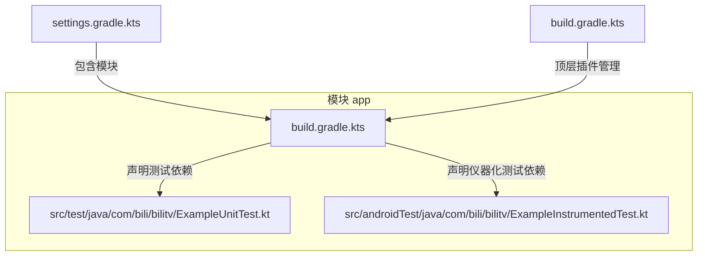
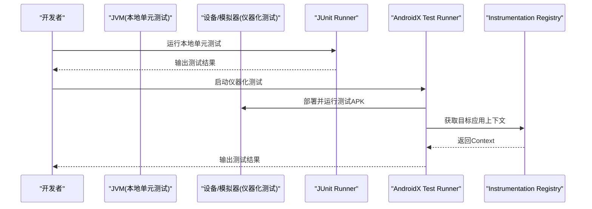
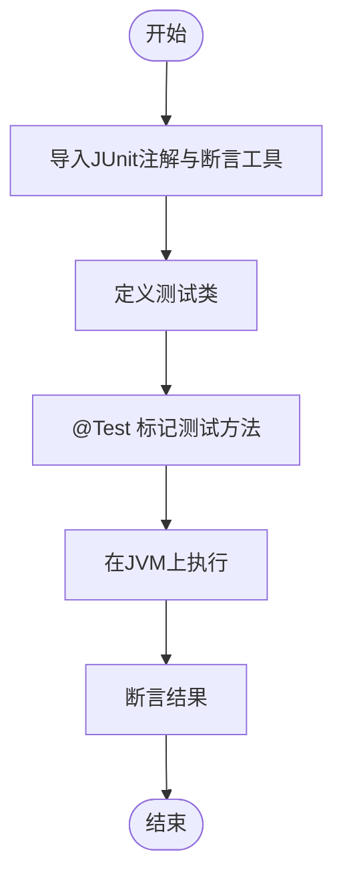
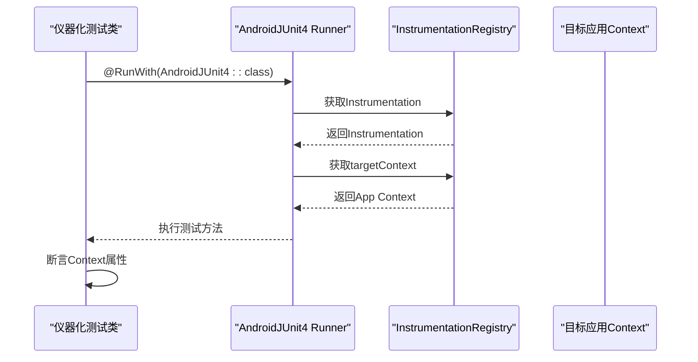
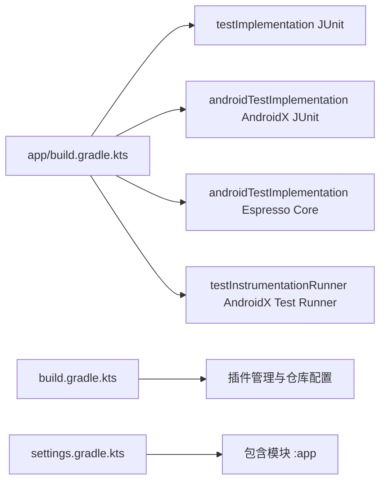
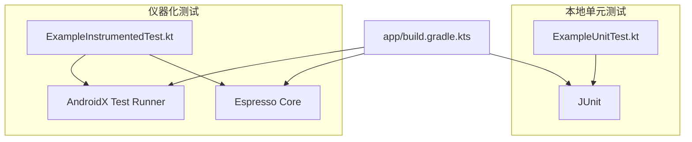

# 测试目录结构

<cite>
**本文引用的文件**
- [app/src/test/java/com/bili/bilitv/ExampleUnitTest.kt](file://app/src/test/java/com/bili/bilitv/ExampleUnitTest.kt)
- [app/src/androidTest/java/com/bili/bilitv/ExampleInstrumentedTest.kt](file://app/src/androidTest/java/com/bili/bilitv/ExampleInstrumentedTest.kt)
- [app/build.gradle.kts](file://app/build.gradle.kts)
- [build.gradle.kts](file://build.gradle.kts)
- [settings.gradle.kts](file://settings.gradle.kts)
</cite>

## 目录索引
1. [简介](#简介)
2. [项目结构](#项目结构)
3. [核心组件](#核心组件)
4. [架构总览](#架构总览)
5. [详细组件分析](#详细组件分析)
6. [依赖关系分析](#依赖关系分析)
7. [性能考量](#性能考量)
8. [故障排查指南](#故障排查指南)
9. [结论](#结论)
10. [附录](#附录)

## 简介
本文件聚焦于Android应用模块中的两类测试源集：src/test与src/androidTest。前者为本地单元测试，直接运行在JVM上，适合验证纯Kotlin/Java逻辑，无需Android环境；后者为仪器化测试，运行在真实设备或模拟器上，可访问Android系统服务（如Context），适合UI交互与系统能力测试。文档将阐述两类测试的架构差异、注解与断言机制、与JUnit/Espresso的集成方式，并给出典型测试用例的结构示例以及通过Gradle命令执行测试的方法。

## 项目结构
该仓库采用标准Android模块结构，测试相关的关键位置如下：
- 本地单元测试源集：app/src/test/java/com/bili/bilitv/ExampleUnitTest.kt
- 仪器化测试源集：app/src/androidTest/java/com/bili/bilitv/ExampleInstrumentedTest.kt
- 模块构建脚本：app/build.gradle.kts
- 顶层构建脚本：build.gradle.kts
- 工程设置：settings.gradle.kts

下图展示测试相关目录与构建脚本的关系：

图表来源
- [settings.gradle.kts](file://settings.gradle.kts#L1-L24)
- [app/build.gradle.kts](file://app/build.gradle.kts#L1-L47)
- [app/src/test/java/com/bili/bilitv/ExampleUnitTest.kt](file://app/src/test/java/com/bili/bilitv/ExampleUnitTest.kt#L1-L17)
- [app/src/androidTest/java/com/bili/bilitv/ExampleInstrumentedTest.kt](file://app/src/androidTest/java/com/bili/bilitv/ExampleInstrumentedTest.kt#L1-L24)

章节来源
- [settings.gradle.kts](file://settings.gradle.kts#L1-L24)
- [app/build.gradle.kts](file://app/build.gradle.kts#L1-L47)

## 核心组件
- 本地单元测试示例：位于src/test，使用JUnit注解进行测试，断言基于JUnit Assert工具，运行在JVM上，不依赖Android框架。
- 仪器化测试示例：位于src/androidTest，使用AndroidX Test框架注册Instrumentation Runner，通过InstrumentationRegistry获取目标应用上下文，断言包名等信息，运行在设备/模拟器上。

章节来源
- [app/src/test/java/com/bili/bilitv/ExampleUnitTest.kt](file://app/src/test/java/com/bili/bilitv/ExampleUnitTest.kt#L1-L17)
- [app/src/androidTest/java/com/bili/bilitv/ExampleInstrumentedTest.kt](file://app/src/androidTest/java/com/bili/bilitv/ExampleInstrumentedTest.kt#L1-L24)

## 架构总览
两类测试在“运行时环境”和“可用API”上存在本质差异：
- 运行时环境
  - 本地单元测试：JVM（无Android依赖）
  - 仪器化测试：Android Instrumentation（可访问Android系统服务）
- 可用API
  - 本地单元测试：仅限纯Kotlin/Java逻辑与第三方库
  - 仪器化测试：可访问Context、Activity、Service等Android系统对象
- 执行方式
  - 本地单元测试：通过JVM上的JUnit Runner执行
  - 仪器化测试：通过AndroidX Test Runner与Instrumentation执行

下图以序列视角展示两类测试的执行流程：

图表来源
- [app/src/test/java/com/bili/bilitv/ExampleUnitTest.kt](file://app/src/test/java/com/bili/bilitv/ExampleUnitTest.kt#L1-L17)
- [app/src/androidTest/java/com/bili/bilitv/ExampleInstrumentedTest.kt](file://app/src/androidTest/java/com/bili/bilitv/ExampleInstrumentedTest.kt#L1-L24)
- [app/build.gradle.kts](file://app/build.gradle.kts#L1-L47)

## 详细组件分析

### 本地单元测试（ExampleUnitTest.kt）
- 注解与断言
  - 使用JUnit注解标记测试方法
  - 使用JUnit断言工具进行断言
- 运行环境
  - 在JVM上执行，无需Android环境
- 典型用途
  - 验证纯Kotlin/Java逻辑（如数学运算、数据处理、算法）
- 结构要点
  - 测试类与测试方法命名清晰
  - 断言简洁明确，便于快速反馈

图表来源
- [app/src/test/java/com/bili/bilitv/ExampleUnitTest.kt](file://app/src/test/java/com/bili/bilitv/ExampleUnitTest.kt#L1-L17)

章节来源
- [app/src/test/java/com/bili/bilitv/ExampleUnitTest.kt](file://app/src/test/java/com/bili/bilitv/ExampleUnitTest.kt#L1-L17)

### 仪器化测试（ExampleInstrumentedTest.kt）
- 注解与断言
  - 使用@RunWith标注AndroidJUnit4运行器
  - 使用InstrumentationRegistry获取目标Context
  - 使用JUnit断言工具进行断言
- 运行环境
  - 在设备/模拟器上执行，可访问Android系统服务
- 典型用途
  - UI交互测试、系统服务访问、包名校验等
- 结构要点
  - 通过InstrumentationRegistry.targetContext获取应用上下文
  - 断言包名等与Android环境相关的属性

图表来源
- [app/src/androidTest/java/com/bili/bilitv/ExampleInstrumentedTest.kt](file://app/src/androidTest/java/com/bili/bilitv/ExampleInstrumentedTest.kt#L1-L24)

章节来源
- [app/src/androidTest/java/com/bili/bilitv/ExampleInstrumentedTest.kt](file://app/src/androidTest/java/com/bili/bilitv/ExampleInstrumentedTest.kt#L1-L24)

### 构建与依赖集成
- 模块级构建脚本中声明了测试与仪器化测试所需的依赖：
  - 本地单元测试依赖JUnit
  - 仪器化测试依赖AndroidX Test JUnit与Espresso
  - 指定仪器化测试Runner为AndroidX Test Runner
- 顶层构建脚本负责插件管理与仓库配置

图表来源
- [app/build.gradle.kts](file://app/build.gradle.kts#L1-L47)
- [build.gradle.kts](file://build.gradle.kts#L1-L5)
- [settings.gradle.kts](file://settings.gradle.kts#L1-L24)

章节来源
- [app/build.gradle.kts](file://app/build.gradle.kts#L1-L47)
- [build.gradle.kts](file://build.gradle.kts#L1-L5)
- [settings.gradle.kts](file://settings.gradle.kts#L1-L24)

## 依赖关系分析
- 组件耦合
  - 本地单元测试与仪器化测试分别依赖不同的运行器与断言工具
  - 仪器化测试依赖AndroidX Test与Espresso，具备更强的系统服务能力
- 外部依赖
  - JUnit用于本地单元测试
  - AndroidX Test Runner与Espresso用于仪器化测试
- 潜在问题
  - 若未正确配置testInstrumentationRunner，仪器化测试可能无法启动
  - 若未添加Espresso依赖，UI相关仪器化测试会失败

图表来源
- [app/src/test/java/com/bili/bilitv/ExampleUnitTest.kt](file://app/src/test/java/com/bili/bilitv/ExampleUnitTest.kt#L1-L17)
- [app/src/androidTest/java/com/bili/bilitv/ExampleInstrumentedTest.kt](file://app/src/androidTest/java/com/bili/bilitv/ExampleInstrumentedTest.kt#L1-L24)
- [app/build.gradle.kts](file://app/build.gradle.kts#L1-L47)

章节来源
- [app/build.gradle.kts](file://app/build.gradle.kts#L1-L47)

## 性能考量
- 本地单元测试在JVM上执行，启动快、迭代效率高，适合高频回归与边界条件验证
- 仪器化测试需要部署到设备/模拟器，启动时间较长，适合关键路径与端到端验证
- 建议将纯逻辑测试放在本地单元测试，UI与系统交互测试放在仪器化测试

## 故障排查指南
- 仪器化测试无法启动
  - 检查是否在构建脚本中配置了正确的testInstrumentationRunner
  - 确认设备/模拟器已连接且可被识别
- 断言失败
  - 对比期望值与实际值，确认断言逻辑与输入数据
  - 对于Context相关断言，确认包名或资源ID是否正确
- 依赖缺失
  - 若缺少AndroidX Test或Espresso依赖，仪器化测试会编译或运行失败
  - 确保构建脚本中已添加对应依赖

章节来源
- [app/build.gradle.kts](file://app/build.gradle.kts#L1-L47)

## 结论
- src/test适用于纯Kotlin/Java逻辑的快速验证，运行在JVM上，无需Android环境
- src/androidTest适用于需要Android系统服务的测试，运行在设备/模拟器上，可访问Context等
- 两类测试通过不同的运行器与断言工具实现，构建脚本中需正确配置依赖与Runner
- 建议按职责分离：逻辑测试放本地单元测试，UI与系统交互测试放仪器化测试

## 附录
- 典型测试用例结构示例（以路径代替代码内容）
  - 本地单元测试：参见 [app/src/test/java/com/bili/bilitv/ExampleUnitTest.kt](file://app/src/test/java/com/bili/bilitv/ExampleUnitTest.kt#L1-L17)
  - 仪器化测试：参见 [app/src/androidTest/java/com/bili/bilitv/ExampleInstrumentedTest.kt](file://app/src/androidTest/java/com/bili/bilitv/ExampleInstrumentedTest.kt#L1-L24)
- Gradle命令执行测试（示例）
  - 运行本地单元测试：gradlew test
  - 运行仪器化测试：gradlew connectedAndroidTest
  - 运行所有测试：gradlew test connectedAndroidTest

章节来源
- [app/build.gradle.kts](file://app/build.gradle.kts#L1-L47)
- [build.gradle.kts](file://build.gradle.kts#L1-L5)
- [settings.gradle.kts](file://settings.gradle.kts#L1-L24)