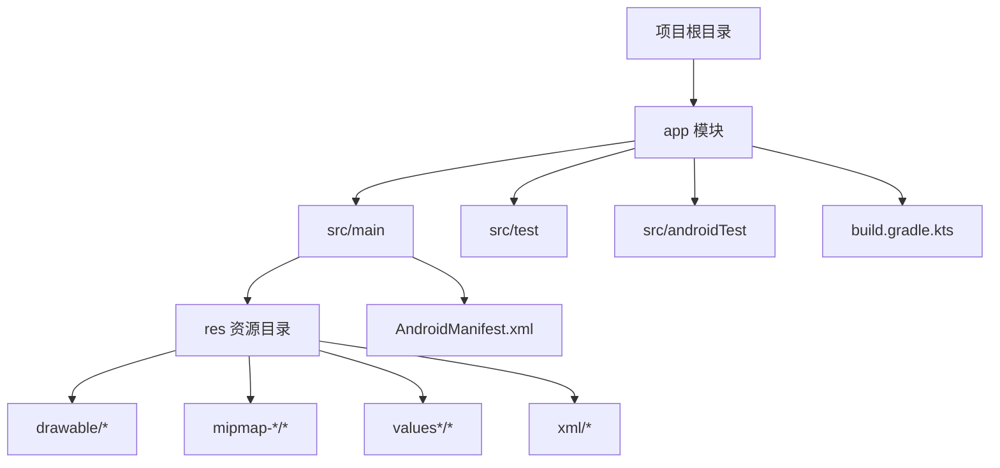
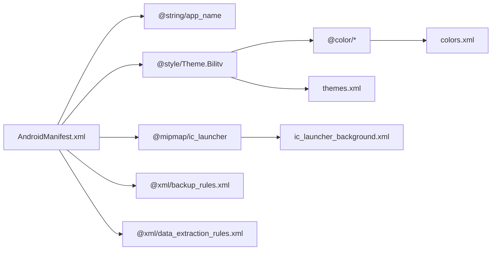
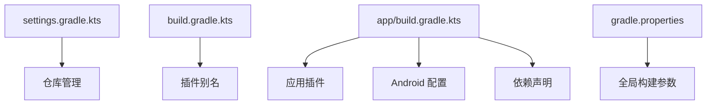

# 目录结构说明

<cite>
**本文引用的文件**
- [app/src/main/res/values/strings.xml](file://app/src/main/res/values/strings.xml)
- [app/src/main/res/values/themes.xml](file://app/src/main/res/values/themes.xml)
- [app/src/main/res/values/colors.xml](file://app/src/main/res/values/colors.xml)
- [app/src/main/res/xml/backup_rules.xml](file://app/src/main/res/xml/backup_rules.xml)
- [app/src/main/res/xml/data_extraction_rules.xml](file://app/src/main/res/xml/data_extraction_rules.xml)
- [app/src/main/res/drawable/ic_launcher_background.xml](file://app/src/main/res/drawable/ic_launcher_background.xml)
- [app/src/main/AndroidManifest.xml](file://app/src/main/AndroidManifest.xml)
- [app/build.gradle.kts](file://app/build.gradle.kts)
- [build.gradle.kts](file://build.gradle.kts)
- [gradle.properties](file://gradle.properties)
- [settings.gradle.kts](file://settings.gradle.kts)
- [app/src/test/java/com/bili/bilitv/ExampleUnitTest.kt](file://app/src/test/java/com/bili/bilitv/ExampleUnitTest.kt)
- [app/src/androidTest/java/com/bili/bilitv/ExampleInstrumentedTest.kt](file://app/src/androidTest/java/com/bili/bilitv/ExampleInstrumentedTest.kt)
</cite>

## 目录结构总览

本项目为一个单模块 Android 应用，采用标准的 Android 工程目录组织方式。核心目录与职责如下：
- app：应用模块，包含源代码、资源、清单文件与构建脚本
- 根目录：项目级配置文件，包括仓库管理、全局 Gradle 设置等

图表来源
- [settings.gradle.kts](file://settings.gradle.kts#L22-L24)
- [app/build.gradle.kts](file://app/build.gradle.kts#L1-L47)
- [app/src/main/AndroidManifest.xml](file://app/src/main/AndroidManifest.xml#L1-L15)

章节来源
- [settings.gradle.kts](file://settings.gradle.kts#L22-L24)
- [app/build.gradle.kts](file://app/build.gradle.kts#L1-L47)

## 关键目录与文件详解

### app/src/main：应用主源码与资源
- 作用：存放应用运行时所需的源代码、资源与清单文件
- 子目录与职责：
  - res：应用资源集合，按类型与限定符组织
  - AndroidManifest.xml：应用元数据与入口声明

章节来源
- [app/src/main/AndroidManifest.xml](file://app/src/main/AndroidManifest.xml#L1-L15)

### app/src/main/res：资源分类与用途
- drawable：矢量图或位图资源，用于图标背景、界面元素等
  - 示例：ic_launcher_background.xml 作为应用启动图标背景
- mipmap-anydpi-v26：应用图标资源，适配不同密度与圆角需求
  - 示例：ic_launcher.xml、ic_launcher_round.xml
- values：通用资源定义，如字符串、颜色、主题
  - strings.xml：应用名称等文本资源
  - colors.xml：品牌色板
  - themes.xml：应用主题样式（主色、次色、状态栏色等）
- xml：系统备份与数据提取规则
  - backup_rules.xml：全量备份策略
  - data_extraction_rules.xml：云备份与设备迁移的数据提取规则
- 结构映射关系：
  - AndroidManifest 中通过 @string/app_name、@style/Theme.Bilitv、@mipmap/ic_launcher 等引用上述资源
  - 主题与颜色在 themes.xml 中集中定义，便于统一视觉风格

章节来源
- [app/src/main/res/drawable/ic_launcher_background.xml](file://app/src/main/res/drawable/ic_launcher_background.xml#L1-L171)
- [app/src/main/res/values/strings.xml](file://app/src/main/res/values/strings.xml#L1-L3)
- [app/src/main/res/values/colors.xml](file://app/src/main/res/values/colors.xml#L1-L10)
- [app/src/main/res/values/themes.xml](file://app/src/main/res/values/themes.xml#L1-L16)
- [app/src/main/res/xml/backup_rules.xml](file://app/src/main/res/xml/backup_rules.xml#L1-L13)
- [app/src/main/res/xml/data_extraction_rules.xml](file://app/src/main/res/xml/data_extraction_rules.xml#L1-L19)
- [app/src/main/AndroidManifest.xml](file://app/src/main/AndroidManifest.xml#L1-L15)

### app/src/test 与 app/src/androidTest：测试分层
- src/test：本地单元测试，运行于主机环境（JVM），适合逻辑与工具类验证
  - 示例：ExampleUnitTest.kt 展示基础断言用法
- src/androidTest：仪器化测试，运行于真实或模拟设备，适合 UI、集成与端到端场景
  - 示例：ExampleInstrumentedTest.kt 展示获取目标上下文与包名校验
- 选择建议：
  - 仅需验证纯函数或业务逻辑：使用 src/test
  - 需要访问 Android 框架 API 或进行 UI 测试：使用 src/androidTest

章节来源
- [app/src/test/java/com/bili/bilitv/ExampleUnitTest.kt](file://app/src/test/java/com/bili/bilitv/ExampleUnitTest.kt#L1-L17)
- [app/src/androidTest/java/com/bili/bilitv/ExampleInstrumentedTest.kt](file://app/src/androidTest/java/com/bili/bilitv/ExampleInstrumentedTest.kt#L1-L24)

### app/build.gradle.kts：模块级构建脚本
- 职责：
  - 声明插件与 Android 配置（命名空间、编译 SDK、最小/目标 SDK、版本号等）
  - 定义构建类型（如 release）、编译选项（Java/Kotlin 版本）
  - 声明依赖（implementation、testImplementation、androidTestImplementation）
- 与项目级脚本的关系：
  - 项目级 build.gradle.kts 仅声明插件别名并设置 apply=false，避免重复应用
  - 模块级脚本显式应用插件并完成具体配置

章节来源
- [app/build.gradle.kts](file://app/build.gradle.kts#L1-L47)
- [build.gradle.kts](file://build.gradle.kts#L1-L5)

### build.gradle.kts（项目级）：全局插件与仓库管理
- 职责：
  - 统一声明插件别名（android.application、kotlin.android），并在各模块中按需应用
  - settings.gradle.kts 中通过 pluginManagement 与 dependencyResolutionManagement 管理仓库与版本
- 与模块级脚本协作：
  - 项目级负责“插件与仓库”，模块级负责“具体配置与依赖”

章节来源
- [build.gradle.kts](file://build.gradle.kts#L1-L5)
- [settings.gradle.kts](file://settings.gradle.kts#L1-L24)

### gradle.properties：构建优化参数
- 关键参数与意义：
  - org.gradle.jvmargs：Gradle 后台进程 JVM 参数，用于提升内存与编码稳定性
  - android.useAndroidX：启用 AndroidX 包结构，确保兼容性
  - kotlin.code.style：Kotlin 代码风格规范
  - android.nonTransitiveRClass：按库隔离 R 类，减小 R 类体积
- 影响范围：
  - 全局生效于所有模块，影响编译性能、打包体积与兼容性

章节来源
- [gradle.properties](file://gradle.properties#L1-L23)

## 架构与资源映射关系

以下图示展示了从清单到资源再到主题的整体映射路径，体现“结构—功能”的对应关系：

图表来源
- [app/src/main/AndroidManifest.xml](file://app/src/main/AndroidManifest.xml#L1-L15)
- [app/src/main/res/values/strings.xml](file://app/src/main/res/values/strings.xml#L1-L3)
- [app/src/main/res/values/themes.xml](file://app/src/main/res/values/themes.xml#L1-L16)
- [app/src/main/res/values/colors.xml](file://app/src/main/res/values/colors.xml#L1-L10)
- [app/src/main/res/drawable/ic_launcher_background.xml](file://app/src/main/res/drawable/ic_launcher_background.xml#L1-L171)
- [app/src/main/res/xml/backup_rules.xml](file://app/src/main/res/xml/backup_rules.xml#L1-L13)
- [app/src/main/res/xml/data_extraction_rules.xml](file://app/src/main/res/xml/data_extraction_rules.xml#L1-L19)

## 依赖与配置关系

图表来源
- [settings.gradle.kts](file://settings.gradle.kts#L1-L24)
- [build.gradle.kts](file://build.gradle.kts#L1-L5)
- [app/build.gradle.kts](file://app/build.gradle.kts#L1-L47)
- [gradle.properties](file://gradle.properties#L1-L23)

## 性能与最佳实践

- 资源组织：
  - 使用 values/colors.xml 统一管理品牌色，避免硬编码
  - 使用 values/themes.xml 集中定义主题，减少重复与不一致
- 测试分层：
  - 将纯逻辑测试放入 src/test，UI 与系统交互测试放入 src/androidTest
- 构建优化：
  - 合理设置 org.gradle.jvmargs 提升编译稳定性
  - 启用 android.nonTransitiveRClass 减少 R 类体积
  - 使用 AndroidX 以获得更好的兼容性与维护性

[本节为通用指导，无需列出章节来源]

## 故障排查指南

- 资源引用错误：
  - 症状：编译报错或运行时找不到资源
  - 排查：确认 AndroidManifest 中的 @string/@style/@mipmap 引用与 res 对应文件一致
- 主题与颜色不生效：
  - 症状：界面未按预期着色
  - 排查：检查 themes.xml 是否正确引用 colors.xml 中的颜色名称
- 测试无法运行：
  - 症状：单元测试或仪器化测试失败
  - 排查：确认 src/test 与 src/androidTest 的包名与类结构正确，依赖已声明

章节来源
- [app/src/main/AndroidManifest.xml](file://app/src/main/AndroidManifest.xml#L1-L15)
- [app/src/main/res/values/themes.xml](file://app/src/main/res/values/themes.xml#L1-L16)
- [app/src/main/res/values/colors.xml](file://app/src/main/res/values/colors.xml#L1-L10)
- [app/src/test/java/com/bili/bilitv/ExampleUnitTest.kt](file://app/src/test/java/com/bili/bilitv/ExampleUnitTest.kt#L1-L17)
- [app/src/androidTest/java/com/bili/bilitv/ExampleInstrumentedTest.kt](file://app/src/androidTest/java/com/bili/bilitv/ExampleInstrumentedTest.kt#L1-L24)

## 结论

本项目采用清晰的目录结构与分层配置，实现了“资源—主题—清单—构建脚本”的强关联映射。通过 values/colors.xml、values/themes.xml 与 AndroidManifest.xml 的协同，统一了视觉风格与应用标识；通过 src/test 与 src/androidTest 的分离，明确了本地与设备端测试的边界；通过项目级与模块级构建脚本的分工，保证了插件与仓库的一致性与可维护性。遵循本文档的定位与最佳实践，新开发者可快速上手并高效扩展功能。

[本节为总结性内容，无需列出章节来源]