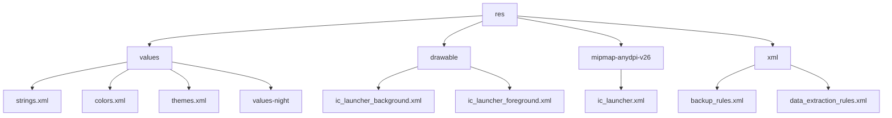
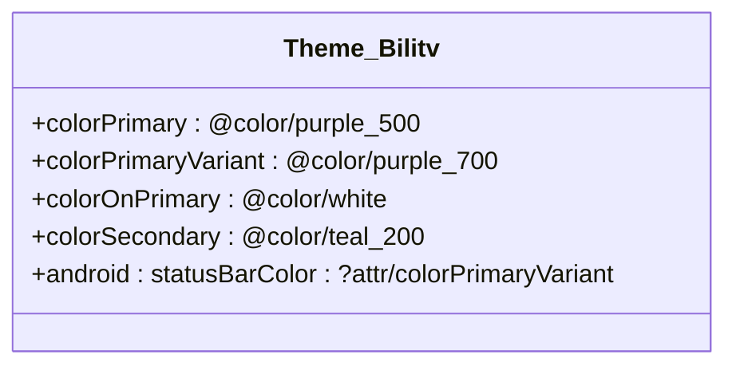
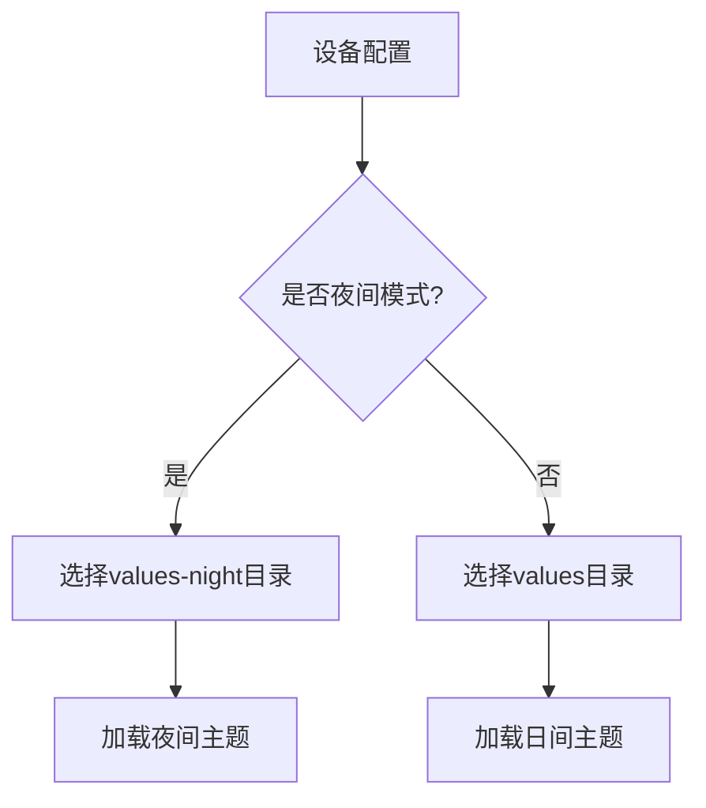
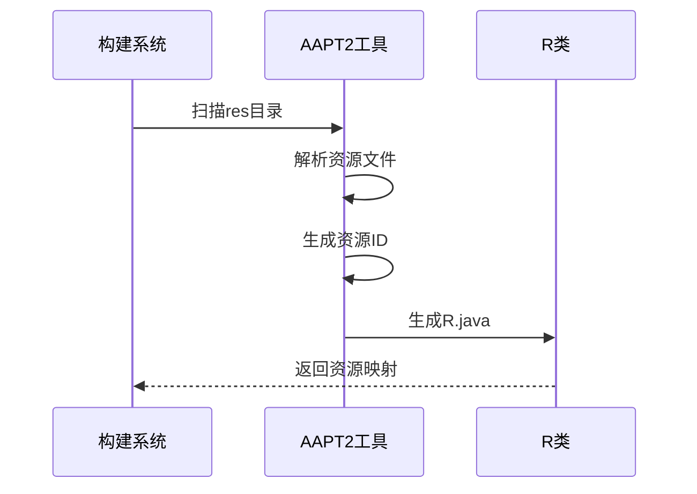
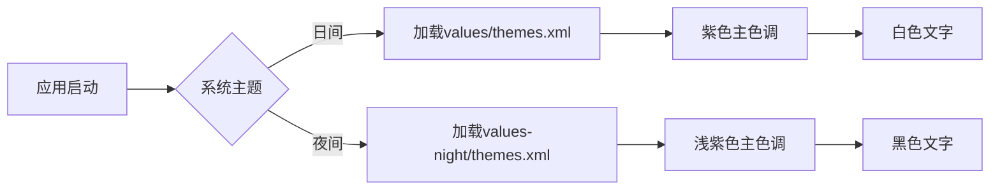

# 资源管理结构

<cite>
**本文档引用的文件**  
- [strings.xml](file://app/src/main/res/values/strings.xml)
- [colors.xml](file://app/src/main/res/values/colors.xml)
- [themes.xml](file://app/src/main/res/values/themes.xml)
- [themes.xml](file://app/src/main/res/values-night/themes.xml)
- [ic_launcher_background.xml](file://app/src/main/res/drawable/ic_launcher_background.xml)
- [ic_launcher_foreground.xml](file://app/src/main/res/drawable/ic_launcher_foreground.xml)
- [ic_launcher.xml](file://app/src/main/res/mipmap-anydpi-v26/ic_launcher.xml)
- [backup_rules.xml](file://app/src/main/res/xml/backup_rules.xml)
- [data_extraction_rules.xml](file://app/src/main/res/xml/data_extraction_rules.xml)
- [AndroidManifest.xml](file://app/src/main/AndroidManifest.xml)
- [build.gradle.kts](file://app/build.gradle.kts)
- [R.txt](file://app/build/intermediates/symbol_list_with_package_name/debug/processDebugResources/package-aware-r.txt)
</cite>

## 目录
1. [项目资源结构概述](#项目资源结构概述)
2. [res/values资源详解](#resvalues资源详解)
3. [Drawable与Mipmap资源](#drawable与mipmap资源)
4. [XML配置资源](#xml配置资源)
5. [资源加载与选择机制](#资源加载与选择机制)
6. [资源引用与R类生成](#资源引用与r类生成)
7. [主题切换协同工作机制](#主题切换协同工作机制)

## 项目资源结构概述

Android项目资源目录采用分层结构组织，通过特定命名规范实现多设备配置适配。项目中的`res`目录包含多个子目录，每个子目录存放特定类型的资源文件。



**图示来源**  
- [strings.xml](file://app/src/main/res/values/strings.xml)
- [colors.xml](file://app/src/main/res/values/colors.xml)
- [themes.xml](file://app/src/main/res/values/themes.xml)
- [ic_launcher_background.xml](file://app/src/main/res/drawable/ic_launcher_background.xml)
- [ic_launcher.xml](file://app/src/main/res/mipmap-anydpi-v26/ic_launcher.xml)
- [backup_rules.xml](file://app/src/main/res/xml/backup_rules.xml)

**本节来源**  
- [app/src/main/res](file://app/src/main/res)

## res/values资源详解

`res/values`目录存放应用的值资源文件，包括字符串、颜色和主题样式等。这些资源通过XML文件定义，支持多语言和多配置适配。

### 字符串资源配置

`strings.xml`文件定义应用的文本资源，采用键值对形式组织。通过资源ID引用，实现文本内容与代码逻辑分离。

```xml
<resources>
    <string name="app_name">bilitv</string>
</resources>
```

**本节来源**  
- [strings.xml](file://app/src/main/res/values/strings.xml)

### 颜色资源配置

`colors.xml`文件定义应用的颜色资源，使用十六进制颜色值。颜色资源可在主题、布局和其他资源文件中引用。

```xml
<resources>
    <color name="purple_200">#FFBB86FC</color>
    <color name="purple_500">#FF6200EE</color>
    <color name="teal_200">#FF03DAC5</color>
    <color name="white">#FFFFFFFF</color>
</resources>
```

**本节来源**  
- [colors.xml](file://app/src/main/res/values/colors.xml)

### 主题样式配置

`themes.xml`文件定义应用的主题样式，继承Material Design主题并自定义颜色属性。主题通过`<item>`标签配置各种UI元素的颜色。



**图示来源**  
- [themes.xml](file://app/src/main/res/values/themes.xml)

**本节来源**  
- [themes.xml](file://app/src/main/res/values/themes.xml)

## Drawable与Mipmap资源

Drawable和Mipmap目录存放图形资源，支持矢量图形和自适应图标。

### 矢量图形资源

`drawable`目录存放矢量图形资源，使用XML定义的Vector Drawable。这种格式支持无限缩放而不失真。

```xml
<vector xmlns:android="http://schemas.android.com/apk/res/android"
    android:width="108dp"
    android:height="108dp"
    android:viewportWidth="108"
    android:viewportHeight="108">
    <path android:fillColor="#3DDC84" android:pathData="M0,0h108v108h-108z" />
</vector>
```

**本节来源**  
- [ic_launcher_background.xml](file://app/src/main/res/drawable/ic_launcher_background.xml)
- [ic_launcher_foreground.xml](file://app/src/main/res/drawable/ic_launcher_foreground.xml)

### 自适应启动图标

`mipmap-anydpi-v26`目录存放自适应启动图标，支持Android 8.0及以上系统的自适应图标功能。

```xml
<adaptive-icon xmlns:android="http://schemas.android.com/apk/res/android">
    <background android:drawable="@drawable/ic_launcher_background" />
    <foreground android:drawable="@drawable/ic_launcher_foreground" />
    <monochrome android:drawable="@drawable/ic_launcher_foreground" />
</adaptive-icon>
```

**本节来源**  
- [ic_launcher.xml](file://app/src/main/res/mipmap-anydpi-v26/ic_launcher.xml)

## XML配置资源

`xml`目录存放结构化配置文件，定义应用的备份规则和数据提取策略。

### 备份规则配置

`backup_rules.xml`文件定义应用数据的自动备份规则，控制哪些数据需要备份。

```xml
<full-backup-content>
    <!-- 包含所有共享偏好设置，排除特定文件 -->
</full-backup-content>
```

**本节来源**  
- [backup_rules.xml](file://app/src/main/res/xml/backup_rules.xml)

### 数据提取规则

`data_extraction_rules.xml`文件定义设备迁移时的数据提取规则，支持云备份和设备传输。

```xml
<data-extraction-rules>
    <cloud-backup>
        <!-- 云备份规则 -->
    </cloud-backup>
</data-extraction-rules>
```

**本节来源**  
- [data_extraction_rules.xml](file://app/src/main/res/xml/data_extraction_rules.xml)

## 资源加载与选择机制

Android系统根据设备配置自动选择最匹配的资源目录，实现多设备适配。

### 资源选择优先级

系统按照特定顺序搜索资源目录，优先选择最具体的配置。例如，夜间模式下优先选择`values-night`目录。



**图示来源**  
- [themes.xml](file://app/src/main/res/values/themes.xml)
- [themes.xml](file://app/src/main/res/values-night/themes.xml)

**本节来源**  
- [themes.xml](file://app/src/main/res/values/themes.xml)
- [themes.xml](file://app/src/main/res/values-night/themes.xml)

## 资源引用与R类生成

资源通过特定语法引用，并在编译时生成R类。

### 资源引用语法

在布局文件和代码中使用`@`符号引用资源，格式为`@资源类型/资源名`。

```xml
android:label="@string/app_name"
android:icon="@mipmap/ic_launcher"
android:theme="@style/Theme.Bilitv"
```

**本节来源**  
- [AndroidManifest.xml](file://app/src/main/AndroidManifest.xml)

### R类生成过程

构建系统在编译时扫描所有资源文件，生成包含所有资源ID的R类。这个过程由AAPT2工具完成。



**图示来源**  
- [R.txt](file://app/src/build/intermediates/symbol_list_with_package_name/debug/processDebugResources/package-aware-r.txt)
- [build.gradle.kts](file://app/build.gradle.kts)

**本节来源**  
- [R.txt](file://app/build/intermediates/symbol_list_with_package_name/debug/processDebugResources/package-aware-r.txt)
- [build.gradle.kts](file://app/build.gradle.kts)

## 主题切换协同工作机制

DayNight主题切换通过多目录配置和资源引用实现无缝切换。

### 主题配置协同

日间和夜间主题分别在`values`和`values-night`目录中定义，使用相同的资源名称但不同的属性值。



**图示来源**  
- [themes.xml](file://app/src/main/res/values/themes.xml)
- [themes.xml](file://app/src/main/res/values-night/themes.xml)

**本节来源**  
- [themes.xml](file://app/src/main/res/values/themes.xml)
- [themes.xml](file://app/src/main/res/values-night/themes.xml)