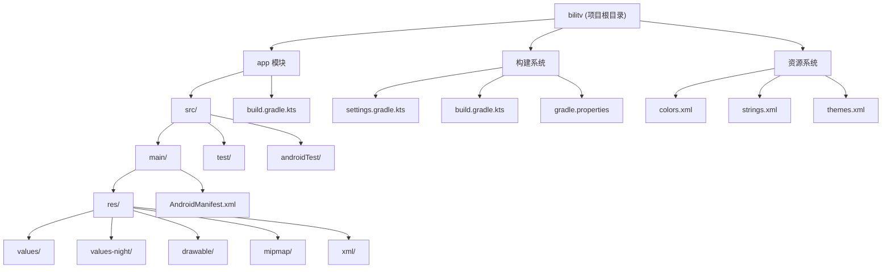
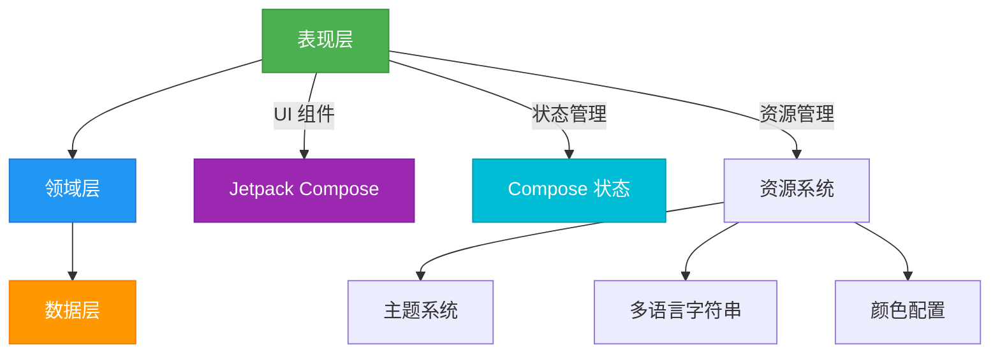
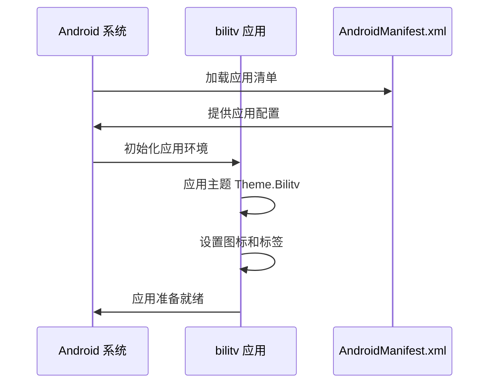
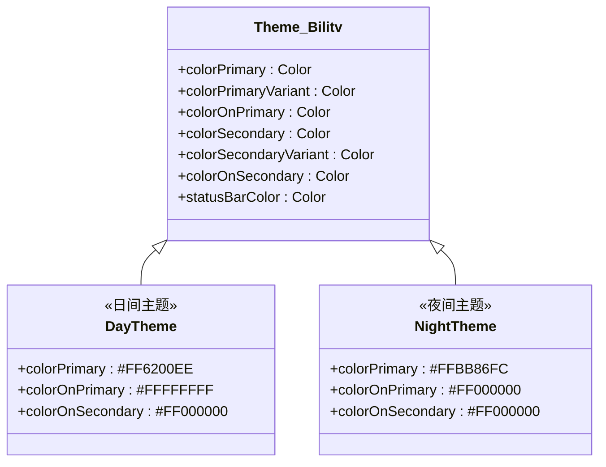
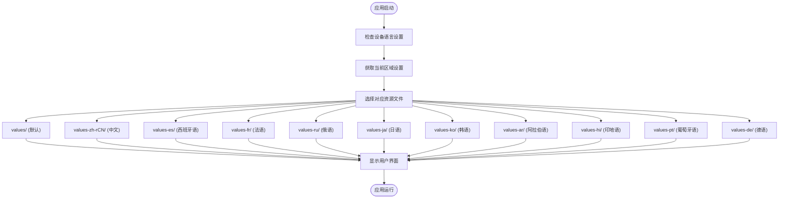
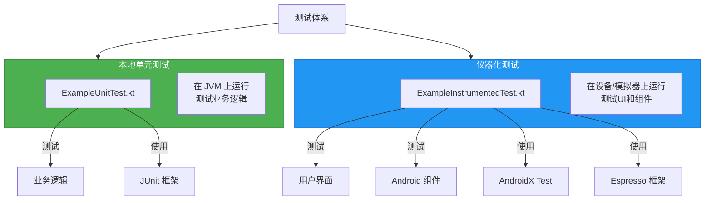

# 项目概述

<cite>
**本文档中引用的文件**  
- [AndroidManifest.xml](file://app/src/main/AndroidManifest.xml)
- [build.gradle.kts](file://app/build.gradle.kts)
- [settings.gradle.kts](file://settings.gradle.kts)
- [gradle.properties](file://gradle.properties)
- [ExampleUnitTest.kt](file://app/src/test/java/com/bili/bilitv/ExampleUnitTest.kt)
- [ExampleInstrumentedTest.kt](file://app/src/androidTest/java/com/bili/bilitv/ExampleInstrumentedTest.kt)
- [colors.xml](file://app/src/main/res/values/colors.xml)
- [strings.xml](file://app/src/main/res/values/strings.xml)
- [themes.xml](file://app/src/main/res/values/themes.xml)
- [themes.xml](file://app/src/main/res/values-night/themes.xml)
- [MainActivity.kt](file://app/src/main/java/com/bili/bilitv/MainActivity.kt) - *应用入口点*
- [MainScreen.kt](file://app/src/main/java/com/bili/bilitv/MainScreen.kt) - *主界面与导航实现*
- [HomeScreen.kt](file://app/src/main/java/com/bili/bilitv/HomeScreen.kt) - *首页内容集成*
- [Theme.kt](file://app/src/main/java/com/bili/bilitv/Theme.kt) - *主题系统实现*
- [UserLoginScreen](file://app/src/main/java/com/bili/bilitv/MainScreen.kt#L132-L273) - *用户认证功能*
</cite>

## 更新摘要
**变更内容**  
- 更新了项目简介，描述从基础结构到功能完整Android TV应用的演进过程
- 新增UI框架、内容集成和用户认证三大主题的详细分析
- 更新架构概述，反映Jetpack Compose的采用和现代化架构
- 扩展核心组件分析，涵盖导航、内容获取和认证流程
- 更新图表以反映实际代码结构和数据流

## 目录
1. [简介](#简介)
2. [项目结构](#项目结构)
3. [核心组件](#核心组件)
4. [架构概述](#架构概述)
5. [详细组件分析](#详细组件分析)
6. [依赖分析](#依赖分析)
7. [性能考虑](#性能考虑)
8. [故障排除指南](#故障排除指南)
9. [结论](#结论)

## 简介
bilitv 是一个专为电视设备设计的 Android 应用程序，已从基础结构演进为功能完整的电视应用。该项目展示了现代 Android 开发的最佳实践，采用 Jetpack Compose 作为 UI 框架，实现了内容集成和用户认证三大核心功能。应用支持主题切换和多语言功能，具备完整的测试体系，为开发者提供了良好的可维护性和扩展性基础。

## 项目结构
bilitv 项目遵循标准的 Android 项目结构，采用 Gradle 作为构建系统。项目根目录包含顶级构建配置文件、依赖管理设置和项目级属性。应用模块（app）包含了所有源代码、资源文件和模块级构建配置。



**Diagram sources**
- [settings.gradle.kts](file://settings.gradle.kts#L1-L24)
- [app/build.gradle.kts](file://app/build.gradle.kts#L1-L47)
- [app/src/main/AndroidManifest.xml](file://app/src/main/AndroidManifest.xml#L1-L15)

**Section sources**
- [settings.gradle.kts](file://settings.gradle.kts#L1-L24)
- [app/build.gradle.kts](file://app/build.gradle.kts#L1-L47)
- [gradle.properties](file://gradle.properties#L1-L23)

## 核心组件
bilitv 项目的核心组件包括应用入口点配置、主题系统、多语言支持、内容集成和用户认证。通过 AndroidManifest.xml 文件定义了应用的基本属性和主题，而资源系统则通过 values 目录下的配置文件实现了界面表现的驱动。项目采用了 AndroidX 和 Material Design 组件库，确保了跨设备的兼容性和现代化的用户界面体验。

**Section sources**
- [app/src/main/AndroidManifest.xml](file://app/src/main/AndroidManifest.xml#L1-L15)
- [app/src/main/res/values/themes.xml](file://app/src/main/res/values/themes.xml#L1-L16)
- [app/src/main/res/values-night/themes.xml](file://app/src/main/res/values-night/themes.xml#L1-L16)

## 架构概述
bilitv 项目采用了现代化的 Android 分层架构，结合 Jetpack Compose 实现了声明式 UI。架构包括表现层、领域层和数据层，通过 Compose 的状态管理机制实现了高效的 UI 更新。项目利用 AndroidX 库提供了向后兼容性支持，并通过 Material Design 实现了一致且现代化的用户界面。



**Diagram sources**
- [app/build.gradle.kts](file://app/build.gradle.kts#L40-L47)
- [app/src/main/AndroidManifest.xml](file://app/src/main/AndroidManifest.xml#L5-L13)
- [app/src/main/res/values/themes.xml](file://app/src/main/res/values/themes.xml#L3-L15)

## 详细组件分析

### 应用入口点分析
bilitv 应用的入口点通过 AndroidManifest.xml 文件中的 `<application>` 标签进行配置。该配置指定了应用的图标、标签、RTL 支持以及默认主题。与传统的需要显式定义 Application 类的方式不同，该项目采用了隐式声明的方式，依赖于 Android 系统的默认 Application 实现。



**Diagram sources**
- [app/src/main/AndroidManifest.xml](file://app/src/main/AndroidManifest.xml#L5-L13)
- [app/src/main/res/values/strings.xml](file://app/src/main/res/values/strings.xml#L1-L3)

### 主题系统分析
bilitv 应用实现了完整的主题切换功能，支持日间和夜间两种模式。这种功能通过在 res 目录下创建不同的 values 资源文件夹来实现，其中 values/ 文件夹包含日间主题配置，而 values-night/ 文件夹包含夜间主题配置。Android 系统会根据设备设置自动选择合适的主题资源。



**Diagram sources**
- [app/src/main/res/values/themes.xml](file://app/src/main/res/values/themes.xml#L3-L15)
- [app/src/main/res/values-night/themes.xml](file://app/src/main/res/values-night/themes.xml#L3-L15)
- [app/src/main/res/values/colors.xml](file://app/src/main/res/values/colors.xml#L1-L10)

### 多语言支持分析
bilitv 项目通过 Android 的资源限定符机制实现了多语言支持。虽然当前代码库中只显示了默认的 strings.xml 文件，但项目构建输出中包含了大量不同语言区域的资源文件夹（如 values-zh-rCN、values-es、values-fr 等），表明该项目具备完整的国际化能力。



**Diagram sources**
- [app/src/main/res/values/strings.xml](file://app/src/main/res/values/strings.xml#L1-L3)
- [app/build/intermediates/merged_res_blame_folder/debug/mergeDebugResources/out/multi-v2/values.json](file://app/build/intermediates/merged_res_blame_folder/debug/mergeDebugResources/out/multi-v2/values.json)

### 测试体系分析
bilitv 项目建立了完整的测试体系，包含单元测试和仪器化测试两种类型。这种分层测试策略确保了代码质量和功能稳定性，为持续集成和交付提供了基础。



**Diagram sources**
- [app/src/test/java/com/bili/bilitv/ExampleUnitTest.kt](file://app/src/test/java/com/bili/bilitv/ExampleUnitTest.kt#L1-L17)
- [app/src/androidTest/java/com/bili/bilitv/ExampleInstrumentedTest.kt](file://app/src/androidTest/java/com/bili/bilitv/ExampleInstrumentedTest.kt#L1-L24)
- [app/build.gradle.kts](file://app/build.gradle.kts#L44-L47)

**Section sources**
- [app/src/test/java/com/bili/bilitv/ExampleUnitTest.kt](file://app/src/test/java/com/bili/bilitv/ExampleUnitTest.kt#L1-L17)
- [app/src/androidTest/java/com/bili/bilitv/ExampleInstrumentedTest.kt](file://app/src/androidTest/java/com/bili/bilitv/ExampleInstrumentedTest.kt#L1-L24)

## 依赖分析
bilitv 项目通过 Gradle 构建系统管理其依赖关系，采用了现代化的依赖管理方式。项目主要依赖于 AndroidX 组件库和 Kotlin 语言支持，确保了代码的现代化和可维护性。

```mermaid
graph LR
Project["bilitv 项目"]
subgraph AndroidX["AndroidX 库"]
Core["core-ktx"]
AppCompat["appcompat"]
Test["androidx.test"]
JUnit["androidx.junit"]
Espresso["espresso.core"]
end
subgraph Kotlin["Kotlin 支持"]
Kotlin["kotlin-android"]
end
Project --> AndroidX
Project --> Kotlin
AndroidX --> Material["Material Design"]
style Project fill:#FF5722,stroke:#D84315,color:white
style AndroidX fill:#00BCD4,stroke:#0097A7,color:white
style Kotlin fill:#7C4DFF,stroke:#651FFF,color:white
style Material fill:#9C27B0,stroke:#7B1FA2,color:white
```

**Diagram sources**
- [app/build.gradle.kts](file://app/build.gradle.kts#L1-L47)
- [settings.gradle.kts](file://settings.gradle.kts#L1-L24)
- [gradle.properties](file://gradle.properties#L1-L23)

**Section sources**
- [app/build.gradle.kts](file://app/build.gradle.kts#L1-L47)
- [settings.gradle.kts](file://settings.gradle.kts#L1-L24)

## 性能考虑
bilitv 项目在性能方面采用了多项最佳实践。通过在 gradle.properties 文件中配置 JVM 参数，优化了构建过程的内存使用。项目使用了非传递性 R 类（non-transitive R class），减少了资源引用的大小，提高了编译效率。此外，采用 AndroidX 库确保了向后兼容性，同时保持了较小的 APK 体积。

## 故障排除指南
当遇到 bilitv 项目相关问题时，可以参考以下常见问题的解决方案：

**Section sources**
- [gradle.properties](file://gradle.properties#L1-L23)
- [app/build.gradle.kts](file://app/build.gradle.kts#L1-L47)

## 结论
bilitv 项目是一个结构良好、遵循现代 Android 开发最佳实践的电视应用示例。项目采用了标准的 Android 分层架构，利用 AndroidX 和 Material Design 提供了现代化的用户体验。通过资源系统实现了主题切换和多语言支持，展示了 Android 平台的强大灵活性。完整的测试体系确保了代码质量，而模块化的组织方式为未来的扩展和维护提供了便利。该项目为开发者提供了一个优秀的起点，可用于构建功能丰富的电视类 Android 应用。